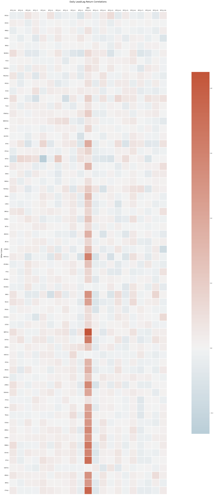
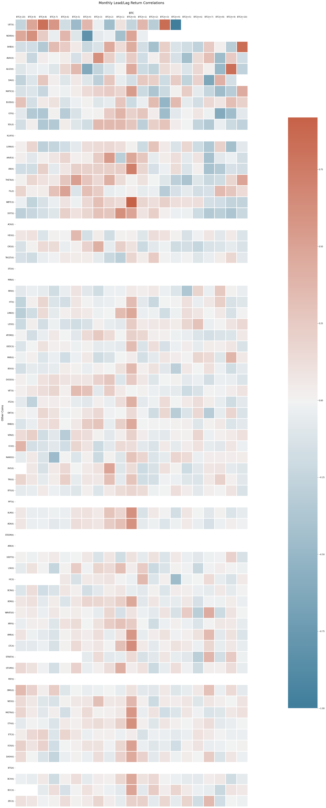

# DATA OVERVIEW AND STATUS REPORT

## DATA SOURCES

Our data was primarily sourced from two online resources: Yahoo finance and coin market cap

Important information:
- open 
- close 
- volume
- Daily percent change
- Weekly percent change
- Biweekly percent change
- Monthly percent change

We will use this data to compile our analysis

### How we decided on coins:
We took the top 20 coins everyday from mid August (simply an API limitation no personal bias) and appended the data frame day by day until very close to the current date of 05/04/2022

## Data Concerns and Issues 

### General Observations
- Static percentage of missing values across many coins is dependent upon the public availability of data and information
    - Note: The dates at which Yahoo Finance and CoinMarketCap initiated coverage **_do not_** represent the dates each coin was initially offered
    - Yahoo Finance and other similar sources (Google Finance, etc) source data from CoinMarketCap. This will continue to complicate efforts to fill in missing data.
- Missing data might necessitate reconsideration of the assessed time horizon
    - Historically mature coins - particularly Bitcoin - are well covered and missing data is rarely problematic
    - Newer coin offerings, including well-known ones (ETH, DOGE) have a significant portion of data missing. Time horizon must be shifted to account for the availability of public data
    - Returns in particular will be particularly difficult to manage - shrinking the studied time period will likely induce recency bias and abnormal trading events (COVID)

## The Imports


```python
from datetime import datetime, timedelta, date
import pandas as pd
import numpy as np
from clean import data_merge
from transformDate import changeDate
import matplotlib.pyplot as plt
import glob
import os
from functools import reduce
import seaborn as sns
from corr import correlation
from winsorizer import winsorizer_with_missing
```

## Fixing Data Columns and Data Analysis


```python
returns_df = pd.read_csv('../Data/coindata.csv')
returns_df['namelen_to_drop'] = returns_df.Symbol.str.len()
returns_df['Name'] = returns_df.apply(lambda x: x['Name'][x['namelen_to_drop']:], 1)
returns_df = returns_df.drop(['Unnamed: 0','namelen_to_drop'],axis=1)
```


```python
final_df = returns_df[['date', 'Symbol','Price','% 24h', '% 7d']].copy()
```


```python
final_price_df = final_df.pivot(index='date', columns='Symbol', values='Price')
```


```python
unique_ticker = returns_df['Symbol'].nunique()
```


```python
final_day_df = final_df.pivot(index='date', columns='Symbol', values='% 24h')
```


```python
final_day_df.to_csv('../Data/daily_returns.csv')
```


```python
final_price_df.to_csv('../Data/prices.csv')
```


```python
final_week_df = final_df.pivot(index='date', columns='Symbol', values='% 7d')
```

## Sample Period:

Based on information from this link, we believe 2017 is an optimal time to start observing data as both the total market cap and coins are roughly 10 percent of current data. Although 10 percent is an arbitrary number, based on the explosion of crypto recently, straying further from 10% might create a sample size unrecognizable to current market conditions. Additionally, the cryptocurrency marketplace had its first spike in 2017, hitting a market cap of about 20% of what it is today. While 10% and 20% are relatively small samples, there were still over 1300 coins and over 600 billion dollars in total market capitalization, making these numbers seemingly legitimate.

While some of the top currencies have data spanning far before 2017, we recognize that the top 50 coins change frequently. Given this fact pattern, we will either need to choose the top 50 coins still trading from 2017, make the timeline coin dependent and keep the current top 50, or adjust the beginning year from 2017 to a more palatable timeline.

When a coin drops out of the top 50, we will still include it in the dataset to avoid the problem mentioned above. There will be a column in the revised dataset that notes if the coin is in the current top 50 as well as if it was in the top 50 during the trading period in the dataset. This could lead to a larger dataset than anticipated and changes to this method of thought might need to occur throughout the project’s completion.

## Data Specifications:
- Need:
    sufficient trading information (volume, open/close price, returns etc.) on each of the coins we are studying. Crypto white papers for additional information on each coin
- Have:
    - https://www.marketwatch.com/market-data/cryptocurrency
    - https://coinmarketcap.com/
    - https://www.cryptodatadownload.com/
    - https://whitepaperdatabase.com/
    - https://www.coinlore.com/crypto-sectors
    - https://www.statista.com/statistics/863917/number-crypto-coins-tokens/
    - https://www.statista.com/statistics/730876/cryptocurrency-maket-value/

## Data Cleaning


```python
print(final_price_df.head(),  '\n---')
print(final_price_df.tail(),  '\n---')
print(final_price_df.columns, '\n---')
print("The shape is: ",final_price_df.shape, '\n---')
print("Info:",final_price_df.info(), '\n---') # memory usage, name, dtype, and # of non-null obs (--> # of missing obs) per variable
print(final_price_df.describe(), '\n---') # summary stats, and you can customize the list!
print("Unique Cols", final_price_df.columns.unique(), '\n---')
print("Number of Unique Coins", final_price_df.columns.nunique(), '\n---')
print("Number of days ind DF vs Actual Days: 1697/1715")
```

    Symbol      999 AAVE  ACA  ADA ALGO  ARK ATOM AVAX      BCC      BCH  ...  \
    date                                                                  ...   
    2017-08-18  NaN  NaN  NaN  NaN  NaN  NaN  NaN  NaN  $121.08  $690.24  ...   
    2017-08-19  NaN  NaN  NaN  NaN  NaN  NaN  NaN  NaN  $120.04  $754.56  ...   
    2017-08-20  NaN  NaN  NaN  NaN  NaN  NaN  NaN  NaN  $116.77  $712.87  ...   
    2017-08-21  NaN  NaN  NaN  NaN  NaN  NaN  NaN  NaN  $115.91  $599.64  ...   
    2017-08-22  NaN  NaN  NaN  NaN  NaN  NaN  NaN  NaN  $120.44  $690.88  ...   
    
    Symbol      WAVES WBTC      XEM  XLM     XMR      XRP  XTZ  XVG  YFI      ZEC  
    date                                                                           
    2017-08-18  $4.30  NaN  $0.2432  NaN  $46.69  $0.1589  NaN  NaN  NaN  $201.01  
    2017-08-19  $4.43  NaN  $0.2561  NaN  $55.96  $0.1551  NaN  NaN  NaN  $233.34  
    2017-08-20  $4.86  NaN  $0.2714  NaN  $54.71  $0.1587  NaN  NaN  NaN  $241.07  
    2017-08-21  $4.39  NaN  $0.2525  NaN  $77.82  $0.1919  NaN  NaN  NaN  $239.06  
    2017-08-22  $4.46  NaN  $0.2541  NaN  $91.16  $0.2393  NaN  NaN  NaN  $227.71  
    
    [5 rows x 89 columns] 
    ---
    Symbol      999 AAVE  ACA      ADA ALGO  ARK ATOM    AVAX  BCC  BCH  ...  \
    date                                                                 ...   
    2022-04-23  NaN  NaN  NaN  $0.8885  NaN  NaN  NaN  $72.92  NaN  NaN  ...   
    2022-04-24  NaN  NaN  NaN  $0.8863  NaN  NaN  NaN  $71.60  NaN  NaN  ...   
    2022-04-25  NaN  NaN  NaN  $0.8987  NaN  NaN  NaN  $72.87  NaN  NaN  ...   
    2022-04-26  NaN  NaN  NaN  $0.8276  NaN  NaN  NaN  $68.67  NaN  NaN  ...   
    2022-04-27  NaN  NaN  NaN  $0.8406  NaN  NaN  NaN  $69.86  NaN  NaN  ...   
    
    Symbol     WAVES        WBTC  XEM  XLM  XMR      XRP  XTZ  XVG  YFI  ZEC  
    date                                                                      
    2022-04-23   NaN  $39,475.83  NaN  NaN  NaN  $0.7077  NaN  NaN  NaN  NaN  
    2022-04-24   NaN  $39,473.12  NaN  NaN  NaN  $0.6987  NaN  NaN  NaN  NaN  
    2022-04-25   NaN  $40,405.27  NaN  NaN  NaN  $0.6944  NaN  NaN  NaN  NaN  
    2022-04-26   NaN  $38,076.36  NaN  NaN  NaN  $0.6417  NaN  NaN  NaN  NaN  
    2022-04-27   NaN  $39,180.25  NaN  NaN  NaN  $0.6523  NaN  NaN  NaN  NaN  
    
    [5 rows x 89 columns] 
    ---
    Index(['999', 'AAVE', 'ACA', 'ADA', 'ALGO', 'ARK', 'ATOM', 'AVAX', 'BCC',
           'BCH', 'BCN', 'BNB', 'BSV', 'BTC', 'BTG', 'BTS', 'BTT', 'BUSD', 'COMP',
           'CRO', 'CTR', 'DAI', 'DASH', 'DOGE', 'DOT', 'EGLD', 'EMPR', 'EOS',
           'ERC20', 'ETC', 'ETH', 'FIL', 'FTT', 'HC', 'HEX', 'HT', 'ICP', 'ICX',
           'INNBCL', 'KLAY', 'KNC', 'LEO', 'LINK', 'LSK', 'LTC', 'LUNA', 'MATIC',
           'MEXC', 'MIN', 'MIOTA', 'MKR', 'MONA', 'NANO', 'NEAR', 'NEO', 'NPXS',
           'NXT', 'OMG', 'ONT', 'PAY', 'PPT', 'QTUM', 'REV', 'SHIB', 'SNX', 'SOL',
           'STEEM', 'STO', 'STRAT', 'TAGZ5', 'THETA', 'TRX', 'UNI', 'USDC', 'USDT',
           'UST', 'VEN', 'VEST', 'VET', 'WAVES', 'WBTC', 'XEM', 'XLM', 'XMR',
           'XRP', 'XTZ', 'XVG', 'YFI', 'ZEC'],
          dtype='object', name='Symbol') 
    ---
    The shape is:  (1697, 89) 
    ---
    <class 'pandas.core.frame.DataFrame'>
    Index: 1697 entries, 2017-08-18 to 2022-04-27
    Data columns (total 89 columns):
     #   Column  Non-Null Count  Dtype 
    ---  ------  --------------  ----- 
     0   999     30 non-null     object
     1   AAVE    59 non-null     object
     2   ACA     21 non-null     object
     3   ADA     1652 non-null   object
     4   ALGO    89 non-null     object
     5   ARK     12 non-null     object
     6   ATOM    309 non-null    object
     7   AVAX    233 non-null    object
     8   BCC     121 non-null    object
     9   BCH     1524 non-null   object
     10  BCN     29 non-null     object
     11  BNB     1463 non-null   object
     12  BSV     808 non-null    object
     13  BTC     1697 non-null   object
     14  BTG     106 non-null    object
     15  BTS     6 non-null      object
     16  BTT     3 non-null      object
     17  BUSD    342 non-null    object
     18  COMP    1 non-null      object
     19  CRO     436 non-null    object
     20  CTR     1 non-null      object
     21  DAI     124 non-null    object
     22  DASH    890 non-null    object
     23  DOGE    490 non-null    object
     24  DOT     591 non-null    object
     25  EGLD    1 non-null      object
     26  EMPR    1 non-null      object
     27  EOS     1223 non-null   object
     28  ERC20   1 non-null      object
     29  ETC     934 non-null    object
     30  ETH     1697 non-null   object
     31  FIL     63 non-null     object
     32  FTT     1 non-null      object
     33  HC      38 non-null     object
     34  HEX     46 non-null     object
     35  HT      308 non-null    object
     36  ICP     92 non-null     object
     37  ICX     59 non-null     object
     38  INNBCL  1 non-null      object
     39  KLAY    16 non-null     object
     40  KNC     1 non-null      object
     41  LEO     497 non-null    object
     42  LINK    881 non-null    object
     43  LSK     201 non-null    object
     44  LTC     1611 non-null   object
     45  LUNA    276 non-null    object
     46  MATIC   293 non-null    object
     47  MEXC    12 non-null     object
     48  MIN     25 non-null     object
     49  MIOTA   852 non-null    object
     50  MKR     129 non-null    object
     51  MONA    1 non-null      object
     52  NANO    43 non-null     object
     53  NEAR    38 non-null     object
     54  NEO     965 non-null    object
     55  NPXS    1 non-null      object
     56  NXT     2 non-null      object
     57  OMG     201 non-null    object
     58  ONT     89 non-null     object
     59  PAY     11 non-null     object
     60  PPT     14 non-null     object
     61  QTUM    298 non-null    object
     62  REV     1 non-null      object
     63  SHIB    202 non-null    object
     64  SNX     1 non-null      object
     65  SOL     378 non-null    object
     66  STEEM   4 non-null      object
     67  STO     8 non-null      object
     68  STRAT   66 non-null     object
     69  TAGZ5   46 non-null     object
     70  THETA   147 non-null    object
     71  TRX     1169 non-null   object
     72  UNI     353 non-null    object
     73  USDC    730 non-null    object
     74  USDT    1612 non-null   object
     75  UST     115 non-null    object
     76  VEN     194 non-null    object
     77  VEST    2 non-null      object
     78  VET     215 non-null    object
     79  WAVES   83 non-null     object
     80  WBTC    523 non-null    object
     81  XEM     714 non-null    object
     82  XLM     1385 non-null   object
     83  XMR     1275 non-null   object
     84  XRP     1697 non-null   object
     85  XTZ     764 non-null    object
     86  XVG     20 non-null     object
     87  YFI     2 non-null      object
     88  ZEC     275 non-null    object
    dtypes: object(89)
    memory usage: 1.2+ MB
    Info: None 
    ---
    Symbol    999     AAVE      ACA    ADA   ALGO    ARK   ATOM    AVAX      BCC  \
    count      30       59       21   1652     89     12    309     233      121   
    unique     26       59       13   1335     52     12    245     225      121   
    top     $3.01  $182.93  $0.2017  $1.19  $1.77  $3.49  $3.81  $55.30  $121.08   
    freq        2        1        4     11      5      1      4       2        1   
    
    Symbol      BCH  ...  WAVES        WBTC      XEM      XLM     XMR    XRP  \
    count      1524  ...     83         523      714     1385    1275   1697   
    unique     1506  ...     72         523      679     1268    1224   1356   
    top     $130.20  ...  $4.97  $10,798.55  $0.1949  $0.1025  $93.36  $1.09   
    freq          2  ...      3           1        3        3       4     13   
    
    Symbol    XTZ      XVG         YFI      ZEC  
    count     764       20           2      275  
    unique    290       20           2      271  
    top     $1.31  $0.1431  $43,282.04  $129.34  
    freq       17        1           1        2  
    
    [4 rows x 89 columns] 
    ---
    Unique Cols Index(['999', 'AAVE', 'ACA', 'ADA', 'ALGO', 'ARK', 'ATOM', 'AVAX', 'BCC',
           'BCH', 'BCN', 'BNB', 'BSV', 'BTC', 'BTG', 'BTS', 'BTT', 'BUSD', 'COMP',
           'CRO', 'CTR', 'DAI', 'DASH', 'DOGE', 'DOT', 'EGLD', 'EMPR', 'EOS',
           'ERC20', 'ETC', 'ETH', 'FIL', 'FTT', 'HC', 'HEX', 'HT', 'ICP', 'ICX',
           'INNBCL', 'KLAY', 'KNC', 'LEO', 'LINK', 'LSK', 'LTC', 'LUNA', 'MATIC',
           'MEXC', 'MIN', 'MIOTA', 'MKR', 'MONA', 'NANO', 'NEAR', 'NEO', 'NPXS',
           'NXT', 'OMG', 'ONT', 'PAY', 'PPT', 'QTUM', 'REV', 'SHIB', 'SNX', 'SOL',
           'STEEM', 'STO', 'STRAT', 'TAGZ5', 'THETA', 'TRX', 'UNI', 'USDC', 'USDT',
           'UST', 'VEN', 'VEST', 'VET', 'WAVES', 'WBTC', 'XEM', 'XLM', 'XMR',
           'XRP', 'XTZ', 'XVG', 'YFI', 'ZEC'],
          dtype='object', name='Symbol') 
    ---
    Number of Unique Coins 89 
    ---
    Number of days ind DF vs Actual Days: 1697/1715
    

## Highlighting Outliers --> Daily


```python
daily = changeDate(final_price_df, 1)
for symbol in daily:
    daily[symbol] = daily[symbol].str.rstrip('%').astype('float') / 100.0
```


```python
from outlier_report import *

vars_to_check = list(daily.columns.unique())
daily_report = outlier_report(daily,vars_to_check,thres=4)
```


<style type="text/css">
#T_01114_row0_col11, #T_01114_row0_col12, #T_01114_row1_col11, #T_01114_row1_col12, #T_01114_row2_col3, #T_01114_row2_col12, #T_01114_row3_col11, #T_01114_row3_col12, #T_01114_row4_col3, #T_01114_row4_col11, #T_01114_row4_col12, #T_01114_row5_col11, #T_01114_row5_col12, #T_01114_row6_col3, #T_01114_row6_col11, #T_01114_row6_col12, #T_01114_row7_col11, #T_01114_row7_col12, #T_01114_row8_col3, #T_01114_row8_col11, #T_01114_row8_col12, #T_01114_row9_col3, #T_01114_row9_col11, #T_01114_row9_col12, #T_01114_row10_col11, #T_01114_row10_col12, #T_01114_row11_col3, #T_01114_row11_col11, #T_01114_row11_col12, #T_01114_row12_col3, #T_01114_row12_col11, #T_01114_row12_col12, #T_01114_row13_col3, #T_01114_row13_col11, #T_01114_row13_col12, #T_01114_row14_col3, #T_01114_row14_col11, #T_01114_row14_col12, #T_01114_row15_col3, #T_01114_row15_col11, #T_01114_row15_col12, #T_01114_row16_col11, #T_01114_row16_col12, #T_01114_row17_col3, #T_01114_row17_col12, #T_01114_row18_col3, #T_01114_row18_col11, #T_01114_row18_col12, #T_01114_row19_col3, #T_01114_row19_col11, #T_01114_row19_col12, #T_01114_row20_col11, #T_01114_row20_col12, #T_01114_row21_col3, #T_01114_row21_col11, #T_01114_row21_col12, #T_01114_row22_col11, #T_01114_row22_col12, #T_01114_row23_col3, #T_01114_row23_col11, #T_01114_row23_col12, #T_01114_row24_col3, #T_01114_row24_col10, #T_01114_row24_col11, #T_01114_row24_col12, #T_01114_row25_col3, #T_01114_row25_col11, #T_01114_row25_col12, #T_01114_row26_col11, #T_01114_row26_col12, #T_01114_row27_col3, #T_01114_row27_col11, #T_01114_row27_col12, #T_01114_row28_col3, #T_01114_row28_col11, #T_01114_row28_col12, #T_01114_row29_col3, #T_01114_row29_col11, #T_01114_row29_col12, #T_01114_row30_col3, #T_01114_row30_col11, #T_01114_row30_col12, #T_01114_row31_col3, #T_01114_row31_col11, #T_01114_row31_col12, #T_01114_row32_col3, #T_01114_row32_col11, #T_01114_row32_col12, #T_01114_row33_col3, #T_01114_row33_col11, #T_01114_row33_col12, #T_01114_row34_col3, #T_01114_row34_col11, #T_01114_row34_col12, #T_01114_row35_col3, #T_01114_row35_col11, #T_01114_row35_col12, #T_01114_row36_col3, #T_01114_row36_col11, #T_01114_row36_col12, #T_01114_row37_col3, #T_01114_row37_col11, #T_01114_row37_col12, #T_01114_row38_col3, #T_01114_row38_col11, #T_01114_row38_col12, #T_01114_row39_col3, #T_01114_row39_col11, #T_01114_row39_col12, #T_01114_row40_col3, #T_01114_row40_col11, #T_01114_row40_col12, #T_01114_row41_col3, #T_01114_row41_col11, #T_01114_row41_col12, #T_01114_row42_col3, #T_01114_row42_col11, #T_01114_row42_col12, #T_01114_row43_col3, #T_01114_row43_col11, #T_01114_row43_col12, #T_01114_row44_col3, #T_01114_row44_col11, #T_01114_row44_col12, #T_01114_row45_col3, #T_01114_row45_col11, #T_01114_row45_col12, #T_01114_row46_col3, #T_01114_row46_col11, #T_01114_row46_col12, #T_01114_row47_col3, #T_01114_row47_col11, #T_01114_row47_col12, #T_01114_row48_col3, #T_01114_row48_col11, #T_01114_row48_col12, #T_01114_row49_col3, #T_01114_row49_col11, #T_01114_row49_col12, #T_01114_row50_col3, #T_01114_row50_col11, #T_01114_row50_col12, #T_01114_row51_col3, #T_01114_row51_col11, #T_01114_row51_col12, #T_01114_row52_col3, #T_01114_row52_col11, #T_01114_row52_col12, #T_01114_row53_col3, #T_01114_row53_col11, #T_01114_row53_col12, #T_01114_row54_col3, #T_01114_row54_col11, #T_01114_row54_col12, #T_01114_row55_col3, #T_01114_row55_col11, #T_01114_row55_col12, #T_01114_row56_col11, #T_01114_row56_col12, #T_01114_row57_col3, #T_01114_row57_col11, #T_01114_row57_col12, #T_01114_row58_col3, #T_01114_row58_col11, #T_01114_row58_col12, #T_01114_row59_col3, #T_01114_row59_col11, #T_01114_row59_col12, #T_01114_row60_col3, #T_01114_row60_col11, #T_01114_row60_col12, #T_01114_row61_col3, #T_01114_row61_col11, #T_01114_row61_col12, #T_01114_row62_col3, #T_01114_row62_col11, #T_01114_row62_col12, #T_01114_row63_col3, #T_01114_row63_col11, #T_01114_row63_col12, #T_01114_row64_col3, #T_01114_row64_col11, #T_01114_row64_col12, #T_01114_row65_col3, #T_01114_row65_col11, #T_01114_row65_col12, #T_01114_row66_col3, #T_01114_row66_col11, #T_01114_row66_col12, #T_01114_row67_col3, #T_01114_row67_col11, #T_01114_row67_col12, #T_01114_row68_col3, #T_01114_row68_col11, #T_01114_row68_col12, #T_01114_row69_col11, #T_01114_row69_col12, #T_01114_row70_col3, #T_01114_row70_col11, #T_01114_row70_col12, #T_01114_row71_col3, #T_01114_row71_col11, #T_01114_row71_col12, #T_01114_row72_col3, #T_01114_row72_col11, #T_01114_row72_col12, #T_01114_row73_col3, #T_01114_row73_col11, #T_01114_row73_col12, #T_01114_row74_col3, #T_01114_row74_col4, #T_01114_row74_col10, #T_01114_row74_col11, #T_01114_row74_col12, #T_01114_row75_col3, #T_01114_row75_col11, #T_01114_row75_col12, #T_01114_row76_col3, #T_01114_row76_col12 {
  background-color: red;
}
</style>
<table id="T_01114_">
  <thead>
    <tr>
      <th class="blank level0" >&nbsp;</th>
      <th class="col_heading level0 col0" >count</th>
      <th class="col_heading level0 col1" >mean</th>
      <th class="col_heading level0 col2" >std</th>
      <th class="col_heading level0 col3" >min</th>
      <th class="col_heading level0 col4" >1%</th>
      <th class="col_heading level0 col5" >5%</th>
      <th class="col_heading level0 col6" >25%</th>
      <th class="col_heading level0 col7" >50%</th>
      <th class="col_heading level0 col8" >75%</th>
      <th class="col_heading level0 col9" >95%</th>
      <th class="col_heading level0 col10" >99%</th>
      <th class="col_heading level0 col11" >max</th>
      <th class="col_heading level0 col12" >max_z_abs</th>
    </tr>
    <tr>
      <th class="index_name level0" >Symbol</th>
      <th class="blank col0" >&nbsp;</th>
      <th class="blank col1" >&nbsp;</th>
      <th class="blank col2" >&nbsp;</th>
      <th class="blank col3" >&nbsp;</th>
      <th class="blank col4" >&nbsp;</th>
      <th class="blank col5" >&nbsp;</th>
      <th class="blank col6" >&nbsp;</th>
      <th class="blank col7" >&nbsp;</th>
      <th class="blank col8" >&nbsp;</th>
      <th class="blank col9" >&nbsp;</th>
      <th class="blank col10" >&nbsp;</th>
      <th class="blank col11" >&nbsp;</th>
      <th class="blank col12" >&nbsp;</th>
    </tr>
  </thead>
  <tbody>
    <tr>
      <th id="T_01114_level0_row0" class="row_heading level0 row0" >ETC</th>
      <td id="T_01114_row0_col0" class="data row0 col0" >1,696</td>
      <td id="T_01114_row0_col1" class="data row0 col1" >-0.00</td>
      <td id="T_01114_row0_col2" class="data row0 col2" >1.00</td>
      <td id="T_01114_row0_col3" class="data row0 col3" >-1.19</td>
      <td id="T_01114_row0_col4" class="data row0 col4" >-0.50</td>
      <td id="T_01114_row0_col5" class="data row0 col5" >-0.25</td>
      <td id="T_01114_row0_col6" class="data row0 col6" >-0.04</td>
      <td id="T_01114_row0_col7" class="data row0 col7" >-0.03</td>
      <td id="T_01114_row0_col8" class="data row0 col8" >-0.02</td>
      <td id="T_01114_row0_col9" class="data row0 col9" >0.18</td>
      <td id="T_01114_row0_col10" class="data row0 col10" >0.51</td>
      <td id="T_01114_row0_col11" class="data row0 col11" >40.60</td>
      <td id="T_01114_row0_col12" class="data row0 col12" >40.60</td>
    </tr>
    <tr>
      <th id="T_01114_level0_row1" class="row_heading level0 row1" >BCN</th>
      <td id="T_01114_row1_col0" class="data row1 col0" >1,684</td>
      <td id="T_01114_row1_col1" class="data row1 col1" >-0.00</td>
      <td id="T_01114_row1_col2" class="data row1 col2" >1.00</td>
      <td id="T_01114_row1_col3" class="data row1 col3" >-3.22</td>
      <td id="T_01114_row1_col4" class="data row1 col4" >-0.07</td>
      <td id="T_01114_row1_col5" class="data row1 col5" >-0.02</td>
      <td id="T_01114_row1_col6" class="data row1 col6" >-0.02</td>
      <td id="T_01114_row1_col7" class="data row1 col7" >-0.02</td>
      <td id="T_01114_row1_col8" class="data row1 col8" >-0.02</td>
      <td id="T_01114_row1_col9" class="data row1 col9" >-0.02</td>
      <td id="T_01114_row1_col10" class="data row1 col10" >-0.02</td>
      <td id="T_01114_row1_col11" class="data row1 col11" >40.55</td>
      <td id="T_01114_row1_col12" class="data row1 col12" >40.55</td>
    </tr>
    <tr>
      <th id="T_01114_level0_row2" class="row_heading level0 row2" >NXT</th>
      <td id="T_01114_row2_col0" class="data row2 col0" >1,569</td>
      <td id="T_01114_row2_col1" class="data row2 col1" >0.00</td>
      <td id="T_01114_row2_col2" class="data row2 col2" >1.00</td>
      <td id="T_01114_row2_col3" class="data row2 col3" >-39.59</td>
      <td id="T_01114_row2_col4" class="data row2 col4" >0.03</td>
      <td id="T_01114_row2_col5" class="data row2 col5" >0.03</td>
      <td id="T_01114_row2_col6" class="data row2 col6" >0.03</td>
      <td id="T_01114_row2_col7" class="data row2 col7" >0.03</td>
      <td id="T_01114_row2_col8" class="data row2 col8" >0.03</td>
      <td id="T_01114_row2_col9" class="data row2 col9" >0.03</td>
      <td id="T_01114_row2_col10" class="data row2 col10" >0.03</td>
      <td id="T_01114_row2_col11" class="data row2 col11" >0.03</td>
      <td id="T_01114_row2_col12" class="data row2 col12" >39.59</td>
    </tr>
    <tr>
      <th id="T_01114_level0_row3" class="row_heading level0 row3" >BTS</th>
      <td id="T_01114_row3_col0" class="data row3 col0" >1,696</td>
      <td id="T_01114_row3_col1" class="data row3 col1" >-0.00</td>
      <td id="T_01114_row3_col2" class="data row3 col2" >1.00</td>
      <td id="T_01114_row3_col3" class="data row3 col3" >-3.45</td>
      <td id="T_01114_row3_col4" class="data row3 col4" >-0.03</td>
      <td id="T_01114_row3_col5" class="data row3 col5" >-0.03</td>
      <td id="T_01114_row3_col6" class="data row3 col6" >-0.03</td>
      <td id="T_01114_row3_col7" class="data row3 col7" >-0.03</td>
      <td id="T_01114_row3_col8" class="data row3 col8" >-0.03</td>
      <td id="T_01114_row3_col9" class="data row3 col9" >-0.03</td>
      <td id="T_01114_row3_col10" class="data row3 col10" >-0.03</td>
      <td id="T_01114_row3_col11" class="data row3 col11" >38.78</td>
      <td id="T_01114_row3_col12" class="data row3 col12" >38.78</td>
    </tr>
    <tr>
      <th id="T_01114_level0_row4" class="row_heading level0 row4" >STRAT</th>
      <td id="T_01114_row4_col0" class="data row4 col0" >1,696</td>
      <td id="T_01114_row4_col1" class="data row4 col1" >0.00</td>
      <td id="T_01114_row4_col2" class="data row4 col2" >1.00</td>
      <td id="T_01114_row4_col3" class="data row4 col3" >-6.88</td>
      <td id="T_01114_row4_col4" class="data row4 col4" >-1.29</td>
      <td id="T_01114_row4_col5" class="data row4 col5" >-0.02</td>
      <td id="T_01114_row4_col6" class="data row4 col6" >-0.02</td>
      <td id="T_01114_row4_col7" class="data row4 col7" >-0.02</td>
      <td id="T_01114_row4_col8" class="data row4 col8" >-0.02</td>
      <td id="T_01114_row4_col9" class="data row4 col9" >-0.02</td>
      <td id="T_01114_row4_col10" class="data row4 col10" >1.00</td>
      <td id="T_01114_row4_col11" class="data row4 col11" >36.70</td>
      <td id="T_01114_row4_col12" class="data row4 col12" >36.70</td>
    </tr>
    <tr>
      <th id="T_01114_level0_row5" class="row_heading level0 row5" >DOGE</th>
      <td id="T_01114_row5_col0" class="data row5 col0" >1,313</td>
      <td id="T_01114_row5_col1" class="data row5 col1" >0.00</td>
      <td id="T_01114_row5_col2" class="data row5 col2" >1.00</td>
      <td id="T_01114_row5_col3" class="data row5 col3" >-1.83</td>
      <td id="T_01114_row5_col4" class="data row5 col4" >-0.40</td>
      <td id="T_01114_row5_col5" class="data row5 col5" >-0.21</td>
      <td id="T_01114_row5_col6" class="data row5 col6" >-0.03</td>
      <td id="T_01114_row5_col7" class="data row5 col7" >-0.03</td>
      <td id="T_01114_row5_col8" class="data row5 col8" >-0.03</td>
      <td id="T_01114_row5_col9" class="data row5 col9" >0.16</td>
      <td id="T_01114_row5_col10" class="data row5 col10" >0.77</td>
      <td id="T_01114_row5_col11" class="data row5 col11" >35.52</td>
      <td id="T_01114_row5_col12" class="data row5 col12" >35.52</td>
    </tr>
    <tr>
      <th id="T_01114_level0_row6" class="row_heading level0 row6" >WAVES</th>
      <td id="T_01114_row6_col0" class="data row6 col0" >1,696</td>
      <td id="T_01114_row6_col1" class="data row6 col1" >-0.00</td>
      <td id="T_01114_row6_col2" class="data row6 col2" >1.00</td>
      <td id="T_01114_row6_col3" class="data row6 col3" >-15.34</td>
      <td id="T_01114_row6_col4" class="data row6 col4" >-1.08</td>
      <td id="T_01114_row6_col5" class="data row6 col5" >-0.01</td>
      <td id="T_01114_row6_col6" class="data row6 col6" >-0.01</td>
      <td id="T_01114_row6_col7" class="data row6 col7" >-0.01</td>
      <td id="T_01114_row6_col8" class="data row6 col8" >-0.01</td>
      <td id="T_01114_row6_col9" class="data row6 col9" >-0.01</td>
      <td id="T_01114_row6_col10" class="data row6 col10" >1.10</td>
      <td id="T_01114_row6_col11" class="data row6 col11" >34.60</td>
      <td id="T_01114_row6_col12" class="data row6 col12" >34.60</td>
    </tr>
    <tr>
      <th id="T_01114_level0_row7" class="row_heading level0 row7" >MIOTA</th>
      <td id="T_01114_row7_col0" class="data row7 col0" >1,696</td>
      <td id="T_01114_row7_col1" class="data row7 col1" >-0.00</td>
      <td id="T_01114_row7_col2" class="data row7 col2" >1.00</td>
      <td id="T_01114_row7_col3" class="data row7 col3" >-3.71</td>
      <td id="T_01114_row7_col4" class="data row7 col4" >-1.78</td>
      <td id="T_01114_row7_col5" class="data row7 col5" >-0.88</td>
      <td id="T_01114_row7_col6" class="data row7 col6" >-0.05</td>
      <td id="T_01114_row7_col7" class="data row7 col7" >-0.03</td>
      <td id="T_01114_row7_col8" class="data row7 col8" >-0.03</td>
      <td id="T_01114_row7_col9" class="data row7 col9" >0.84</td>
      <td id="T_01114_row7_col10" class="data row7 col10" >2.07</td>
      <td id="T_01114_row7_col11" class="data row7 col11" >32.61</td>
      <td id="T_01114_row7_col12" class="data row7 col12" >32.61</td>
    </tr>
    <tr>
      <th id="T_01114_level0_row8" class="row_heading level0 row8" >STEEM</th>
      <td id="T_01114_row8_col0" class="data row8 col0" >1,655</td>
      <td id="T_01114_row8_col1" class="data row8 col1" >0.00</td>
      <td id="T_01114_row8_col2" class="data row8 col2" >1.00</td>
      <td id="T_01114_row8_col3" class="data row8 col3" >-22.87</td>
      <td id="T_01114_row8_col4" class="data row8 col4" >-0.00</td>
      <td id="T_01114_row8_col5" class="data row8 col5" >-0.00</td>
      <td id="T_01114_row8_col6" class="data row8 col6" >-0.00</td>
      <td id="T_01114_row8_col7" class="data row8 col7" >-0.00</td>
      <td id="T_01114_row8_col8" class="data row8 col8" >-0.00</td>
      <td id="T_01114_row8_col9" class="data row8 col9" >-0.00</td>
      <td id="T_01114_row8_col10" class="data row8 col10" >-0.00</td>
      <td id="T_01114_row8_col11" class="data row8 col11" >32.40</td>
      <td id="T_01114_row8_col12" class="data row8 col12" >32.40</td>
    </tr>
    <tr>
      <th id="T_01114_level0_row9" class="row_heading level0 row9" >ONT</th>
      <td id="T_01114_row9_col0" class="data row9 col0" >1,407</td>
      <td id="T_01114_row9_col1" class="data row9 col1" >-0.00</td>
      <td id="T_01114_row9_col2" class="data row9 col2" >1.00</td>
      <td id="T_01114_row9_col3" class="data row9 col3" >-30.45</td>
      <td id="T_01114_row9_col4" class="data row9 col4" >-1.59</td>
      <td id="T_01114_row9_col5" class="data row9 col5" >0.01</td>
      <td id="T_01114_row9_col6" class="data row9 col6" >0.01</td>
      <td id="T_01114_row9_col7" class="data row9 col7" >0.01</td>
      <td id="T_01114_row9_col8" class="data row9 col8" >0.01</td>
      <td id="T_01114_row9_col9" class="data row9 col9" >0.01</td>
      <td id="T_01114_row9_col10" class="data row9 col10" >2.64</td>
      <td id="T_01114_row9_col11" class="data row9 col11" >6.33</td>
      <td id="T_01114_row9_col12" class="data row9 col12" >30.45</td>
    </tr>
    <tr>
      <th id="T_01114_level0_row10" class="row_heading level0 row10" >HT</th>
      <td id="T_01114_row10_col0" class="data row10 col0" >959</td>
      <td id="T_01114_row10_col1" class="data row10 col1" >-0.00</td>
      <td id="T_01114_row10_col2" class="data row10 col2" >1.00</td>
      <td id="T_01114_row10_col3" class="data row10 col3" >-2.84</td>
      <td id="T_01114_row10_col4" class="data row10 col4" >-0.52</td>
      <td id="T_01114_row10_col5" class="data row10 col5" >-0.21</td>
      <td id="T_01114_row10_col6" class="data row10 col6" >-0.04</td>
      <td id="T_01114_row10_col7" class="data row10 col7" >-0.04</td>
      <td id="T_01114_row10_col8" class="data row10 col8" >-0.04</td>
      <td id="T_01114_row10_col9" class="data row10 col9" >0.17</td>
      <td id="T_01114_row10_col10" class="data row10 col10" >0.50</td>
      <td id="T_01114_row10_col11" class="data row10 col11" >30.39</td>
      <td id="T_01114_row10_col12" class="data row10 col12" >30.39</td>
    </tr>
    <tr>
      <th id="T_01114_level0_row11" class="row_heading level0 row11" >ICX</th>
      <td id="T_01114_row11_col0" class="data row11 col0" >1,567</td>
      <td id="T_01114_row11_col1" class="data row11 col1" >0.00</td>
      <td id="T_01114_row11_col2" class="data row11 col2" >1.00</td>
      <td id="T_01114_row11_col3" class="data row11 col3" >-8.76</td>
      <td id="T_01114_row11_col4" class="data row11 col4" >-2.19</td>
      <td id="T_01114_row11_col5" class="data row11 col5" >0.00</td>
      <td id="T_01114_row11_col6" class="data row11 col6" >0.00</td>
      <td id="T_01114_row11_col7" class="data row11 col7" >0.00</td>
      <td id="T_01114_row11_col8" class="data row11 col8" >0.00</td>
      <td id="T_01114_row11_col9" class="data row11 col9" >0.00</td>
      <td id="T_01114_row11_col10" class="data row11 col10" >1.11</td>
      <td id="T_01114_row11_col11" class="data row11 col11" >30.02</td>
      <td id="T_01114_row11_col12" class="data row11 col12" >30.02</td>
    </tr>
    <tr>
      <th id="T_01114_level0_row12" class="row_heading level0 row12" >PAY</th>
      <td id="T_01114_row12_col0" class="data row12 col0" >1,696</td>
      <td id="T_01114_row12_col1" class="data row12 col1" >-0.00</td>
      <td id="T_01114_row12_col2" class="data row12 col2" >1.00</td>
      <td id="T_01114_row12_col3" class="data row12 col3" >-29.14</td>
      <td id="T_01114_row12_col4" class="data row12 col4" >0.01</td>
      <td id="T_01114_row12_col5" class="data row12 col5" >0.01</td>
      <td id="T_01114_row12_col6" class="data row12 col6" >0.01</td>
      <td id="T_01114_row12_col7" class="data row12 col7" >0.01</td>
      <td id="T_01114_row12_col8" class="data row12 col8" >0.01</td>
      <td id="T_01114_row12_col9" class="data row12 col9" >0.01</td>
      <td id="T_01114_row12_col10" class="data row12 col10" >0.01</td>
      <td id="T_01114_row12_col11" class="data row12 col11" >18.93</td>
      <td id="T_01114_row12_col12" class="data row12 col12" >29.14</td>
    </tr>
    <tr>
      <th id="T_01114_level0_row13" class="row_heading level0 row13" >PPT</th>
      <td id="T_01114_row13_col0" class="data row13 col0" >1,584</td>
      <td id="T_01114_row13_col1" class="data row13 col1" >0.00</td>
      <td id="T_01114_row13_col2" class="data row13 col2" >1.00</td>
      <td id="T_01114_row13_col3" class="data row13 col3" >-12.26</td>
      <td id="T_01114_row13_col4" class="data row13 col4" >-0.03</td>
      <td id="T_01114_row13_col5" class="data row13 col5" >-0.03</td>
      <td id="T_01114_row13_col6" class="data row13 col6" >-0.03</td>
      <td id="T_01114_row13_col7" class="data row13 col7" >-0.03</td>
      <td id="T_01114_row13_col8" class="data row13 col8" >-0.03</td>
      <td id="T_01114_row13_col9" class="data row13 col9" >-0.03</td>
      <td id="T_01114_row13_col10" class="data row13 col10" >-0.03</td>
      <td id="T_01114_row13_col11" class="data row13 col11" >27.33</td>
      <td id="T_01114_row13_col12" class="data row13 col12" >27.33</td>
    </tr>
    <tr>
      <th id="T_01114_level0_row14" class="row_heading level0 row14" >MEXC</th>
      <td id="T_01114_row14_col0" class="data row14 col0" >917</td>
      <td id="T_01114_row14_col1" class="data row14 col1" >0.00</td>
      <td id="T_01114_row14_col2" class="data row14 col2" >1.00</td>
      <td id="T_01114_row14_col3" class="data row14 col3" >-12.34</td>
      <td id="T_01114_row14_col4" class="data row14 col4" >-0.01</td>
      <td id="T_01114_row14_col5" class="data row14 col5" >-0.01</td>
      <td id="T_01114_row14_col6" class="data row14 col6" >-0.01</td>
      <td id="T_01114_row14_col7" class="data row14 col7" >-0.01</td>
      <td id="T_01114_row14_col8" class="data row14 col8" >-0.01</td>
      <td id="T_01114_row14_col9" class="data row14 col9" >-0.01</td>
      <td id="T_01114_row14_col10" class="data row14 col10" >-0.01</td>
      <td id="T_01114_row14_col11" class="data row14 col11" >25.79</td>
      <td id="T_01114_row14_col12" class="data row14 col12" >25.79</td>
    </tr>
    <tr>
      <th id="T_01114_level0_row15" class="row_heading level0 row15" >STO</th>
      <td id="T_01114_row15_col0" class="data row15 col0" >763</td>
      <td id="T_01114_row15_col1" class="data row15 col1" >-0.00</td>
      <td id="T_01114_row15_col2" class="data row15 col2" >1.00</td>
      <td id="T_01114_row15_col3" class="data row15 col3" >-6.36</td>
      <td id="T_01114_row15_col4" class="data row15 col4" >-0.04</td>
      <td id="T_01114_row15_col5" class="data row15 col5" >-0.04</td>
      <td id="T_01114_row15_col6" class="data row15 col6" >-0.04</td>
      <td id="T_01114_row15_col7" class="data row15 col7" >-0.04</td>
      <td id="T_01114_row15_col8" class="data row15 col8" >-0.04</td>
      <td id="T_01114_row15_col9" class="data row15 col9" >-0.04</td>
      <td id="T_01114_row15_col10" class="data row15 col10" >-0.04</td>
      <td id="T_01114_row15_col11" class="data row15 col11" >25.46</td>
      <td id="T_01114_row15_col12" class="data row15 col12" >25.46</td>
    </tr>
    <tr>
      <th id="T_01114_level0_row16" class="row_heading level0 row16" >VEST</th>
      <td id="T_01114_row16_col0" class="data row16 col0" >638</td>
      <td id="T_01114_row16_col1" class="data row16 col1" >0.00</td>
      <td id="T_01114_row16_col2" class="data row16 col2" >1.00</td>
      <td id="T_01114_row16_col3" class="data row16 col3" >-0.04</td>
      <td id="T_01114_row16_col4" class="data row16 col4" >-0.04</td>
      <td id="T_01114_row16_col5" class="data row16 col5" >-0.04</td>
      <td id="T_01114_row16_col6" class="data row16 col6" >-0.04</td>
      <td id="T_01114_row16_col7" class="data row16 col7" >-0.04</td>
      <td id="T_01114_row16_col8" class="data row16 col8" >-0.04</td>
      <td id="T_01114_row16_col9" class="data row16 col9" >-0.04</td>
      <td id="T_01114_row16_col10" class="data row16 col10" >-0.04</td>
      <td id="T_01114_row16_col11" class="data row16 col11" >25.22</td>
      <td id="T_01114_row16_col12" class="data row16 col12" >25.22</td>
    </tr>
    <tr>
      <th id="T_01114_level0_row17" class="row_heading level0 row17" >YFI</th>
      <td id="T_01114_row17_col0" class="data row17 col0" >581</td>
      <td id="T_01114_row17_col1" class="data row17 col1" >-0.00</td>
      <td id="T_01114_row17_col2" class="data row17 col2" >1.00</td>
      <td id="T_01114_row17_col3" class="data row17 col3" >-24.06</td>
      <td id="T_01114_row17_col4" class="data row17 col4" >0.04</td>
      <td id="T_01114_row17_col5" class="data row17 col5" >0.04</td>
      <td id="T_01114_row17_col6" class="data row17 col6" >0.04</td>
      <td id="T_01114_row17_col7" class="data row17 col7" >0.04</td>
      <td id="T_01114_row17_col8" class="data row17 col8" >0.04</td>
      <td id="T_01114_row17_col9" class="data row17 col9" >0.04</td>
      <td id="T_01114_row17_col10" class="data row17 col10" >0.04</td>
      <td id="T_01114_row17_col11" class="data row17 col11" >0.04</td>
      <td id="T_01114_row17_col12" class="data row17 col12" >24.06</td>
    </tr>
    <tr>
      <th id="T_01114_level0_row18" class="row_heading level0 row18" >XEM</th>
      <td id="T_01114_row18_col0" class="data row18 col0" >1,696</td>
      <td id="T_01114_row18_col1" class="data row18 col1" >-0.00</td>
      <td id="T_01114_row18_col2" class="data row18 col2" >1.00</td>
      <td id="T_01114_row18_col3" class="data row18 col3" >-4.30</td>
      <td id="T_01114_row18_col4" class="data row18 col4" >-1.92</td>
      <td id="T_01114_row18_col5" class="data row18 col5" >-1.07</td>
      <td id="T_01114_row18_col6" class="data row18 col6" >-0.03</td>
      <td id="T_01114_row18_col7" class="data row18 col7" >-0.03</td>
      <td id="T_01114_row18_col8" class="data row18 col8" >-0.03</td>
      <td id="T_01114_row18_col9" class="data row18 col9" >1.00</td>
      <td id="T_01114_row18_col10" class="data row18 col10" >2.68</td>
      <td id="T_01114_row18_col11" class="data row18 col11" >23.95</td>
      <td id="T_01114_row18_col12" class="data row18 col12" >23.95</td>
    </tr>
    <tr>
      <th id="T_01114_level0_row19" class="row_heading level0 row19" >CRO</th>
      <td id="T_01114_row19_col0" class="data row19 col0" >1,008</td>
      <td id="T_01114_row19_col1" class="data row19 col1" >-0.00</td>
      <td id="T_01114_row19_col2" class="data row19 col2" >1.00</td>
      <td id="T_01114_row19_col3" class="data row19 col3" >-5.20</td>
      <td id="T_01114_row19_col4" class="data row19 col4" >-1.00</td>
      <td id="T_01114_row19_col5" class="data row19 col5" >-0.55</td>
      <td id="T_01114_row19_col6" class="data row19 col6" >-0.04</td>
      <td id="T_01114_row19_col7" class="data row19 col7" >-0.04</td>
      <td id="T_01114_row19_col8" class="data row19 col8" >-0.04</td>
      <td id="T_01114_row19_col9" class="data row19 col9" >0.43</td>
      <td id="T_01114_row19_col10" class="data row19 col10" >1.22</td>
      <td id="T_01114_row19_col11" class="data row19 col11" >23.84</td>
      <td id="T_01114_row19_col12" class="data row19 col12" >23.84</td>
    </tr>
    <tr>
      <th id="T_01114_level0_row20" class="row_heading level0 row20" >ALGO</th>
      <td id="T_01114_row20_col0" class="data row20 col0" >551</td>
      <td id="T_01114_row20_col1" class="data row20 col1" >-0.00</td>
      <td id="T_01114_row20_col2" class="data row20 col2" >1.00</td>
      <td id="T_01114_row20_col3" class="data row20 col3" >-0.87</td>
      <td id="T_01114_row20_col4" class="data row20 col4" >-0.46</td>
      <td id="T_01114_row20_col5" class="data row20 col5" >-0.21</td>
      <td id="T_01114_row20_col6" class="data row20 col6" >-0.04</td>
      <td id="T_01114_row20_col7" class="data row20 col7" >-0.04</td>
      <td id="T_01114_row20_col8" class="data row20 col8" >-0.04</td>
      <td id="T_01114_row20_col9" class="data row20 col9" >0.06</td>
      <td id="T_01114_row20_col10" class="data row20 col10" >0.56</td>
      <td id="T_01114_row20_col11" class="data row20 col11" >23.22</td>
      <td id="T_01114_row20_col12" class="data row20 col12" >23.22</td>
    </tr>
    <tr>
      <th id="T_01114_level0_row21" class="row_heading level0 row21" >MKR</th>
      <td id="T_01114_row21_col0" class="data row21 col0" >1,225</td>
      <td id="T_01114_row21_col1" class="data row21 col1" >0.00</td>
      <td id="T_01114_row21_col2" class="data row21 col2" >1.00</td>
      <td id="T_01114_row21_col3" class="data row21 col3" >-5.93</td>
      <td id="T_01114_row21_col4" class="data row21 col4" >-2.58</td>
      <td id="T_01114_row21_col5" class="data row21 col5" >-0.03</td>
      <td id="T_01114_row21_col6" class="data row21 col6" >-0.03</td>
      <td id="T_01114_row21_col7" class="data row21 col7" >-0.03</td>
      <td id="T_01114_row21_col8" class="data row21 col8" >-0.03</td>
      <td id="T_01114_row21_col9" class="data row21 col9" >0.15</td>
      <td id="T_01114_row21_col10" class="data row21 col10" >3.37</td>
      <td id="T_01114_row21_col11" class="data row21 col11" >22.68</td>
      <td id="T_01114_row21_col12" class="data row21 col12" >22.68</td>
    </tr>
    <tr>
      <th id="T_01114_level0_row22" class="row_heading level0 row22" >ATOM</th>
      <td id="T_01114_row22_col0" class="data row22 col0" >1,079</td>
      <td id="T_01114_row22_col1" class="data row22 col1" >0.00</td>
      <td id="T_01114_row22_col2" class="data row22 col2" >1.00</td>
      <td id="T_01114_row22_col3" class="data row22 col3" >-2.84</td>
      <td id="T_01114_row22_col4" class="data row22 col4" >-1.92</td>
      <td id="T_01114_row22_col5" class="data row22 col5" >-0.96</td>
      <td id="T_01114_row22_col6" class="data row22 col6" >-0.05</td>
      <td id="T_01114_row22_col7" class="data row22 col7" >-0.05</td>
      <td id="T_01114_row22_col8" class="data row22 col8" >-0.05</td>
      <td id="T_01114_row22_col9" class="data row22 col9" >0.86</td>
      <td id="T_01114_row22_col10" class="data row22 col10" >2.75</td>
      <td id="T_01114_row22_col11" class="data row22 col11" >22.56</td>
      <td id="T_01114_row22_col12" class="data row22 col12" >22.56</td>
    </tr>
    <tr>
      <th id="T_01114_level0_row23" class="row_heading level0 row23" >XVG</th>
      <td id="T_01114_row23_col0" class="data row23 col0" >1,572</td>
      <td id="T_01114_row23_col1" class="data row23 col1" >0.00</td>
      <td id="T_01114_row23_col2" class="data row23 col2" >1.00</td>
      <td id="T_01114_row23_col3" class="data row23 col3" >-18.62</td>
      <td id="T_01114_row23_col4" class="data row23 col4" >-0.01</td>
      <td id="T_01114_row23_col5" class="data row23 col5" >-0.01</td>
      <td id="T_01114_row23_col6" class="data row23 col6" >-0.01</td>
      <td id="T_01114_row23_col7" class="data row23 col7" >-0.01</td>
      <td id="T_01114_row23_col8" class="data row23 col8" >-0.01</td>
      <td id="T_01114_row23_col9" class="data row23 col9" >-0.01</td>
      <td id="T_01114_row23_col10" class="data row23 col10" >-0.01</td>
      <td id="T_01114_row23_col11" class="data row23 col11" >21.96</td>
      <td id="T_01114_row23_col12" class="data row23 col12" >21.96</td>
    </tr>
    <tr>
      <th id="T_01114_level0_row24" class="row_heading level0 row24" >LSK</th>
      <td id="T_01114_row24_col0" class="data row24 col0" >1,694</td>
      <td id="T_01114_row24_col1" class="data row24 col1" >0.00</td>
      <td id="T_01114_row24_col2" class="data row24 col2" >1.00</td>
      <td id="T_01114_row24_col3" class="data row24 col3" >-8.44</td>
      <td id="T_01114_row24_col4" class="data row24 col4" >-3.17</td>
      <td id="T_01114_row24_col5" class="data row24 col5" >-0.42</td>
      <td id="T_01114_row24_col6" class="data row24 col6" >-0.03</td>
      <td id="T_01114_row24_col7" class="data row24 col7" >-0.03</td>
      <td id="T_01114_row24_col8" class="data row24 col8" >-0.03</td>
      <td id="T_01114_row24_col9" class="data row24 col9" >0.22</td>
      <td id="T_01114_row24_col10" class="data row24 col10" >4.12</td>
      <td id="T_01114_row24_col11" class="data row24 col11" >20.46</td>
      <td id="T_01114_row24_col12" class="data row24 col12" >20.46</td>
    </tr>
    <tr>
      <th id="T_01114_level0_row25" class="row_heading level0 row25" >ZEC</th>
      <td id="T_01114_row25_col0" class="data row25 col0" >1,696</td>
      <td id="T_01114_row25_col1" class="data row25 col1" >-0.00</td>
      <td id="T_01114_row25_col2" class="data row25 col2" >1.00</td>
      <td id="T_01114_row25_col3" class="data row25 col3" >-20.32</td>
      <td id="T_01114_row25_col4" class="data row25 col4" >-3.13</td>
      <td id="T_01114_row25_col5" class="data row25 col5" >-0.58</td>
      <td id="T_01114_row25_col6" class="data row25 col6" >0.00</td>
      <td id="T_01114_row25_col7" class="data row25 col7" >0.00</td>
      <td id="T_01114_row25_col8" class="data row25 col8" >0.00</td>
      <td id="T_01114_row25_col9" class="data row25 col9" >0.52</td>
      <td id="T_01114_row25_col10" class="data row25 col10" >3.04</td>
      <td id="T_01114_row25_col11" class="data row25 col11" >13.73</td>
      <td id="T_01114_row25_col12" class="data row25 col12" >20.32</td>
    </tr>
    <tr>
      <th id="T_01114_level0_row26" class="row_heading level0 row26" >BTT</th>
      <td id="T_01114_row26_col0" class="data row26 col0" >384</td>
      <td id="T_01114_row26_col1" class="data row26 col1" >0.00</td>
      <td id="T_01114_row26_col2" class="data row26 col2" >1.00</td>
      <td id="T_01114_row26_col3" class="data row26 col3" >-0.05</td>
      <td id="T_01114_row26_col4" class="data row26 col4" >-0.05</td>
      <td id="T_01114_row26_col5" class="data row26 col5" >-0.05</td>
      <td id="T_01114_row26_col6" class="data row26 col6" >-0.05</td>
      <td id="T_01114_row26_col7" class="data row26 col7" >-0.05</td>
      <td id="T_01114_row26_col8" class="data row26 col8" >-0.05</td>
      <td id="T_01114_row26_col9" class="data row26 col9" >-0.05</td>
      <td id="T_01114_row26_col10" class="data row26 col10" >-0.05</td>
      <td id="T_01114_row26_col11" class="data row26 col11" >19.54</td>
      <td id="T_01114_row26_col12" class="data row26 col12" >19.54</td>
    </tr>
    <tr>
      <th id="T_01114_level0_row27" class="row_heading level0 row27" >DAI</th>
      <td id="T_01114_row27_col0" class="data row27 col0" >551</td>
      <td id="T_01114_row27_col1" class="data row27 col1" >0.00</td>
      <td id="T_01114_row27_col2" class="data row27 col2" >1.00</td>
      <td id="T_01114_row27_col3" class="data row27 col3" >-19.36</td>
      <td id="T_01114_row27_col4" class="data row27 col4" >-1.63</td>
      <td id="T_01114_row27_col5" class="data row27 col5" >-0.55</td>
      <td id="T_01114_row27_col6" class="data row27 col6" >0.04</td>
      <td id="T_01114_row27_col7" class="data row27 col7" >0.04</td>
      <td id="T_01114_row27_col8" class="data row27 col8" >0.04</td>
      <td id="T_01114_row27_col9" class="data row27 col9" >0.43</td>
      <td id="T_01114_row27_col10" class="data row27 col10" >1.31</td>
      <td id="T_01114_row27_col11" class="data row27 col11" >8.46</td>
      <td id="T_01114_row27_col12" class="data row27 col12" >19.36</td>
    </tr>
    <tr>
      <th id="T_01114_level0_row28" class="row_heading level0 row28" >BSV</th>
      <td id="T_01114_row28_col0" class="data row28 col0" >1,233</td>
      <td id="T_01114_row28_col1" class="data row28 col1" >0.00</td>
      <td id="T_01114_row28_col2" class="data row28 col2" >1.00</td>
      <td id="T_01114_row28_col3" class="data row28 col3" >-5.84</td>
      <td id="T_01114_row28_col4" class="data row28 col4" >-1.92</td>
      <td id="T_01114_row28_col5" class="data row28 col5" >-0.90</td>
      <td id="T_01114_row28_col6" class="data row28 col6" >-0.19</td>
      <td id="T_01114_row28_col7" class="data row28 col7" >-0.04</td>
      <td id="T_01114_row28_col8" class="data row28 col8" >0.06</td>
      <td id="T_01114_row28_col9" class="data row28 col9" >0.88</td>
      <td id="T_01114_row28_col10" class="data row28 col10" >2.55</td>
      <td id="T_01114_row28_col11" class="data row28 col11" >19.20</td>
      <td id="T_01114_row28_col12" class="data row28 col12" >19.20</td>
    </tr>
    <tr>
      <th id="T_01114_level0_row29" class="row_heading level0 row29" >MIN</th>
      <td id="T_01114_row29_col0" class="data row29 col0" >850</td>
      <td id="T_01114_row29_col1" class="data row29 col1" >-0.00</td>
      <td id="T_01114_row29_col2" class="data row29 col2" >1.00</td>
      <td id="T_01114_row29_col3" class="data row29 col3" >-11.36</td>
      <td id="T_01114_row29_col4" class="data row29 col4" >-0.93</td>
      <td id="T_01114_row29_col5" class="data row29 col5" >-0.02</td>
      <td id="T_01114_row29_col6" class="data row29 col6" >-0.02</td>
      <td id="T_01114_row29_col7" class="data row29 col7" >-0.02</td>
      <td id="T_01114_row29_col8" class="data row29 col8" >-0.02</td>
      <td id="T_01114_row29_col9" class="data row29 col9" >-0.02</td>
      <td id="T_01114_row29_col10" class="data row29 col10" >2.63</td>
      <td id="T_01114_row29_col11" class="data row29 col11" >19.11</td>
      <td id="T_01114_row29_col12" class="data row29 col12" >19.11</td>
    </tr>
    <tr>
      <th id="T_01114_level0_row30" class="row_heading level0 row30" >XTZ</th>
      <td id="T_01114_row30_col0" class="data row30 col0" >1,377</td>
      <td id="T_01114_row30_col1" class="data row30 col1" >0.00</td>
      <td id="T_01114_row30_col2" class="data row30 col2" >1.00</td>
      <td id="T_01114_row30_col3" class="data row30 col3" >-8.64</td>
      <td id="T_01114_row30_col4" class="data row30 col4" >-2.20</td>
      <td id="T_01114_row30_col5" class="data row30 col5" >-1.19</td>
      <td id="T_01114_row30_col6" class="data row30 col6" >-0.17</td>
      <td id="T_01114_row30_col7" class="data row30 col7" >-0.03</td>
      <td id="T_01114_row30_col8" class="data row30 col8" >-0.03</td>
      <td id="T_01114_row30_col9" class="data row30 col9" >1.41</td>
      <td id="T_01114_row30_col10" class="data row30 col10" >2.80</td>
      <td id="T_01114_row30_col11" class="data row30 col11" >18.96</td>
      <td id="T_01114_row30_col12" class="data row30 col12" >18.96</td>
    </tr>
    <tr>
      <th id="T_01114_level0_row31" class="row_heading level0 row31" >BTG</th>
      <td id="T_01114_row31_col0" class="data row31 col0" >1,597</td>
      <td id="T_01114_row31_col1" class="data row31 col1" >0.00</td>
      <td id="T_01114_row31_col2" class="data row31 col2" >1.00</td>
      <td id="T_01114_row31_col3" class="data row31 col3" >-18.80</td>
      <td id="T_01114_row31_col4" class="data row31 col4" >-2.47</td>
      <td id="T_01114_row31_col5" class="data row31 col5" >0.03</td>
      <td id="T_01114_row31_col6" class="data row31 col6" >0.03</td>
      <td id="T_01114_row31_col7" class="data row31 col7" >0.03</td>
      <td id="T_01114_row31_col8" class="data row31 col8" >0.03</td>
      <td id="T_01114_row31_col9" class="data row31 col9" >0.03</td>
      <td id="T_01114_row31_col10" class="data row31 col10" >1.56</td>
      <td id="T_01114_row31_col11" class="data row31 col11" >16.62</td>
      <td id="T_01114_row31_col12" class="data row31 col12" >18.80</td>
    </tr>
    <tr>
      <th id="T_01114_level0_row32" class="row_heading level0 row32" >999</th>
      <td id="T_01114_row32_col0" class="data row32 col0" >858</td>
      <td id="T_01114_row32_col1" class="data row32 col1" >-0.00</td>
      <td id="T_01114_row32_col2" class="data row32 col2" >1.00</td>
      <td id="T_01114_row32_col3" class="data row32 col3" >-10.46</td>
      <td id="T_01114_row32_col4" class="data row32 col4" >-0.58</td>
      <td id="T_01114_row32_col5" class="data row32 col5" >-0.04</td>
      <td id="T_01114_row32_col6" class="data row32 col6" >-0.04</td>
      <td id="T_01114_row32_col7" class="data row32 col7" >-0.04</td>
      <td id="T_01114_row32_col8" class="data row32 col8" >-0.04</td>
      <td id="T_01114_row32_col9" class="data row32 col9" >-0.04</td>
      <td id="T_01114_row32_col10" class="data row32 col10" >0.83</td>
      <td id="T_01114_row32_col11" class="data row32 col11" >18.34</td>
      <td id="T_01114_row32_col12" class="data row32 col12" >18.34</td>
    </tr>
    <tr>
      <th id="T_01114_level0_row33" class="row_heading level0 row33" >OMG</th>
      <td id="T_01114_row33_col0" class="data row33 col0" >1,696</td>
      <td id="T_01114_row33_col1" class="data row33 col1" >-0.00</td>
      <td id="T_01114_row33_col2" class="data row33 col2" >1.00</td>
      <td id="T_01114_row33_col3" class="data row33 col3" >-11.29</td>
      <td id="T_01114_row33_col4" class="data row33 col4" >-3.09</td>
      <td id="T_01114_row33_col5" class="data row33 col5" >-0.35</td>
      <td id="T_01114_row33_col6" class="data row33 col6" >-0.01</td>
      <td id="T_01114_row33_col7" class="data row33 col7" >-0.01</td>
      <td id="T_01114_row33_col8" class="data row33 col8" >-0.01</td>
      <td id="T_01114_row33_col9" class="data row33 col9" >0.34</td>
      <td id="T_01114_row33_col10" class="data row33 col10" >2.96</td>
      <td id="T_01114_row33_col11" class="data row33 col11" >18.19</td>
      <td id="T_01114_row33_col12" class="data row33 col12" >18.19</td>
    </tr>
    <tr>
      <th id="T_01114_level0_row34" class="row_heading level0 row34" >HC</th>
      <td id="T_01114_row34_col0" class="data row34 col0" >1,686</td>
      <td id="T_01114_row34_col1" class="data row34 col1" >0.00</td>
      <td id="T_01114_row34_col2" class="data row34 col2" >1.00</td>
      <td id="T_01114_row34_col3" class="data row34 col3" >-18.10</td>
      <td id="T_01114_row34_col4" class="data row34 col4" >-1.71</td>
      <td id="T_01114_row34_col5" class="data row34 col5" >0.01</td>
      <td id="T_01114_row34_col6" class="data row34 col6" >0.01</td>
      <td id="T_01114_row34_col7" class="data row34 col7" >0.01</td>
      <td id="T_01114_row34_col8" class="data row34 col8" >0.01</td>
      <td id="T_01114_row34_col9" class="data row34 col9" >0.01</td>
      <td id="T_01114_row34_col10" class="data row34 col10" >0.01</td>
      <td id="T_01114_row34_col11" class="data row34 col11" >17.62</td>
      <td id="T_01114_row34_col12" class="data row34 col12" >18.10</td>
    </tr>
    <tr>
      <th id="T_01114_level0_row35" class="row_heading level0 row35" >FIL</th>
      <td id="T_01114_row35_col0" class="data row35 col0" >551</td>
      <td id="T_01114_row35_col1" class="data row35 col1" >-0.00</td>
      <td id="T_01114_row35_col2" class="data row35 col2" >1.00</td>
      <td id="T_01114_row35_col3" class="data row35 col3" >-5.22</td>
      <td id="T_01114_row35_col4" class="data row35 col4" >-1.03</td>
      <td id="T_01114_row35_col5" class="data row35 col5" >-0.15</td>
      <td id="T_01114_row35_col6" class="data row35 col6" >-0.05</td>
      <td id="T_01114_row35_col7" class="data row35 col7" >-0.05</td>
      <td id="T_01114_row35_col8" class="data row35 col8" >-0.05</td>
      <td id="T_01114_row35_col9" class="data row35 col9" >-0.05</td>
      <td id="T_01114_row35_col10" class="data row35 col10" >1.69</td>
      <td id="T_01114_row35_col11" class="data row35 col11" >17.92</td>
      <td id="T_01114_row35_col12" class="data row35 col12" >17.92</td>
    </tr>
    <tr>
      <th id="T_01114_level0_row36" class="row_heading level0 row36" >BCC</th>
      <td id="T_01114_row36_col0" class="data row36 col0" >1,696</td>
      <td id="T_01114_row36_col1" class="data row36 col1" >-0.00</td>
      <td id="T_01114_row36_col2" class="data row36 col2" >1.00</td>
      <td id="T_01114_row36_col3" class="data row36 col3" >-9.85</td>
      <td id="T_01114_row36_col4" class="data row36 col4" >-2.68</td>
      <td id="T_01114_row36_col5" class="data row36 col5" >-0.05</td>
      <td id="T_01114_row36_col6" class="data row36 col6" >-0.05</td>
      <td id="T_01114_row36_col7" class="data row36 col7" >-0.05</td>
      <td id="T_01114_row36_col8" class="data row36 col8" >-0.05</td>
      <td id="T_01114_row36_col9" class="data row36 col9" >-0.05</td>
      <td id="T_01114_row36_col10" class="data row36 col10" >3.28</td>
      <td id="T_01114_row36_col11" class="data row36 col11" >17.69</td>
      <td id="T_01114_row36_col12" class="data row36 col12" >17.69</td>
    </tr>
    <tr>
      <th id="T_01114_level0_row37" class="row_heading level0 row37" >TRX</th>
      <td id="T_01114_row37_col0" class="data row37 col0" >1,576</td>
      <td id="T_01114_row37_col1" class="data row37 col1" >-0.00</td>
      <td id="T_01114_row37_col2" class="data row37 col2" >1.00</td>
      <td id="T_01114_row37_col3" class="data row37 col3" >-6.06</td>
      <td id="T_01114_row37_col4" class="data row37 col4" >-2.38</td>
      <td id="T_01114_row37_col5" class="data row37 col5" >-1.27</td>
      <td id="T_01114_row37_col6" class="data row37 col6" >-0.27</td>
      <td id="T_01114_row37_col7" class="data row37 col7" >-0.04</td>
      <td id="T_01114_row37_col8" class="data row37 col8" >0.19</td>
      <td id="T_01114_row37_col9" class="data row37 col9" >1.34</td>
      <td id="T_01114_row37_col10" class="data row37 col10" >3.01</td>
      <td id="T_01114_row37_col11" class="data row37 col11" >17.63</td>
      <td id="T_01114_row37_col12" class="data row37 col12" >17.63</td>
    </tr>
    <tr>
      <th id="T_01114_level0_row38" class="row_heading level0 row38" >VET</th>
      <td id="T_01114_row38_col0" class="data row38 col0" >1,347</td>
      <td id="T_01114_row38_col1" class="data row38 col1" >0.00</td>
      <td id="T_01114_row38_col2" class="data row38 col2" >1.00</td>
      <td id="T_01114_row38_col3" class="data row38 col3" >-6.69</td>
      <td id="T_01114_row38_col4" class="data row38 col4" >-2.13</td>
      <td id="T_01114_row38_col5" class="data row38 col5" >-0.53</td>
      <td id="T_01114_row38_col6" class="data row38 col6" >-0.05</td>
      <td id="T_01114_row38_col7" class="data row38 col7" >-0.05</td>
      <td id="T_01114_row38_col8" class="data row38 col8" >-0.05</td>
      <td id="T_01114_row38_col9" class="data row38 col9" >0.53</td>
      <td id="T_01114_row38_col10" class="data row38 col10" >3.43</td>
      <td id="T_01114_row38_col11" class="data row38 col11" >17.47</td>
      <td id="T_01114_row38_col12" class="data row38 col12" >17.47</td>
    </tr>
    <tr>
      <th id="T_01114_level0_row39" class="row_heading level0 row39" >ADA</th>
      <td id="T_01114_row39_col0" class="data row39 col0" >1,651</td>
      <td id="T_01114_row39_col1" class="data row39 col1" >-0.00</td>
      <td id="T_01114_row39_col2" class="data row39 col2" >1.00</td>
      <td id="T_01114_row39_col3" class="data row39 col3" >-5.09</td>
      <td id="T_01114_row39_col4" class="data row39 col4" >-1.93</td>
      <td id="T_01114_row39_col5" class="data row39 col5" >-1.21</td>
      <td id="T_01114_row39_col6" class="data row39 col6" >-0.45</td>
      <td id="T_01114_row39_col7" class="data row39 col7" >-0.06</td>
      <td id="T_01114_row39_col8" class="data row39 col8" >0.33</td>
      <td id="T_01114_row39_col9" class="data row39 col9" >1.35</td>
      <td id="T_01114_row39_col10" class="data row39 col10" >2.96</td>
      <td id="T_01114_row39_col11" class="data row39 col11" >17.29</td>
      <td id="T_01114_row39_col12" class="data row39 col12" >17.29</td>
    </tr>
    <tr>
      <th id="T_01114_level0_row40" class="row_heading level0 row40" >QTUM</th>
      <td id="T_01114_row40_col0" class="data row40 col0" >1,696</td>
      <td id="T_01114_row40_col1" class="data row40 col1" >-0.00</td>
      <td id="T_01114_row40_col2" class="data row40 col2" >1.00</td>
      <td id="T_01114_row40_col3" class="data row40 col3" >-8.34</td>
      <td id="T_01114_row40_col4" class="data row40 col4" >-2.83</td>
      <td id="T_01114_row40_col5" class="data row40 col5" >-0.79</td>
      <td id="T_01114_row40_col6" class="data row40 col6" >-0.02</td>
      <td id="T_01114_row40_col7" class="data row40 col7" >-0.02</td>
      <td id="T_01114_row40_col8" class="data row40 col8" >-0.02</td>
      <td id="T_01114_row40_col9" class="data row40 col9" >0.69</td>
      <td id="T_01114_row40_col10" class="data row40 col10" >3.58</td>
      <td id="T_01114_row40_col11" class="data row40 col11" >17.18</td>
      <td id="T_01114_row40_col12" class="data row40 col12" >17.18</td>
    </tr>
    <tr>
      <th id="T_01114_level0_row41" class="row_heading level0 row41" >TAGZ5</th>
      <td id="T_01114_row41_col0" class="data row41 col0" >763</td>
      <td id="T_01114_row41_col1" class="data row41 col1" >0.00</td>
      <td id="T_01114_row41_col2" class="data row41 col2" >1.00</td>
      <td id="T_01114_row41_col3" class="data row41 col3" >-10.66</td>
      <td id="T_01114_row41_col4" class="data row41 col4" >-0.25</td>
      <td id="T_01114_row41_col5" class="data row41 col5" >-0.07</td>
      <td id="T_01114_row41_col6" class="data row41 col6" >-0.07</td>
      <td id="T_01114_row41_col7" class="data row41 col7" >-0.07</td>
      <td id="T_01114_row41_col8" class="data row41 col8" >-0.07</td>
      <td id="T_01114_row41_col9" class="data row41 col9" >-0.07</td>
      <td id="T_01114_row41_col10" class="data row41 col10" >1.84</td>
      <td id="T_01114_row41_col11" class="data row41 col11" >17.04</td>
      <td id="T_01114_row41_col12" class="data row41 col12" >17.04</td>
    </tr>
    <tr>
      <th id="T_01114_level0_row42" class="row_heading level0 row42" >NANO</th>
      <td id="T_01114_row42_col0" class="data row42 col0" >1,561</td>
      <td id="T_01114_row42_col1" class="data row42 col1" >0.00</td>
      <td id="T_01114_row42_col2" class="data row42 col2" >1.00</td>
      <td id="T_01114_row42_col3" class="data row42 col3" >-13.74</td>
      <td id="T_01114_row42_col4" class="data row42 col4" >-2.73</td>
      <td id="T_01114_row42_col5" class="data row42 col5" >0.02</td>
      <td id="T_01114_row42_col6" class="data row42 col6" >0.02</td>
      <td id="T_01114_row42_col7" class="data row42 col7" >0.02</td>
      <td id="T_01114_row42_col8" class="data row42 col8" >0.02</td>
      <td id="T_01114_row42_col9" class="data row42 col9" >0.02</td>
      <td id="T_01114_row42_col10" class="data row42 col10" >0.02</td>
      <td id="T_01114_row42_col11" class="data row42 col11" >17.04</td>
      <td id="T_01114_row42_col12" class="data row42 col12" >17.04</td>
    </tr>
    <tr>
      <th id="T_01114_level0_row43" class="row_heading level0 row43" >ARK</th>
      <td id="T_01114_row43_col0" class="data row43 col0" >1,669</td>
      <td id="T_01114_row43_col1" class="data row43 col1" >-0.00</td>
      <td id="T_01114_row43_col2" class="data row43 col2" >1.00</td>
      <td id="T_01114_row43_col3" class="data row43 col3" >-16.24</td>
      <td id="T_01114_row43_col4" class="data row43 col4" >0.01</td>
      <td id="T_01114_row43_col5" class="data row43 col5" >0.01</td>
      <td id="T_01114_row43_col6" class="data row43 col6" >0.01</td>
      <td id="T_01114_row43_col7" class="data row43 col7" >0.01</td>
      <td id="T_01114_row43_col8" class="data row43 col8" >0.01</td>
      <td id="T_01114_row43_col9" class="data row43 col9" >0.01</td>
      <td id="T_01114_row43_col10" class="data row43 col10" >0.01</td>
      <td id="T_01114_row43_col11" class="data row43 col11" >16.81</td>
      <td id="T_01114_row43_col12" class="data row43 col12" >16.81</td>
    </tr>
    <tr>
      <th id="T_01114_level0_row44" class="row_heading level0 row44" >HEX</th>
      <td id="T_01114_row44_col0" class="data row44 col0" >710</td>
      <td id="T_01114_row44_col1" class="data row44 col1" >-0.00</td>
      <td id="T_01114_row44_col2" class="data row44 col2" >1.00</td>
      <td id="T_01114_row44_col3" class="data row44 col3" >-9.71</td>
      <td id="T_01114_row44_col4" class="data row44 col4" >-3.07</td>
      <td id="T_01114_row44_col5" class="data row44 col5" >0.01</td>
      <td id="T_01114_row44_col6" class="data row44 col6" >0.01</td>
      <td id="T_01114_row44_col7" class="data row44 col7" >0.01</td>
      <td id="T_01114_row44_col8" class="data row44 col8" >0.01</td>
      <td id="T_01114_row44_col9" class="data row44 col9" >0.01</td>
      <td id="T_01114_row44_col10" class="data row44 col10" >1.85</td>
      <td id="T_01114_row44_col11" class="data row44 col11" >16.73</td>
      <td id="T_01114_row44_col12" class="data row44 col12" >16.73</td>
    </tr>
    <tr>
      <th id="T_01114_level0_row45" class="row_heading level0 row45" >ACA</th>
      <td id="T_01114_row45_col0" class="data row45 col0" >671</td>
      <td id="T_01114_row45_col1" class="data row45 col1" >-0.00</td>
      <td id="T_01114_row45_col2" class="data row45 col2" >1.00</td>
      <td id="T_01114_row45_col3" class="data row45 col3" >-15.50</td>
      <td id="T_01114_row45_col4" class="data row45 col4" >-1.17</td>
      <td id="T_01114_row45_col5" class="data row45 col5" >0.00</td>
      <td id="T_01114_row45_col6" class="data row45 col6" >0.00</td>
      <td id="T_01114_row45_col7" class="data row45 col7" >0.00</td>
      <td id="T_01114_row45_col8" class="data row45 col8" >0.00</td>
      <td id="T_01114_row45_col9" class="data row45 col9" >0.00</td>
      <td id="T_01114_row45_col10" class="data row45 col10" >0.82</td>
      <td id="T_01114_row45_col11" class="data row45 col11" >14.18</td>
      <td id="T_01114_row45_col12" class="data row45 col12" >15.50</td>
    </tr>
    <tr>
      <th id="T_01114_level0_row46" class="row_heading level0 row46" >USDC</th>
      <td id="T_01114_row46_col0" class="data row46 col0" >1,188</td>
      <td id="T_01114_row46_col1" class="data row46 col1" >0.00</td>
      <td id="T_01114_row46_col2" class="data row46 col2" >1.00</td>
      <td id="T_01114_row46_col3" class="data row46 col3" >-14.29</td>
      <td id="T_01114_row46_col4" class="data row46 col4" >-3.64</td>
      <td id="T_01114_row46_col5" class="data row46 col5" >-0.18</td>
      <td id="T_01114_row46_col6" class="data row46 col6" >0.00</td>
      <td id="T_01114_row46_col7" class="data row46 col7" >0.00</td>
      <td id="T_01114_row46_col8" class="data row46 col8" >0.00</td>
      <td id="T_01114_row46_col9" class="data row46 col9" >0.19</td>
      <td id="T_01114_row46_col10" class="data row46 col10" >2.09</td>
      <td id="T_01114_row46_col11" class="data row46 col11" >12.14</td>
      <td id="T_01114_row46_col12" class="data row46 col12" >14.29</td>
    </tr>
    <tr>
      <th id="T_01114_level0_row47" class="row_heading level0 row47" >BNB</th>
      <td id="T_01114_row47_col0" class="data row47 col0" >1,479</td>
      <td id="T_01114_row47_col1" class="data row47 col1" >0.00</td>
      <td id="T_01114_row47_col2" class="data row47 col2" >1.00</td>
      <td id="T_01114_row47_col3" class="data row47 col3" >-7.60</td>
      <td id="T_01114_row47_col4" class="data row47 col4" >-2.39</td>
      <td id="T_01114_row47_col5" class="data row47 col5" >-1.41</td>
      <td id="T_01114_row47_col6" class="data row47 col6" >-0.44</td>
      <td id="T_01114_row47_col7" class="data row47 col7" >-0.05</td>
      <td id="T_01114_row47_col8" class="data row47 col8" >0.43</td>
      <td id="T_01114_row47_col9" class="data row47 col9" >1.52</td>
      <td id="T_01114_row47_col10" class="data row47 col10" >2.83</td>
      <td id="T_01114_row47_col11" class="data row47 col11" >12.48</td>
      <td id="T_01114_row47_col12" class="data row47 col12" >12.48</td>
    </tr>
    <tr>
      <th id="T_01114_level0_row48" class="row_heading level0 row48" >XRP</th>
      <td id="T_01114_row48_col0" class="data row48 col0" >1,696</td>
      <td id="T_01114_row48_col1" class="data row48 col1" >0.00</td>
      <td id="T_01114_row48_col2" class="data row48 col2" >1.00</td>
      <td id="T_01114_row48_col3" class="data row48 col3" >-6.15</td>
      <td id="T_01114_row48_col4" class="data row48 col4" >-2.23</td>
      <td id="T_01114_row48_col5" class="data row48 col5" >-1.23</td>
      <td id="T_01114_row48_col6" class="data row48 col6" >-0.39</td>
      <td id="T_01114_row48_col7" class="data row48 col7" >-0.06</td>
      <td id="T_01114_row48_col8" class="data row48 col8" >0.27</td>
      <td id="T_01114_row48_col9" class="data row48 col9" >1.33</td>
      <td id="T_01114_row48_col10" class="data row48 col10" >3.54</td>
      <td id="T_01114_row48_col11" class="data row48 col11" >11.99</td>
      <td id="T_01114_row48_col12" class="data row48 col12" >11.99</td>
    </tr>
    <tr>
      <th id="T_01114_level0_row49" class="row_heading level0 row49" >DASH</th>
      <td id="T_01114_row49_col0" class="data row49 col0" >1,696</td>
      <td id="T_01114_row49_col1" class="data row49 col1" >0.00</td>
      <td id="T_01114_row49_col2" class="data row49 col2" >1.00</td>
      <td id="T_01114_row49_col3" class="data row49 col3" >-4.64</td>
      <td id="T_01114_row49_col4" class="data row49 col4" >-2.71</td>
      <td id="T_01114_row49_col5" class="data row49 col5" >-1.31</td>
      <td id="T_01114_row49_col6" class="data row49 col6" >-0.10</td>
      <td id="T_01114_row49_col7" class="data row49 col7" >-0.01</td>
      <td id="T_01114_row49_col8" class="data row49 col8" >-0.01</td>
      <td id="T_01114_row49_col9" class="data row49 col9" >1.27</td>
      <td id="T_01114_row49_col10" class="data row49 col10" >3.37</td>
      <td id="T_01114_row49_col11" class="data row49 col11" >11.77</td>
      <td id="T_01114_row49_col12" class="data row49 col12" >11.77</td>
    </tr>
    <tr>
      <th id="T_01114_level0_row50" class="row_heading level0 row50" >THETA</th>
      <td id="T_01114_row50_col0" class="data row50 col0" >479</td>
      <td id="T_01114_row50_col1" class="data row50 col1" >-0.00</td>
      <td id="T_01114_row50_col2" class="data row50 col2" >1.00</td>
      <td id="T_01114_row50_col3" class="data row50 col3" >-5.56</td>
      <td id="T_01114_row50_col4" class="data row50 col4" >-2.32</td>
      <td id="T_01114_row50_col5" class="data row50 col5" >-1.24</td>
      <td id="T_01114_row50_col6" class="data row50 col6" >-0.08</td>
      <td id="T_01114_row50_col7" class="data row50 col7" >-0.08</td>
      <td id="T_01114_row50_col8" class="data row50 col8" >-0.08</td>
      <td id="T_01114_row50_col9" class="data row50 col9" >1.43</td>
      <td id="T_01114_row50_col10" class="data row50 col10" >3.26</td>
      <td id="T_01114_row50_col11" class="data row50 col11" >11.51</td>
      <td id="T_01114_row50_col12" class="data row50 col12" >11.51</td>
    </tr>
    <tr>
      <th id="T_01114_level0_row51" class="row_heading level0 row51" >XLM</th>
      <td id="T_01114_row51_col0" class="data row51 col0" >1,637</td>
      <td id="T_01114_row51_col1" class="data row51 col1" >-0.00</td>
      <td id="T_01114_row51_col2" class="data row51 col2" >1.00</td>
      <td id="T_01114_row51_col3" class="data row51 col3" >-5.16</td>
      <td id="T_01114_row51_col4" class="data row51 col4" >-2.30</td>
      <td id="T_01114_row51_col5" class="data row51 col5" >-1.32</td>
      <td id="T_01114_row51_col6" class="data row51 col6" >-0.39</td>
      <td id="T_01114_row51_col7" class="data row51 col7" >-0.05</td>
      <td id="T_01114_row51_col8" class="data row51 col8" >0.28</td>
      <td id="T_01114_row51_col9" class="data row51 col9" >1.47</td>
      <td id="T_01114_row51_col10" class="data row51 col10" >3.40</td>
      <td id="T_01114_row51_col11" class="data row51 col11" >11.32</td>
      <td id="T_01114_row51_col12" class="data row51 col12" >11.32</td>
    </tr>
    <tr>
      <th id="T_01114_level0_row52" class="row_heading level0 row52" >USDT</th>
      <td id="T_01114_row52_col0" class="data row52 col0" >1,679</td>
      <td id="T_01114_row52_col1" class="data row52 col1" >0.00</td>
      <td id="T_01114_row52_col2" class="data row52 col2" >1.00</td>
      <td id="T_01114_row52_col3" class="data row52 col3" >-10.18</td>
      <td id="T_01114_row52_col4" class="data row52 col4" >-2.38</td>
      <td id="T_01114_row52_col5" class="data row52 col5" >-2.10</td>
      <td id="T_01114_row52_col6" class="data row52 col6" >0.00</td>
      <td id="T_01114_row52_col7" class="data row52 col7" >0.00</td>
      <td id="T_01114_row52_col8" class="data row52 col8" >0.00</td>
      <td id="T_01114_row52_col9" class="data row52 col9" >2.12</td>
      <td id="T_01114_row52_col10" class="data row52 col10" >2.85</td>
      <td id="T_01114_row52_col11" class="data row52 col11" >10.88</td>
      <td id="T_01114_row52_col12" class="data row52 col12" >10.88</td>
    </tr>
    <tr>
      <th id="T_01114_level0_row53" class="row_heading level0 row53" >NEO</th>
      <td id="T_01114_row53_col0" class="data row53 col0" >1,696</td>
      <td id="T_01114_row53_col1" class="data row53 col1" >0.00</td>
      <td id="T_01114_row53_col2" class="data row53 col2" >1.00</td>
      <td id="T_01114_row53_col3" class="data row53 col3" >-5.21</td>
      <td id="T_01114_row53_col4" class="data row53 col4" >-2.54</td>
      <td id="T_01114_row53_col5" class="data row53 col5" >-1.44</td>
      <td id="T_01114_row53_col6" class="data row53 col6" >-0.19</td>
      <td id="T_01114_row53_col7" class="data row53 col7" >-0.02</td>
      <td id="T_01114_row53_col8" class="data row53 col8" >0.10</td>
      <td id="T_01114_row53_col9" class="data row53 col9" >1.57</td>
      <td id="T_01114_row53_col10" class="data row53 col10" >3.35</td>
      <td id="T_01114_row53_col11" class="data row53 col11" >10.79</td>
      <td id="T_01114_row53_col12" class="data row53 col12" >10.79</td>
    </tr>
    <tr>
      <th id="T_01114_level0_row54" class="row_heading level0 row54" >EOS</th>
      <td id="T_01114_row54_col0" class="data row54 col0" >1,696</td>
      <td id="T_01114_row54_col1" class="data row54 col1" >-0.00</td>
      <td id="T_01114_row54_col2" class="data row54 col2" >1.00</td>
      <td id="T_01114_row54_col3" class="data row54 col3" >-6.61</td>
      <td id="T_01114_row54_col4" class="data row54 col4" >-2.69</td>
      <td id="T_01114_row54_col5" class="data row54 col5" >-1.34</td>
      <td id="T_01114_row54_col6" class="data row54 col6" >-0.25</td>
      <td id="T_01114_row54_col7" class="data row54 col7" >-0.05</td>
      <td id="T_01114_row54_col8" class="data row54 col8" >0.16</td>
      <td id="T_01114_row54_col9" class="data row54 col9" >1.46</td>
      <td id="T_01114_row54_col10" class="data row54 col10" >3.36</td>
      <td id="T_01114_row54_col11" class="data row54 col11" >10.42</td>
      <td id="T_01114_row54_col12" class="data row54 col12" >10.42</td>
    </tr>
    <tr>
      <th id="T_01114_level0_row55" class="row_heading level0 row55" >KLAY</th>
      <td id="T_01114_row55_col0" class="data row55 col0" >391</td>
      <td id="T_01114_row55_col1" class="data row55 col1" >0.00</td>
      <td id="T_01114_row55_col2" class="data row55 col2" >1.00</td>
      <td id="T_01114_row55_col3" class="data row55 col3" >-8.59</td>
      <td id="T_01114_row55_col4" class="data row55 col4" >-2.28</td>
      <td id="T_01114_row55_col5" class="data row55 col5" >-0.02</td>
      <td id="T_01114_row55_col6" class="data row55 col6" >-0.02</td>
      <td id="T_01114_row55_col7" class="data row55 col7" >-0.02</td>
      <td id="T_01114_row55_col8" class="data row55 col8" >-0.02</td>
      <td id="T_01114_row55_col9" class="data row55 col9" >-0.02</td>
      <td id="T_01114_row55_col10" class="data row55 col10" >2.46</td>
      <td id="T_01114_row55_col11" class="data row55 col11" >10.41</td>
      <td id="T_01114_row55_col12" class="data row55 col12" >10.41</td>
    </tr>
    <tr>
      <th id="T_01114_level0_row56" class="row_heading level0 row56" >SHIB</th>
      <td id="T_01114_row56_col0" class="data row56 col0" >348</td>
      <td id="T_01114_row56_col1" class="data row56 col1" >0.00</td>
      <td id="T_01114_row56_col2" class="data row56 col2" >1.00</td>
      <td id="T_01114_row56_col3" class="data row56 col3" >-3.10</td>
      <td id="T_01114_row56_col4" class="data row56 col4" >-2.14</td>
      <td id="T_01114_row56_col5" class="data row56 col5" >-1.23</td>
      <td id="T_01114_row56_col6" class="data row56 col6" >-0.27</td>
      <td id="T_01114_row56_col7" class="data row56 col7" >-0.01</td>
      <td id="T_01114_row56_col8" class="data row56 col8" >0.01</td>
      <td id="T_01114_row56_col9" class="data row56 col9" >1.36</td>
      <td id="T_01114_row56_col10" class="data row56 col10" >3.33</td>
      <td id="T_01114_row56_col11" class="data row56 col11" >10.40</td>
      <td id="T_01114_row56_col12" class="data row56 col12" >10.40</td>
    </tr>
    <tr>
      <th id="T_01114_level0_row57" class="row_heading level0 row57" >SOL</th>
      <td id="T_01114_row57_col0" class="data row57 col0" >421</td>
      <td id="T_01114_row57_col1" class="data row57 col1" >-0.00</td>
      <td id="T_01114_row57_col2" class="data row57 col2" >1.00</td>
      <td id="T_01114_row57_col3" class="data row57 col3" >-4.82</td>
      <td id="T_01114_row57_col4" class="data row57 col4" >-2.46</td>
      <td id="T_01114_row57_col5" class="data row57 col5" >-1.24</td>
      <td id="T_01114_row57_col6" class="data row57 col6" >-0.48</td>
      <td id="T_01114_row57_col7" class="data row57 col7" >-0.09</td>
      <td id="T_01114_row57_col8" class="data row57 col8" >0.34</td>
      <td id="T_01114_row57_col9" class="data row57 col9" >1.74</td>
      <td id="T_01114_row57_col10" class="data row57 col10" >2.39</td>
      <td id="T_01114_row57_col11" class="data row57 col11" >9.70</td>
      <td id="T_01114_row57_col12" class="data row57 col12" >9.70</td>
    </tr>
    <tr>
      <th id="T_01114_level0_row58" class="row_heading level0 row58" >XMR</th>
      <td id="T_01114_row58_col0" class="data row58 col0" >1,696</td>
      <td id="T_01114_row58_col1" class="data row58 col1" >0.00</td>
      <td id="T_01114_row58_col2" class="data row58 col2" >1.00</td>
      <td id="T_01114_row58_col3" class="data row58 col3" >-7.59</td>
      <td id="T_01114_row58_col4" class="data row58 col4" >-2.69</td>
      <td id="T_01114_row58_col5" class="data row58 col5" >-1.45</td>
      <td id="T_01114_row58_col6" class="data row58 col6" >-0.34</td>
      <td id="T_01114_row58_col7" class="data row58 col7" >-0.04</td>
      <td id="T_01114_row58_col8" class="data row58 col8" >0.32</td>
      <td id="T_01114_row58_col9" class="data row58 col9" >1.49</td>
      <td id="T_01114_row58_col10" class="data row58 col10" >3.28</td>
      <td id="T_01114_row58_col11" class="data row58 col11" >9.21</td>
      <td id="T_01114_row58_col12" class="data row58 col12" >9.21</td>
    </tr>
    <tr>
      <th id="T_01114_level0_row59" class="row_heading level0 row59" >AAVE</th>
      <td id="T_01114_row59_col0" class="data row59 col0" >458</td>
      <td id="T_01114_row59_col1" class="data row59 col1" >0.00</td>
      <td id="T_01114_row59_col2" class="data row59 col2" >1.00</td>
      <td id="T_01114_row59_col3" class="data row59 col3" >-5.81</td>
      <td id="T_01114_row59_col4" class="data row59 col4" >-2.43</td>
      <td id="T_01114_row59_col5" class="data row59 col5" >-0.56</td>
      <td id="T_01114_row59_col6" class="data row59 col6" >-0.07</td>
      <td id="T_01114_row59_col7" class="data row59 col7" >-0.07</td>
      <td id="T_01114_row59_col8" class="data row59 col8" >-0.07</td>
      <td id="T_01114_row59_col9" class="data row59 col9" >0.74</td>
      <td id="T_01114_row59_col10" class="data row59 col10" >3.85</td>
      <td id="T_01114_row59_col11" class="data row59 col11" >9.13</td>
      <td id="T_01114_row59_col12" class="data row59 col12" >9.13</td>
    </tr>
    <tr>
      <th id="T_01114_level0_row60" class="row_heading level0 row60" >BTC</th>
      <td id="T_01114_row60_col0" class="data row60 col0" >1,696</td>
      <td id="T_01114_row60_col1" class="data row60 col1" >0.00</td>
      <td id="T_01114_row60_col2" class="data row60 col2" >1.00</td>
      <td id="T_01114_row60_col3" class="data row60 col3" >-9.09</td>
      <td id="T_01114_row60_col4" class="data row60 col4" >-2.60</td>
      <td id="T_01114_row60_col5" class="data row60 col5" >-1.54</td>
      <td id="T_01114_row60_col6" class="data row60 col6" >-0.44</td>
      <td id="T_01114_row60_col7" class="data row60 col7" >-0.01</td>
      <td id="T_01114_row60_col8" class="data row60 col8" >0.43</td>
      <td id="T_01114_row60_col9" class="data row60 col9" >1.67</td>
      <td id="T_01114_row60_col10" class="data row60 col10" >2.80</td>
      <td id="T_01114_row60_col11" class="data row60 col11" >6.09</td>
      <td id="T_01114_row60_col12" class="data row60 col12" >9.09</td>
    </tr>
    <tr>
      <th id="T_01114_level0_row61" class="row_heading level0 row61" >WBTC</th>
      <td id="T_01114_row61_col0" class="data row61 col0" >558</td>
      <td id="T_01114_row61_col1" class="data row61 col1" >-0.00</td>
      <td id="T_01114_row61_col2" class="data row61 col2" >1.00</td>
      <td id="T_01114_row61_col3" class="data row61 col3" >-8.53</td>
      <td id="T_01114_row61_col4" class="data row61 col4" >-2.55</td>
      <td id="T_01114_row61_col5" class="data row61 col5" >-1.48</td>
      <td id="T_01114_row61_col6" class="data row61 col6" >-0.46</td>
      <td id="T_01114_row61_col7" class="data row61 col7" >-0.05</td>
      <td id="T_01114_row61_col8" class="data row61 col8" >0.50</td>
      <td id="T_01114_row61_col9" class="data row61 col9" >1.65</td>
      <td id="T_01114_row61_col10" class="data row61 col10" >2.49</td>
      <td id="T_01114_row61_col11" class="data row61 col11" >4.89</td>
      <td id="T_01114_row61_col12" class="data row61 col12" >8.53</td>
    </tr>
    <tr>
      <th id="T_01114_level0_row62" class="row_heading level0 row62" >ETH</th>
      <td id="T_01114_row62_col0" class="data row62 col0" >1,696</td>
      <td id="T_01114_row62_col1" class="data row62 col1" >0.00</td>
      <td id="T_01114_row62_col2" class="data row62 col2" >1.00</td>
      <td id="T_01114_row62_col3" class="data row62 col3" >-8.31</td>
      <td id="T_01114_row62_col4" class="data row62 col4" >-2.87</td>
      <td id="T_01114_row62_col5" class="data row62 col5" >-1.51</td>
      <td id="T_01114_row62_col6" class="data row62 col6" >-0.46</td>
      <td id="T_01114_row62_col7" class="data row62 col7" >-0.02</td>
      <td id="T_01114_row62_col8" class="data row62 col8" >0.49</td>
      <td id="T_01114_row62_col9" class="data row62 col9" >1.62</td>
      <td id="T_01114_row62_col10" class="data row62 col10" >2.78</td>
      <td id="T_01114_row62_col11" class="data row62 col11" >5.11</td>
      <td id="T_01114_row62_col12" class="data row62 col12" >8.31</td>
    </tr>
    <tr>
      <th id="T_01114_level0_row63" class="row_heading level0 row63" >VEN</th>
      <td id="T_01114_row63_col0" class="data row63 col0" >1,540</td>
      <td id="T_01114_row63_col1" class="data row63 col1" >-0.00</td>
      <td id="T_01114_row63_col2" class="data row63 col2" >1.00</td>
      <td id="T_01114_row63_col3" class="data row63 col3" >-8.19</td>
      <td id="T_01114_row63_col4" class="data row63 col4" >-3.89</td>
      <td id="T_01114_row63_col5" class="data row63 col5" >-1.03</td>
      <td id="T_01114_row63_col6" class="data row63 col6" >0.02</td>
      <td id="T_01114_row63_col7" class="data row63 col7" >0.02</td>
      <td id="T_01114_row63_col8" class="data row63 col8" >0.02</td>
      <td id="T_01114_row63_col9" class="data row63 col9" >0.30</td>
      <td id="T_01114_row63_col10" class="data row63 col10" >3.70</td>
      <td id="T_01114_row63_col11" class="data row63 col11" >7.98</td>
      <td id="T_01114_row63_col12" class="data row63 col12" >8.19</td>
    </tr>
    <tr>
      <th id="T_01114_level0_row64" class="row_heading level0 row64" >LTC</th>
      <td id="T_01114_row64_col0" class="data row64 col0" >1,696</td>
      <td id="T_01114_row64_col1" class="data row64 col1" >-0.00</td>
      <td id="T_01114_row64_col2" class="data row64 col2" >1.00</td>
      <td id="T_01114_row64_col3" class="data row64 col3" >-6.25</td>
      <td id="T_01114_row64_col4" class="data row64 col4" >-2.54</td>
      <td id="T_01114_row64_col5" class="data row64 col5" >-1.41</td>
      <td id="T_01114_row64_col6" class="data row64 col6" >-0.46</td>
      <td id="T_01114_row64_col7" class="data row64 col7" >-0.04</td>
      <td id="T_01114_row64_col8" class="data row64 col8" >0.41</td>
      <td id="T_01114_row64_col9" class="data row64 col9" >1.57</td>
      <td id="T_01114_row64_col10" class="data row64 col10" >2.99</td>
      <td id="T_01114_row64_col11" class="data row64 col11" >8.13</td>
      <td id="T_01114_row64_col12" class="data row64 col12" >8.13</td>
    </tr>
    <tr>
      <th id="T_01114_level0_row65" class="row_heading level0 row65" >BCH</th>
      <td id="T_01114_row65_col0" class="data row65 col0" >1,696</td>
      <td id="T_01114_row65_col1" class="data row65 col1" >-0.00</td>
      <td id="T_01114_row65_col2" class="data row65 col2" >1.00</td>
      <td id="T_01114_row65_col3" class="data row65 col3" >-6.46</td>
      <td id="T_01114_row65_col4" class="data row65 col4" >-2.53</td>
      <td id="T_01114_row65_col5" class="data row65 col5" >-1.35</td>
      <td id="T_01114_row65_col6" class="data row65 col6" >-0.39</td>
      <td id="T_01114_row65_col7" class="data row65 col7" >-0.03</td>
      <td id="T_01114_row65_col8" class="data row65 col8" >0.31</td>
      <td id="T_01114_row65_col9" class="data row65 col9" >1.39</td>
      <td id="T_01114_row65_col10" class="data row65 col10" >3.31</td>
      <td id="T_01114_row65_col11" class="data row65 col11" >8.04</td>
      <td id="T_01114_row65_col12" class="data row65 col12" >8.04</td>
    </tr>
    <tr>
      <th id="T_01114_level0_row66" class="row_heading level0 row66" >MATIC</th>
      <td id="T_01114_row66_col0" class="data row66 col0" >343</td>
      <td id="T_01114_row66_col1" class="data row66 col1" >-0.00</td>
      <td id="T_01114_row66_col2" class="data row66 col2" >1.00</td>
      <td id="T_01114_row66_col3" class="data row66 col3" >-4.33</td>
      <td id="T_01114_row66_col4" class="data row66 col4" >-2.53</td>
      <td id="T_01114_row66_col5" class="data row66 col5" >-1.25</td>
      <td id="T_01114_row66_col6" class="data row66 col6" >-0.44</td>
      <td id="T_01114_row66_col7" class="data row66 col7" >-0.03</td>
      <td id="T_01114_row66_col8" class="data row66 col8" >0.30</td>
      <td id="T_01114_row66_col9" class="data row66 col9" >1.45</td>
      <td id="T_01114_row66_col10" class="data row66 col10" >3.05</td>
      <td id="T_01114_row66_col11" class="data row66 col11" >7.70</td>
      <td id="T_01114_row66_col12" class="data row66 col12" >7.70</td>
    </tr>
    <tr>
      <th id="T_01114_level0_row67" class="row_heading level0 row67" >LINK</th>
      <td id="T_01114_row67_col0" class="data row67 col0" >1,021</td>
      <td id="T_01114_row67_col1" class="data row67 col1" >-0.00</td>
      <td id="T_01114_row67_col2" class="data row67 col2" >1.00</td>
      <td id="T_01114_row67_col3" class="data row67 col3" >-7.42</td>
      <td id="T_01114_row67_col4" class="data row67 col4" >-2.59</td>
      <td id="T_01114_row67_col5" class="data row67 col5" >-1.49</td>
      <td id="T_01114_row67_col6" class="data row67 col6" >-0.47</td>
      <td id="T_01114_row67_col7" class="data row67 col7" >-0.06</td>
      <td id="T_01114_row67_col8" class="data row67 col8" >0.42</td>
      <td id="T_01114_row67_col9" class="data row67 col9" >1.67</td>
      <td id="T_01114_row67_col10" class="data row67 col10" >2.81</td>
      <td id="T_01114_row67_col11" class="data row67 col11" >5.01</td>
      <td id="T_01114_row67_col12" class="data row67 col12" >7.42</td>
    </tr>
    <tr>
      <th id="T_01114_level0_row68" class="row_heading level0 row68" >ICP</th>
      <td id="T_01114_row68_col0" class="data row68 col0" >347</td>
      <td id="T_01114_row68_col1" class="data row68 col1" >-0.00</td>
      <td id="T_01114_row68_col2" class="data row68 col2" >1.00</td>
      <td id="T_01114_row68_col3" class="data row68 col3" >-5.14</td>
      <td id="T_01114_row68_col4" class="data row68 col4" >-3.19</td>
      <td id="T_01114_row68_col5" class="data row68 col5" >-1.72</td>
      <td id="T_01114_row68_col6" class="data row68 col6" >0.07</td>
      <td id="T_01114_row68_col7" class="data row68 col7" >0.07</td>
      <td id="T_01114_row68_col8" class="data row68 col8" >0.07</td>
      <td id="T_01114_row68_col9" class="data row68 col9" >1.00</td>
      <td id="T_01114_row68_col10" class="data row68 col10" >3.06</td>
      <td id="T_01114_row68_col11" class="data row68 col11" >7.41</td>
      <td id="T_01114_row68_col12" class="data row68 col12" >7.41</td>
    </tr>
    <tr>
      <th id="T_01114_level0_row69" class="row_heading level0 row69" >LUNA</th>
      <td id="T_01114_row69_col0" class="data row69 col0" >407</td>
      <td id="T_01114_row69_col1" class="data row69 col1" >0.00</td>
      <td id="T_01114_row69_col2" class="data row69 col2" >1.00</td>
      <td id="T_01114_row69_col3" class="data row69 col3" >-2.59</td>
      <td id="T_01114_row69_col4" class="data row69 col4" >-1.98</td>
      <td id="T_01114_row69_col5" class="data row69 col5" >-1.40</td>
      <td id="T_01114_row69_col6" class="data row69 col6" >-0.36</td>
      <td id="T_01114_row69_col7" class="data row69 col7" >-0.10</td>
      <td id="T_01114_row69_col8" class="data row69 col8" >0.28</td>
      <td id="T_01114_row69_col9" class="data row69 col9" >1.60</td>
      <td id="T_01114_row69_col10" class="data row69 col10" >3.52</td>
      <td id="T_01114_row69_col11" class="data row69 col11" >6.95</td>
      <td id="T_01114_row69_col12" class="data row69 col12" >6.95</td>
    </tr>
    <tr>
      <th id="T_01114_level0_row70" class="row_heading level0 row70" >UNI</th>
      <td id="T_01114_row70_col0" class="data row70 col0" >459</td>
      <td id="T_01114_row70_col1" class="data row70 col1" >-0.00</td>
      <td id="T_01114_row70_col2" class="data row70 col2" >1.00</td>
      <td id="T_01114_row70_col3" class="data row70 col3" >-4.96</td>
      <td id="T_01114_row70_col4" class="data row70 col4" >-2.36</td>
      <td id="T_01114_row70_col5" class="data row70 col5" >-1.35</td>
      <td id="T_01114_row70_col6" class="data row70 col6" >-0.48</td>
      <td id="T_01114_row70_col7" class="data row70 col7" >-0.06</td>
      <td id="T_01114_row70_col8" class="data row70 col8" >0.32</td>
      <td id="T_01114_row70_col9" class="data row70 col9" >1.53</td>
      <td id="T_01114_row70_col10" class="data row70 col10" >3.31</td>
      <td id="T_01114_row70_col11" class="data row70 col11" >6.76</td>
      <td id="T_01114_row70_col12" class="data row70 col12" >6.76</td>
    </tr>
    <tr>
      <th id="T_01114_level0_row71" class="row_heading level0 row71" >LEO</th>
      <td id="T_01114_row71_col0" class="data row71 col0" >1,029</td>
      <td id="T_01114_row71_col1" class="data row71 col1" >-0.00</td>
      <td id="T_01114_row71_col2" class="data row71 col2" >1.00</td>
      <td id="T_01114_row71_col3" class="data row71 col3" >-6.14</td>
      <td id="T_01114_row71_col4" class="data row71 col4" >-3.93</td>
      <td id="T_01114_row71_col5" class="data row71 col5" >-1.42</td>
      <td id="T_01114_row71_col6" class="data row71 col6" >0.02</td>
      <td id="T_01114_row71_col7" class="data row71 col7" >0.02</td>
      <td id="T_01114_row71_col8" class="data row71 col8" >0.02</td>
      <td id="T_01114_row71_col9" class="data row71 col9" >1.32</td>
      <td id="T_01114_row71_col10" class="data row71 col10" >3.11</td>
      <td id="T_01114_row71_col11" class="data row71 col11" >5.42</td>
      <td id="T_01114_row71_col12" class="data row71 col12" >6.14</td>
    </tr>
    <tr>
      <th id="T_01114_level0_row72" class="row_heading level0 row72" >AVAX</th>
      <td id="T_01114_row72_col0" class="data row72 col0" >434</td>
      <td id="T_01114_row72_col1" class="data row72 col1" >0.00</td>
      <td id="T_01114_row72_col2" class="data row72 col2" >1.00</td>
      <td id="T_01114_row72_col3" class="data row72 col3" >-4.26</td>
      <td id="T_01114_row72_col4" class="data row72 col4" >-2.37</td>
      <td id="T_01114_row72_col5" class="data row72 col5" >-1.65</td>
      <td id="T_01114_row72_col6" class="data row72 col6" >-0.09</td>
      <td id="T_01114_row72_col7" class="data row72 col7" >-0.03</td>
      <td id="T_01114_row72_col8" class="data row72 col8" >0.17</td>
      <td id="T_01114_row72_col9" class="data row72 col9" >1.64</td>
      <td id="T_01114_row72_col10" class="data row72 col10" >3.14</td>
      <td id="T_01114_row72_col11" class="data row72 col11" >5.65</td>
      <td id="T_01114_row72_col12" class="data row72 col12" >5.65</td>
    </tr>
    <tr>
      <th id="T_01114_level0_row73" class="row_heading level0 row73" >DOT</th>
      <td id="T_01114_row73_col0" class="data row73 col0" >591</td>
      <td id="T_01114_row73_col1" class="data row73 col1" >0.00</td>
      <td id="T_01114_row73_col2" class="data row73 col2" >1.00</td>
      <td id="T_01114_row73_col3" class="data row73 col3" >-5.46</td>
      <td id="T_01114_row73_col4" class="data row73 col4" >-2.36</td>
      <td id="T_01114_row73_col5" class="data row73 col5" >-1.45</td>
      <td id="T_01114_row73_col6" class="data row73 col6" >-0.54</td>
      <td id="T_01114_row73_col7" class="data row73 col7" >-0.05</td>
      <td id="T_01114_row73_col8" class="data row73 col8" >0.43</td>
      <td id="T_01114_row73_col9" class="data row73 col9" >1.48</td>
      <td id="T_01114_row73_col10" class="data row73 col10" >3.01</td>
      <td id="T_01114_row73_col11" class="data row73 col11" >5.29</td>
      <td id="T_01114_row73_col12" class="data row73 col12" >5.46</td>
    </tr>
    <tr>
      <th id="T_01114_level0_row74" class="row_heading level0 row74" >UST</th>
      <td id="T_01114_row74_col0" class="data row74 col0" >127</td>
      <td id="T_01114_row74_col1" class="data row74 col1" >0.00</td>
      <td id="T_01114_row74_col2" class="data row74 col2" >1.00</td>
      <td id="T_01114_row74_col3" class="data row74 col3" >-4.98</td>
      <td id="T_01114_row74_col4" class="data row74 col4" >-4.14</td>
      <td id="T_01114_row74_col5" class="data row74 col5" >-0.84</td>
      <td id="T_01114_row74_col6" class="data row74 col6" >-0.00</td>
      <td id="T_01114_row74_col7" class="data row74 col7" >-0.00</td>
      <td id="T_01114_row74_col8" class="data row74 col8" >-0.00</td>
      <td id="T_01114_row74_col9" class="data row74 col9" >0.85</td>
      <td id="T_01114_row74_col10" class="data row74 col10" >4.36</td>
      <td id="T_01114_row74_col11" class="data row74 col11" >5.02</td>
      <td id="T_01114_row74_col12" class="data row74 col12" >5.02</td>
    </tr>
    <tr>
      <th id="T_01114_level0_row75" class="row_heading level0 row75" >BUSD</th>
      <td id="T_01114_row75_col0" class="data row75 col0" >551</td>
      <td id="T_01114_row75_col1" class="data row75 col1" >0.00</td>
      <td id="T_01114_row75_col2" class="data row75 col2" >1.00</td>
      <td id="T_01114_row75_col3" class="data row75 col3" >-4.91</td>
      <td id="T_01114_row75_col4" class="data row75 col4" >-3.36</td>
      <td id="T_01114_row75_col5" class="data row75 col5" >-1.68</td>
      <td id="T_01114_row75_col6" class="data row75 col6" >0.00</td>
      <td id="T_01114_row75_col7" class="data row75 col7" >0.00</td>
      <td id="T_01114_row75_col8" class="data row75 col8" >0.00</td>
      <td id="T_01114_row75_col9" class="data row75 col9" >1.81</td>
      <td id="T_01114_row75_col10" class="data row75 col10" >3.36</td>
      <td id="T_01114_row75_col11" class="data row75 col11" >4.66</td>
      <td id="T_01114_row75_col12" class="data row75 col12" >4.91</td>
    </tr>
    <tr>
      <th id="T_01114_level0_row76" class="row_heading level0 row76" >NEAR</th>
      <td id="T_01114_row76_col0" class="data row76 col0" >105</td>
      <td id="T_01114_row76_col1" class="data row76 col1" >-0.00</td>
      <td id="T_01114_row76_col2" class="data row76 col2" >1.00</td>
      <td id="T_01114_row76_col3" class="data row76 col3" >-4.90</td>
      <td id="T_01114_row76_col4" class="data row76 col4" >-2.78</td>
      <td id="T_01114_row76_col5" class="data row76 col5" >-1.43</td>
      <td id="T_01114_row76_col6" class="data row76 col6" >0.06</td>
      <td id="T_01114_row76_col7" class="data row76 col7" >0.06</td>
      <td id="T_01114_row76_col8" class="data row76 col8" >0.06</td>
      <td id="T_01114_row76_col9" class="data row76 col9" >1.00</td>
      <td id="T_01114_row76_col10" class="data row76 col10" >3.30</td>
      <td id="T_01114_row76_col11" class="data row76 col11" >3.53</td>
      <td id="T_01114_row76_col12" class="data row76 col12" >4.90</td>
    </tr>
    <tr>
      <th id="T_01114_level0_row77" class="row_heading level0 row77" >COMP</th>
      <td id="T_01114_row77_col0" class="data row77 col0" >0</td>
      <td id="T_01114_row77_col1" class="data row77 col1" >nan</td>
      <td id="T_01114_row77_col2" class="data row77 col2" >nan</td>
      <td id="T_01114_row77_col3" class="data row77 col3" >nan</td>
      <td id="T_01114_row77_col4" class="data row77 col4" >nan</td>
      <td id="T_01114_row77_col5" class="data row77 col5" >nan</td>
      <td id="T_01114_row77_col6" class="data row77 col6" >nan</td>
      <td id="T_01114_row77_col7" class="data row77 col7" >nan</td>
      <td id="T_01114_row77_col8" class="data row77 col8" >nan</td>
      <td id="T_01114_row77_col9" class="data row77 col9" >nan</td>
      <td id="T_01114_row77_col10" class="data row77 col10" >nan</td>
      <td id="T_01114_row77_col11" class="data row77 col11" >nan</td>
      <td id="T_01114_row77_col12" class="data row77 col12" >nan</td>
    </tr>
    <tr>
      <th id="T_01114_level0_row78" class="row_heading level0 row78" >CTR</th>
      <td id="T_01114_row78_col0" class="data row78 col0" >0</td>
      <td id="T_01114_row78_col1" class="data row78 col1" >nan</td>
      <td id="T_01114_row78_col2" class="data row78 col2" >nan</td>
      <td id="T_01114_row78_col3" class="data row78 col3" >nan</td>
      <td id="T_01114_row78_col4" class="data row78 col4" >nan</td>
      <td id="T_01114_row78_col5" class="data row78 col5" >nan</td>
      <td id="T_01114_row78_col6" class="data row78 col6" >nan</td>
      <td id="T_01114_row78_col7" class="data row78 col7" >nan</td>
      <td id="T_01114_row78_col8" class="data row78 col8" >nan</td>
      <td id="T_01114_row78_col9" class="data row78 col9" >nan</td>
      <td id="T_01114_row78_col10" class="data row78 col10" >nan</td>
      <td id="T_01114_row78_col11" class="data row78 col11" >nan</td>
      <td id="T_01114_row78_col12" class="data row78 col12" >nan</td>
    </tr>
    <tr>
      <th id="T_01114_level0_row79" class="row_heading level0 row79" >EGLD</th>
      <td id="T_01114_row79_col0" class="data row79 col0" >0</td>
      <td id="T_01114_row79_col1" class="data row79 col1" >nan</td>
      <td id="T_01114_row79_col2" class="data row79 col2" >nan</td>
      <td id="T_01114_row79_col3" class="data row79 col3" >nan</td>
      <td id="T_01114_row79_col4" class="data row79 col4" >nan</td>
      <td id="T_01114_row79_col5" class="data row79 col5" >nan</td>
      <td id="T_01114_row79_col6" class="data row79 col6" >nan</td>
      <td id="T_01114_row79_col7" class="data row79 col7" >nan</td>
      <td id="T_01114_row79_col8" class="data row79 col8" >nan</td>
      <td id="T_01114_row79_col9" class="data row79 col9" >nan</td>
      <td id="T_01114_row79_col10" class="data row79 col10" >nan</td>
      <td id="T_01114_row79_col11" class="data row79 col11" >nan</td>
      <td id="T_01114_row79_col12" class="data row79 col12" >nan</td>
    </tr>
    <tr>
      <th id="T_01114_level0_row80" class="row_heading level0 row80" >EMPR</th>
      <td id="T_01114_row80_col0" class="data row80 col0" >0</td>
      <td id="T_01114_row80_col1" class="data row80 col1" >nan</td>
      <td id="T_01114_row80_col2" class="data row80 col2" >nan</td>
      <td id="T_01114_row80_col3" class="data row80 col3" >nan</td>
      <td id="T_01114_row80_col4" class="data row80 col4" >nan</td>
      <td id="T_01114_row80_col5" class="data row80 col5" >nan</td>
      <td id="T_01114_row80_col6" class="data row80 col6" >nan</td>
      <td id="T_01114_row80_col7" class="data row80 col7" >nan</td>
      <td id="T_01114_row80_col8" class="data row80 col8" >nan</td>
      <td id="T_01114_row80_col9" class="data row80 col9" >nan</td>
      <td id="T_01114_row80_col10" class="data row80 col10" >nan</td>
      <td id="T_01114_row80_col11" class="data row80 col11" >nan</td>
      <td id="T_01114_row80_col12" class="data row80 col12" >nan</td>
    </tr>
    <tr>
      <th id="T_01114_level0_row81" class="row_heading level0 row81" >ERC20</th>
      <td id="T_01114_row81_col0" class="data row81 col0" >0</td>
      <td id="T_01114_row81_col1" class="data row81 col1" >nan</td>
      <td id="T_01114_row81_col2" class="data row81 col2" >nan</td>
      <td id="T_01114_row81_col3" class="data row81 col3" >nan</td>
      <td id="T_01114_row81_col4" class="data row81 col4" >nan</td>
      <td id="T_01114_row81_col5" class="data row81 col5" >nan</td>
      <td id="T_01114_row81_col6" class="data row81 col6" >nan</td>
      <td id="T_01114_row81_col7" class="data row81 col7" >nan</td>
      <td id="T_01114_row81_col8" class="data row81 col8" >nan</td>
      <td id="T_01114_row81_col9" class="data row81 col9" >nan</td>
      <td id="T_01114_row81_col10" class="data row81 col10" >nan</td>
      <td id="T_01114_row81_col11" class="data row81 col11" >nan</td>
      <td id="T_01114_row81_col12" class="data row81 col12" >nan</td>
    </tr>
    <tr>
      <th id="T_01114_level0_row82" class="row_heading level0 row82" >FTT</th>
      <td id="T_01114_row82_col0" class="data row82 col0" >0</td>
      <td id="T_01114_row82_col1" class="data row82 col1" >nan</td>
      <td id="T_01114_row82_col2" class="data row82 col2" >nan</td>
      <td id="T_01114_row82_col3" class="data row82 col3" >nan</td>
      <td id="T_01114_row82_col4" class="data row82 col4" >nan</td>
      <td id="T_01114_row82_col5" class="data row82 col5" >nan</td>
      <td id="T_01114_row82_col6" class="data row82 col6" >nan</td>
      <td id="T_01114_row82_col7" class="data row82 col7" >nan</td>
      <td id="T_01114_row82_col8" class="data row82 col8" >nan</td>
      <td id="T_01114_row82_col9" class="data row82 col9" >nan</td>
      <td id="T_01114_row82_col10" class="data row82 col10" >nan</td>
      <td id="T_01114_row82_col11" class="data row82 col11" >nan</td>
      <td id="T_01114_row82_col12" class="data row82 col12" >nan</td>
    </tr>
    <tr>
      <th id="T_01114_level0_row83" class="row_heading level0 row83" >INNBCL</th>
      <td id="T_01114_row83_col0" class="data row83 col0" >0</td>
      <td id="T_01114_row83_col1" class="data row83 col1" >nan</td>
      <td id="T_01114_row83_col2" class="data row83 col2" >nan</td>
      <td id="T_01114_row83_col3" class="data row83 col3" >nan</td>
      <td id="T_01114_row83_col4" class="data row83 col4" >nan</td>
      <td id="T_01114_row83_col5" class="data row83 col5" >nan</td>
      <td id="T_01114_row83_col6" class="data row83 col6" >nan</td>
      <td id="T_01114_row83_col7" class="data row83 col7" >nan</td>
      <td id="T_01114_row83_col8" class="data row83 col8" >nan</td>
      <td id="T_01114_row83_col9" class="data row83 col9" >nan</td>
      <td id="T_01114_row83_col10" class="data row83 col10" >nan</td>
      <td id="T_01114_row83_col11" class="data row83 col11" >nan</td>
      <td id="T_01114_row83_col12" class="data row83 col12" >nan</td>
    </tr>
    <tr>
      <th id="T_01114_level0_row84" class="row_heading level0 row84" >KNC</th>
      <td id="T_01114_row84_col0" class="data row84 col0" >0</td>
      <td id="T_01114_row84_col1" class="data row84 col1" >nan</td>
      <td id="T_01114_row84_col2" class="data row84 col2" >nan</td>
      <td id="T_01114_row84_col3" class="data row84 col3" >nan</td>
      <td id="T_01114_row84_col4" class="data row84 col4" >nan</td>
      <td id="T_01114_row84_col5" class="data row84 col5" >nan</td>
      <td id="T_01114_row84_col6" class="data row84 col6" >nan</td>
      <td id="T_01114_row84_col7" class="data row84 col7" >nan</td>
      <td id="T_01114_row84_col8" class="data row84 col8" >nan</td>
      <td id="T_01114_row84_col9" class="data row84 col9" >nan</td>
      <td id="T_01114_row84_col10" class="data row84 col10" >nan</td>
      <td id="T_01114_row84_col11" class="data row84 col11" >nan</td>
      <td id="T_01114_row84_col12" class="data row84 col12" >nan</td>
    </tr>
    <tr>
      <th id="T_01114_level0_row85" class="row_heading level0 row85" >MONA</th>
      <td id="T_01114_row85_col0" class="data row85 col0" >0</td>
      <td id="T_01114_row85_col1" class="data row85 col1" >nan</td>
      <td id="T_01114_row85_col2" class="data row85 col2" >nan</td>
      <td id="T_01114_row85_col3" class="data row85 col3" >nan</td>
      <td id="T_01114_row85_col4" class="data row85 col4" >nan</td>
      <td id="T_01114_row85_col5" class="data row85 col5" >nan</td>
      <td id="T_01114_row85_col6" class="data row85 col6" >nan</td>
      <td id="T_01114_row85_col7" class="data row85 col7" >nan</td>
      <td id="T_01114_row85_col8" class="data row85 col8" >nan</td>
      <td id="T_01114_row85_col9" class="data row85 col9" >nan</td>
      <td id="T_01114_row85_col10" class="data row85 col10" >nan</td>
      <td id="T_01114_row85_col11" class="data row85 col11" >nan</td>
      <td id="T_01114_row85_col12" class="data row85 col12" >nan</td>
    </tr>
    <tr>
      <th id="T_01114_level0_row86" class="row_heading level0 row86" >NPXS</th>
      <td id="T_01114_row86_col0" class="data row86 col0" >0</td>
      <td id="T_01114_row86_col1" class="data row86 col1" >nan</td>
      <td id="T_01114_row86_col2" class="data row86 col2" >nan</td>
      <td id="T_01114_row86_col3" class="data row86 col3" >nan</td>
      <td id="T_01114_row86_col4" class="data row86 col4" >nan</td>
      <td id="T_01114_row86_col5" class="data row86 col5" >nan</td>
      <td id="T_01114_row86_col6" class="data row86 col6" >nan</td>
      <td id="T_01114_row86_col7" class="data row86 col7" >nan</td>
      <td id="T_01114_row86_col8" class="data row86 col8" >nan</td>
      <td id="T_01114_row86_col9" class="data row86 col9" >nan</td>
      <td id="T_01114_row86_col10" class="data row86 col10" >nan</td>
      <td id="T_01114_row86_col11" class="data row86 col11" >nan</td>
      <td id="T_01114_row86_col12" class="data row86 col12" >nan</td>
    </tr>
    <tr>
      <th id="T_01114_level0_row87" class="row_heading level0 row87" >REV</th>
      <td id="T_01114_row87_col0" class="data row87 col0" >0</td>
      <td id="T_01114_row87_col1" class="data row87 col1" >nan</td>
      <td id="T_01114_row87_col2" class="data row87 col2" >nan</td>
      <td id="T_01114_row87_col3" class="data row87 col3" >nan</td>
      <td id="T_01114_row87_col4" class="data row87 col4" >nan</td>
      <td id="T_01114_row87_col5" class="data row87 col5" >nan</td>
      <td id="T_01114_row87_col6" class="data row87 col6" >nan</td>
      <td id="T_01114_row87_col7" class="data row87 col7" >nan</td>
      <td id="T_01114_row87_col8" class="data row87 col8" >nan</td>
      <td id="T_01114_row87_col9" class="data row87 col9" >nan</td>
      <td id="T_01114_row87_col10" class="data row87 col10" >nan</td>
      <td id="T_01114_row87_col11" class="data row87 col11" >nan</td>
      <td id="T_01114_row87_col12" class="data row87 col12" >nan</td>
    </tr>
    <tr>
      <th id="T_01114_level0_row88" class="row_heading level0 row88" >SNX</th>
      <td id="T_01114_row88_col0" class="data row88 col0" >0</td>
      <td id="T_01114_row88_col1" class="data row88 col1" >nan</td>
      <td id="T_01114_row88_col2" class="data row88 col2" >nan</td>
      <td id="T_01114_row88_col3" class="data row88 col3" >nan</td>
      <td id="T_01114_row88_col4" class="data row88 col4" >nan</td>
      <td id="T_01114_row88_col5" class="data row88 col5" >nan</td>
      <td id="T_01114_row88_col6" class="data row88 col6" >nan</td>
      <td id="T_01114_row88_col7" class="data row88 col7" >nan</td>
      <td id="T_01114_row88_col8" class="data row88 col8" >nan</td>
      <td id="T_01114_row88_col9" class="data row88 col9" >nan</td>
      <td id="T_01114_row88_col10" class="data row88 col10" >nan</td>
      <td id="T_01114_row88_col11" class="data row88 col11" >nan</td>
      <td id="T_01114_row88_col12" class="data row88 col12" >nan</td>
    </tr>
  </tbody>
</table>


## Potentially Problematic Variables given their Z_Scores


```python
vars_with_big_outliers = list(outlier_report(daily,vars_to_check,thres=4,return_df=True,no_print=True)
                              .query('max_z_abs > 5 & count > 0').index)
```


```python
total_vals = daily.columns.nunique()
big_outliers = len(vars_with_big_outliers)
percent = (big_outliers/total_vals)
print('Percent with "Big Outliers" {:.2%}'.format(percent))
```

    Percent with "Big Outliers" 84.27%
    

### Reality of Crypto
This perfectly encapsulates the volatility of the market. In a normal data cleaning process, these variables would almost certinaly be removed. However, crypto is inherintly extremely volatile, making this list useless in our cleaning process

## Winsorized Data --> Daily


```python
(winsorizer_with_missing(daily)
 .describe(percentiles=[.01,.99])
 .T[['count','min','1%',"99%",'max']])
```


<div>
<style scoped>
    .dataframe tbody tr th:only-of-type {
        vertical-align: middle;
    }

    .dataframe tbody tr th {
        vertical-align: top;
    }

    .dataframe thead th {
        text-align: right;
    }
</style>
<table border="1" class="dataframe">
  <thead>
    <tr style="text-align: right;">
      <th></th>
      <th>count</th>
      <th>min</th>
      <th>1%</th>
      <th>99%</th>
      <th>max</th>
    </tr>
    <tr>
      <th>Symbol</th>
      <th></th>
      <th></th>
      <th></th>
      <th></th>
      <th></th>
    </tr>
  </thead>
  <tbody>
    <tr>
      <th>999</th>
      <td>858.0</td>
      <td>-0.022392</td>
      <td>-0.021314</td>
      <td>0.035022</td>
      <td>0.035316</td>
    </tr>
    <tr>
      <th>AAVE</th>
      <td>458.0</td>
      <td>-0.071001</td>
      <td>-0.070829</td>
      <td>0.117355</td>
      <td>0.117429</td>
    </tr>
    <tr>
      <th>ACA</th>
      <td>671.0</td>
      <td>-0.001150</td>
      <td>-0.001045</td>
      <td>0.000590</td>
      <td>0.000800</td>
    </tr>
    <tr>
      <th>ADA</th>
      <td>1651.0</td>
      <td>-0.147200</td>
      <td>-0.146850</td>
      <td>0.236925</td>
      <td>0.238150</td>
    </tr>
    <tr>
      <th>ALGO</th>
      <td>551.0</td>
      <td>-0.081350</td>
      <td>-0.077925</td>
      <td>0.118725</td>
      <td>0.119450</td>
    </tr>
    <tr>
      <th>...</th>
      <td>...</td>
      <td>...</td>
      <td>...</td>
      <td>...</td>
      <td>...</td>
    </tr>
    <tr>
      <th>XRP</th>
      <td>1696.0</td>
      <td>-0.151330</td>
      <td>-0.151302</td>
      <td>0.248115</td>
      <td>0.248395</td>
    </tr>
    <tr>
      <th>XTZ</th>
      <td>1377.0</td>
      <td>-0.114712</td>
      <td>-0.113563</td>
      <td>0.148371</td>
      <td>0.149228</td>
    </tr>
    <tr>
      <th>XVG</th>
      <td>1572.0</td>
      <td>0.000000</td>
      <td>0.000000</td>
      <td>0.000000</td>
      <td>0.000000</td>
    </tr>
    <tr>
      <th>YFI</th>
      <td>581.0</td>
      <td>0.000000</td>
      <td>0.000000</td>
      <td>0.000000</td>
      <td>0.000000</td>
    </tr>
    <tr>
      <th>ZEC</th>
      <td>1696.0</td>
      <td>-0.101800</td>
      <td>-0.101705</td>
      <td>0.098703</td>
      <td>0.098770</td>
    </tr>
  </tbody>
</table>
<p>89 rows × 5 columns</p>
</div>


Due to this winsorization, the changed and now the min and max equal the 1/99 percentiles

## Highlighting Outliers --> Weekly


```python
weekly = changeDate(final_price_df, 7)
for symbol in weekly:
    weekly[symbol] = weekly[symbol].str.rstrip('%').astype('float') / 100.0
```


```python
from outlier_report import *

vars_to_check = list(weekly.columns.unique())
outlier_report(weekly,vars_to_check,thres=4)
```


<style type="text/css">
#T_997fc_row0_col3, #T_997fc_row0_col12, #T_997fc_row1_col11, #T_997fc_row1_col12, #T_997fc_row2_col3, #T_997fc_row2_col12, #T_997fc_row3_col11, #T_997fc_row3_col12, #T_997fc_row4_col11, #T_997fc_row4_col12, #T_997fc_row5_col3, #T_997fc_row5_col11, #T_997fc_row5_col12, #T_997fc_row6_col11, #T_997fc_row6_col12, #T_997fc_row7_col3, #T_997fc_row7_col11, #T_997fc_row7_col12, #T_997fc_row8_col3, #T_997fc_row8_col11, #T_997fc_row8_col12, #T_997fc_row9_col11, #T_997fc_row9_col12, #T_997fc_row10_col11, #T_997fc_row10_col12, #T_997fc_row11_col11, #T_997fc_row11_col12, #T_997fc_row12_col11, #T_997fc_row12_col12, #T_997fc_row13_col11, #T_997fc_row13_col12, #T_997fc_row14_col11, #T_997fc_row14_col12, #T_997fc_row15_col3, #T_997fc_row15_col11, #T_997fc_row15_col12, #T_997fc_row16_col3, #T_997fc_row16_col4, #T_997fc_row16_col12, #T_997fc_row17_col3, #T_997fc_row17_col11, #T_997fc_row17_col12, #T_997fc_row18_col11, #T_997fc_row18_col12, #T_997fc_row19_col3, #T_997fc_row19_col11, #T_997fc_row19_col12, #T_997fc_row20_col11, #T_997fc_row20_col12, #T_997fc_row21_col10, #T_997fc_row21_col11, #T_997fc_row21_col12, #T_997fc_row22_col3, #T_997fc_row22_col10, #T_997fc_row22_col11, #T_997fc_row22_col12, #T_997fc_row23_col11, #T_997fc_row23_col12, #T_997fc_row24_col11, #T_997fc_row24_col12, #T_997fc_row25_col10, #T_997fc_row25_col11, #T_997fc_row25_col12, #T_997fc_row26_col11, #T_997fc_row26_col12, #T_997fc_row27_col3, #T_997fc_row27_col4, #T_997fc_row27_col12, #T_997fc_row28_col10, #T_997fc_row28_col11, #T_997fc_row28_col12, #T_997fc_row29_col3, #T_997fc_row29_col10, #T_997fc_row29_col11, #T_997fc_row29_col12, #T_997fc_row30_col10, #T_997fc_row30_col11, #T_997fc_row30_col12, #T_997fc_row31_col10, #T_997fc_row31_col11, #T_997fc_row31_col12, #T_997fc_row32_col3, #T_997fc_row32_col11, #T_997fc_row32_col12, #T_997fc_row33_col11, #T_997fc_row33_col12, #T_997fc_row34_col11, #T_997fc_row34_col12, #T_997fc_row35_col3, #T_997fc_row35_col11, #T_997fc_row35_col12, #T_997fc_row36_col10, #T_997fc_row36_col11, #T_997fc_row36_col12, #T_997fc_row37_col3, #T_997fc_row37_col12, #T_997fc_row38_col11, #T_997fc_row38_col12, #T_997fc_row39_col11, #T_997fc_row39_col12, #T_997fc_row40_col3, #T_997fc_row40_col4, #T_997fc_row40_col11, #T_997fc_row40_col12, #T_997fc_row41_col11, #T_997fc_row41_col12, #T_997fc_row42_col3, #T_997fc_row42_col11, #T_997fc_row42_col12, #T_997fc_row43_col3, #T_997fc_row43_col4, #T_997fc_row43_col11, #T_997fc_row43_col12, #T_997fc_row44_col11, #T_997fc_row44_col12, #T_997fc_row45_col10, #T_997fc_row45_col11, #T_997fc_row45_col12, #T_997fc_row46_col10, #T_997fc_row46_col11, #T_997fc_row46_col12, #T_997fc_row47_col3, #T_997fc_row47_col10, #T_997fc_row47_col11, #T_997fc_row47_col12, #T_997fc_row48_col11, #T_997fc_row48_col12, #T_997fc_row49_col11, #T_997fc_row49_col12, #T_997fc_row50_col11, #T_997fc_row50_col12, #T_997fc_row51_col11, #T_997fc_row51_col12, #T_997fc_row52_col11, #T_997fc_row52_col12, #T_997fc_row53_col11, #T_997fc_row53_col12, #T_997fc_row54_col3, #T_997fc_row54_col12 {
  background-color: red;
}
</style>
<table id="T_997fc_">
  <thead>
    <tr>
      <th class="blank level0" >&nbsp;</th>
      <th class="col_heading level0 col0" >count</th>
      <th class="col_heading level0 col1" >mean</th>
      <th class="col_heading level0 col2" >std</th>
      <th class="col_heading level0 col3" >min</th>
      <th class="col_heading level0 col4" >1%</th>
      <th class="col_heading level0 col5" >5%</th>
      <th class="col_heading level0 col6" >25%</th>
      <th class="col_heading level0 col7" >50%</th>
      <th class="col_heading level0 col8" >75%</th>
      <th class="col_heading level0 col9" >95%</th>
      <th class="col_heading level0 col10" >99%</th>
      <th class="col_heading level0 col11" >max</th>
      <th class="col_heading level0 col12" >max_z_abs</th>
    </tr>
    <tr>
      <th class="index_name level0" >Symbol</th>
      <th class="blank col0" >&nbsp;</th>
      <th class="blank col1" >&nbsp;</th>
      <th class="blank col2" >&nbsp;</th>
      <th class="blank col3" >&nbsp;</th>
      <th class="blank col4" >&nbsp;</th>
      <th class="blank col5" >&nbsp;</th>
      <th class="blank col6" >&nbsp;</th>
      <th class="blank col7" >&nbsp;</th>
      <th class="blank col8" >&nbsp;</th>
      <th class="blank col9" >&nbsp;</th>
      <th class="blank col10" >&nbsp;</th>
      <th class="blank col11" >&nbsp;</th>
      <th class="blank col12" >&nbsp;</th>
    </tr>
  </thead>
  <tbody>
    <tr>
      <th id="T_997fc_level0_row0" class="row_heading level0 row0" >PAY</th>
      <td id="T_997fc_row0_col0" class="data row0 col0" >242</td>
      <td id="T_997fc_row0_col1" class="data row0 col1" >0.00</td>
      <td id="T_997fc_row0_col2" class="data row0 col2" >1.00</td>
      <td id="T_997fc_row0_col3" class="data row0 col3" >-15.49</td>
      <td id="T_997fc_row0_col4" class="data row0 col4" >0.06</td>
      <td id="T_997fc_row0_col5" class="data row0 col5" >0.06</td>
      <td id="T_997fc_row0_col6" class="data row0 col6" >0.06</td>
      <td id="T_997fc_row0_col7" class="data row0 col7" >0.06</td>
      <td id="T_997fc_row0_col8" class="data row0 col8" >0.06</td>
      <td id="T_997fc_row0_col9" class="data row0 col9" >0.06</td>
      <td id="T_997fc_row0_col10" class="data row0 col10" >0.06</td>
      <td id="T_997fc_row0_col11" class="data row0 col11" >0.06</td>
      <td id="T_997fc_row0_col12" class="data row0 col12" >15.49</td>
    </tr>
    <tr>
      <th id="T_997fc_level0_row1" class="row_heading level0 row1" >ETC</th>
      <td id="T_997fc_row1_col0" class="data row1 col0" >242</td>
      <td id="T_997fc_row1_col1" class="data row1 col1" >-0.00</td>
      <td id="T_997fc_row1_col2" class="data row1 col2" >1.00</td>
      <td id="T_997fc_row1_col3" class="data row1 col3" >-0.36</td>
      <td id="T_997fc_row1_col4" class="data row1 col4" >-0.34</td>
      <td id="T_997fc_row1_col5" class="data row1 col5" >-0.25</td>
      <td id="T_997fc_row1_col6" class="data row1 col6" >-0.07</td>
      <td id="T_997fc_row1_col7" class="data row1 col7" >-0.07</td>
      <td id="T_997fc_row1_col8" class="data row1 col8" >-0.06</td>
      <td id="T_997fc_row1_col9" class="data row1 col9" >0.10</td>
      <td id="T_997fc_row1_col10" class="data row1 col10" >0.33</td>
      <td id="T_997fc_row1_col11" class="data row1 col11" >15.41</td>
      <td id="T_997fc_row1_col12" class="data row1 col12" >15.41</td>
    </tr>
    <tr>
      <th id="T_997fc_level0_row2" class="row_heading level0 row2" >ARK</th>
      <td id="T_997fc_row2_col0" class="data row2 col0" >238</td>
      <td id="T_997fc_row2_col1" class="data row2 col1" >-0.00</td>
      <td id="T_997fc_row2_col2" class="data row2 col2" >1.00</td>
      <td id="T_997fc_row2_col3" class="data row2 col3" >-15.36</td>
      <td id="T_997fc_row2_col4" class="data row2 col4" >0.06</td>
      <td id="T_997fc_row2_col5" class="data row2 col5" >0.06</td>
      <td id="T_997fc_row2_col6" class="data row2 col6" >0.06</td>
      <td id="T_997fc_row2_col7" class="data row2 col7" >0.06</td>
      <td id="T_997fc_row2_col8" class="data row2 col8" >0.06</td>
      <td id="T_997fc_row2_col9" class="data row2 col9" >0.06</td>
      <td id="T_997fc_row2_col10" class="data row2 col10" >0.06</td>
      <td id="T_997fc_row2_col11" class="data row2 col11" >0.06</td>
      <td id="T_997fc_row2_col12" class="data row2 col12" >15.36</td>
    </tr>
    <tr>
      <th id="T_997fc_level0_row3" class="row_heading level0 row3" >BCN</th>
      <td id="T_997fc_row3_col0" class="data row3 col0" >240</td>
      <td id="T_997fc_row3_col1" class="data row3 col1" >-0.00</td>
      <td id="T_997fc_row3_col2" class="data row3 col2" >1.00</td>
      <td id="T_997fc_row3_col3" class="data row3 col3" >-1.54</td>
      <td id="T_997fc_row3_col4" class="data row3 col4" >-0.06</td>
      <td id="T_997fc_row3_col5" class="data row3 col5" >-0.06</td>
      <td id="T_997fc_row3_col6" class="data row3 col6" >-0.06</td>
      <td id="T_997fc_row3_col7" class="data row3 col7" >-0.06</td>
      <td id="T_997fc_row3_col8" class="data row3 col8" >-0.06</td>
      <td id="T_997fc_row3_col9" class="data row3 col9" >-0.06</td>
      <td id="T_997fc_row3_col10" class="data row3 col10" >-0.06</td>
      <td id="T_997fc_row3_col11" class="data row3 col11" >15.35</td>
      <td id="T_997fc_row3_col12" class="data row3 col12" >15.35</td>
    </tr>
    <tr>
      <th id="T_997fc_level0_row4" class="row_heading level0 row4" >PPT</th>
      <td id="T_997fc_row4_col0" class="data row4 col0" >226</td>
      <td id="T_997fc_row4_col1" class="data row4 col1" >0.00</td>
      <td id="T_997fc_row4_col2" class="data row4 col2" >1.00</td>
      <td id="T_997fc_row4_col3" class="data row4 col3" >-0.07</td>
      <td id="T_997fc_row4_col4" class="data row4 col4" >-0.07</td>
      <td id="T_997fc_row4_col5" class="data row4 col5" >-0.07</td>
      <td id="T_997fc_row4_col6" class="data row4 col6" >-0.07</td>
      <td id="T_997fc_row4_col7" class="data row4 col7" >-0.07</td>
      <td id="T_997fc_row4_col8" class="data row4 col8" >-0.07</td>
      <td id="T_997fc_row4_col9" class="data row4 col9" >-0.07</td>
      <td id="T_997fc_row4_col10" class="data row4 col10" >-0.07</td>
      <td id="T_997fc_row4_col11" class="data row4 col11" >14.97</td>
      <td id="T_997fc_row4_col12" class="data row4 col12" >14.97</td>
    </tr>
    <tr>
      <th id="T_997fc_level0_row5" class="row_heading level0 row5" >WAVES</th>
      <td id="T_997fc_row5_col0" class="data row5 col0" >242</td>
      <td id="T_997fc_row5_col1" class="data row5 col1" >-0.00</td>
      <td id="T_997fc_row5_col2" class="data row5 col2" >1.00</td>
      <td id="T_997fc_row5_col3" class="data row5 col3" >-4.55</td>
      <td id="T_997fc_row5_col4" class="data row5 col4" >-1.21</td>
      <td id="T_997fc_row5_col5" class="data row5 col5" >-0.04</td>
      <td id="T_997fc_row5_col6" class="data row5 col6" >-0.04</td>
      <td id="T_997fc_row5_col7" class="data row5 col7" >-0.04</td>
      <td id="T_997fc_row5_col8" class="data row5 col8" >-0.04</td>
      <td id="T_997fc_row5_col9" class="data row5 col9" >-0.04</td>
      <td id="T_997fc_row5_col10" class="data row5 col10" >1.03</td>
      <td id="T_997fc_row5_col11" class="data row5 col11" >14.47</td>
      <td id="T_997fc_row5_col12" class="data row5 col12" >14.47</td>
    </tr>
    <tr>
      <th id="T_997fc_level0_row6" class="row_heading level0 row6" >XVG</th>
      <td id="T_997fc_row6_col0" class="data row6 col0" >224</td>
      <td id="T_997fc_row6_col1" class="data row6 col1" >-0.00</td>
      <td id="T_997fc_row6_col2" class="data row6 col2" >1.00</td>
      <td id="T_997fc_row6_col3" class="data row6 col3" >-0.09</td>
      <td id="T_997fc_row6_col4" class="data row6 col4" >-0.09</td>
      <td id="T_997fc_row6_col5" class="data row6 col5" >-0.09</td>
      <td id="T_997fc_row6_col6" class="data row6 col6" >-0.09</td>
      <td id="T_997fc_row6_col7" class="data row6 col7" >-0.09</td>
      <td id="T_997fc_row6_col8" class="data row6 col8" >-0.09</td>
      <td id="T_997fc_row6_col9" class="data row6 col9" >-0.09</td>
      <td id="T_997fc_row6_col10" class="data row6 col10" >-0.09</td>
      <td id="T_997fc_row6_col11" class="data row6 col11" >13.62</td>
      <td id="T_997fc_row6_col12" class="data row6 col12" >13.62</td>
    </tr>
    <tr>
      <th id="T_997fc_level0_row7" class="row_heading level0 row7" >ICX</th>
      <td id="T_997fc_row7_col0" class="data row7 col0" >221</td>
      <td id="T_997fc_row7_col1" class="data row7 col1" >0.00</td>
      <td id="T_997fc_row7_col2" class="data row7 col2" >1.00</td>
      <td id="T_997fc_row7_col3" class="data row7 col3" >-5.78</td>
      <td id="T_997fc_row7_col4" class="data row7 col4" >-1.55</td>
      <td id="T_997fc_row7_col5" class="data row7 col5" >0.01</td>
      <td id="T_997fc_row7_col6" class="data row7 col6" >0.01</td>
      <td id="T_997fc_row7_col7" class="data row7 col7" >0.01</td>
      <td id="T_997fc_row7_col8" class="data row7 col8" >0.01</td>
      <td id="T_997fc_row7_col9" class="data row7 col9" >0.01</td>
      <td id="T_997fc_row7_col10" class="data row7 col10" >0.01</td>
      <td id="T_997fc_row7_col11" class="data row7 col11" >12.78</td>
      <td id="T_997fc_row7_col12" class="data row7 col12" >12.78</td>
    </tr>
    <tr>
      <th id="T_997fc_level0_row8" class="row_heading level0 row8" >HC</th>
      <td id="T_997fc_row8_col0" class="data row8 col0" >240</td>
      <td id="T_997fc_row8_col1" class="data row8 col1" >0.00</td>
      <td id="T_997fc_row8_col2" class="data row8 col2" >1.00</td>
      <td id="T_997fc_row8_col3" class="data row8 col3" >-8.39</td>
      <td id="T_997fc_row8_col4" class="data row8 col4" >-0.99</td>
      <td id="T_997fc_row8_col5" class="data row8 col5" >-0.00</td>
      <td id="T_997fc_row8_col6" class="data row8 col6" >-0.00</td>
      <td id="T_997fc_row8_col7" class="data row8 col7" >-0.00</td>
      <td id="T_997fc_row8_col8" class="data row8 col8" >-0.00</td>
      <td id="T_997fc_row8_col9" class="data row8 col9" >-0.00</td>
      <td id="T_997fc_row8_col10" class="data row8 col10" >-0.00</td>
      <td id="T_997fc_row8_col11" class="data row8 col11" >12.72</td>
      <td id="T_997fc_row8_col12" class="data row8 col12" >12.72</td>
    </tr>
    <tr>
      <th id="T_997fc_level0_row9" class="row_heading level0 row9" >DOGE</th>
      <td id="T_997fc_row9_col0" class="data row9 col0" >187</td>
      <td id="T_997fc_row9_col1" class="data row9 col1" >0.00</td>
      <td id="T_997fc_row9_col2" class="data row9 col2" >1.00</td>
      <td id="T_997fc_row9_col3" class="data row9 col3" >-0.66</td>
      <td id="T_997fc_row9_col4" class="data row9 col4" >-0.49</td>
      <td id="T_997fc_row9_col5" class="data row9 col5" >-0.40</td>
      <td id="T_997fc_row9_col6" class="data row9 col6" >-0.11</td>
      <td id="T_997fc_row9_col7" class="data row9 col7" >-0.11</td>
      <td id="T_997fc_row9_col8" class="data row9 col8" >-0.11</td>
      <td id="T_997fc_row9_col9" class="data row9 col9" >0.28</td>
      <td id="T_997fc_row9_col10" class="data row9 col10" >2.49</td>
      <td id="T_997fc_row9_col11" class="data row9 col11" >12.16</td>
      <td id="T_997fc_row9_col12" class="data row9 col12" >12.16</td>
    </tr>
    <tr>
      <th id="T_997fc_level0_row10" class="row_heading level0 row10" >LSK</th>
      <td id="T_997fc_row10_col0" class="data row10 col0" >241</td>
      <td id="T_997fc_row10_col1" class="data row10 col1" >-0.00</td>
      <td id="T_997fc_row10_col2" class="data row10 col2" >1.00</td>
      <td id="T_997fc_row10_col3" class="data row10 col3" >-3.27</td>
      <td id="T_997fc_row10_col4" class="data row10 col4" >-1.85</td>
      <td id="T_997fc_row10_col5" class="data row10 col5" >-0.15</td>
      <td id="T_997fc_row10_col6" class="data row10 col6" >-0.08</td>
      <td id="T_997fc_row10_col7" class="data row10 col7" >-0.08</td>
      <td id="T_997fc_row10_col8" class="data row10 col8" >-0.08</td>
      <td id="T_997fc_row10_col9" class="data row10 col9" >-0.02</td>
      <td id="T_997fc_row10_col10" class="data row10 col10" >3.15</td>
      <td id="T_997fc_row10_col11" class="data row10 col11" >12.05</td>
      <td id="T_997fc_row10_col12" class="data row10 col12" >12.05</td>
    </tr>
    <tr>
      <th id="T_997fc_level0_row11" class="row_heading level0 row11" >TRX</th>
      <td id="T_997fc_row11_col0" class="data row11 col0" >224</td>
      <td id="T_997fc_row11_col1" class="data row11 col1" >-0.00</td>
      <td id="T_997fc_row11_col2" class="data row11 col2" >1.00</td>
      <td id="T_997fc_row11_col3" class="data row11 col3" >-1.30</td>
      <td id="T_997fc_row11_col4" class="data row11 col4" >-0.92</td>
      <td id="T_997fc_row11_col5" class="data row11 col5" >-0.65</td>
      <td id="T_997fc_row11_col6" class="data row11 col6" >-0.23</td>
      <td id="T_997fc_row11_col7" class="data row11 col7" >-0.09</td>
      <td id="T_997fc_row11_col8" class="data row11 col8" >0.03</td>
      <td id="T_997fc_row11_col9" class="data row11 col9" >0.45</td>
      <td id="T_997fc_row11_col10" class="data row11 col10" >1.76</td>
      <td id="T_997fc_row11_col11" class="data row11 col11" >12.00</td>
      <td id="T_997fc_row11_col12" class="data row11 col12" >12.00</td>
    </tr>
    <tr>
      <th id="T_997fc_level0_row12" class="row_heading level0 row12" >MIOTA</th>
      <td id="T_997fc_row12_col0" class="data row12 col0" >242</td>
      <td id="T_997fc_row12_col1" class="data row12 col1" >-0.00</td>
      <td id="T_997fc_row12_col2" class="data row12 col2" >1.00</td>
      <td id="T_997fc_row12_col3" class="data row12 col3" >-1.94</td>
      <td id="T_997fc_row12_col4" class="data row12 col4" >-1.58</td>
      <td id="T_997fc_row12_col5" class="data row12 col5" >-0.96</td>
      <td id="T_997fc_row12_col6" class="data row12 col6" >-0.12</td>
      <td id="T_997fc_row12_col7" class="data row12 col7" >-0.04</td>
      <td id="T_997fc_row12_col8" class="data row12 col8" >-0.04</td>
      <td id="T_997fc_row12_col9" class="data row12 col9" >0.78</td>
      <td id="T_997fc_row12_col10" class="data row12 col10" >2.92</td>
      <td id="T_997fc_row12_col11" class="data row12 col11" >11.99</td>
      <td id="T_997fc_row12_col12" class="data row12 col12" >11.99</td>
    </tr>
    <tr>
      <th id="T_997fc_level0_row13" class="row_heading level0 row13" >ADA</th>
      <td id="T_997fc_row13_col0" class="data row13 col0" >235</td>
      <td id="T_997fc_row13_col1" class="data row13 col1" >0.00</td>
      <td id="T_997fc_row13_col2" class="data row13 col2" >1.00</td>
      <td id="T_997fc_row13_col3" class="data row13 col3" >-1.40</td>
      <td id="T_997fc_row13_col4" class="data row13 col4" >-1.17</td>
      <td id="T_997fc_row13_col5" class="data row13 col5" >-0.90</td>
      <td id="T_997fc_row13_col6" class="data row13 col6" >-0.40</td>
      <td id="T_997fc_row13_col7" class="data row13 col7" >-0.17</td>
      <td id="T_997fc_row13_col8" class="data row13 col8" >0.22</td>
      <td id="T_997fc_row13_col9" class="data row13 col9" >0.96</td>
      <td id="T_997fc_row13_col10" class="data row13 col10" >2.78</td>
      <td id="T_997fc_row13_col11" class="data row13 col11" >11.60</td>
      <td id="T_997fc_row13_col12" class="data row13 col12" >11.60</td>
    </tr>
    <tr>
      <th id="T_997fc_level0_row14" class="row_heading level0 row14" >QTUM</th>
      <td id="T_997fc_row14_col0" class="data row14 col0" >242</td>
      <td id="T_997fc_row14_col1" class="data row14 col1" >0.00</td>
      <td id="T_997fc_row14_col2" class="data row14 col2" >1.00</td>
      <td id="T_997fc_row14_col3" class="data row14 col3" >-3.11</td>
      <td id="T_997fc_row14_col4" class="data row14 col4" >-2.31</td>
      <td id="T_997fc_row14_col5" class="data row14 col5" >-0.87</td>
      <td id="T_997fc_row14_col6" class="data row14 col6" >-0.04</td>
      <td id="T_997fc_row14_col7" class="data row14 col7" >-0.04</td>
      <td id="T_997fc_row14_col8" class="data row14 col8" >-0.04</td>
      <td id="T_997fc_row14_col9" class="data row14 col9" >0.85</td>
      <td id="T_997fc_row14_col10" class="data row14 col10" >2.69</td>
      <td id="T_997fc_row14_col11" class="data row14 col11" >11.40</td>
      <td id="T_997fc_row14_col12" class="data row14 col12" >11.40</td>
    </tr>
    <tr>
      <th id="T_997fc_level0_row15" class="row_heading level0 row15" >ONT</th>
      <td id="T_997fc_row15_col0" class="data row15 col0" >200</td>
      <td id="T_997fc_row15_col1" class="data row15 col1" >-0.00</td>
      <td id="T_997fc_row15_col2" class="data row15 col2" >1.00</td>
      <td id="T_997fc_row15_col3" class="data row15 col3" >-11.04</td>
      <td id="T_997fc_row15_col4" class="data row15 col4" >-1.99</td>
      <td id="T_997fc_row15_col5" class="data row15 col5" >0.03</td>
      <td id="T_997fc_row15_col6" class="data row15 col6" >0.03</td>
      <td id="T_997fc_row15_col7" class="data row15 col7" >0.03</td>
      <td id="T_997fc_row15_col8" class="data row15 col8" >0.03</td>
      <td id="T_997fc_row15_col9" class="data row15 col9" >0.03</td>
      <td id="T_997fc_row15_col10" class="data row15 col10" >2.10</td>
      <td id="T_997fc_row15_col11" class="data row15 col11" >5.34</td>
      <td id="T_997fc_row15_col12" class="data row15 col12" >11.04</td>
    </tr>
    <tr>
      <th id="T_997fc_level0_row16" class="row_heading level0 row16" >BTG</th>
      <td id="T_997fc_row16_col0" class="data row16 col0" >227</td>
      <td id="T_997fc_row16_col1" class="data row16 col1" >-0.00</td>
      <td id="T_997fc_row16_col2" class="data row16 col2" >1.00</td>
      <td id="T_997fc_row16_col3" class="data row16 col3" >-10.69</td>
      <td id="T_997fc_row16_col4" class="data row16 col4" >-4.67</td>
      <td id="T_997fc_row16_col5" class="data row16 col5" >0.03</td>
      <td id="T_997fc_row16_col6" class="data row16 col6" >0.15</td>
      <td id="T_997fc_row16_col7" class="data row16 col7" >0.15</td>
      <td id="T_997fc_row16_col8" class="data row16 col8" >0.15</td>
      <td id="T_997fc_row16_col9" class="data row16 col9" >0.15</td>
      <td id="T_997fc_row16_col10" class="data row16 col10" >0.47</td>
      <td id="T_997fc_row16_col11" class="data row16 col11" >2.44</td>
      <td id="T_997fc_row16_col12" class="data row16 col12" >10.69</td>
    </tr>
    <tr>
      <th id="T_997fc_level0_row17" class="row_heading level0 row17" >999</th>
      <td id="T_997fc_row17_col0" class="data row17 col0" >122</td>
      <td id="T_997fc_row17_col1" class="data row17 col1" >-0.00</td>
      <td id="T_997fc_row17_col2" class="data row17 col2" >1.00</td>
      <td id="T_997fc_row17_col3" class="data row17 col3" >-4.11</td>
      <td id="T_997fc_row17_col4" class="data row17 col4" >-0.05</td>
      <td id="T_997fc_row17_col5" class="data row17 col5" >-0.05</td>
      <td id="T_997fc_row17_col6" class="data row17 col6" >-0.05</td>
      <td id="T_997fc_row17_col7" class="data row17 col7" >-0.05</td>
      <td id="T_997fc_row17_col8" class="data row17 col8" >-0.05</td>
      <td id="T_997fc_row17_col9" class="data row17 col9" >-0.05</td>
      <td id="T_997fc_row17_col10" class="data row17 col10" >-0.05</td>
      <td id="T_997fc_row17_col11" class="data row17 col11" >10.19</td>
      <td id="T_997fc_row17_col12" class="data row17 col12" >10.19</td>
    </tr>
    <tr>
      <th id="T_997fc_level0_row18" class="row_heading level0 row18" >XEM</th>
      <td id="T_997fc_row18_col0" class="data row18 col0" >242</td>
      <td id="T_997fc_row18_col1" class="data row18 col1" >-0.00</td>
      <td id="T_997fc_row18_col2" class="data row18 col2" >1.00</td>
      <td id="T_997fc_row18_col3" class="data row18 col3" >-2.12</td>
      <td id="T_997fc_row18_col4" class="data row18 col4" >-1.38</td>
      <td id="T_997fc_row18_col5" class="data row18 col5" >-1.01</td>
      <td id="T_997fc_row18_col6" class="data row18 col6" >-0.08</td>
      <td id="T_997fc_row18_col7" class="data row18 col7" >-0.08</td>
      <td id="T_997fc_row18_col8" class="data row18 col8" >-0.08</td>
      <td id="T_997fc_row18_col9" class="data row18 col9" >0.98</td>
      <td id="T_997fc_row18_col10" class="data row18 col10" >2.65</td>
      <td id="T_997fc_row18_col11" class="data row18 col11" >9.70</td>
      <td id="T_997fc_row18_col12" class="data row18 col12" >9.70</td>
    </tr>
    <tr>
      <th id="T_997fc_level0_row19" class="row_heading level0 row19" >USDC</th>
      <td id="T_997fc_row19_col0" class="data row19 col0" >169</td>
      <td id="T_997fc_row19_col1" class="data row19 col1" >0.00</td>
      <td id="T_997fc_row19_col2" class="data row19 col2" >1.00</td>
      <td id="T_997fc_row19_col3" class="data row19 col3" >-9.67</td>
      <td id="T_997fc_row19_col4" class="data row19 col4" >-2.44</td>
      <td id="T_997fc_row19_col5" class="data row19 col5" >-0.12</td>
      <td id="T_997fc_row19_col6" class="data row19 col6" >0.01</td>
      <td id="T_997fc_row19_col7" class="data row19 col7" >0.01</td>
      <td id="T_997fc_row19_col8" class="data row19 col8" >0.01</td>
      <td id="T_997fc_row19_col9" class="data row19 col9" >0.17</td>
      <td id="T_997fc_row19_col10" class="data row19 col10" >2.46</td>
      <td id="T_997fc_row19_col11" class="data row19 col11" >6.93</td>
      <td id="T_997fc_row19_col12" class="data row19 col12" >9.67</td>
    </tr>
    <tr>
      <th id="T_997fc_level0_row20" class="row_heading level0 row20" >ACA</th>
      <td id="T_997fc_row20_col0" class="data row20 col0" >95</td>
      <td id="T_997fc_row20_col1" class="data row20 col1" >-0.00</td>
      <td id="T_997fc_row20_col2" class="data row20 col2" >1.00</td>
      <td id="T_997fc_row20_col3" class="data row20 col3" >-1.34</td>
      <td id="T_997fc_row20_col4" class="data row20 col4" >-0.16</td>
      <td id="T_997fc_row20_col5" class="data row20 col5" >-0.09</td>
      <td id="T_997fc_row20_col6" class="data row20 col6" >-0.09</td>
      <td id="T_997fc_row20_col7" class="data row20 col7" >-0.09</td>
      <td id="T_997fc_row20_col8" class="data row20 col8" >-0.09</td>
      <td id="T_997fc_row20_col9" class="data row20 col9" >-0.09</td>
      <td id="T_997fc_row20_col10" class="data row20 col10" >0.49</td>
      <td id="T_997fc_row20_col11" class="data row20 col11" >9.56</td>
      <td id="T_997fc_row20_col12" class="data row20 col12" >9.56</td>
    </tr>
    <tr>
      <th id="T_997fc_level0_row21" class="row_heading level0 row21" >VET</th>
      <td id="T_997fc_row21_col0" class="data row21 col0" >190</td>
      <td id="T_997fc_row21_col1" class="data row21 col1" >-0.00</td>
      <td id="T_997fc_row21_col2" class="data row21 col2" >1.00</td>
      <td id="T_997fc_row21_col3" class="data row21 col3" >-1.91</td>
      <td id="T_997fc_row21_col4" class="data row21 col4" >-1.54</td>
      <td id="T_997fc_row21_col5" class="data row21 col5" >-0.41</td>
      <td id="T_997fc_row21_col6" class="data row21 col6" >-0.13</td>
      <td id="T_997fc_row21_col7" class="data row21 col7" >-0.13</td>
      <td id="T_997fc_row21_col8" class="data row21 col8" >-0.13</td>
      <td id="T_997fc_row21_col9" class="data row21 col9" >0.94</td>
      <td id="T_997fc_row21_col10" class="data row21 col10" >4.83</td>
      <td id="T_997fc_row21_col11" class="data row21 col11" >9.53</td>
      <td id="T_997fc_row21_col12" class="data row21 col12" >9.53</td>
    </tr>
    <tr>
      <th id="T_997fc_level0_row22" class="row_heading level0 row22" >BCC</th>
      <td id="T_997fc_row22_col0" class="data row22 col0" >242</td>
      <td id="T_997fc_row22_col1" class="data row22 col1" >-0.00</td>
      <td id="T_997fc_row22_col2" class="data row22 col2" >1.00</td>
      <td id="T_997fc_row22_col3" class="data row22 col3" >-4.24</td>
      <td id="T_997fc_row22_col4" class="data row22 col4" >-1.89</td>
      <td id="T_997fc_row22_col5" class="data row22 col5" >-0.11</td>
      <td id="T_997fc_row22_col6" class="data row22 col6" >-0.11</td>
      <td id="T_997fc_row22_col7" class="data row22 col7" >-0.11</td>
      <td id="T_997fc_row22_col8" class="data row22 col8" >-0.11</td>
      <td id="T_997fc_row22_col9" class="data row22 col9" >-0.11</td>
      <td id="T_997fc_row22_col10" class="data row22 col10" >5.13</td>
      <td id="T_997fc_row22_col11" class="data row22 col11" >9.09</td>
      <td id="T_997fc_row22_col12" class="data row22 col12" >9.09</td>
    </tr>
    <tr>
      <th id="T_997fc_level0_row23" class="row_heading level0 row23" >XMR</th>
      <td id="T_997fc_row23_col0" class="data row23 col0" >242</td>
      <td id="T_997fc_row23_col1" class="data row23 col1" >-0.00</td>
      <td id="T_997fc_row23_col2" class="data row23 col2" >1.00</td>
      <td id="T_997fc_row23_col3" class="data row23 col3" >-2.47</td>
      <td id="T_997fc_row23_col4" class="data row23 col4" >-1.90</td>
      <td id="T_997fc_row23_col5" class="data row23 col5" >-1.32</td>
      <td id="T_997fc_row23_col6" class="data row23 col6" >-0.39</td>
      <td id="T_997fc_row23_col7" class="data row23 col7" >-0.11</td>
      <td id="T_997fc_row23_col8" class="data row23 col8" >0.33</td>
      <td id="T_997fc_row23_col9" class="data row23 col9" >1.66</td>
      <td id="T_997fc_row23_col10" class="data row23 col10" >2.46</td>
      <td id="T_997fc_row23_col11" class="data row23 col11" >8.80</td>
      <td id="T_997fc_row23_col12" class="data row23 col12" >8.80</td>
    </tr>
    <tr>
      <th id="T_997fc_level0_row24" class="row_heading level0 row24" >XRP</th>
      <td id="T_997fc_row24_col0" class="data row24 col0" >242</td>
      <td id="T_997fc_row24_col1" class="data row24 col1" >-0.00</td>
      <td id="T_997fc_row24_col2" class="data row24 col2" >1.00</td>
      <td id="T_997fc_row24_col3" class="data row24 col3" >-2.25</td>
      <td id="T_997fc_row24_col4" class="data row24 col4" >-1.44</td>
      <td id="T_997fc_row24_col5" class="data row24 col5" >-1.04</td>
      <td id="T_997fc_row24_col6" class="data row24 col6" >-0.46</td>
      <td id="T_997fc_row24_col7" class="data row24 col7" >-0.12</td>
      <td id="T_997fc_row24_col8" class="data row24 col8" >0.21</td>
      <td id="T_997fc_row24_col9" class="data row24 col9" >1.36</td>
      <td id="T_997fc_row24_col10" class="data row24 col10" >3.98</td>
      <td id="T_997fc_row24_col11" class="data row24 col11" >8.62</td>
      <td id="T_997fc_row24_col12" class="data row24 col12" >8.62</td>
    </tr>
    <tr>
      <th id="T_997fc_level0_row25" class="row_heading level0 row25" >BSV</th>
      <td id="T_997fc_row25_col0" class="data row25 col0" >175</td>
      <td id="T_997fc_row25_col1" class="data row25 col1" >-0.00</td>
      <td id="T_997fc_row25_col2" class="data row25 col2" >1.00</td>
      <td id="T_997fc_row25_col3" class="data row25 col3" >-2.35</td>
      <td id="T_997fc_row25_col4" class="data row25 col4" >-1.79</td>
      <td id="T_997fc_row25_col5" class="data row25 col5" >-0.97</td>
      <td id="T_997fc_row25_col6" class="data row25 col6" >-0.23</td>
      <td id="T_997fc_row25_col7" class="data row25 col7" >-0.10</td>
      <td id="T_997fc_row25_col8" class="data row25 col8" >0.03</td>
      <td id="T_997fc_row25_col9" class="data row25 col9" >1.23</td>
      <td id="T_997fc_row25_col10" class="data row25 col10" >4.17</td>
      <td id="T_997fc_row25_col11" class="data row25 col11" >8.50</td>
      <td id="T_997fc_row25_col12" class="data row25 col12" >8.50</td>
    </tr>
    <tr>
      <th id="T_997fc_level0_row26" class="row_heading level0 row26" >LTC</th>
      <td id="T_997fc_row26_col0" class="data row26 col0" >242</td>
      <td id="T_997fc_row26_col1" class="data row26 col1" >0.00</td>
      <td id="T_997fc_row26_col2" class="data row26 col2" >1.00</td>
      <td id="T_997fc_row26_col3" class="data row26 col3" >-2.09</td>
      <td id="T_997fc_row26_col4" class="data row26 col4" >-1.88</td>
      <td id="T_997fc_row26_col5" class="data row26 col5" >-1.27</td>
      <td id="T_997fc_row26_col6" class="data row26 col6" >-0.51</td>
      <td id="T_997fc_row26_col7" class="data row26 col7" >-0.09</td>
      <td id="T_997fc_row26_col8" class="data row26 col8" >0.36</td>
      <td id="T_997fc_row26_col9" class="data row26 col9" >1.49</td>
      <td id="T_997fc_row26_col10" class="data row26 col10" >2.74</td>
      <td id="T_997fc_row26_col11" class="data row26 col11" >8.28</td>
      <td id="T_997fc_row26_col12" class="data row26 col12" >8.28</td>
    </tr>
    <tr>
      <th id="T_997fc_level0_row27" class="row_heading level0 row27" >NANO</th>
      <td id="T_997fc_row27_col0" class="data row27 col0" >222</td>
      <td id="T_997fc_row27_col1" class="data row27 col1" >0.00</td>
      <td id="T_997fc_row27_col2" class="data row27 col2" >1.00</td>
      <td id="T_997fc_row27_col3" class="data row27 col3" >-8.19</td>
      <td id="T_997fc_row27_col4" class="data row27 col4" >-6.97</td>
      <td id="T_997fc_row27_col5" class="data row27 col5" >0.15</td>
      <td id="T_997fc_row27_col6" class="data row27 col6" >0.15</td>
      <td id="T_997fc_row27_col7" class="data row27 col7" >0.15</td>
      <td id="T_997fc_row27_col8" class="data row27 col8" >0.15</td>
      <td id="T_997fc_row27_col9" class="data row27 col9" >0.15</td>
      <td id="T_997fc_row27_col10" class="data row27 col10" >0.15</td>
      <td id="T_997fc_row27_col11" class="data row27 col11" >0.15</td>
      <td id="T_997fc_row27_col12" class="data row27 col12" >8.19</td>
    </tr>
    <tr>
      <th id="T_997fc_level0_row28" class="row_heading level0 row28" >CRO</th>
      <td id="T_997fc_row28_col0" class="data row28 col0" >109</td>
      <td id="T_997fc_row28_col1" class="data row28 col1" >-0.00</td>
      <td id="T_997fc_row28_col2" class="data row28 col2" >1.00</td>
      <td id="T_997fc_row28_col3" class="data row28 col3" >-1.22</td>
      <td id="T_997fc_row28_col4" class="data row28 col4" >-0.89</td>
      <td id="T_997fc_row28_col5" class="data row28 col5" >-0.72</td>
      <td id="T_997fc_row28_col6" class="data row28 col6" >-0.14</td>
      <td id="T_997fc_row28_col7" class="data row28 col7" >-0.14</td>
      <td id="T_997fc_row28_col8" class="data row28 col8" >-0.11</td>
      <td id="T_997fc_row28_col9" class="data row28 col9" >0.58</td>
      <td id="T_997fc_row28_col10" class="data row28 col10" >5.18</td>
      <td id="T_997fc_row28_col11" class="data row28 col11" >8.01</td>
      <td id="T_997fc_row28_col12" class="data row28 col12" >8.01</td>
    </tr>
    <tr>
      <th id="T_997fc_level0_row29" class="row_heading level0 row29" >MKR</th>
      <td id="T_997fc_row29_col0" class="data row29 col0" >174</td>
      <td id="T_997fc_row29_col1" class="data row29 col1" >-0.00</td>
      <td id="T_997fc_row29_col2" class="data row29 col2" >1.00</td>
      <td id="T_997fc_row29_col3" class="data row29 col3" >-4.62</td>
      <td id="T_997fc_row29_col4" class="data row29 col4" >-2.63</td>
      <td id="T_997fc_row29_col5" class="data row29 col5" >-0.08</td>
      <td id="T_997fc_row29_col6" class="data row29 col6" >-0.08</td>
      <td id="T_997fc_row29_col7" class="data row29 col7" >-0.08</td>
      <td id="T_997fc_row29_col8" class="data row29 col8" >-0.08</td>
      <td id="T_997fc_row29_col9" class="data row29 col9" >0.49</td>
      <td id="T_997fc_row29_col10" class="data row29 col10" >4.20</td>
      <td id="T_997fc_row29_col11" class="data row29 col11" >7.93</td>
      <td id="T_997fc_row29_col12" class="data row29 col12" >7.93</td>
    </tr>
    <tr>
      <th id="T_997fc_level0_row30" class="row_heading level0 row30" >ATOM</th>
      <td id="T_997fc_row30_col0" class="data row30 col0" >153</td>
      <td id="T_997fc_row30_col1" class="data row30 col1" >-0.00</td>
      <td id="T_997fc_row30_col2" class="data row30 col2" >1.00</td>
      <td id="T_997fc_row30_col3" class="data row30 col3" >-1.92</td>
      <td id="T_997fc_row30_col4" class="data row30 col4" >-1.34</td>
      <td id="T_997fc_row30_col5" class="data row30 col5" >-0.84</td>
      <td id="T_997fc_row30_col6" class="data row30 col6" >-0.13</td>
      <td id="T_997fc_row30_col7" class="data row30 col7" >-0.13</td>
      <td id="T_997fc_row30_col8" class="data row30 col8" >-0.13</td>
      <td id="T_997fc_row30_col9" class="data row30 col9" >0.99</td>
      <td id="T_997fc_row30_col10" class="data row30 col10" >4.88</td>
      <td id="T_997fc_row30_col11" class="data row30 col11" >7.87</td>
      <td id="T_997fc_row30_col12" class="data row30 col12" >7.87</td>
    </tr>
    <tr>
      <th id="T_997fc_level0_row31" class="row_heading level0 row31" >TAGZ5</th>
      <td id="T_997fc_row31_col0" class="data row31 col0" >108</td>
      <td id="T_997fc_row31_col1" class="data row31 col1" >-0.00</td>
      <td id="T_997fc_row31_col2" class="data row31 col2" >1.00</td>
      <td id="T_997fc_row31_col3" class="data row31 col3" >-0.93</td>
      <td id="T_997fc_row31_col4" class="data row31 col4" >-0.17</td>
      <td id="T_997fc_row31_col5" class="data row31 col5" >-0.17</td>
      <td id="T_997fc_row31_col6" class="data row31 col6" >-0.17</td>
      <td id="T_997fc_row31_col7" class="data row31 col7" >-0.17</td>
      <td id="T_997fc_row31_col8" class="data row31 col8" >-0.17</td>
      <td id="T_997fc_row31_col9" class="data row31 col9" >-0.17</td>
      <td id="T_997fc_row31_col10" class="data row31 col10" >4.47</td>
      <td id="T_997fc_row31_col11" class="data row31 col11" >7.84</td>
      <td id="T_997fc_row31_col12" class="data row31 col12" >7.84</td>
    </tr>
    <tr>
      <th id="T_997fc_level0_row32" class="row_heading level0 row32" >MIN</th>
      <td id="T_997fc_row32_col0" class="data row32 col0" >121</td>
      <td id="T_997fc_row32_col1" class="data row32 col1" >0.00</td>
      <td id="T_997fc_row32_col2" class="data row32 col2" >1.00</td>
      <td id="T_997fc_row32_col3" class="data row32 col3" >-7.77</td>
      <td id="T_997fc_row32_col4" class="data row32 col4" >-0.02</td>
      <td id="T_997fc_row32_col5" class="data row32 col5" >-0.02</td>
      <td id="T_997fc_row32_col6" class="data row32 col6" >-0.02</td>
      <td id="T_997fc_row32_col7" class="data row32 col7" >-0.02</td>
      <td id="T_997fc_row32_col8" class="data row32 col8" >-0.02</td>
      <td id="T_997fc_row32_col9" class="data row32 col9" >-0.02</td>
      <td id="T_997fc_row32_col10" class="data row32 col10" >1.70</td>
      <td id="T_997fc_row32_col11" class="data row32 col11" >7.42</td>
      <td id="T_997fc_row32_col12" class="data row32 col12" >7.77</td>
    </tr>
    <tr>
      <th id="T_997fc_level0_row33" class="row_heading level0 row33" >EOS</th>
      <td id="T_997fc_row33_col0" class="data row33 col0" >242</td>
      <td id="T_997fc_row33_col1" class="data row33 col1" >-0.00</td>
      <td id="T_997fc_row33_col2" class="data row33 col2" >1.00</td>
      <td id="T_997fc_row33_col3" class="data row33 col3" >-2.16</td>
      <td id="T_997fc_row33_col4" class="data row33 col4" >-1.79</td>
      <td id="T_997fc_row33_col5" class="data row33 col5" >-1.29</td>
      <td id="T_997fc_row33_col6" class="data row33 col6" >-0.32</td>
      <td id="T_997fc_row33_col7" class="data row33 col7" >-0.12</td>
      <td id="T_997fc_row33_col8" class="data row33 col8" >0.18</td>
      <td id="T_997fc_row33_col9" class="data row33 col9" >1.57</td>
      <td id="T_997fc_row33_col10" class="data row33 col10" >3.75</td>
      <td id="T_997fc_row33_col11" class="data row33 col11" >7.62</td>
      <td id="T_997fc_row33_col12" class="data row33 col12" >7.62</td>
    </tr>
    <tr>
      <th id="T_997fc_level0_row34" class="row_heading level0 row34" >HT</th>
      <td id="T_997fc_row34_col0" class="data row34 col0" >136</td>
      <td id="T_997fc_row34_col1" class="data row34 col1" >0.00</td>
      <td id="T_997fc_row34_col2" class="data row34 col2" >1.00</td>
      <td id="T_997fc_row34_col3" class="data row34 col3" >-3.48</td>
      <td id="T_997fc_row34_col4" class="data row34 col4" >-2.99</td>
      <td id="T_997fc_row34_col5" class="data row34 col5" >-1.11</td>
      <td id="T_997fc_row34_col6" class="data row34 col6" >-0.04</td>
      <td id="T_997fc_row34_col7" class="data row34 col7" >-0.04</td>
      <td id="T_997fc_row34_col8" class="data row34 col8" >-0.04</td>
      <td id="T_997fc_row34_col9" class="data row34 col9" >1.71</td>
      <td id="T_997fc_row34_col10" class="data row34 col10" >2.31</td>
      <td id="T_997fc_row34_col11" class="data row34 col11" >7.51</td>
      <td id="T_997fc_row34_col12" class="data row34 col12" >7.51</td>
    </tr>
    <tr>
      <th id="T_997fc_level0_row35" class="row_heading level0 row35" >OMG</th>
      <td id="T_997fc_row35_col0" class="data row35 col0" >242</td>
      <td id="T_997fc_row35_col1" class="data row35 col1" >0.00</td>
      <td id="T_997fc_row35_col2" class="data row35 col2" >1.00</td>
      <td id="T_997fc_row35_col3" class="data row35 col3" >-5.40</td>
      <td id="T_997fc_row35_col4" class="data row35 col4" >-3.48</td>
      <td id="T_997fc_row35_col5" class="data row35 col5" >-0.76</td>
      <td id="T_997fc_row35_col6" class="data row35 col6" >0.01</td>
      <td id="T_997fc_row35_col7" class="data row35 col7" >0.01</td>
      <td id="T_997fc_row35_col8" class="data row35 col8" >0.01</td>
      <td id="T_997fc_row35_col9" class="data row35 col9" >0.32</td>
      <td id="T_997fc_row35_col10" class="data row35 col10" >2.78</td>
      <td id="T_997fc_row35_col11" class="data row35 col11" >7.33</td>
      <td id="T_997fc_row35_col12" class="data row35 col12" >7.33</td>
    </tr>
    <tr>
      <th id="T_997fc_level0_row36" class="row_heading level0 row36" >FIL</th>
      <td id="T_997fc_row36_col0" class="data row36 col0" >78</td>
      <td id="T_997fc_row36_col1" class="data row36 col1" >0.00</td>
      <td id="T_997fc_row36_col2" class="data row36 col2" >1.00</td>
      <td id="T_997fc_row36_col3" class="data row36 col3" >-0.88</td>
      <td id="T_997fc_row36_col4" class="data row36 col4" >-0.44</td>
      <td id="T_997fc_row36_col5" class="data row36 col5" >-0.17</td>
      <td id="T_997fc_row36_col6" class="data row36 col6" >-0.17</td>
      <td id="T_997fc_row36_col7" class="data row36 col7" >-0.17</td>
      <td id="T_997fc_row36_col8" class="data row36 col8" >-0.17</td>
      <td id="T_997fc_row36_col9" class="data row36 col9" >-0.17</td>
      <td id="T_997fc_row36_col10" class="data row36 col10" >4.18</td>
      <td id="T_997fc_row36_col11" class="data row36 col11" >7.31</td>
      <td id="T_997fc_row36_col12" class="data row36 col12" >7.31</td>
    </tr>
    <tr>
      <th id="T_997fc_level0_row37" class="row_heading level0 row37" >KLAY</th>
      <td id="T_997fc_row37_col0" class="data row37 col0" >55</td>
      <td id="T_997fc_row37_col1" class="data row37 col1" >0.00</td>
      <td id="T_997fc_row37_col2" class="data row37 col2" >1.00</td>
      <td id="T_997fc_row37_col3" class="data row37 col3" >-7.28</td>
      <td id="T_997fc_row37_col4" class="data row37 col4" >-3.28</td>
      <td id="T_997fc_row37_col5" class="data row37 col5" >0.13</td>
      <td id="T_997fc_row37_col6" class="data row37 col6" >0.13</td>
      <td id="T_997fc_row37_col7" class="data row37 col7" >0.13</td>
      <td id="T_997fc_row37_col8" class="data row37 col8" >0.13</td>
      <td id="T_997fc_row37_col9" class="data row37 col9" >0.13</td>
      <td id="T_997fc_row37_col10" class="data row37 col10" >0.13</td>
      <td id="T_997fc_row37_col11" class="data row37 col11" >0.13</td>
      <td id="T_997fc_row37_col12" class="data row37 col12" >7.28</td>
    </tr>
    <tr>
      <th id="T_997fc_level0_row38" class="row_heading level0 row38" >BCH</th>
      <td id="T_997fc_row38_col0" class="data row38 col0" >242</td>
      <td id="T_997fc_row38_col1" class="data row38 col1" >0.00</td>
      <td id="T_997fc_row38_col2" class="data row38 col2" >1.00</td>
      <td id="T_997fc_row38_col3" class="data row38 col3" >-2.73</td>
      <td id="T_997fc_row38_col4" class="data row38 col4" >-1.80</td>
      <td id="T_997fc_row38_col5" class="data row38 col5" >-1.25</td>
      <td id="T_997fc_row38_col6" class="data row38 col6" >-0.44</td>
      <td id="T_997fc_row38_col7" class="data row38 col7" >-0.08</td>
      <td id="T_997fc_row38_col8" class="data row38 col8" >0.24</td>
      <td id="T_997fc_row38_col9" class="data row38 col9" >1.35</td>
      <td id="T_997fc_row38_col10" class="data row38 col10" >3.47</td>
      <td id="T_997fc_row38_col11" class="data row38 col11" >7.13</td>
      <td id="T_997fc_row38_col12" class="data row38 col12" >7.13</td>
    </tr>
    <tr>
      <th id="T_997fc_level0_row39" class="row_heading level0 row39" >THETA</th>
      <td id="T_997fc_row39_col0" class="data row39 col0" >67</td>
      <td id="T_997fc_row39_col1" class="data row39 col1" >0.00</td>
      <td id="T_997fc_row39_col2" class="data row39 col2" >1.00</td>
      <td id="T_997fc_row39_col3" class="data row39 col3" >-1.30</td>
      <td id="T_997fc_row39_col4" class="data row39 col4" >-0.97</td>
      <td id="T_997fc_row39_col5" class="data row39 col5" >-0.63</td>
      <td id="T_997fc_row39_col6" class="data row39 col6" >-0.15</td>
      <td id="T_997fc_row39_col7" class="data row39 col7" >-0.15</td>
      <td id="T_997fc_row39_col8" class="data row39 col8" >-0.15</td>
      <td id="T_997fc_row39_col9" class="data row39 col9" >1.13</td>
      <td id="T_997fc_row39_col10" class="data row39 col10" >3.93</td>
      <td id="T_997fc_row39_col11" class="data row39 col11" >7.07</td>
      <td id="T_997fc_row39_col12" class="data row39 col12" >7.07</td>
    </tr>
    <tr>
      <th id="T_997fc_level0_row40" class="row_heading level0 row40" >STRAT</th>
      <td id="T_997fc_row40_col0" class="data row40 col0" >242</td>
      <td id="T_997fc_row40_col1" class="data row40 col1" >0.00</td>
      <td id="T_997fc_row40_col2" class="data row40 col2" >1.00</td>
      <td id="T_997fc_row40_col3" class="data row40 col3" >-6.79</td>
      <td id="T_997fc_row40_col4" class="data row40 col4" >-5.24</td>
      <td id="T_997fc_row40_col5" class="data row40 col5" >0.02</td>
      <td id="T_997fc_row40_col6" class="data row40 col6" >0.02</td>
      <td id="T_997fc_row40_col7" class="data row40 col7" >0.02</td>
      <td id="T_997fc_row40_col8" class="data row40 col8" >0.02</td>
      <td id="T_997fc_row40_col9" class="data row40 col9" >0.02</td>
      <td id="T_997fc_row40_col10" class="data row40 col10" >3.64</td>
      <td id="T_997fc_row40_col11" class="data row40 col11" >6.31</td>
      <td id="T_997fc_row40_col12" class="data row40 col12" >6.79</td>
    </tr>
    <tr>
      <th id="T_997fc_level0_row41" class="row_heading level0 row41" >BNB</th>
      <td id="T_997fc_row41_col0" class="data row41 col0" >211</td>
      <td id="T_997fc_row41_col1" class="data row41 col1" >0.00</td>
      <td id="T_997fc_row41_col2" class="data row41 col2" >1.00</td>
      <td id="T_997fc_row41_col3" class="data row41 col3" >-2.66</td>
      <td id="T_997fc_row41_col4" class="data row41 col4" >-2.14</td>
      <td id="T_997fc_row41_col5" class="data row41 col5" >-1.27</td>
      <td id="T_997fc_row41_col6" class="data row41 col6" >-0.45</td>
      <td id="T_997fc_row41_col7" class="data row41 col7" >-0.10</td>
      <td id="T_997fc_row41_col8" class="data row41 col8" >0.33</td>
      <td id="T_997fc_row41_col9" class="data row41 col9" >1.30</td>
      <td id="T_997fc_row41_col10" class="data row41 col10" >3.73</td>
      <td id="T_997fc_row41_col11" class="data row41 col11" >6.67</td>
      <td id="T_997fc_row41_col12" class="data row41 col12" >6.67</td>
    </tr>
    <tr>
      <th id="T_997fc_level0_row42" class="row_heading level0 row42" >ZEC</th>
      <td id="T_997fc_row42_col0" class="data row42 col0" >242</td>
      <td id="T_997fc_row42_col1" class="data row42 col1" >0.00</td>
      <td id="T_997fc_row42_col2" class="data row42 col2" >1.00</td>
      <td id="T_997fc_row42_col3" class="data row42 col3" >-6.57</td>
      <td id="T_997fc_row42_col4" class="data row42 col4" >-3.34</td>
      <td id="T_997fc_row42_col5" class="data row42 col5" >-1.20</td>
      <td id="T_997fc_row42_col6" class="data row42 col6" >0.03</td>
      <td id="T_997fc_row42_col7" class="data row42 col7" >0.03</td>
      <td id="T_997fc_row42_col8" class="data row42 col8" >0.03</td>
      <td id="T_997fc_row42_col9" class="data row42 col9" >0.90</td>
      <td id="T_997fc_row42_col10" class="data row42 col10" >3.46</td>
      <td id="T_997fc_row42_col11" class="data row42 col11" >6.04</td>
      <td id="T_997fc_row42_col12" class="data row42 col12" >6.57</td>
    </tr>
    <tr>
      <th id="T_997fc_level0_row43" class="row_heading level0 row43" >HEX</th>
      <td id="T_997fc_row43_col0" class="data row43 col0" >101</td>
      <td id="T_997fc_row43_col1" class="data row43 col1" >-0.00</td>
      <td id="T_997fc_row43_col2" class="data row43 col2" >1.00</td>
      <td id="T_997fc_row43_col3" class="data row43 col3" >-5.40</td>
      <td id="T_997fc_row43_col4" class="data row43 col4" >-4.33</td>
      <td id="T_997fc_row43_col5" class="data row43 col5" >0.03</td>
      <td id="T_997fc_row43_col6" class="data row43 col6" >0.03</td>
      <td id="T_997fc_row43_col7" class="data row43 col7" >0.03</td>
      <td id="T_997fc_row43_col8" class="data row43 col8" >0.03</td>
      <td id="T_997fc_row43_col9" class="data row43 col9" >0.03</td>
      <td id="T_997fc_row43_col10" class="data row43 col10" >2.52</td>
      <td id="T_997fc_row43_col11" class="data row43 col11" >6.49</td>
      <td id="T_997fc_row43_col12" class="data row43 col12" >6.49</td>
    </tr>
    <tr>
      <th id="T_997fc_level0_row44" class="row_heading level0 row44" >DASH</th>
      <td id="T_997fc_row44_col0" class="data row44 col0" >242</td>
      <td id="T_997fc_row44_col1" class="data row44 col1" >0.00</td>
      <td id="T_997fc_row44_col2" class="data row44 col2" >1.00</td>
      <td id="T_997fc_row44_col3" class="data row44 col3" >-2.85</td>
      <td id="T_997fc_row44_col4" class="data row44 col4" >-2.13</td>
      <td id="T_997fc_row44_col5" class="data row44 col5" >-1.49</td>
      <td id="T_997fc_row44_col6" class="data row44 col6" >-0.23</td>
      <td id="T_997fc_row44_col7" class="data row44 col7" >-0.02</td>
      <td id="T_997fc_row44_col8" class="data row44 col8" >-0.02</td>
      <td id="T_997fc_row44_col9" class="data row44 col9" >1.91</td>
      <td id="T_997fc_row44_col10" class="data row44 col10" >3.39</td>
      <td id="T_997fc_row44_col11" class="data row44 col11" >6.29</td>
      <td id="T_997fc_row44_col12" class="data row44 col12" >6.29</td>
    </tr>
    <tr>
      <th id="T_997fc_level0_row45" class="row_heading level0 row45" >XLM</th>
      <td id="T_997fc_row45_col0" class="data row45 col0" >233</td>
      <td id="T_997fc_row45_col1" class="data row45 col1" >-0.00</td>
      <td id="T_997fc_row45_col2" class="data row45 col2" >1.00</td>
      <td id="T_997fc_row45_col3" class="data row45 col3" >-1.85</td>
      <td id="T_997fc_row45_col4" class="data row45 col4" >-1.52</td>
      <td id="T_997fc_row45_col5" class="data row45 col5" >-1.07</td>
      <td id="T_997fc_row45_col6" class="data row45 col6" >-0.45</td>
      <td id="T_997fc_row45_col7" class="data row45 col7" >-0.13</td>
      <td id="T_997fc_row45_col8" class="data row45 col8" >0.21</td>
      <td id="T_997fc_row45_col9" class="data row45 col9" >1.42</td>
      <td id="T_997fc_row45_col10" class="data row45 col10" >5.08</td>
      <td id="T_997fc_row45_col11" class="data row45 col11" >6.23</td>
      <td id="T_997fc_row45_col12" class="data row45 col12" >6.23</td>
    </tr>
    <tr>
      <th id="T_997fc_level0_row46" class="row_heading level0 row46" >AAVE</th>
      <td id="T_997fc_row46_col0" class="data row46 col0" >65</td>
      <td id="T_997fc_row46_col1" class="data row46 col1" >-0.00</td>
      <td id="T_997fc_row46_col2" class="data row46 col2" >1.00</td>
      <td id="T_997fc_row46_col3" class="data row46 col3" >-1.58</td>
      <td id="T_997fc_row46_col4" class="data row46 col4" >-1.43</td>
      <td id="T_997fc_row46_col5" class="data row46 col5" >-0.45</td>
      <td id="T_997fc_row46_col6" class="data row46 col6" >-0.14</td>
      <td id="T_997fc_row46_col7" class="data row46 col7" >-0.14</td>
      <td id="T_997fc_row46_col8" class="data row46 col8" >-0.14</td>
      <td id="T_997fc_row46_col9" class="data row46 col9" >0.80</td>
      <td id="T_997fc_row46_col10" class="data row46 col10" >4.84</td>
      <td id="T_997fc_row46_col11" class="data row46 col11" >6.20</td>
      <td id="T_997fc_row46_col12" class="data row46 col12" >6.20</td>
    </tr>
    <tr>
      <th id="T_997fc_level0_row47" class="row_heading level0 row47" >VEN</th>
      <td id="T_997fc_row47_col0" class="data row47 col0" >219</td>
      <td id="T_997fc_row47_col1" class="data row47 col1" >0.00</td>
      <td id="T_997fc_row47_col2" class="data row47 col2" >1.00</td>
      <td id="T_997fc_row47_col3" class="data row47 col3" >-4.46</td>
      <td id="T_997fc_row47_col4" class="data row47 col4" >-3.58</td>
      <td id="T_997fc_row47_col5" class="data row47 col5" >-0.87</td>
      <td id="T_997fc_row47_col6" class="data row47 col6" >0.04</td>
      <td id="T_997fc_row47_col7" class="data row47 col7" >0.04</td>
      <td id="T_997fc_row47_col8" class="data row47 col8" >0.04</td>
      <td id="T_997fc_row47_col9" class="data row47 col9" >0.04</td>
      <td id="T_997fc_row47_col10" class="data row47 col10" >4.65</td>
      <td id="T_997fc_row47_col11" class="data row47 col11" >5.65</td>
      <td id="T_997fc_row47_col12" class="data row47 col12" >5.65</td>
    </tr>
    <tr>
      <th id="T_997fc_level0_row48" class="row_heading level0 row48" >NEO</th>
      <td id="T_997fc_row48_col0" class="data row48 col0" >242</td>
      <td id="T_997fc_row48_col1" class="data row48 col1" >0.00</td>
      <td id="T_997fc_row48_col2" class="data row48 col2" >1.00</td>
      <td id="T_997fc_row48_col3" class="data row48 col3" >-3.08</td>
      <td id="T_997fc_row48_col4" class="data row48 col4" >-2.28</td>
      <td id="T_997fc_row48_col5" class="data row48 col5" >-1.63</td>
      <td id="T_997fc_row48_col6" class="data row48 col6" >-0.20</td>
      <td id="T_997fc_row48_col7" class="data row48 col7" >-0.04</td>
      <td id="T_997fc_row48_col8" class="data row48 col8" >0.07</td>
      <td id="T_997fc_row48_col9" class="data row48 col9" >2.07</td>
      <td id="T_997fc_row48_col10" class="data row48 col10" >3.20</td>
      <td id="T_997fc_row48_col11" class="data row48 col11" >5.22</td>
      <td id="T_997fc_row48_col12" class="data row48 col12" >5.22</td>
    </tr>
    <tr>
      <th id="T_997fc_level0_row49" class="row_heading level0 row49" >SHIB</th>
      <td id="T_997fc_row49_col0" class="data row49 col0" >28</td>
      <td id="T_997fc_row49_col1" class="data row49 col1" >-0.00</td>
      <td id="T_997fc_row49_col2" class="data row49 col2" >1.00</td>
      <td id="T_997fc_row49_col3" class="data row49 col3" >-0.94</td>
      <td id="T_997fc_row49_col4" class="data row49 col4" >-0.86</td>
      <td id="T_997fc_row49_col5" class="data row49 col5" >-0.65</td>
      <td id="T_997fc_row49_col6" class="data row49 col6" >-0.44</td>
      <td id="T_997fc_row49_col7" class="data row49 col7" >-0.21</td>
      <td id="T_997fc_row49_col8" class="data row49 col8" >0.04</td>
      <td id="T_997fc_row49_col9" class="data row49 col9" >1.08</td>
      <td id="T_997fc_row49_col10" class="data row49 col10" >3.70</td>
      <td id="T_997fc_row49_col11" class="data row49 col11" >4.57</td>
      <td id="T_997fc_row49_col12" class="data row49 col12" >4.57</td>
    </tr>
    <tr>
      <th id="T_997fc_level0_row50" class="row_heading level0 row50" >DOT</th>
      <td id="T_997fc_row50_col0" class="data row50 col0" >84</td>
      <td id="T_997fc_row50_col1" class="data row50 col1" >-0.00</td>
      <td id="T_997fc_row50_col2" class="data row50 col2" >1.00</td>
      <td id="T_997fc_row50_col3" class="data row50 col3" >-1.85</td>
      <td id="T_997fc_row50_col4" class="data row50 col4" >-1.56</td>
      <td id="T_997fc_row50_col5" class="data row50 col5" >-1.13</td>
      <td id="T_997fc_row50_col6" class="data row50 col6" >-0.63</td>
      <td id="T_997fc_row50_col7" class="data row50 col7" >-0.18</td>
      <td id="T_997fc_row50_col8" class="data row50 col8" >0.48</td>
      <td id="T_997fc_row50_col9" class="data row50 col9" >1.54</td>
      <td id="T_997fc_row50_col10" class="data row50 col10" >3.97</td>
      <td id="T_997fc_row50_col11" class="data row50 col11" >4.48</td>
      <td id="T_997fc_row50_col12" class="data row50 col12" >4.48</td>
    </tr>
    <tr>
      <th id="T_997fc_level0_row51" class="row_heading level0 row51" >XTZ</th>
      <td id="T_997fc_row51_col0" class="data row51 col0" >196</td>
      <td id="T_997fc_row51_col1" class="data row51 col1" >0.00</td>
      <td id="T_997fc_row51_col2" class="data row51 col2" >1.00</td>
      <td id="T_997fc_row51_col3" class="data row51 col3" >-3.82</td>
      <td id="T_997fc_row51_col4" class="data row51 col4" >-1.99</td>
      <td id="T_997fc_row51_col5" class="data row51 col5" >-1.42</td>
      <td id="T_997fc_row51_col6" class="data row51 col6" >-0.20</td>
      <td id="T_997fc_row51_col7" class="data row51 col7" >-0.08</td>
      <td id="T_997fc_row51_col8" class="data row51 col8" >0.06</td>
      <td id="T_997fc_row51_col9" class="data row51 col9" >2.03</td>
      <td id="T_997fc_row51_col10" class="data row51 col10" >3.16</td>
      <td id="T_997fc_row51_col11" class="data row51 col11" >4.42</td>
      <td id="T_997fc_row51_col12" class="data row51 col12" >4.42</td>
    </tr>
    <tr>
      <th id="T_997fc_level0_row52" class="row_heading level0 row52" >LINK</th>
      <td id="T_997fc_row52_col0" class="data row52 col0" >145</td>
      <td id="T_997fc_row52_col1" class="data row52 col1" >0.00</td>
      <td id="T_997fc_row52_col2" class="data row52 col2" >1.00</td>
      <td id="T_997fc_row52_col3" class="data row52 col3" >-3.35</td>
      <td id="T_997fc_row52_col4" class="data row52 col4" >-2.12</td>
      <td id="T_997fc_row52_col5" class="data row52 col5" >-1.29</td>
      <td id="T_997fc_row52_col6" class="data row52 col6" >-0.50</td>
      <td id="T_997fc_row52_col7" class="data row52 col7" >-0.14</td>
      <td id="T_997fc_row52_col8" class="data row52 col8" >0.38</td>
      <td id="T_997fc_row52_col9" class="data row52 col9" >1.68</td>
      <td id="T_997fc_row52_col10" class="data row52 col10" >2.52</td>
      <td id="T_997fc_row52_col11" class="data row52 col11" >4.35</td>
      <td id="T_997fc_row52_col12" class="data row52 col12" >4.35</td>
    </tr>
    <tr>
      <th id="T_997fc_level0_row53" class="row_heading level0 row53" >BTC</th>
      <td id="T_997fc_row53_col0" class="data row53 col0" >242</td>
      <td id="T_997fc_row53_col1" class="data row53 col1" >-0.00</td>
      <td id="T_997fc_row53_col2" class="data row53 col2" >1.00</td>
      <td id="T_997fc_row53_col3" class="data row53 col3" >-3.03</td>
      <td id="T_997fc_row53_col4" class="data row53 col4" >-2.18</td>
      <td id="T_997fc_row53_col5" class="data row53 col5" >-1.41</td>
      <td id="T_997fc_row53_col6" class="data row53 col6" >-0.60</td>
      <td id="T_997fc_row53_col7" class="data row53 col7" >-0.08</td>
      <td id="T_997fc_row53_col8" class="data row53 col8" >0.42</td>
      <td id="T_997fc_row53_col9" class="data row53 col9" >1.88</td>
      <td id="T_997fc_row53_col10" class="data row53 col10" >2.83</td>
      <td id="T_997fc_row53_col11" class="data row53 col11" >4.22</td>
      <td id="T_997fc_row53_col12" class="data row53 col12" >4.22</td>
    </tr>
    <tr>
      <th id="T_997fc_level0_row54" class="row_heading level0 row54" >LEO</th>
      <td id="T_997fc_row54_col0" class="data row54 col0" >146</td>
      <td id="T_997fc_row54_col1" class="data row54 col1" >-0.00</td>
      <td id="T_997fc_row54_col2" class="data row54 col2" >1.00</td>
      <td id="T_997fc_row54_col3" class="data row54 col3" >-4.11</td>
      <td id="T_997fc_row54_col4" class="data row54 col4" >-2.77</td>
      <td id="T_997fc_row54_col5" class="data row54 col5" >-1.84</td>
      <td id="T_997fc_row54_col6" class="data row54 col6" >0.05</td>
      <td id="T_997fc_row54_col7" class="data row54 col7" >0.05</td>
      <td id="T_997fc_row54_col8" class="data row54 col8" >0.05</td>
      <td id="T_997fc_row54_col9" class="data row54 col9" >1.63</td>
      <td id="T_997fc_row54_col10" class="data row54 col10" >2.60</td>
      <td id="T_997fc_row54_col11" class="data row54 col11" >3.67</td>
      <td id="T_997fc_row54_col12" class="data row54 col12" >4.11</td>
    </tr>
    <tr>
      <th id="T_997fc_level0_row55" class="row_heading level0 row55" >USDT</th>
      <td id="T_997fc_row55_col0" class="data row55 col0" >239</td>
      <td id="T_997fc_row55_col1" class="data row55 col1" >-0.00</td>
      <td id="T_997fc_row55_col2" class="data row55 col2" >1.00</td>
      <td id="T_997fc_row55_col3" class="data row55 col3" >-3.92</td>
      <td id="T_997fc_row55_col4" class="data row55 col4" >-3.12</td>
      <td id="T_997fc_row55_col5" class="data row55 col5" >-1.58</td>
      <td id="T_997fc_row55_col6" class="data row55 col6" >-0.01</td>
      <td id="T_997fc_row55_col7" class="data row55 col7" >0.00</td>
      <td id="T_997fc_row55_col8" class="data row55 col8" >0.00</td>
      <td id="T_997fc_row55_col9" class="data row55 col9" >1.61</td>
      <td id="T_997fc_row55_col10" class="data row55 col10" >3.20</td>
      <td id="T_997fc_row55_col11" class="data row55 col11" >3.99</td>
      <td id="T_997fc_row55_col12" class="data row55 col12" >3.99</td>
    </tr>
    <tr>
      <th id="T_997fc_level0_row56" class="row_heading level0 row56" >SOL</th>
      <td id="T_997fc_row56_col0" class="data row56 col0" >59</td>
      <td id="T_997fc_row56_col1" class="data row56 col1" >0.00</td>
      <td id="T_997fc_row56_col2" class="data row56 col2" >1.00</td>
      <td id="T_997fc_row56_col3" class="data row56 col3" >-1.86</td>
      <td id="T_997fc_row56_col4" class="data row56 col4" >-1.53</td>
      <td id="T_997fc_row56_col5" class="data row56 col5" >-1.13</td>
      <td id="T_997fc_row56_col6" class="data row56 col6" >-0.47</td>
      <td id="T_997fc_row56_col7" class="data row56 col7" >-0.15</td>
      <td id="T_997fc_row56_col8" class="data row56 col8" >0.38</td>
      <td id="T_997fc_row56_col9" class="data row56 col9" >1.48</td>
      <td id="T_997fc_row56_col10" class="data row56 col10" >3.53</td>
      <td id="T_997fc_row56_col11" class="data row56 col11" >3.81</td>
      <td id="T_997fc_row56_col12" class="data row56 col12" >3.81</td>
    </tr>
    <tr>
      <th id="T_997fc_level0_row57" class="row_heading level0 row57" >LUNA</th>
      <td id="T_997fc_row57_col0" class="data row57 col0" >57</td>
      <td id="T_997fc_row57_col1" class="data row57 col1" >-0.00</td>
      <td id="T_997fc_row57_col2" class="data row57 col2" >1.00</td>
      <td id="T_997fc_row57_col3" class="data row57 col3" >-1.60</td>
      <td id="T_997fc_row57_col4" class="data row57 col4" >-1.46</td>
      <td id="T_997fc_row57_col5" class="data row57 col5" >-1.20</td>
      <td id="T_997fc_row57_col6" class="data row57 col6" >-0.41</td>
      <td id="T_997fc_row57_col7" class="data row57 col7" >-0.23</td>
      <td id="T_997fc_row57_col8" class="data row57 col8" >0.40</td>
      <td id="T_997fc_row57_col9" class="data row57 col9" >1.67</td>
      <td id="T_997fc_row57_col10" class="data row57 col10" >3.65</td>
      <td id="T_997fc_row57_col11" class="data row57 col11" >3.75</td>
      <td id="T_997fc_row57_col12" class="data row57 col12" >3.75</td>
    </tr>
    <tr>
      <th id="T_997fc_level0_row58" class="row_heading level0 row58" >ETH</th>
      <td id="T_997fc_row58_col0" class="data row58 col0" >242</td>
      <td id="T_997fc_row58_col1" class="data row58 col1" >0.00</td>
      <td id="T_997fc_row58_col2" class="data row58 col2" >1.00</td>
      <td id="T_997fc_row58_col3" class="data row58 col3" >-3.05</td>
      <td id="T_997fc_row58_col4" class="data row58 col4" >-2.54</td>
      <td id="T_997fc_row58_col5" class="data row58 col5" >-1.51</td>
      <td id="T_997fc_row58_col6" class="data row58 col6" >-0.55</td>
      <td id="T_997fc_row58_col7" class="data row58 col7" >-0.06</td>
      <td id="T_997fc_row58_col8" class="data row58 col8" >0.53</td>
      <td id="T_997fc_row58_col9" class="data row58 col9" >1.80</td>
      <td id="T_997fc_row58_col10" class="data row58 col10" >2.90</td>
      <td id="T_997fc_row58_col11" class="data row58 col11" >3.65</td>
      <td id="T_997fc_row58_col12" class="data row58 col12" >3.65</td>
    </tr>
    <tr>
      <th id="T_997fc_level0_row59" class="row_heading level0 row59" >ICP</th>
      <td id="T_997fc_row59_col0" class="data row59 col0" >49</td>
      <td id="T_997fc_row59_col1" class="data row59 col1" >0.00</td>
      <td id="T_997fc_row59_col2" class="data row59 col2" >1.00</td>
      <td id="T_997fc_row59_col3" class="data row59 col3" >-3.57</td>
      <td id="T_997fc_row59_col4" class="data row59 col4" >-3.51</td>
      <td id="T_997fc_row59_col5" class="data row59 col5" >-1.43</td>
      <td id="T_997fc_row59_col6" class="data row59 col6" >0.21</td>
      <td id="T_997fc_row59_col7" class="data row59 col7" >0.21</td>
      <td id="T_997fc_row59_col8" class="data row59 col8" >0.21</td>
      <td id="T_997fc_row59_col9" class="data row59 col9" >0.45</td>
      <td id="T_997fc_row59_col10" class="data row59 col10" >2.52</td>
      <td id="T_997fc_row59_col11" class="data row59 col11" >3.43</td>
      <td id="T_997fc_row59_col12" class="data row59 col12" >3.57</td>
    </tr>
    <tr>
      <th id="T_997fc_level0_row60" class="row_heading level0 row60" >WBTC</th>
      <td id="T_997fc_row60_col0" class="data row60 col0" >79</td>
      <td id="T_997fc_row60_col1" class="data row60 col1" >-0.00</td>
      <td id="T_997fc_row60_col2" class="data row60 col2" >1.00</td>
      <td id="T_997fc_row60_col3" class="data row60 col3" >-3.09</td>
      <td id="T_997fc_row60_col4" class="data row60 col4" >-1.93</td>
      <td id="T_997fc_row60_col5" class="data row60 col5" >-1.31</td>
      <td id="T_997fc_row60_col6" class="data row60 col6" >-0.53</td>
      <td id="T_997fc_row60_col7" class="data row60 col7" >-0.01</td>
      <td id="T_997fc_row60_col8" class="data row60 col8" >0.52</td>
      <td id="T_997fc_row60_col9" class="data row60 col9" >1.37</td>
      <td id="T_997fc_row60_col10" class="data row60 col10" >2.49</td>
      <td id="T_997fc_row60_col11" class="data row60 col11" >3.54</td>
      <td id="T_997fc_row60_col12" class="data row60 col12" >3.54</td>
    </tr>
    <tr>
      <th id="T_997fc_level0_row61" class="row_heading level0 row61" >BUSD</th>
      <td id="T_997fc_row61_col0" class="data row61 col0" >48</td>
      <td id="T_997fc_row61_col1" class="data row61 col1" >0.00</td>
      <td id="T_997fc_row61_col2" class="data row61 col2" >1.00</td>
      <td id="T_997fc_row61_col3" class="data row61 col3" >-3.31</td>
      <td id="T_997fc_row61_col4" class="data row61 col4" >-2.33</td>
      <td id="T_997fc_row61_col5" class="data row61 col5" >-1.21</td>
      <td id="T_997fc_row61_col6" class="data row61 col6" >-0.34</td>
      <td id="T_997fc_row61_col7" class="data row61 col7" >0.01</td>
      <td id="T_997fc_row61_col8" class="data row61 col8" >0.23</td>
      <td id="T_997fc_row61_col9" class="data row61 col9" >1.35</td>
      <td id="T_997fc_row61_col10" class="data row61 col10" >3.01</td>
      <td id="T_997fc_row61_col11" class="data row61 col11" >3.34</td>
      <td id="T_997fc_row61_col12" class="data row61 col12" >3.34</td>
    </tr>
    <tr>
      <th id="T_997fc_level0_row62" class="row_heading level0 row62" >ALGO</th>
      <td id="T_997fc_row62_col0" class="data row62 col0" >32</td>
      <td id="T_997fc_row62_col1" class="data row62 col1" >0.00</td>
      <td id="T_997fc_row62_col2" class="data row62 col2" >1.00</td>
      <td id="T_997fc_row62_col3" class="data row62 col3" >-2.23</td>
      <td id="T_997fc_row62_col4" class="data row62 col4" >-2.21</td>
      <td id="T_997fc_row62_col5" class="data row62 col5" >-1.73</td>
      <td id="T_997fc_row62_col6" class="data row62 col6" >0.03</td>
      <td id="T_997fc_row62_col7" class="data row62 col7" >0.08</td>
      <td id="T_997fc_row62_col8" class="data row62 col8" >0.08</td>
      <td id="T_997fc_row62_col9" class="data row62 col9" >1.57</td>
      <td id="T_997fc_row62_col10" class="data row62 col10" >2.65</td>
      <td id="T_997fc_row62_col11" class="data row62 col11" >3.05</td>
      <td id="T_997fc_row62_col12" class="data row62 col12" >3.05</td>
    </tr>
    <tr>
      <th id="T_997fc_level0_row63" class="row_heading level0 row63" >UNI</th>
      <td id="T_997fc_row63_col0" class="data row63 col0" >65</td>
      <td id="T_997fc_row63_col1" class="data row63 col1" >-0.00</td>
      <td id="T_997fc_row63_col2" class="data row63 col2" >1.00</td>
      <td id="T_997fc_row63_col3" class="data row63 col3" >-2.12</td>
      <td id="T_997fc_row63_col4" class="data row63 col4" >-1.81</td>
      <td id="T_997fc_row63_col5" class="data row63 col5" >-1.38</td>
      <td id="T_997fc_row63_col6" class="data row63 col6" >-0.62</td>
      <td id="T_997fc_row63_col7" class="data row63 col7" >-0.14</td>
      <td id="T_997fc_row63_col8" class="data row63 col8" >0.45</td>
      <td id="T_997fc_row63_col9" class="data row63 col9" >1.93</td>
      <td id="T_997fc_row63_col10" class="data row63 col10" >2.68</td>
      <td id="T_997fc_row63_col11" class="data row63 col11" >3.00</td>
      <td id="T_997fc_row63_col12" class="data row63 col12" >3.00</td>
    </tr>
    <tr>
      <th id="T_997fc_level0_row64" class="row_heading level0 row64" >DAI</th>
      <td id="T_997fc_row64_col0" class="data row64 col0" >40</td>
      <td id="T_997fc_row64_col1" class="data row64 col1" >-0.00</td>
      <td id="T_997fc_row64_col2" class="data row64 col2" >1.00</td>
      <td id="T_997fc_row64_col3" class="data row64 col3" >-2.78</td>
      <td id="T_997fc_row64_col4" class="data row64 col4" >-2.78</td>
      <td id="T_997fc_row64_col5" class="data row64 col5" >-1.72</td>
      <td id="T_997fc_row64_col6" class="data row64 col6" >0.01</td>
      <td id="T_997fc_row64_col7" class="data row64 col7" >0.01</td>
      <td id="T_997fc_row64_col8" class="data row64 col8" >0.01</td>
      <td id="T_997fc_row64_col9" class="data row64 col9" >1.96</td>
      <td id="T_997fc_row64_col10" class="data row64 col10" >2.47</td>
      <td id="T_997fc_row64_col11" class="data row64 col11" >2.79</td>
      <td id="T_997fc_row64_col12" class="data row64 col12" >2.79</td>
    </tr>
    <tr>
      <th id="T_997fc_level0_row65" class="row_heading level0 row65" >MATIC</th>
      <td id="T_997fc_row65_col0" class="data row65 col0" >48</td>
      <td id="T_997fc_row65_col1" class="data row65 col1" >0.00</td>
      <td id="T_997fc_row65_col2" class="data row65 col2" >1.00</td>
      <td id="T_997fc_row65_col3" class="data row65 col3" >-2.53</td>
      <td id="T_997fc_row65_col4" class="data row65 col4" >-2.20</td>
      <td id="T_997fc_row65_col5" class="data row65 col5" >-1.43</td>
      <td id="T_997fc_row65_col6" class="data row65 col6" >-0.74</td>
      <td id="T_997fc_row65_col7" class="data row65 col7" >-0.03</td>
      <td id="T_997fc_row65_col8" class="data row65 col8" >0.69</td>
      <td id="T_997fc_row65_col9" class="data row65 col9" >1.69</td>
      <td id="T_997fc_row65_col10" class="data row65 col10" >2.03</td>
      <td id="T_997fc_row65_col11" class="data row65 col11" >2.09</td>
      <td id="T_997fc_row65_col12" class="data row65 col12" >2.53</td>
    </tr>
    <tr>
      <th id="T_997fc_level0_row66" class="row_heading level0 row66" >NEAR</th>
      <td id="T_997fc_row66_col0" class="data row66 col0" >14</td>
      <td id="T_997fc_row66_col1" class="data row66 col1" >-0.00</td>
      <td id="T_997fc_row66_col2" class="data row66 col2" >1.00</td>
      <td id="T_997fc_row66_col3" class="data row66 col3" >-2.46</td>
      <td id="T_997fc_row66_col4" class="data row66 col4" >-2.39</td>
      <td id="T_997fc_row66_col5" class="data row66 col5" >-2.10</td>
      <td id="T_997fc_row66_col6" class="data row66 col6" >0.45</td>
      <td id="T_997fc_row66_col7" class="data row66 col7" >0.45</td>
      <td id="T_997fc_row66_col8" class="data row66 col8" >0.45</td>
      <td id="T_997fc_row66_col9" class="data row66 col9" >0.54</td>
      <td id="T_997fc_row66_col10" class="data row66 col10" >0.67</td>
      <td id="T_997fc_row66_col11" class="data row66 col11" >0.70</td>
      <td id="T_997fc_row66_col12" class="data row66 col12" >2.46</td>
    </tr>
    <tr>
      <th id="T_997fc_level0_row67" class="row_heading level0 row67" >AVAX</th>
      <td id="T_997fc_row67_col0" class="data row67 col0" >32</td>
      <td id="T_997fc_row67_col1" class="data row67 col1" >0.00</td>
      <td id="T_997fc_row67_col2" class="data row67 col2" >1.00</td>
      <td id="T_997fc_row67_col3" class="data row67 col3" >-2.08</td>
      <td id="T_997fc_row67_col4" class="data row67 col4" >-1.90</td>
      <td id="T_997fc_row67_col5" class="data row67 col5" >-1.47</td>
      <td id="T_997fc_row67_col6" class="data row67 col6" >-0.58</td>
      <td id="T_997fc_row67_col7" class="data row67 col7" >-0.08</td>
      <td id="T_997fc_row67_col8" class="data row67 col8" >0.70</td>
      <td id="T_997fc_row67_col9" class="data row67 col9" >1.57</td>
      <td id="T_997fc_row67_col10" class="data row67 col10" >2.21</td>
      <td id="T_997fc_row67_col11" class="data row67 col11" >2.40</td>
      <td id="T_997fc_row67_col12" class="data row67 col12" >2.40</td>
    </tr>
    <tr>
      <th id="T_997fc_level0_row68" class="row_heading level0 row68" >UST</th>
      <td id="T_997fc_row68_col0" class="data row68 col0" >15</td>
      <td id="T_997fc_row68_col1" class="data row68 col1" >0.00</td>
      <td id="T_997fc_row68_col2" class="data row68 col2" >1.00</td>
      <td id="T_997fc_row68_col3" class="data row68 col3" >-1.69</td>
      <td id="T_997fc_row68_col4" class="data row68 col4" >-1.64</td>
      <td id="T_997fc_row68_col5" class="data row68 col5" >-1.42</td>
      <td id="T_997fc_row68_col6" class="data row68 col6" >-0.16</td>
      <td id="T_997fc_row68_col7" class="data row68 col7" >-0.16</td>
      <td id="T_997fc_row68_col8" class="data row68 col8" >0.22</td>
      <td id="T_997fc_row68_col9" class="data row68 col9" >1.64</td>
      <td id="T_997fc_row68_col10" class="data row68 col10" >2.15</td>
      <td id="T_997fc_row68_col11" class="data row68 col11" >2.28</td>
      <td id="T_997fc_row68_col12" class="data row68 col12" >2.28</td>
    </tr>
    <tr>
      <th id="T_997fc_level0_row69" class="row_heading level0 row69" >BTS</th>
      <td id="T_997fc_row69_col0" class="data row69 col0" >0</td>
      <td id="T_997fc_row69_col1" class="data row69 col1" >nan</td>
      <td id="T_997fc_row69_col2" class="data row69 col2" >nan</td>
      <td id="T_997fc_row69_col3" class="data row69 col3" >nan</td>
      <td id="T_997fc_row69_col4" class="data row69 col4" >nan</td>
      <td id="T_997fc_row69_col5" class="data row69 col5" >nan</td>
      <td id="T_997fc_row69_col6" class="data row69 col6" >nan</td>
      <td id="T_997fc_row69_col7" class="data row69 col7" >nan</td>
      <td id="T_997fc_row69_col8" class="data row69 col8" >nan</td>
      <td id="T_997fc_row69_col9" class="data row69 col9" >nan</td>
      <td id="T_997fc_row69_col10" class="data row69 col10" >nan</td>
      <td id="T_997fc_row69_col11" class="data row69 col11" >nan</td>
      <td id="T_997fc_row69_col12" class="data row69 col12" >nan</td>
    </tr>
    <tr>
      <th id="T_997fc_level0_row70" class="row_heading level0 row70" >BTT</th>
      <td id="T_997fc_row70_col0" class="data row70 col0" >0</td>
      <td id="T_997fc_row70_col1" class="data row70 col1" >nan</td>
      <td id="T_997fc_row70_col2" class="data row70 col2" >nan</td>
      <td id="T_997fc_row70_col3" class="data row70 col3" >nan</td>
      <td id="T_997fc_row70_col4" class="data row70 col4" >nan</td>
      <td id="T_997fc_row70_col5" class="data row70 col5" >nan</td>
      <td id="T_997fc_row70_col6" class="data row70 col6" >nan</td>
      <td id="T_997fc_row70_col7" class="data row70 col7" >nan</td>
      <td id="T_997fc_row70_col8" class="data row70 col8" >nan</td>
      <td id="T_997fc_row70_col9" class="data row70 col9" >nan</td>
      <td id="T_997fc_row70_col10" class="data row70 col10" >nan</td>
      <td id="T_997fc_row70_col11" class="data row70 col11" >nan</td>
      <td id="T_997fc_row70_col12" class="data row70 col12" >nan</td>
    </tr>
    <tr>
      <th id="T_997fc_level0_row71" class="row_heading level0 row71" >COMP</th>
      <td id="T_997fc_row71_col0" class="data row71 col0" >0</td>
      <td id="T_997fc_row71_col1" class="data row71 col1" >nan</td>
      <td id="T_997fc_row71_col2" class="data row71 col2" >nan</td>
      <td id="T_997fc_row71_col3" class="data row71 col3" >nan</td>
      <td id="T_997fc_row71_col4" class="data row71 col4" >nan</td>
      <td id="T_997fc_row71_col5" class="data row71 col5" >nan</td>
      <td id="T_997fc_row71_col6" class="data row71 col6" >nan</td>
      <td id="T_997fc_row71_col7" class="data row71 col7" >nan</td>
      <td id="T_997fc_row71_col8" class="data row71 col8" >nan</td>
      <td id="T_997fc_row71_col9" class="data row71 col9" >nan</td>
      <td id="T_997fc_row71_col10" class="data row71 col10" >nan</td>
      <td id="T_997fc_row71_col11" class="data row71 col11" >nan</td>
      <td id="T_997fc_row71_col12" class="data row71 col12" >nan</td>
    </tr>
    <tr>
      <th id="T_997fc_level0_row72" class="row_heading level0 row72" >CTR</th>
      <td id="T_997fc_row72_col0" class="data row72 col0" >0</td>
      <td id="T_997fc_row72_col1" class="data row72 col1" >nan</td>
      <td id="T_997fc_row72_col2" class="data row72 col2" >nan</td>
      <td id="T_997fc_row72_col3" class="data row72 col3" >nan</td>
      <td id="T_997fc_row72_col4" class="data row72 col4" >nan</td>
      <td id="T_997fc_row72_col5" class="data row72 col5" >nan</td>
      <td id="T_997fc_row72_col6" class="data row72 col6" >nan</td>
      <td id="T_997fc_row72_col7" class="data row72 col7" >nan</td>
      <td id="T_997fc_row72_col8" class="data row72 col8" >nan</td>
      <td id="T_997fc_row72_col9" class="data row72 col9" >nan</td>
      <td id="T_997fc_row72_col10" class="data row72 col10" >nan</td>
      <td id="T_997fc_row72_col11" class="data row72 col11" >nan</td>
      <td id="T_997fc_row72_col12" class="data row72 col12" >nan</td>
    </tr>
    <tr>
      <th id="T_997fc_level0_row73" class="row_heading level0 row73" >EGLD</th>
      <td id="T_997fc_row73_col0" class="data row73 col0" >0</td>
      <td id="T_997fc_row73_col1" class="data row73 col1" >nan</td>
      <td id="T_997fc_row73_col2" class="data row73 col2" >nan</td>
      <td id="T_997fc_row73_col3" class="data row73 col3" >nan</td>
      <td id="T_997fc_row73_col4" class="data row73 col4" >nan</td>
      <td id="T_997fc_row73_col5" class="data row73 col5" >nan</td>
      <td id="T_997fc_row73_col6" class="data row73 col6" >nan</td>
      <td id="T_997fc_row73_col7" class="data row73 col7" >nan</td>
      <td id="T_997fc_row73_col8" class="data row73 col8" >nan</td>
      <td id="T_997fc_row73_col9" class="data row73 col9" >nan</td>
      <td id="T_997fc_row73_col10" class="data row73 col10" >nan</td>
      <td id="T_997fc_row73_col11" class="data row73 col11" >nan</td>
      <td id="T_997fc_row73_col12" class="data row73 col12" >nan</td>
    </tr>
    <tr>
      <th id="T_997fc_level0_row74" class="row_heading level0 row74" >EMPR</th>
      <td id="T_997fc_row74_col0" class="data row74 col0" >0</td>
      <td id="T_997fc_row74_col1" class="data row74 col1" >nan</td>
      <td id="T_997fc_row74_col2" class="data row74 col2" >nan</td>
      <td id="T_997fc_row74_col3" class="data row74 col3" >nan</td>
      <td id="T_997fc_row74_col4" class="data row74 col4" >nan</td>
      <td id="T_997fc_row74_col5" class="data row74 col5" >nan</td>
      <td id="T_997fc_row74_col6" class="data row74 col6" >nan</td>
      <td id="T_997fc_row74_col7" class="data row74 col7" >nan</td>
      <td id="T_997fc_row74_col8" class="data row74 col8" >nan</td>
      <td id="T_997fc_row74_col9" class="data row74 col9" >nan</td>
      <td id="T_997fc_row74_col10" class="data row74 col10" >nan</td>
      <td id="T_997fc_row74_col11" class="data row74 col11" >nan</td>
      <td id="T_997fc_row74_col12" class="data row74 col12" >nan</td>
    </tr>
    <tr>
      <th id="T_997fc_level0_row75" class="row_heading level0 row75" >ERC20</th>
      <td id="T_997fc_row75_col0" class="data row75 col0" >0</td>
      <td id="T_997fc_row75_col1" class="data row75 col1" >nan</td>
      <td id="T_997fc_row75_col2" class="data row75 col2" >nan</td>
      <td id="T_997fc_row75_col3" class="data row75 col3" >nan</td>
      <td id="T_997fc_row75_col4" class="data row75 col4" >nan</td>
      <td id="T_997fc_row75_col5" class="data row75 col5" >nan</td>
      <td id="T_997fc_row75_col6" class="data row75 col6" >nan</td>
      <td id="T_997fc_row75_col7" class="data row75 col7" >nan</td>
      <td id="T_997fc_row75_col8" class="data row75 col8" >nan</td>
      <td id="T_997fc_row75_col9" class="data row75 col9" >nan</td>
      <td id="T_997fc_row75_col10" class="data row75 col10" >nan</td>
      <td id="T_997fc_row75_col11" class="data row75 col11" >nan</td>
      <td id="T_997fc_row75_col12" class="data row75 col12" >nan</td>
    </tr>
    <tr>
      <th id="T_997fc_level0_row76" class="row_heading level0 row76" >FTT</th>
      <td id="T_997fc_row76_col0" class="data row76 col0" >0</td>
      <td id="T_997fc_row76_col1" class="data row76 col1" >nan</td>
      <td id="T_997fc_row76_col2" class="data row76 col2" >nan</td>
      <td id="T_997fc_row76_col3" class="data row76 col3" >nan</td>
      <td id="T_997fc_row76_col4" class="data row76 col4" >nan</td>
      <td id="T_997fc_row76_col5" class="data row76 col5" >nan</td>
      <td id="T_997fc_row76_col6" class="data row76 col6" >nan</td>
      <td id="T_997fc_row76_col7" class="data row76 col7" >nan</td>
      <td id="T_997fc_row76_col8" class="data row76 col8" >nan</td>
      <td id="T_997fc_row76_col9" class="data row76 col9" >nan</td>
      <td id="T_997fc_row76_col10" class="data row76 col10" >nan</td>
      <td id="T_997fc_row76_col11" class="data row76 col11" >nan</td>
      <td id="T_997fc_row76_col12" class="data row76 col12" >nan</td>
    </tr>
    <tr>
      <th id="T_997fc_level0_row77" class="row_heading level0 row77" >INNBCL</th>
      <td id="T_997fc_row77_col0" class="data row77 col0" >0</td>
      <td id="T_997fc_row77_col1" class="data row77 col1" >nan</td>
      <td id="T_997fc_row77_col2" class="data row77 col2" >nan</td>
      <td id="T_997fc_row77_col3" class="data row77 col3" >nan</td>
      <td id="T_997fc_row77_col4" class="data row77 col4" >nan</td>
      <td id="T_997fc_row77_col5" class="data row77 col5" >nan</td>
      <td id="T_997fc_row77_col6" class="data row77 col6" >nan</td>
      <td id="T_997fc_row77_col7" class="data row77 col7" >nan</td>
      <td id="T_997fc_row77_col8" class="data row77 col8" >nan</td>
      <td id="T_997fc_row77_col9" class="data row77 col9" >nan</td>
      <td id="T_997fc_row77_col10" class="data row77 col10" >nan</td>
      <td id="T_997fc_row77_col11" class="data row77 col11" >nan</td>
      <td id="T_997fc_row77_col12" class="data row77 col12" >nan</td>
    </tr>
    <tr>
      <th id="T_997fc_level0_row78" class="row_heading level0 row78" >KNC</th>
      <td id="T_997fc_row78_col0" class="data row78 col0" >0</td>
      <td id="T_997fc_row78_col1" class="data row78 col1" >nan</td>
      <td id="T_997fc_row78_col2" class="data row78 col2" >nan</td>
      <td id="T_997fc_row78_col3" class="data row78 col3" >nan</td>
      <td id="T_997fc_row78_col4" class="data row78 col4" >nan</td>
      <td id="T_997fc_row78_col5" class="data row78 col5" >nan</td>
      <td id="T_997fc_row78_col6" class="data row78 col6" >nan</td>
      <td id="T_997fc_row78_col7" class="data row78 col7" >nan</td>
      <td id="T_997fc_row78_col8" class="data row78 col8" >nan</td>
      <td id="T_997fc_row78_col9" class="data row78 col9" >nan</td>
      <td id="T_997fc_row78_col10" class="data row78 col10" >nan</td>
      <td id="T_997fc_row78_col11" class="data row78 col11" >nan</td>
      <td id="T_997fc_row78_col12" class="data row78 col12" >nan</td>
    </tr>
    <tr>
      <th id="T_997fc_level0_row79" class="row_heading level0 row79" >MEXC</th>
      <td id="T_997fc_row79_col0" class="data row79 col0" >0</td>
      <td id="T_997fc_row79_col1" class="data row79 col1" >nan</td>
      <td id="T_997fc_row79_col2" class="data row79 col2" >nan</td>
      <td id="T_997fc_row79_col3" class="data row79 col3" >nan</td>
      <td id="T_997fc_row79_col4" class="data row79 col4" >nan</td>
      <td id="T_997fc_row79_col5" class="data row79 col5" >nan</td>
      <td id="T_997fc_row79_col6" class="data row79 col6" >nan</td>
      <td id="T_997fc_row79_col7" class="data row79 col7" >nan</td>
      <td id="T_997fc_row79_col8" class="data row79 col8" >nan</td>
      <td id="T_997fc_row79_col9" class="data row79 col9" >nan</td>
      <td id="T_997fc_row79_col10" class="data row79 col10" >nan</td>
      <td id="T_997fc_row79_col11" class="data row79 col11" >nan</td>
      <td id="T_997fc_row79_col12" class="data row79 col12" >nan</td>
    </tr>
    <tr>
      <th id="T_997fc_level0_row80" class="row_heading level0 row80" >MONA</th>
      <td id="T_997fc_row80_col0" class="data row80 col0" >0</td>
      <td id="T_997fc_row80_col1" class="data row80 col1" >nan</td>
      <td id="T_997fc_row80_col2" class="data row80 col2" >nan</td>
      <td id="T_997fc_row80_col3" class="data row80 col3" >nan</td>
      <td id="T_997fc_row80_col4" class="data row80 col4" >nan</td>
      <td id="T_997fc_row80_col5" class="data row80 col5" >nan</td>
      <td id="T_997fc_row80_col6" class="data row80 col6" >nan</td>
      <td id="T_997fc_row80_col7" class="data row80 col7" >nan</td>
      <td id="T_997fc_row80_col8" class="data row80 col8" >nan</td>
      <td id="T_997fc_row80_col9" class="data row80 col9" >nan</td>
      <td id="T_997fc_row80_col10" class="data row80 col10" >nan</td>
      <td id="T_997fc_row80_col11" class="data row80 col11" >nan</td>
      <td id="T_997fc_row80_col12" class="data row80 col12" >nan</td>
    </tr>
    <tr>
      <th id="T_997fc_level0_row81" class="row_heading level0 row81" >NPXS</th>
      <td id="T_997fc_row81_col0" class="data row81 col0" >0</td>
      <td id="T_997fc_row81_col1" class="data row81 col1" >nan</td>
      <td id="T_997fc_row81_col2" class="data row81 col2" >nan</td>
      <td id="T_997fc_row81_col3" class="data row81 col3" >nan</td>
      <td id="T_997fc_row81_col4" class="data row81 col4" >nan</td>
      <td id="T_997fc_row81_col5" class="data row81 col5" >nan</td>
      <td id="T_997fc_row81_col6" class="data row81 col6" >nan</td>
      <td id="T_997fc_row81_col7" class="data row81 col7" >nan</td>
      <td id="T_997fc_row81_col8" class="data row81 col8" >nan</td>
      <td id="T_997fc_row81_col9" class="data row81 col9" >nan</td>
      <td id="T_997fc_row81_col10" class="data row81 col10" >nan</td>
      <td id="T_997fc_row81_col11" class="data row81 col11" >nan</td>
      <td id="T_997fc_row81_col12" class="data row81 col12" >nan</td>
    </tr>
    <tr>
      <th id="T_997fc_level0_row82" class="row_heading level0 row82" >NXT</th>
      <td id="T_997fc_row82_col0" class="data row82 col0" >0</td>
      <td id="T_997fc_row82_col1" class="data row82 col1" >nan</td>
      <td id="T_997fc_row82_col2" class="data row82 col2" >nan</td>
      <td id="T_997fc_row82_col3" class="data row82 col3" >nan</td>
      <td id="T_997fc_row82_col4" class="data row82 col4" >nan</td>
      <td id="T_997fc_row82_col5" class="data row82 col5" >nan</td>
      <td id="T_997fc_row82_col6" class="data row82 col6" >nan</td>
      <td id="T_997fc_row82_col7" class="data row82 col7" >nan</td>
      <td id="T_997fc_row82_col8" class="data row82 col8" >nan</td>
      <td id="T_997fc_row82_col9" class="data row82 col9" >nan</td>
      <td id="T_997fc_row82_col10" class="data row82 col10" >nan</td>
      <td id="T_997fc_row82_col11" class="data row82 col11" >nan</td>
      <td id="T_997fc_row82_col12" class="data row82 col12" >nan</td>
    </tr>
    <tr>
      <th id="T_997fc_level0_row83" class="row_heading level0 row83" >REV</th>
      <td id="T_997fc_row83_col0" class="data row83 col0" >0</td>
      <td id="T_997fc_row83_col1" class="data row83 col1" >nan</td>
      <td id="T_997fc_row83_col2" class="data row83 col2" >nan</td>
      <td id="T_997fc_row83_col3" class="data row83 col3" >nan</td>
      <td id="T_997fc_row83_col4" class="data row83 col4" >nan</td>
      <td id="T_997fc_row83_col5" class="data row83 col5" >nan</td>
      <td id="T_997fc_row83_col6" class="data row83 col6" >nan</td>
      <td id="T_997fc_row83_col7" class="data row83 col7" >nan</td>
      <td id="T_997fc_row83_col8" class="data row83 col8" >nan</td>
      <td id="T_997fc_row83_col9" class="data row83 col9" >nan</td>
      <td id="T_997fc_row83_col10" class="data row83 col10" >nan</td>
      <td id="T_997fc_row83_col11" class="data row83 col11" >nan</td>
      <td id="T_997fc_row83_col12" class="data row83 col12" >nan</td>
    </tr>
    <tr>
      <th id="T_997fc_level0_row84" class="row_heading level0 row84" >SNX</th>
      <td id="T_997fc_row84_col0" class="data row84 col0" >0</td>
      <td id="T_997fc_row84_col1" class="data row84 col1" >nan</td>
      <td id="T_997fc_row84_col2" class="data row84 col2" >nan</td>
      <td id="T_997fc_row84_col3" class="data row84 col3" >nan</td>
      <td id="T_997fc_row84_col4" class="data row84 col4" >nan</td>
      <td id="T_997fc_row84_col5" class="data row84 col5" >nan</td>
      <td id="T_997fc_row84_col6" class="data row84 col6" >nan</td>
      <td id="T_997fc_row84_col7" class="data row84 col7" >nan</td>
      <td id="T_997fc_row84_col8" class="data row84 col8" >nan</td>
      <td id="T_997fc_row84_col9" class="data row84 col9" >nan</td>
      <td id="T_997fc_row84_col10" class="data row84 col10" >nan</td>
      <td id="T_997fc_row84_col11" class="data row84 col11" >nan</td>
      <td id="T_997fc_row84_col12" class="data row84 col12" >nan</td>
    </tr>
    <tr>
      <th id="T_997fc_level0_row85" class="row_heading level0 row85" >STEEM</th>
      <td id="T_997fc_row85_col0" class="data row85 col0" >0</td>
      <td id="T_997fc_row85_col1" class="data row85 col1" >nan</td>
      <td id="T_997fc_row85_col2" class="data row85 col2" >nan</td>
      <td id="T_997fc_row85_col3" class="data row85 col3" >nan</td>
      <td id="T_997fc_row85_col4" class="data row85 col4" >nan</td>
      <td id="T_997fc_row85_col5" class="data row85 col5" >nan</td>
      <td id="T_997fc_row85_col6" class="data row85 col6" >nan</td>
      <td id="T_997fc_row85_col7" class="data row85 col7" >nan</td>
      <td id="T_997fc_row85_col8" class="data row85 col8" >nan</td>
      <td id="T_997fc_row85_col9" class="data row85 col9" >nan</td>
      <td id="T_997fc_row85_col10" class="data row85 col10" >nan</td>
      <td id="T_997fc_row85_col11" class="data row85 col11" >nan</td>
      <td id="T_997fc_row85_col12" class="data row85 col12" >nan</td>
    </tr>
    <tr>
      <th id="T_997fc_level0_row86" class="row_heading level0 row86" >STO</th>
      <td id="T_997fc_row86_col0" class="data row86 col0" >0</td>
      <td id="T_997fc_row86_col1" class="data row86 col1" >nan</td>
      <td id="T_997fc_row86_col2" class="data row86 col2" >nan</td>
      <td id="T_997fc_row86_col3" class="data row86 col3" >nan</td>
      <td id="T_997fc_row86_col4" class="data row86 col4" >nan</td>
      <td id="T_997fc_row86_col5" class="data row86 col5" >nan</td>
      <td id="T_997fc_row86_col6" class="data row86 col6" >nan</td>
      <td id="T_997fc_row86_col7" class="data row86 col7" >nan</td>
      <td id="T_997fc_row86_col8" class="data row86 col8" >nan</td>
      <td id="T_997fc_row86_col9" class="data row86 col9" >nan</td>
      <td id="T_997fc_row86_col10" class="data row86 col10" >nan</td>
      <td id="T_997fc_row86_col11" class="data row86 col11" >nan</td>
      <td id="T_997fc_row86_col12" class="data row86 col12" >nan</td>
    </tr>
    <tr>
      <th id="T_997fc_level0_row87" class="row_heading level0 row87" >VEST</th>
      <td id="T_997fc_row87_col0" class="data row87 col0" >0</td>
      <td id="T_997fc_row87_col1" class="data row87 col1" >nan</td>
      <td id="T_997fc_row87_col2" class="data row87 col2" >nan</td>
      <td id="T_997fc_row87_col3" class="data row87 col3" >nan</td>
      <td id="T_997fc_row87_col4" class="data row87 col4" >nan</td>
      <td id="T_997fc_row87_col5" class="data row87 col5" >nan</td>
      <td id="T_997fc_row87_col6" class="data row87 col6" >nan</td>
      <td id="T_997fc_row87_col7" class="data row87 col7" >nan</td>
      <td id="T_997fc_row87_col8" class="data row87 col8" >nan</td>
      <td id="T_997fc_row87_col9" class="data row87 col9" >nan</td>
      <td id="T_997fc_row87_col10" class="data row87 col10" >nan</td>
      <td id="T_997fc_row87_col11" class="data row87 col11" >nan</td>
      <td id="T_997fc_row87_col12" class="data row87 col12" >nan</td>
    </tr>
    <tr>
      <th id="T_997fc_level0_row88" class="row_heading level0 row88" >YFI</th>
      <td id="T_997fc_row88_col0" class="data row88 col0" >0</td>
      <td id="T_997fc_row88_col1" class="data row88 col1" >nan</td>
      <td id="T_997fc_row88_col2" class="data row88 col2" >nan</td>
      <td id="T_997fc_row88_col3" class="data row88 col3" >nan</td>
      <td id="T_997fc_row88_col4" class="data row88 col4" >nan</td>
      <td id="T_997fc_row88_col5" class="data row88 col5" >nan</td>
      <td id="T_997fc_row88_col6" class="data row88 col6" >nan</td>
      <td id="T_997fc_row88_col7" class="data row88 col7" >nan</td>
      <td id="T_997fc_row88_col8" class="data row88 col8" >nan</td>
      <td id="T_997fc_row88_col9" class="data row88 col9" >nan</td>
      <td id="T_997fc_row88_col10" class="data row88 col10" >nan</td>
      <td id="T_997fc_row88_col11" class="data row88 col11" >nan</td>
      <td id="T_997fc_row88_col12" class="data row88 col12" >nan</td>
    </tr>
  </tbody>
</table>


## Winsorized Data --> Weekly


```python
(winsorizer_with_missing(weekly)
 .describe(percentiles=[.01,.99])
 .T[['count','min','1%',"99%",'max']])
```


<div>
<style scoped>
    .dataframe tbody tr th:only-of-type {
        vertical-align: middle;
    }

    .dataframe tbody tr th {
        vertical-align: top;
    }

    .dataframe thead th {
        text-align: right;
    }
</style>
<table border="1" class="dataframe">
  <thead>
    <tr style="text-align: right;">
      <th></th>
      <th>count</th>
      <th>min</th>
      <th>1%</th>
      <th>99%</th>
      <th>max</th>
    </tr>
    <tr>
      <th>Symbol</th>
      <th></th>
      <th></th>
      <th></th>
      <th></th>
      <th></th>
    </tr>
  </thead>
  <tbody>
    <tr>
      <th>999</th>
      <td>122.0</td>
      <td>0.000000</td>
      <td>0.000000</td>
      <td>0.000000</td>
      <td>0.000000</td>
    </tr>
    <tr>
      <th>AAVE</th>
      <td>65.0</td>
      <td>-0.128380</td>
      <td>-0.123081</td>
      <td>0.449401</td>
      <td>0.498292</td>
    </tr>
    <tr>
      <th>ACA</th>
      <td>95.0</td>
      <td>-0.000120</td>
      <td>-0.000007</td>
      <td>0.000055</td>
      <td>0.000924</td>
    </tr>
    <tr>
      <th>ADA</th>
      <td>235.0</td>
      <td>-0.319306</td>
      <td>-0.310532</td>
      <td>0.896689</td>
      <td>0.900908</td>
    </tr>
    <tr>
      <th>ALGO</th>
      <td>32.0</td>
      <td>-0.124577</td>
      <td>-0.123871</td>
      <td>0.125160</td>
      <td>0.140283</td>
    </tr>
    <tr>
      <th>...</th>
      <td>...</td>
      <td>...</td>
      <td>...</td>
      <td>...</td>
      <td>...</td>
    </tr>
    <tr>
      <th>XRP</th>
      <td>242.0</td>
      <td>-0.305945</td>
      <td>-0.302196</td>
      <td>0.937557</td>
      <td>0.937944</td>
    </tr>
    <tr>
      <th>XTZ</th>
      <td>196.0</td>
      <td>-0.233510</td>
      <td>-0.222481</td>
      <td>0.395294</td>
      <td>0.397070</td>
    </tr>
    <tr>
      <th>XVG</th>
      <td>224.0</td>
      <td>0.000000</td>
      <td>0.000000</td>
      <td>0.000000</td>
      <td>0.000000</td>
    </tr>
    <tr>
      <th>YFI</th>
      <td>0.0</td>
      <td>NaN</td>
      <td>NaN</td>
      <td>NaN</td>
      <td>NaN</td>
    </tr>
    <tr>
      <th>ZEC</th>
      <td>242.0</td>
      <td>-0.269777</td>
      <td>-0.252771</td>
      <td>0.270640</td>
      <td>0.275115</td>
    </tr>
  </tbody>
</table>
<p>89 rows × 5 columns</p>
</div>


Due to this winsorization, the changed and now the min and max equal the 1/99 percentiles

## Highlighting Outliers --> Biweekly


```python
biweekly = changeDate(final_price_df, 14)
for symbol in biweekly:
    biweekly[symbol] = biweekly[symbol].str.rstrip('%').astype('float') / 100.0
```


```python
from outlier_report import *

vars_to_check = list(biweekly.columns.unique())
outlier_report(biweekly,vars_to_check,thres=4)
```


<style type="text/css">
#T_ce7fd_row0_col11, #T_ce7fd_row0_col12, #T_ce7fd_row1_col11, #T_ce7fd_row1_col12, #T_ce7fd_row2_col11, #T_ce7fd_row2_col12, #T_ce7fd_row3_col11, #T_ce7fd_row3_col12, #T_ce7fd_row4_col11, #T_ce7fd_row4_col12, #T_ce7fd_row5_col3, #T_ce7fd_row5_col12, #T_ce7fd_row6_col11, #T_ce7fd_row6_col12, #T_ce7fd_row7_col11, #T_ce7fd_row7_col12, #T_ce7fd_row8_col3, #T_ce7fd_row8_col11, #T_ce7fd_row8_col12, #T_ce7fd_row9_col3, #T_ce7fd_row9_col11, #T_ce7fd_row9_col12, #T_ce7fd_row10_col3, #T_ce7fd_row10_col12, #T_ce7fd_row11_col3, #T_ce7fd_row11_col11, #T_ce7fd_row11_col12, #T_ce7fd_row12_col10, #T_ce7fd_row12_col11, #T_ce7fd_row12_col12, #T_ce7fd_row13_col11, #T_ce7fd_row13_col12, #T_ce7fd_row14_col11, #T_ce7fd_row14_col12, #T_ce7fd_row15_col10, #T_ce7fd_row15_col11, #T_ce7fd_row15_col12, #T_ce7fd_row16_col11, #T_ce7fd_row16_col12, #T_ce7fd_row17_col11, #T_ce7fd_row17_col12, #T_ce7fd_row18_col3, #T_ce7fd_row18_col11, #T_ce7fd_row18_col12, #T_ce7fd_row19_col3, #T_ce7fd_row19_col4, #T_ce7fd_row19_col12, #T_ce7fd_row20_col10, #T_ce7fd_row20_col11, #T_ce7fd_row20_col12, #T_ce7fd_row21_col10, #T_ce7fd_row21_col11, #T_ce7fd_row21_col12, #T_ce7fd_row22_col10, #T_ce7fd_row22_col11, #T_ce7fd_row22_col12, #T_ce7fd_row23_col10, #T_ce7fd_row23_col11, #T_ce7fd_row23_col12, #T_ce7fd_row24_col10, #T_ce7fd_row24_col11, #T_ce7fd_row24_col12, #T_ce7fd_row25_col3, #T_ce7fd_row25_col11, #T_ce7fd_row25_col12, #T_ce7fd_row26_col11, #T_ce7fd_row26_col12, #T_ce7fd_row27_col3, #T_ce7fd_row27_col4, #T_ce7fd_row27_col12, #T_ce7fd_row28_col3, #T_ce7fd_row28_col10, #T_ce7fd_row28_col11, #T_ce7fd_row28_col12, #T_ce7fd_row29_col10, #T_ce7fd_row29_col11, #T_ce7fd_row29_col12, #T_ce7fd_row30_col10, #T_ce7fd_row30_col11, #T_ce7fd_row30_col12, #T_ce7fd_row31_col11, #T_ce7fd_row31_col12, #T_ce7fd_row32_col10, #T_ce7fd_row32_col11, #T_ce7fd_row32_col12, #T_ce7fd_row33_col11, #T_ce7fd_row33_col12, #T_ce7fd_row34_col11, #T_ce7fd_row34_col12, #T_ce7fd_row35_col10, #T_ce7fd_row35_col11, #T_ce7fd_row35_col12, #T_ce7fd_row36_col11, #T_ce7fd_row36_col12, #T_ce7fd_row37_col10, #T_ce7fd_row37_col11, #T_ce7fd_row37_col12, #T_ce7fd_row38_col11, #T_ce7fd_row38_col12, #T_ce7fd_row39_col3, #T_ce7fd_row39_col11, #T_ce7fd_row39_col12, #T_ce7fd_row40_col10, #T_ce7fd_row40_col11, #T_ce7fd_row40_col12, #T_ce7fd_row41_col11, #T_ce7fd_row41_col12, #T_ce7fd_row42_col11, #T_ce7fd_row42_col12, #T_ce7fd_row43_col11, #T_ce7fd_row43_col12 {
  background-color: red;
}
</style>
<table id="T_ce7fd_">
  <thead>
    <tr>
      <th class="blank level0" >&nbsp;</th>
      <th class="col_heading level0 col0" >count</th>
      <th class="col_heading level0 col1" >mean</th>
      <th class="col_heading level0 col2" >std</th>
      <th class="col_heading level0 col3" >min</th>
      <th class="col_heading level0 col4" >1%</th>
      <th class="col_heading level0 col5" >5%</th>
      <th class="col_heading level0 col6" >25%</th>
      <th class="col_heading level0 col7" >50%</th>
      <th class="col_heading level0 col8" >75%</th>
      <th class="col_heading level0 col9" >95%</th>
      <th class="col_heading level0 col10" >99%</th>
      <th class="col_heading level0 col11" >max</th>
      <th class="col_heading level0 col12" >max_z_abs</th>
    </tr>
    <tr>
      <th class="index_name level0" >Symbol</th>
      <th class="blank col0" >&nbsp;</th>
      <th class="blank col1" >&nbsp;</th>
      <th class="blank col2" >&nbsp;</th>
      <th class="blank col3" >&nbsp;</th>
      <th class="blank col4" >&nbsp;</th>
      <th class="blank col5" >&nbsp;</th>
      <th class="blank col6" >&nbsp;</th>
      <th class="blank col7" >&nbsp;</th>
      <th class="blank col8" >&nbsp;</th>
      <th class="blank col9" >&nbsp;</th>
      <th class="blank col10" >&nbsp;</th>
      <th class="blank col11" >&nbsp;</th>
      <th class="blank col12" >&nbsp;</th>
    </tr>
  </thead>
  <tbody>
    <tr>
      <th id="T_ce7fd_level0_row0" class="row_heading level0 row0" >ETC</th>
      <td id="T_ce7fd_row0_col0" class="data row0 col0" >121</td>
      <td id="T_ce7fd_row0_col1" class="data row0 col1" >0.00</td>
      <td id="T_ce7fd_row0_col2" class="data row0 col2" >1.00</td>
      <td id="T_ce7fd_row0_col3" class="data row0 col3" >-0.41</td>
      <td id="T_ce7fd_row0_col4" class="data row0 col4" >-0.37</td>
      <td id="T_ce7fd_row0_col5" class="data row0 col5" >-0.23</td>
      <td id="T_ce7fd_row0_col6" class="data row0 col6" >-0.10</td>
      <td id="T_ce7fd_row0_col7" class="data row0 col7" >-0.09</td>
      <td id="T_ce7fd_row0_col8" class="data row0 col8" >-0.09</td>
      <td id="T_ce7fd_row0_col9" class="data row0 col9" >0.14</td>
      <td id="T_ce7fd_row0_col10" class="data row0 col10" >0.24</td>
      <td id="T_ce7fd_row0_col11" class="data row0 col11" >10.85</td>
      <td id="T_ce7fd_row0_col12" class="data row0 col12" >10.85</td>
    </tr>
    <tr>
      <th id="T_ce7fd_level0_row1" class="row_heading level0 row1" >BCN</th>
      <td id="T_ce7fd_row1_col0" class="data row1 col0" >120</td>
      <td id="T_ce7fd_row1_col1" class="data row1 col1" >0.00</td>
      <td id="T_ce7fd_row1_col2" class="data row1 col2" >1.00</td>
      <td id="T_ce7fd_row1_col3" class="data row1 col3" >-1.27</td>
      <td id="T_ce7fd_row1_col4" class="data row1 col4" >-0.08</td>
      <td id="T_ce7fd_row1_col5" class="data row1 col5" >-0.08</td>
      <td id="T_ce7fd_row1_col6" class="data row1 col6" >-0.08</td>
      <td id="T_ce7fd_row1_col7" class="data row1 col7" >-0.08</td>
      <td id="T_ce7fd_row1_col8" class="data row1 col8" >-0.08</td>
      <td id="T_ce7fd_row1_col9" class="data row1 col9" >-0.08</td>
      <td id="T_ce7fd_row1_col10" class="data row1 col10" >-0.08</td>
      <td id="T_ce7fd_row1_col11" class="data row1 col11" >10.80</td>
      <td id="T_ce7fd_row1_col12" class="data row1 col12" >10.80</td>
    </tr>
    <tr>
      <th id="T_ce7fd_level0_row2" class="row_heading level0 row2" >XVG</th>
      <td id="T_ce7fd_row2_col0" class="data row2 col0" >112</td>
      <td id="T_ce7fd_row2_col1" class="data row2 col1" >-0.00</td>
      <td id="T_ce7fd_row2_col2" class="data row2 col2" >1.00</td>
      <td id="T_ce7fd_row2_col3" class="data row2 col3" >-0.09</td>
      <td id="T_ce7fd_row2_col4" class="data row2 col4" >-0.09</td>
      <td id="T_ce7fd_row2_col5" class="data row2 col5" >-0.09</td>
      <td id="T_ce7fd_row2_col6" class="data row2 col6" >-0.09</td>
      <td id="T_ce7fd_row2_col7" class="data row2 col7" >-0.09</td>
      <td id="T_ce7fd_row2_col8" class="data row2 col8" >-0.09</td>
      <td id="T_ce7fd_row2_col9" class="data row2 col9" >-0.09</td>
      <td id="T_ce7fd_row2_col10" class="data row2 col10" >-0.09</td>
      <td id="T_ce7fd_row2_col11" class="data row2 col11" >10.49</td>
      <td id="T_ce7fd_row2_col12" class="data row2 col12" >10.49</td>
    </tr>
    <tr>
      <th id="T_ce7fd_level0_row3" class="row_heading level0 row3" >MIOTA</th>
      <td id="T_ce7fd_row3_col0" class="data row3 col0" >121</td>
      <td id="T_ce7fd_row3_col1" class="data row3 col1" >0.00</td>
      <td id="T_ce7fd_row3_col2" class="data row3 col2" >1.00</td>
      <td id="T_ce7fd_row3_col3" class="data row3 col3" >-0.88</td>
      <td id="T_ce7fd_row3_col4" class="data row3 col4" >-0.85</td>
      <td id="T_ce7fd_row3_col5" class="data row3 col5" >-0.61</td>
      <td id="T_ce7fd_row3_col6" class="data row3 col6" >-0.10</td>
      <td id="T_ce7fd_row3_col7" class="data row3 col7" >-0.07</td>
      <td id="T_ce7fd_row3_col8" class="data row3 col8" >-0.07</td>
      <td id="T_ce7fd_row3_col9" class="data row3 col9" >0.56</td>
      <td id="T_ce7fd_row3_col10" class="data row3 col10" >1.01</td>
      <td id="T_ce7fd_row3_col11" class="data row3 col11" >10.36</td>
      <td id="T_ce7fd_row3_col12" class="data row3 col12" >10.36</td>
    </tr>
    <tr>
      <th id="T_ce7fd_level0_row4" class="row_heading level0 row4" >QTUM</th>
      <td id="T_ce7fd_row4_col0" class="data row4 col0" >121</td>
      <td id="T_ce7fd_row4_col1" class="data row4 col1" >-0.00</td>
      <td id="T_ce7fd_row4_col2" class="data row4 col2" >1.00</td>
      <td id="T_ce7fd_row4_col3" class="data row4 col3" >-1.93</td>
      <td id="T_ce7fd_row4_col4" class="data row4 col4" >-1.58</td>
      <td id="T_ce7fd_row4_col5" class="data row4 col5" >-0.87</td>
      <td id="T_ce7fd_row4_col6" class="data row4 col6" >-0.06</td>
      <td id="T_ce7fd_row4_col7" class="data row4 col7" >-0.06</td>
      <td id="T_ce7fd_row4_col8" class="data row4 col8" >-0.06</td>
      <td id="T_ce7fd_row4_col9" class="data row4 col9" >0.46</td>
      <td id="T_ce7fd_row4_col10" class="data row4 col10" >1.79</td>
      <td id="T_ce7fd_row4_col11" class="data row4 col11" >9.92</td>
      <td id="T_ce7fd_row4_col12" class="data row4 col12" >9.92</td>
    </tr>
    <tr>
      <th id="T_ce7fd_level0_row5" class="row_heading level0 row5" >BTG</th>
      <td id="T_ce7fd_row5_col0" class="data row5 col0" >113</td>
      <td id="T_ce7fd_row5_col1" class="data row5 col1" >-0.00</td>
      <td id="T_ce7fd_row5_col2" class="data row5 col2" >1.00</td>
      <td id="T_ce7fd_row5_col3" class="data row5 col3" >-9.34</td>
      <td id="T_ce7fd_row5_col4" class="data row5 col4" >-3.46</td>
      <td id="T_ce7fd_row5_col5" class="data row5 col5" >0.13</td>
      <td id="T_ce7fd_row5_col6" class="data row5 col6" >0.13</td>
      <td id="T_ce7fd_row5_col7" class="data row5 col7" >0.13</td>
      <td id="T_ce7fd_row5_col8" class="data row5 col8" >0.13</td>
      <td id="T_ce7fd_row5_col9" class="data row5 col9" >0.13</td>
      <td id="T_ce7fd_row5_col10" class="data row5 col10" >0.13</td>
      <td id="T_ce7fd_row5_col11" class="data row5 col11" >2.00</td>
      <td id="T_ce7fd_row5_col12" class="data row5 col12" >9.34</td>
    </tr>
    <tr>
      <th id="T_ce7fd_level0_row6" class="row_heading level0 row6" >DOGE</th>
      <td id="T_ce7fd_row6_col0" class="data row6 col0" >93</td>
      <td id="T_ce7fd_row6_col1" class="data row6 col1" >0.00</td>
      <td id="T_ce7fd_row6_col2" class="data row6 col2" >1.00</td>
      <td id="T_ce7fd_row6_col3" class="data row6 col3" >-0.33</td>
      <td id="T_ce7fd_row6_col4" class="data row6 col4" >-0.33</td>
      <td id="T_ce7fd_row6_col5" class="data row6 col5" >-0.26</td>
      <td id="T_ce7fd_row6_col6" class="data row6 col6" >-0.12</td>
      <td id="T_ce7fd_row6_col7" class="data row6 col7" >-0.12</td>
      <td id="T_ce7fd_row6_col8" class="data row6 col8" >-0.12</td>
      <td id="T_ce7fd_row6_col9" class="data row6 col9" >0.01</td>
      <td id="T_ce7fd_row6_col10" class="data row6 col10" >2.98</td>
      <td id="T_ce7fd_row6_col11" class="data row6 col11" >9.16</td>
      <td id="T_ce7fd_row6_col12" class="data row6 col12" >9.16</td>
    </tr>
    <tr>
      <th id="T_ce7fd_level0_row7" class="row_heading level0 row7" >LSK</th>
      <td id="T_ce7fd_row7_col0" class="data row7 col0" >120</td>
      <td id="T_ce7fd_row7_col1" class="data row7 col1" >0.00</td>
      <td id="T_ce7fd_row7_col2" class="data row7 col2" >1.00</td>
      <td id="T_ce7fd_row7_col3" class="data row7 col3" >-2.89</td>
      <td id="T_ce7fd_row7_col4" class="data row7 col4" >-2.25</td>
      <td id="T_ce7fd_row7_col5" class="data row7 col5" >-0.08</td>
      <td id="T_ce7fd_row7_col6" class="data row7 col6" >-0.08</td>
      <td id="T_ce7fd_row7_col7" class="data row7 col7" >-0.08</td>
      <td id="T_ce7fd_row7_col8" class="data row7 col8" >-0.08</td>
      <td id="T_ce7fd_row7_col9" class="data row7 col9" >0.06</td>
      <td id="T_ce7fd_row7_col10" class="data row7 col10" >2.72</td>
      <td id="T_ce7fd_row7_col11" class="data row7 col11" >9.14</td>
      <td id="T_ce7fd_row7_col12" class="data row7 col12" >9.14</td>
    </tr>
    <tr>
      <th id="T_ce7fd_level0_row8" class="row_heading level0 row8" >ICX</th>
      <td id="T_ce7fd_row8_col0" class="data row8 col0" >110</td>
      <td id="T_ce7fd_row8_col1" class="data row8 col1" >0.00</td>
      <td id="T_ce7fd_row8_col2" class="data row8 col2" >1.00</td>
      <td id="T_ce7fd_row8_col3" class="data row8 col3" >-5.49</td>
      <td id="T_ce7fd_row8_col4" class="data row8 col4" >-1.26</td>
      <td id="T_ce7fd_row8_col5" class="data row8 col5" >-0.02</td>
      <td id="T_ce7fd_row8_col6" class="data row8 col6" >-0.02</td>
      <td id="T_ce7fd_row8_col7" class="data row8 col7" >-0.02</td>
      <td id="T_ce7fd_row8_col8" class="data row8 col8" >-0.02</td>
      <td id="T_ce7fd_row8_col9" class="data row8 col9" >-0.02</td>
      <td id="T_ce7fd_row8_col10" class="data row8 col10" >-0.02</td>
      <td id="T_ce7fd_row8_col11" class="data row8 col11" >8.77</td>
      <td id="T_ce7fd_row8_col12" class="data row8 col12" >8.77</td>
    </tr>
    <tr>
      <th id="T_ce7fd_level0_row9" class="row_heading level0 row9" >STRAT</th>
      <td id="T_ce7fd_row9_col0" class="data row9 col0" >121</td>
      <td id="T_ce7fd_row9_col1" class="data row9 col1" >-0.00</td>
      <td id="T_ce7fd_row9_col2" class="data row9 col2" >1.00</td>
      <td id="T_ce7fd_row9_col3" class="data row9 col3" >-8.51</td>
      <td id="T_ce7fd_row9_col4" class="data row9 col4" >-0.66</td>
      <td id="T_ce7fd_row9_col5" class="data row9 col5" >0.02</td>
      <td id="T_ce7fd_row9_col6" class="data row9 col6" >0.02</td>
      <td id="T_ce7fd_row9_col7" class="data row9 col7" >0.02</td>
      <td id="T_ce7fd_row9_col8" class="data row9 col8" >0.02</td>
      <td id="T_ce7fd_row9_col9" class="data row9 col9" >0.02</td>
      <td id="T_ce7fd_row9_col10" class="data row9 col10" >0.02</td>
      <td id="T_ce7fd_row9_col11" class="data row9 col11" >6.84</td>
      <td id="T_ce7fd_row9_col12" class="data row9 col12" >8.51</td>
    </tr>
    <tr>
      <th id="T_ce7fd_level0_row10" class="row_heading level0 row10" >ONT</th>
      <td id="T_ce7fd_row10_col0" class="data row10 col0" >100</td>
      <td id="T_ce7fd_row10_col1" class="data row10 col1" >0.00</td>
      <td id="T_ce7fd_row10_col2" class="data row10 col2" >1.00</td>
      <td id="T_ce7fd_row10_col3" class="data row10 col3" >-8.46</td>
      <td id="T_ce7fd_row10_col4" class="data row10 col4" >-1.99</td>
      <td id="T_ce7fd_row10_col5" class="data row10 col5" >0.03</td>
      <td id="T_ce7fd_row10_col6" class="data row10 col6" >0.03</td>
      <td id="T_ce7fd_row10_col7" class="data row10 col7" >0.03</td>
      <td id="T_ce7fd_row10_col8" class="data row10 col8" >0.03</td>
      <td id="T_ce7fd_row10_col9" class="data row10 col9" >0.03</td>
      <td id="T_ce7fd_row10_col10" class="data row10 col10" >2.20</td>
      <td id="T_ce7fd_row10_col11" class="data row10 col11" >3.87</td>
      <td id="T_ce7fd_row10_col12" class="data row10 col12" >8.46</td>
    </tr>
    <tr>
      <th id="T_ce7fd_level0_row11" class="row_heading level0 row11" >HC</th>
      <td id="T_ce7fd_row11_col0" class="data row11 col0" >120</td>
      <td id="T_ce7fd_row11_col1" class="data row11 col1" >0.00</td>
      <td id="T_ce7fd_row11_col2" class="data row11 col2" >1.00</td>
      <td id="T_ce7fd_row11_col3" class="data row11 col3" >-7.29</td>
      <td id="T_ce7fd_row11_col4" class="data row11 col4" >-0.01</td>
      <td id="T_ce7fd_row11_col5" class="data row11 col5" >-0.01</td>
      <td id="T_ce7fd_row11_col6" class="data row11 col6" >-0.01</td>
      <td id="T_ce7fd_row11_col7" class="data row11 col7" >-0.01</td>
      <td id="T_ce7fd_row11_col8" class="data row11 col8" >-0.01</td>
      <td id="T_ce7fd_row11_col9" class="data row11 col9" >-0.01</td>
      <td id="T_ce7fd_row11_col10" class="data row11 col10" >-0.01</td>
      <td id="T_ce7fd_row11_col11" class="data row11 col11" >8.12</td>
      <td id="T_ce7fd_row11_col12" class="data row11 col12" >8.12</td>
    </tr>
    <tr>
      <th id="T_ce7fd_level0_row12" class="row_heading level0 row12" >TRX</th>
      <td id="T_ce7fd_row12_col0" class="data row12 col0" >112</td>
      <td id="T_ce7fd_row12_col1" class="data row12 col1" >0.00</td>
      <td id="T_ce7fd_row12_col2" class="data row12 col2" >1.00</td>
      <td id="T_ce7fd_row12_col3" class="data row12 col3" >-1.25</td>
      <td id="T_ce7fd_row12_col4" class="data row12 col4" >-0.94</td>
      <td id="T_ce7fd_row12_col5" class="data row12 col5" >-0.67</td>
      <td id="T_ce7fd_row12_col6" class="data row12 col6" >-0.28</td>
      <td id="T_ce7fd_row12_col7" class="data row12 col7" >-0.13</td>
      <td id="T_ce7fd_row12_col8" class="data row12 col8" >0.03</td>
      <td id="T_ce7fd_row12_col9" class="data row12 col9" >0.59</td>
      <td id="T_ce7fd_row12_col10" class="data row12 col10" >5.01</td>
      <td id="T_ce7fd_row12_col11" class="data row12 col11" >8.08</td>
      <td id="T_ce7fd_row12_col12" class="data row12 col12" >8.08</td>
    </tr>
    <tr>
      <th id="T_ce7fd_level0_row13" class="row_heading level0 row13" >XRP</th>
      <td id="T_ce7fd_row13_col0" class="data row13 col0" >121</td>
      <td id="T_ce7fd_row13_col1" class="data row13 col1" >0.00</td>
      <td id="T_ce7fd_row13_col2" class="data row13 col2" >1.00</td>
      <td id="T_ce7fd_row13_col3" class="data row13 col3" >-1.28</td>
      <td id="T_ce7fd_row13_col4" class="data row13 col4" >-1.15</td>
      <td id="T_ce7fd_row13_col5" class="data row13 col5" >-0.77</td>
      <td id="T_ce7fd_row13_col6" class="data row13 col6" >-0.44</td>
      <td id="T_ce7fd_row13_col7" class="data row13 col7" >-0.14</td>
      <td id="T_ce7fd_row13_col8" class="data row13 col8" >0.14</td>
      <td id="T_ce7fd_row13_col9" class="data row13 col9" >1.16</td>
      <td id="T_ce7fd_row13_col10" class="data row13 col10" >3.46</td>
      <td id="T_ce7fd_row13_col11" class="data row13 col11" >7.98</td>
      <td id="T_ce7fd_row13_col12" class="data row13 col12" >7.98</td>
    </tr>
    <tr>
      <th id="T_ce7fd_level0_row14" class="row_heading level0 row14" >XMR</th>
      <td id="T_ce7fd_row14_col0" class="data row14 col0" >121</td>
      <td id="T_ce7fd_row14_col1" class="data row14 col1" >-0.00</td>
      <td id="T_ce7fd_row14_col2" class="data row14 col2" >1.00</td>
      <td id="T_ce7fd_row14_col3" class="data row14 col3" >-1.92</td>
      <td id="T_ce7fd_row14_col4" class="data row14 col4" >-1.91</td>
      <td id="T_ce7fd_row14_col5" class="data row14 col5" >-1.14</td>
      <td id="T_ce7fd_row14_col6" class="data row14 col6" >-0.36</td>
      <td id="T_ce7fd_row14_col7" class="data row14 col7" >-0.13</td>
      <td id="T_ce7fd_row14_col8" class="data row14 col8" >0.25</td>
      <td id="T_ce7fd_row14_col9" class="data row14 col9" >1.08</td>
      <td id="T_ce7fd_row14_col10" class="data row14 col10" >2.57</td>
      <td id="T_ce7fd_row14_col11" class="data row14 col11" >7.85</td>
      <td id="T_ce7fd_row14_col12" class="data row14 col12" >7.85</td>
    </tr>
    <tr>
      <th id="T_ce7fd_level0_row15" class="row_heading level0 row15" >VET</th>
      <td id="T_ce7fd_row15_col0" class="data row15 col0" >95</td>
      <td id="T_ce7fd_row15_col1" class="data row15 col1" >0.00</td>
      <td id="T_ce7fd_row15_col2" class="data row15 col2" >1.00</td>
      <td id="T_ce7fd_row15_col3" class="data row15 col3" >-1.49</td>
      <td id="T_ce7fd_row15_col4" class="data row15 col4" >-0.95</td>
      <td id="T_ce7fd_row15_col5" class="data row15 col5" >-0.44</td>
      <td id="T_ce7fd_row15_col6" class="data row15 col6" >-0.16</td>
      <td id="T_ce7fd_row15_col7" class="data row15 col7" >-0.16</td>
      <td id="T_ce7fd_row15_col8" class="data row15 col8" >-0.16</td>
      <td id="T_ce7fd_row15_col9" class="data row15 col9" >0.85</td>
      <td id="T_ce7fd_row15_col10" class="data row15 col10" >4.30</td>
      <td id="T_ce7fd_row15_col11" class="data row15 col11" >7.78</td>
      <td id="T_ce7fd_row15_col12" class="data row15 col12" >7.78</td>
    </tr>
    <tr>
      <th id="T_ce7fd_level0_row16" class="row_heading level0 row16" >BNB</th>
      <td id="T_ce7fd_row16_col0" class="data row16 col0" >105</td>
      <td id="T_ce7fd_row16_col1" class="data row16 col1" >-0.00</td>
      <td id="T_ce7fd_row16_col2" class="data row16 col2" >1.00</td>
      <td id="T_ce7fd_row16_col3" class="data row16 col3" >-1.87</td>
      <td id="T_ce7fd_row16_col4" class="data row16 col4" >-1.73</td>
      <td id="T_ce7fd_row16_col5" class="data row16 col5" >-1.04</td>
      <td id="T_ce7fd_row16_col6" class="data row16 col6" >-0.43</td>
      <td id="T_ce7fd_row16_col7" class="data row16 col7" >-0.15</td>
      <td id="T_ce7fd_row16_col8" class="data row16 col8" >0.28</td>
      <td id="T_ce7fd_row16_col9" class="data row16 col9" >0.99</td>
      <td id="T_ce7fd_row16_col10" class="data row16 col10" >2.79</td>
      <td id="T_ce7fd_row16_col11" class="data row16 col11" >7.69</td>
      <td id="T_ce7fd_row16_col12" class="data row16 col12" >7.69</td>
    </tr>
    <tr>
      <th id="T_ce7fd_level0_row17" class="row_heading level0 row17" >999</th>
      <td id="T_ce7fd_row17_col0" class="data row17 col0" >61</td>
      <td id="T_ce7fd_row17_col1" class="data row17 col1" >0.00</td>
      <td id="T_ce7fd_row17_col2" class="data row17 col2" >1.00</td>
      <td id="T_ce7fd_row17_col3" class="data row17 col3" >-0.13</td>
      <td id="T_ce7fd_row17_col4" class="data row17 col4" >-0.13</td>
      <td id="T_ce7fd_row17_col5" class="data row17 col5" >-0.13</td>
      <td id="T_ce7fd_row17_col6" class="data row17 col6" >-0.13</td>
      <td id="T_ce7fd_row17_col7" class="data row17 col7" >-0.13</td>
      <td id="T_ce7fd_row17_col8" class="data row17 col8" >-0.13</td>
      <td id="T_ce7fd_row17_col9" class="data row17 col9" >-0.13</td>
      <td id="T_ce7fd_row17_col10" class="data row17 col10" >3.00</td>
      <td id="T_ce7fd_row17_col11" class="data row17 col11" >7.68</td>
      <td id="T_ce7fd_row17_col12" class="data row17 col12" >7.68</td>
    </tr>
    <tr>
      <th id="T_ce7fd_level0_row18" class="row_heading level0 row18" >USDC</th>
      <td id="T_ce7fd_row18_col0" class="data row18 col0" >84</td>
      <td id="T_ce7fd_row18_col1" class="data row18 col1" >-0.00</td>
      <td id="T_ce7fd_row18_col2" class="data row18 col2" >1.00</td>
      <td id="T_ce7fd_row18_col3" class="data row18 col3" >-7.51</td>
      <td id="T_ce7fd_row18_col4" class="data row18 col4" >-1.62</td>
      <td id="T_ce7fd_row18_col5" class="data row18 col5" >-0.02</td>
      <td id="T_ce7fd_row18_col6" class="data row18 col6" >0.02</td>
      <td id="T_ce7fd_row18_col7" class="data row18 col7" >0.02</td>
      <td id="T_ce7fd_row18_col8" class="data row18 col8" >0.02</td>
      <td id="T_ce7fd_row18_col9" class="data row18 col9" >0.08</td>
      <td id="T_ce7fd_row18_col10" class="data row18 col10" >1.51</td>
      <td id="T_ce7fd_row18_col11" class="data row18 col11" >5.05</td>
      <td id="T_ce7fd_row18_col12" class="data row18 col12" >7.51</td>
    </tr>
    <tr>
      <th id="T_ce7fd_level0_row19" class="row_heading level0 row19" >NANO</th>
      <td id="T_ce7fd_row19_col0" class="data row19 col0" >111</td>
      <td id="T_ce7fd_row19_col1" class="data row19 col1" >-0.00</td>
      <td id="T_ce7fd_row19_col2" class="data row19 col2" >1.00</td>
      <td id="T_ce7fd_row19_col3" class="data row19 col3" >-7.44</td>
      <td id="T_ce7fd_row19_col4" class="data row19 col4" >-6.49</td>
      <td id="T_ce7fd_row19_col5" class="data row19 col5" >0.15</td>
      <td id="T_ce7fd_row19_col6" class="data row19 col6" >0.15</td>
      <td id="T_ce7fd_row19_col7" class="data row19 col7" >0.15</td>
      <td id="T_ce7fd_row19_col8" class="data row19 col8" >0.15</td>
      <td id="T_ce7fd_row19_col9" class="data row19 col9" >0.15</td>
      <td id="T_ce7fd_row19_col10" class="data row19 col10" >0.15</td>
      <td id="T_ce7fd_row19_col11" class="data row19 col11" >0.15</td>
      <td id="T_ce7fd_row19_col12" class="data row19 col12" >7.44</td>
    </tr>
    <tr>
      <th id="T_ce7fd_level0_row20" class="row_heading level0 row20" >BCC</th>
      <td id="T_ce7fd_row20_col0" class="data row20 col0" >121</td>
      <td id="T_ce7fd_row20_col1" class="data row20 col1" >0.00</td>
      <td id="T_ce7fd_row20_col2" class="data row20 col2" >1.00</td>
      <td id="T_ce7fd_row20_col3" class="data row20 col3" >-3.58</td>
      <td id="T_ce7fd_row20_col4" class="data row20 col4" >-2.12</td>
      <td id="T_ce7fd_row20_col5" class="data row20 col5" >-0.12</td>
      <td id="T_ce7fd_row20_col6" class="data row20 col6" >-0.12</td>
      <td id="T_ce7fd_row20_col7" class="data row20 col7" >-0.12</td>
      <td id="T_ce7fd_row20_col8" class="data row20 col8" >-0.12</td>
      <td id="T_ce7fd_row20_col9" class="data row20 col9" >-0.12</td>
      <td id="T_ce7fd_row20_col10" class="data row20 col10" >5.18</td>
      <td id="T_ce7fd_row20_col11" class="data row20 col11" >7.16</td>
      <td id="T_ce7fd_row20_col12" class="data row20 col12" >7.16</td>
    </tr>
    <tr>
      <th id="T_ce7fd_level0_row21" class="row_heading level0 row21" >TAGZ5</th>
      <td id="T_ce7fd_row21_col0" class="data row21 col0" >54</td>
      <td id="T_ce7fd_row21_col1" class="data row21 col1" >0.00</td>
      <td id="T_ce7fd_row21_col2" class="data row21 col2" >1.00</td>
      <td id="T_ce7fd_row21_col3" class="data row21 col3" >-0.17</td>
      <td id="T_ce7fd_row21_col4" class="data row21 col4" >-0.17</td>
      <td id="T_ce7fd_row21_col5" class="data row21 col5" >-0.17</td>
      <td id="T_ce7fd_row21_col6" class="data row21 col6" >-0.17</td>
      <td id="T_ce7fd_row21_col7" class="data row21 col7" >-0.17</td>
      <td id="T_ce7fd_row21_col8" class="data row21 col8" >-0.17</td>
      <td id="T_ce7fd_row21_col9" class="data row21 col9" >-0.17</td>
      <td id="T_ce7fd_row21_col10" class="data row21 col10" >4.33</td>
      <td id="T_ce7fd_row21_col11" class="data row21 col11" >6.87</td>
      <td id="T_ce7fd_row21_col12" class="data row21 col12" >6.87</td>
    </tr>
    <tr>
      <th id="T_ce7fd_level0_row22" class="row_heading level0 row22" >MKR</th>
      <td id="T_ce7fd_row22_col0" class="data row22 col0" >87</td>
      <td id="T_ce7fd_row22_col1" class="data row22 col1" >-0.00</td>
      <td id="T_ce7fd_row22_col2" class="data row22 col2" >1.00</td>
      <td id="T_ce7fd_row22_col3" class="data row22 col3" >-2.37</td>
      <td id="T_ce7fd_row22_col4" class="data row22 col4" >-1.92</td>
      <td id="T_ce7fd_row22_col5" class="data row22 col5" >-0.10</td>
      <td id="T_ce7fd_row22_col6" class="data row22 col6" >-0.10</td>
      <td id="T_ce7fd_row22_col7" class="data row22 col7" >-0.10</td>
      <td id="T_ce7fd_row22_col8" class="data row22 col8" >-0.10</td>
      <td id="T_ce7fd_row22_col9" class="data row22 col9" >0.03</td>
      <td id="T_ce7fd_row22_col10" class="data row22 col10" >5.41</td>
      <td id="T_ce7fd_row22_col11" class="data row22 col11" >6.55</td>
      <td id="T_ce7fd_row22_col12" class="data row22 col12" >6.55</td>
    </tr>
    <tr>
      <th id="T_ce7fd_level0_row23" class="row_heading level0 row23" >ADA</th>
      <td id="T_ce7fd_row23_col0" class="data row23 col0" >117</td>
      <td id="T_ce7fd_row23_col1" class="data row23 col1" >0.00</td>
      <td id="T_ce7fd_row23_col2" class="data row23 col2" >1.00</td>
      <td id="T_ce7fd_row23_col3" class="data row23 col3" >-1.28</td>
      <td id="T_ce7fd_row23_col4" class="data row23 col4" >-1.23</td>
      <td id="T_ce7fd_row23_col5" class="data row23 col5" >-0.88</td>
      <td id="T_ce7fd_row23_col6" class="data row23 col6" >-0.45</td>
      <td id="T_ce7fd_row23_col7" class="data row23 col7" >-0.17</td>
      <td id="T_ce7fd_row23_col8" class="data row23 col8" >0.09</td>
      <td id="T_ce7fd_row23_col9" class="data row23 col9" >1.22</td>
      <td id="T_ce7fd_row23_col10" class="data row23 col10" >4.90</td>
      <td id="T_ce7fd_row23_col11" class="data row23 col11" >6.44</td>
      <td id="T_ce7fd_row23_col12" class="data row23 col12" >6.44</td>
    </tr>
    <tr>
      <th id="T_ce7fd_level0_row24" class="row_heading level0 row24" >XEM</th>
      <td id="T_ce7fd_row24_col0" class="data row24 col0" >121</td>
      <td id="T_ce7fd_row24_col1" class="data row24 col1" >-0.00</td>
      <td id="T_ce7fd_row24_col2" class="data row24 col2" >1.00</td>
      <td id="T_ce7fd_row24_col3" class="data row24 col3" >-1.47</td>
      <td id="T_ce7fd_row24_col4" class="data row24 col4" >-1.28</td>
      <td id="T_ce7fd_row24_col5" class="data row24 col5" >-0.97</td>
      <td id="T_ce7fd_row24_col6" class="data row24 col6" >-0.12</td>
      <td id="T_ce7fd_row24_col7" class="data row24 col7" >-0.12</td>
      <td id="T_ce7fd_row24_col8" class="data row24 col8" >-0.12</td>
      <td id="T_ce7fd_row24_col9" class="data row24 col9" >1.08</td>
      <td id="T_ce7fd_row24_col10" class="data row24 col10" >5.41</td>
      <td id="T_ce7fd_row24_col11" class="data row24 col11" >6.37</td>
      <td id="T_ce7fd_row24_col12" class="data row24 col12" >6.37</td>
    </tr>
    <tr>
      <th id="T_ce7fd_level0_row25" class="row_heading level0 row25" >OMG</th>
      <td id="T_ce7fd_row25_col0" class="data row25 col0" >121</td>
      <td id="T_ce7fd_row25_col1" class="data row25 col1" >-0.00</td>
      <td id="T_ce7fd_row25_col2" class="data row25 col2" >1.00</td>
      <td id="T_ce7fd_row25_col3" class="data row25 col3" >-5.53</td>
      <td id="T_ce7fd_row25_col4" class="data row25 col4" >-2.20</td>
      <td id="T_ce7fd_row25_col5" class="data row25 col5" >-0.63</td>
      <td id="T_ce7fd_row25_col6" class="data row25 col6" >-0.02</td>
      <td id="T_ce7fd_row25_col7" class="data row25 col7" >-0.02</td>
      <td id="T_ce7fd_row25_col8" class="data row25 col8" >-0.02</td>
      <td id="T_ce7fd_row25_col9" class="data row25 col9" >-0.02</td>
      <td id="T_ce7fd_row25_col10" class="data row25 col10" >3.73</td>
      <td id="T_ce7fd_row25_col11" class="data row25 col11" >6.33</td>
      <td id="T_ce7fd_row25_col12" class="data row25 col12" >6.33</td>
    </tr>
    <tr>
      <th id="T_ce7fd_level0_row26" class="row_heading level0 row26" >BSV</th>
      <td id="T_ce7fd_row26_col0" class="data row26 col0" >87</td>
      <td id="T_ce7fd_row26_col1" class="data row26 col1" >-0.00</td>
      <td id="T_ce7fd_row26_col2" class="data row26 col2" >1.00</td>
      <td id="T_ce7fd_row26_col3" class="data row26 col3" >-1.95</td>
      <td id="T_ce7fd_row26_col4" class="data row26 col4" >-1.42</td>
      <td id="T_ce7fd_row26_col5" class="data row26 col5" >-0.85</td>
      <td id="T_ce7fd_row26_col6" class="data row26 col6" >-0.32</td>
      <td id="T_ce7fd_row26_col7" class="data row26 col7" >-0.12</td>
      <td id="T_ce7fd_row26_col8" class="data row26 col8" >-0.06</td>
      <td id="T_ce7fd_row26_col9" class="data row26 col9" >1.71</td>
      <td id="T_ce7fd_row26_col10" class="data row26 col10" >3.82</td>
      <td id="T_ce7fd_row26_col11" class="data row26 col11" >6.32</td>
      <td id="T_ce7fd_row26_col12" class="data row26 col12" >6.32</td>
    </tr>
    <tr>
      <th id="T_ce7fd_level0_row27" class="row_heading level0 row27" >HEX</th>
      <td id="T_ce7fd_row27_col0" class="data row27 col0" >50</td>
      <td id="T_ce7fd_row27_col1" class="data row27 col1" >0.00</td>
      <td id="T_ce7fd_row27_col2" class="data row27 col2" >1.00</td>
      <td id="T_ce7fd_row27_col3" class="data row27 col3" >-6.24</td>
      <td id="T_ce7fd_row27_col4" class="data row27 col4" >-4.48</td>
      <td id="T_ce7fd_row27_col5" class="data row27 col5" >-0.45</td>
      <td id="T_ce7fd_row27_col6" class="data row27 col6" >0.21</td>
      <td id="T_ce7fd_row27_col7" class="data row27 col7" >0.21</td>
      <td id="T_ce7fd_row27_col8" class="data row27 col8" >0.21</td>
      <td id="T_ce7fd_row27_col9" class="data row27 col9" >0.21</td>
      <td id="T_ce7fd_row27_col10" class="data row27 col10" >0.21</td>
      <td id="T_ce7fd_row27_col11" class="data row27 col11" >0.21</td>
      <td id="T_ce7fd_row27_col12" class="data row27 col12" >6.24</td>
    </tr>
    <tr>
      <th id="T_ce7fd_level0_row28" class="row_heading level0 row28" >WAVES</th>
      <td id="T_ce7fd_row28_col0" class="data row28 col0" >121</td>
      <td id="T_ce7fd_row28_col1" class="data row28 col1" >0.00</td>
      <td id="T_ce7fd_row28_col2" class="data row28 col2" >1.00</td>
      <td id="T_ce7fd_row28_col3" class="data row28 col3" >-6.23</td>
      <td id="T_ce7fd_row28_col4" class="data row28 col4" >-3.04</td>
      <td id="T_ce7fd_row28_col5" class="data row28 col5" >-0.01</td>
      <td id="T_ce7fd_row28_col6" class="data row28 col6" >-0.01</td>
      <td id="T_ce7fd_row28_col7" class="data row28 col7" >-0.01</td>
      <td id="T_ce7fd_row28_col8" class="data row28 col8" >-0.01</td>
      <td id="T_ce7fd_row28_col9" class="data row28 col9" >-0.01</td>
      <td id="T_ce7fd_row28_col10" class="data row28 col10" >4.42</td>
      <td id="T_ce7fd_row28_col11" class="data row28 col11" >6.09</td>
      <td id="T_ce7fd_row28_col12" class="data row28 col12" >6.23</td>
    </tr>
    <tr>
      <th id="T_ce7fd_level0_row29" class="row_heading level0 row29" >XLM</th>
      <td id="T_ce7fd_row29_col0" class="data row29 col0" >116</td>
      <td id="T_ce7fd_row29_col1" class="data row29 col1" >-0.00</td>
      <td id="T_ce7fd_row29_col2" class="data row29 col2" >1.00</td>
      <td id="T_ce7fd_row29_col3" class="data row29 col3" >-1.24</td>
      <td id="T_ce7fd_row29_col4" class="data row29 col4" >-1.22</td>
      <td id="T_ce7fd_row29_col5" class="data row29 col5" >-0.82</td>
      <td id="T_ce7fd_row29_col6" class="data row29 col6" >-0.44</td>
      <td id="T_ce7fd_row29_col7" class="data row29 col7" >-0.16</td>
      <td id="T_ce7fd_row29_col8" class="data row29 col8" >0.08</td>
      <td id="T_ce7fd_row29_col9" class="data row29 col9" >1.30</td>
      <td id="T_ce7fd_row29_col10" class="data row29 col10" >4.96</td>
      <td id="T_ce7fd_row29_col11" class="data row29 col11" >6.11</td>
      <td id="T_ce7fd_row29_col12" class="data row29 col12" >6.11</td>
    </tr>
    <tr>
      <th id="T_ce7fd_level0_row30" class="row_heading level0 row30" >FIL</th>
      <td id="T_ce7fd_row30_col0" class="data row30 col0" >39</td>
      <td id="T_ce7fd_row30_col1" class="data row30 col1" >-0.00</td>
      <td id="T_ce7fd_row30_col2" class="data row30 col2" >1.00</td>
      <td id="T_ce7fd_row30_col3" class="data row30 col3" >-0.57</td>
      <td id="T_ce7fd_row30_col4" class="data row30 col4" >-0.43</td>
      <td id="T_ce7fd_row30_col5" class="data row30 col5" >-0.19</td>
      <td id="T_ce7fd_row30_col6" class="data row30 col6" >-0.19</td>
      <td id="T_ce7fd_row30_col7" class="data row30 col7" >-0.19</td>
      <td id="T_ce7fd_row30_col8" class="data row30 col8" >-0.19</td>
      <td id="T_ce7fd_row30_col9" class="data row30 col9" >-0.03</td>
      <td id="T_ce7fd_row30_col10" class="data row30 col10" >4.16</td>
      <td id="T_ce7fd_row30_col11" class="data row30 col11" >5.88</td>
      <td id="T_ce7fd_row30_col12" class="data row30 col12" >5.88</td>
    </tr>
    <tr>
      <th id="T_ce7fd_level0_row31" class="row_heading level0 row31" >USDT</th>
      <td id="T_ce7fd_row31_col0" class="data row31 col0" >119</td>
      <td id="T_ce7fd_row31_col1" class="data row31 col1" >-0.00</td>
      <td id="T_ce7fd_row31_col2" class="data row31 col2" >1.00</td>
      <td id="T_ce7fd_row31_col3" class="data row31 col3" >-3.72</td>
      <td id="T_ce7fd_row31_col4" class="data row31 col4" >-1.52</td>
      <td id="T_ce7fd_row31_col5" class="data row31 col5" >-1.42</td>
      <td id="T_ce7fd_row31_col6" class="data row31 col6" >0.01</td>
      <td id="T_ce7fd_row31_col7" class="data row31 col7" >0.01</td>
      <td id="T_ce7fd_row31_col8" class="data row31 col8" >0.01</td>
      <td id="T_ce7fd_row31_col9" class="data row31 col9" >1.45</td>
      <td id="T_ce7fd_row31_col10" class="data row31 col10" >3.42</td>
      <td id="T_ce7fd_row31_col11" class="data row31 col11" >5.76</td>
      <td id="T_ce7fd_row31_col12" class="data row31 col12" >5.76</td>
    </tr>
    <tr>
      <th id="T_ce7fd_level0_row32" class="row_heading level0 row32" >CRO</th>
      <td id="T_ce7fd_row32_col0" class="data row32 col0" >53</td>
      <td id="T_ce7fd_row32_col1" class="data row32 col1" >-0.00</td>
      <td id="T_ce7fd_row32_col2" class="data row32 col2" >1.00</td>
      <td id="T_ce7fd_row32_col3" class="data row32 col3" >-1.05</td>
      <td id="T_ce7fd_row32_col4" class="data row32 col4" >-0.88</td>
      <td id="T_ce7fd_row32_col5" class="data row32 col5" >-0.63</td>
      <td id="T_ce7fd_row32_col6" class="data row32 col6" >-0.23</td>
      <td id="T_ce7fd_row32_col7" class="data row32 col7" >-0.20</td>
      <td id="T_ce7fd_row32_col8" class="data row32 col8" >-0.14</td>
      <td id="T_ce7fd_row32_col9" class="data row32 col9" >0.65</td>
      <td id="T_ce7fd_row32_col10" class="data row32 col10" >4.64</td>
      <td id="T_ce7fd_row32_col11" class="data row32 col11" >5.63</td>
      <td id="T_ce7fd_row32_col12" class="data row32 col12" >5.63</td>
    </tr>
    <tr>
      <th id="T_ce7fd_level0_row33" class="row_heading level0 row33" >BCH</th>
      <td id="T_ce7fd_row33_col0" class="data row33 col0" >121</td>
      <td id="T_ce7fd_row33_col1" class="data row33 col1" >-0.00</td>
      <td id="T_ce7fd_row33_col2" class="data row33 col2" >1.00</td>
      <td id="T_ce7fd_row33_col3" class="data row33 col3" >-2.21</td>
      <td id="T_ce7fd_row33_col4" class="data row33 col4" >-1.56</td>
      <td id="T_ce7fd_row33_col5" class="data row33 col5" >-1.12</td>
      <td id="T_ce7fd_row33_col6" class="data row33 col6" >-0.55</td>
      <td id="T_ce7fd_row33_col7" class="data row33 col7" >-0.12</td>
      <td id="T_ce7fd_row33_col8" class="data row33 col8" >0.33</td>
      <td id="T_ce7fd_row33_col9" class="data row33 col9" >1.91</td>
      <td id="T_ce7fd_row33_col10" class="data row33 col10" >2.71</td>
      <td id="T_ce7fd_row33_col11" class="data row33 col11" >5.43</td>
      <td id="T_ce7fd_row33_col12" class="data row33 col12" >5.43</td>
    </tr>
    <tr>
      <th id="T_ce7fd_level0_row34" class="row_heading level0 row34" >AAVE</th>
      <td id="T_ce7fd_row34_col0" class="data row34 col0" >32</td>
      <td id="T_ce7fd_row34_col1" class="data row34 col1" >-0.00</td>
      <td id="T_ce7fd_row34_col2" class="data row34 col2" >1.00</td>
      <td id="T_ce7fd_row34_col3" class="data row34 col3" >-1.33</td>
      <td id="T_ce7fd_row34_col4" class="data row34 col4" >-0.96</td>
      <td id="T_ce7fd_row34_col5" class="data row34 col5" >-0.15</td>
      <td id="T_ce7fd_row34_col6" class="data row34 col6" >-0.15</td>
      <td id="T_ce7fd_row34_col7" class="data row34 col7" >-0.15</td>
      <td id="T_ce7fd_row34_col8" class="data row34 col8" >-0.15</td>
      <td id="T_ce7fd_row34_col9" class="data row34 col9" >0.07</td>
      <td id="T_ce7fd_row34_col10" class="data row34 col10" >3.78</td>
      <td id="T_ce7fd_row34_col11" class="data row34 col11" >5.34</td>
      <td id="T_ce7fd_row34_col12" class="data row34 col12" >5.34</td>
    </tr>
    <tr>
      <th id="T_ce7fd_level0_row35" class="row_heading level0 row35" >ATOM</th>
      <td id="T_ce7fd_row35_col0" class="data row35 col0" >76</td>
      <td id="T_ce7fd_row35_col1" class="data row35 col1" >-0.00</td>
      <td id="T_ce7fd_row35_col2" class="data row35 col2" >1.00</td>
      <td id="T_ce7fd_row35_col3" class="data row35 col3" >-1.35</td>
      <td id="T_ce7fd_row35_col4" class="data row35 col4" >-1.32</td>
      <td id="T_ce7fd_row35_col5" class="data row35 col5" >-0.92</td>
      <td id="T_ce7fd_row35_col6" class="data row35 col6" >-0.19</td>
      <td id="T_ce7fd_row35_col7" class="data row35 col7" >-0.19</td>
      <td id="T_ce7fd_row35_col8" class="data row35 col8" >-0.19</td>
      <td id="T_ce7fd_row35_col9" class="data row35 col9" >1.30</td>
      <td id="T_ce7fd_row35_col10" class="data row35 col10" >5.17</td>
      <td id="T_ce7fd_row35_col11" class="data row35 col11" >5.33</td>
      <td id="T_ce7fd_row35_col12" class="data row35 col12" >5.33</td>
    </tr>
    <tr>
      <th id="T_ce7fd_level0_row36" class="row_heading level0 row36" >HT</th>
      <td id="T_ce7fd_row36_col0" class="data row36 col0" >68</td>
      <td id="T_ce7fd_row36_col1" class="data row36 col1" >-0.00</td>
      <td id="T_ce7fd_row36_col2" class="data row36 col2" >1.00</td>
      <td id="T_ce7fd_row36_col3" class="data row36 col3" >-3.63</td>
      <td id="T_ce7fd_row36_col4" class="data row36 col4" >-3.30</td>
      <td id="T_ce7fd_row36_col5" class="data row36 col5" >-0.77</td>
      <td id="T_ce7fd_row36_col6" class="data row36 col6" >-0.05</td>
      <td id="T_ce7fd_row36_col7" class="data row36 col7" >-0.05</td>
      <td id="T_ce7fd_row36_col8" class="data row36 col8" >-0.05</td>
      <td id="T_ce7fd_row36_col9" class="data row36 col9" >1.28</td>
      <td id="T_ce7fd_row36_col10" class="data row36 col10" >2.85</td>
      <td id="T_ce7fd_row36_col11" class="data row36 col11" >5.30</td>
      <td id="T_ce7fd_row36_col12" class="data row36 col12" >5.30</td>
    </tr>
    <tr>
      <th id="T_ce7fd_level0_row37" class="row_heading level0 row37" >ZEC</th>
      <td id="T_ce7fd_row37_col0" class="data row37 col0" >121</td>
      <td id="T_ce7fd_row37_col1" class="data row37 col1" >-0.00</td>
      <td id="T_ce7fd_row37_col2" class="data row37 col2" >1.00</td>
      <td id="T_ce7fd_row37_col3" class="data row37 col3" >-3.97</td>
      <td id="T_ce7fd_row37_col4" class="data row37 col4" >-3.83</td>
      <td id="T_ce7fd_row37_col5" class="data row37 col5" >-1.09</td>
      <td id="T_ce7fd_row37_col6" class="data row37 col6" >0.04</td>
      <td id="T_ce7fd_row37_col7" class="data row37 col7" >0.04</td>
      <td id="T_ce7fd_row37_col8" class="data row37 col8" >0.04</td>
      <td id="T_ce7fd_row37_col9" class="data row37 col9" >0.20</td>
      <td id="T_ce7fd_row37_col10" class="data row37 col10" >4.42</td>
      <td id="T_ce7fd_row37_col11" class="data row37 col11" >5.26</td>
      <td id="T_ce7fd_row37_col12" class="data row37 col12" >5.26</td>
    </tr>
    <tr>
      <th id="T_ce7fd_level0_row38" class="row_heading level0 row38" >BTC</th>
      <td id="T_ce7fd_row38_col0" class="data row38 col0" >121</td>
      <td id="T_ce7fd_row38_col1" class="data row38 col1" >-0.00</td>
      <td id="T_ce7fd_row38_col2" class="data row38 col2" >1.00</td>
      <td id="T_ce7fd_row38_col3" class="data row38 col3" >-2.32</td>
      <td id="T_ce7fd_row38_col4" class="data row38 col4" >-2.13</td>
      <td id="T_ce7fd_row38_col5" class="data row38 col5" >-1.32</td>
      <td id="T_ce7fd_row38_col6" class="data row38 col6" >-0.52</td>
      <td id="T_ce7fd_row38_col7" class="data row38 col7" >-0.11</td>
      <td id="T_ce7fd_row38_col8" class="data row38 col8" >0.45</td>
      <td id="T_ce7fd_row38_col9" class="data row38 col9" >1.71</td>
      <td id="T_ce7fd_row38_col10" class="data row38 col10" >2.40</td>
      <td id="T_ce7fd_row38_col11" class="data row38 col11" >5.18</td>
      <td id="T_ce7fd_row38_col12" class="data row38 col12" >5.18</td>
    </tr>
    <tr>
      <th id="T_ce7fd_level0_row39" class="row_heading level0 row39" >VEN</th>
      <td id="T_ce7fd_row39_col0" class="data row39 col0" >109</td>
      <td id="T_ce7fd_row39_col1" class="data row39 col1" >0.00</td>
      <td id="T_ce7fd_row39_col2" class="data row39 col2" >1.00</td>
      <td id="T_ce7fd_row39_col3" class="data row39 col3" >-4.36</td>
      <td id="T_ce7fd_row39_col4" class="data row39 col4" >-3.41</td>
      <td id="T_ce7fd_row39_col5" class="data row39 col5" >-1.60</td>
      <td id="T_ce7fd_row39_col6" class="data row39 col6" >0.08</td>
      <td id="T_ce7fd_row39_col7" class="data row39 col7" >0.08</td>
      <td id="T_ce7fd_row39_col8" class="data row39 col8" >0.08</td>
      <td id="T_ce7fd_row39_col9" class="data row39 col9" >0.08</td>
      <td id="T_ce7fd_row39_col10" class="data row39 col10" >3.78</td>
      <td id="T_ce7fd_row39_col11" class="data row39 col11" >4.87</td>
      <td id="T_ce7fd_row39_col12" class="data row39 col12" >4.87</td>
    </tr>
    <tr>
      <th id="T_ce7fd_level0_row40" class="row_heading level0 row40" >EOS</th>
      <td id="T_ce7fd_row40_col0" class="data row40 col0" >121</td>
      <td id="T_ce7fd_row40_col1" class="data row40 col1" >-0.00</td>
      <td id="T_ce7fd_row40_col2" class="data row40 col2" >1.00</td>
      <td id="T_ce7fd_row40_col3" class="data row40 col3" >-1.77</td>
      <td id="T_ce7fd_row40_col4" class="data row40 col4" >-1.62</td>
      <td id="T_ce7fd_row40_col5" class="data row40 col5" >-1.13</td>
      <td id="T_ce7fd_row40_col6" class="data row40 col6" >-0.40</td>
      <td id="T_ce7fd_row40_col7" class="data row40 col7" >-0.17</td>
      <td id="T_ce7fd_row40_col8" class="data row40 col8" >0.15</td>
      <td id="T_ce7fd_row40_col9" class="data row40 col9" >1.36</td>
      <td id="T_ce7fd_row40_col10" class="data row40 col10" >4.26</td>
      <td id="T_ce7fd_row40_col11" class="data row40 col11" >4.83</td>
      <td id="T_ce7fd_row40_col12" class="data row40 col12" >4.83</td>
    </tr>
    <tr>
      <th id="T_ce7fd_level0_row41" class="row_heading level0 row41" >LTC</th>
      <td id="T_ce7fd_row41_col0" class="data row41 col0" >121</td>
      <td id="T_ce7fd_row41_col1" class="data row41 col1" >-0.00</td>
      <td id="T_ce7fd_row41_col2" class="data row41 col2" >1.00</td>
      <td id="T_ce7fd_row41_col3" class="data row41 col3" >-2.06</td>
      <td id="T_ce7fd_row41_col4" class="data row41 col4" >-2.02</td>
      <td id="T_ce7fd_row41_col5" class="data row41 col5" >-1.24</td>
      <td id="T_ce7fd_row41_col6" class="data row41 col6" >-0.67</td>
      <td id="T_ce7fd_row41_col7" class="data row41 col7" >-0.11</td>
      <td id="T_ce7fd_row41_col8" class="data row41 col8" >0.41</td>
      <td id="T_ce7fd_row41_col9" class="data row41 col9" >1.41</td>
      <td id="T_ce7fd_row41_col10" class="data row41 col10" >3.24</td>
      <td id="T_ce7fd_row41_col11" class="data row41 col11" >4.74</td>
      <td id="T_ce7fd_row41_col12" class="data row41 col12" >4.74</td>
    </tr>
    <tr>
      <th id="T_ce7fd_level0_row42" class="row_heading level0 row42" >THETA</th>
      <td id="T_ce7fd_row42_col0" class="data row42 col0" >33</td>
      <td id="T_ce7fd_row42_col1" class="data row42 col1" >-0.00</td>
      <td id="T_ce7fd_row42_col2" class="data row42 col2" >1.00</td>
      <td id="T_ce7fd_row42_col3" class="data row42 col3" >-1.24</td>
      <td id="T_ce7fd_row42_col4" class="data row42 col4" >-1.02</td>
      <td id="T_ce7fd_row42_col5" class="data row42 col5" >-0.49</td>
      <td id="T_ce7fd_row42_col6" class="data row42 col6" >-0.20</td>
      <td id="T_ce7fd_row42_col7" class="data row42 col7" >-0.20</td>
      <td id="T_ce7fd_row42_col8" class="data row42 col8" >-0.20</td>
      <td id="T_ce7fd_row42_col9" class="data row42 col9" >1.42</td>
      <td id="T_ce7fd_row42_col10" class="data row42 col10" >3.96</td>
      <td id="T_ce7fd_row42_col11" class="data row42 col11" >4.37</td>
      <td id="T_ce7fd_row42_col12" class="data row42 col12" >4.37</td>
    </tr>
    <tr>
      <th id="T_ce7fd_level0_row43" class="row_heading level0 row43" >DASH</th>
      <td id="T_ce7fd_row43_col0" class="data row43 col0" >121</td>
      <td id="T_ce7fd_row43_col1" class="data row43 col1" >0.00</td>
      <td id="T_ce7fd_row43_col2" class="data row43 col2" >1.00</td>
      <td id="T_ce7fd_row43_col3" class="data row43 col3" >-2.44</td>
      <td id="T_ce7fd_row43_col4" class="data row43 col4" >-2.01</td>
      <td id="T_ce7fd_row43_col5" class="data row43 col5" >-1.42</td>
      <td id="T_ce7fd_row43_col6" class="data row43 col6" >-0.27</td>
      <td id="T_ce7fd_row43_col7" class="data row43 col7" >-0.04</td>
      <td id="T_ce7fd_row43_col8" class="data row43 col8" >-0.04</td>
      <td id="T_ce7fd_row43_col9" class="data row43 col9" >1.60</td>
      <td id="T_ce7fd_row43_col10" class="data row43 col10" >3.88</td>
      <td id="T_ce7fd_row43_col11" class="data row43 col11" >4.19</td>
      <td id="T_ce7fd_row43_col12" class="data row43 col12" >4.19</td>
    </tr>
    <tr>
      <th id="T_ce7fd_level0_row44" class="row_heading level0 row44" >ETH</th>
      <td id="T_ce7fd_row44_col0" class="data row44 col0" >121</td>
      <td id="T_ce7fd_row44_col1" class="data row44 col1" >-0.00</td>
      <td id="T_ce7fd_row44_col2" class="data row44 col2" >1.00</td>
      <td id="T_ce7fd_row44_col3" class="data row44 col3" >-2.49</td>
      <td id="T_ce7fd_row44_col4" class="data row44 col4" >-2.21</td>
      <td id="T_ce7fd_row44_col5" class="data row44 col5" >-1.48</td>
      <td id="T_ce7fd_row44_col6" class="data row44 col6" >-0.63</td>
      <td id="T_ce7fd_row44_col7" class="data row44 col7" >-0.10</td>
      <td id="T_ce7fd_row44_col8" class="data row44 col8" >0.57</td>
      <td id="T_ce7fd_row44_col9" class="data row44 col9" >1.76</td>
      <td id="T_ce7fd_row44_col10" class="data row44 col10" >2.48</td>
      <td id="T_ce7fd_row44_col11" class="data row44 col11" >3.80</td>
      <td id="T_ce7fd_row44_col12" class="data row44 col12" >3.80</td>
    </tr>
    <tr>
      <th id="T_ce7fd_level0_row45" class="row_heading level0 row45" >NEO</th>
      <td id="T_ce7fd_row45_col0" class="data row45 col0" >121</td>
      <td id="T_ce7fd_row45_col1" class="data row45 col1" >-0.00</td>
      <td id="T_ce7fd_row45_col2" class="data row45 col2" >1.00</td>
      <td id="T_ce7fd_row45_col3" class="data row45 col3" >-2.79</td>
      <td id="T_ce7fd_row45_col4" class="data row45 col4" >-2.59</td>
      <td id="T_ce7fd_row45_col5" class="data row45 col5" >-1.28</td>
      <td id="T_ce7fd_row45_col6" class="data row45 col6" >-0.18</td>
      <td id="T_ce7fd_row45_col7" class="data row45 col7" >-0.06</td>
      <td id="T_ce7fd_row45_col8" class="data row45 col8" >0.12</td>
      <td id="T_ce7fd_row45_col9" class="data row45 col9" >2.21</td>
      <td id="T_ce7fd_row45_col10" class="data row45 col10" >2.96</td>
      <td id="T_ce7fd_row45_col11" class="data row45 col11" >3.71</td>
      <td id="T_ce7fd_row45_col12" class="data row45 col12" >3.71</td>
    </tr>
    <tr>
      <th id="T_ce7fd_level0_row46" class="row_heading level0 row46" >SOL</th>
      <td id="T_ce7fd_row46_col0" class="data row46 col0" >26</td>
      <td id="T_ce7fd_row46_col1" class="data row46 col1" >0.00</td>
      <td id="T_ce7fd_row46_col2" class="data row46 col2" >1.00</td>
      <td id="T_ce7fd_row46_col3" class="data row46 col3" >-1.16</td>
      <td id="T_ce7fd_row46_col4" class="data row46 col4" >-1.09</td>
      <td id="T_ce7fd_row46_col5" class="data row46 col5" >-0.85</td>
      <td id="T_ce7fd_row46_col6" class="data row46 col6" >-0.57</td>
      <td id="T_ce7fd_row46_col7" class="data row46 col7" >-0.28</td>
      <td id="T_ce7fd_row46_col8" class="data row46 col8" >0.28</td>
      <td id="T_ce7fd_row46_col9" class="data row46 col9" >1.76</td>
      <td id="T_ce7fd_row46_col10" class="data row46 col10" >3.25</td>
      <td id="T_ce7fd_row46_col11" class="data row46 col11" >3.64</td>
      <td id="T_ce7fd_row46_col12" class="data row46 col12" >3.64</td>
    </tr>
    <tr>
      <th id="T_ce7fd_level0_row47" class="row_heading level0 row47" >XTZ</th>
      <td id="T_ce7fd_row47_col0" class="data row47 col0" >98</td>
      <td id="T_ce7fd_row47_col1" class="data row47 col1" >0.00</td>
      <td id="T_ce7fd_row47_col2" class="data row47 col2" >1.00</td>
      <td id="T_ce7fd_row47_col3" class="data row47 col3" >-3.15</td>
      <td id="T_ce7fd_row47_col4" class="data row47 col4" >-3.15</td>
      <td id="T_ce7fd_row47_col5" class="data row47 col5" >-1.28</td>
      <td id="T_ce7fd_row47_col6" class="data row47 col6" >-0.12</td>
      <td id="T_ce7fd_row47_col7" class="data row47 col7" >-0.12</td>
      <td id="T_ce7fd_row47_col8" class="data row47 col8" >0.20</td>
      <td id="T_ce7fd_row47_col9" class="data row47 col9" >1.80</td>
      <td id="T_ce7fd_row47_col10" class="data row47 col10" >3.52</td>
      <td id="T_ce7fd_row47_col11" class="data row47 col11" >3.53</td>
      <td id="T_ce7fd_row47_col12" class="data row47 col12" >3.53</td>
    </tr>
    <tr>
      <th id="T_ce7fd_level0_row48" class="row_heading level0 row48" >LEO</th>
      <td id="T_ce7fd_row48_col0" class="data row48 col0" >73</td>
      <td id="T_ce7fd_row48_col1" class="data row48 col1" >-0.00</td>
      <td id="T_ce7fd_row48_col2" class="data row48 col2" >1.00</td>
      <td id="T_ce7fd_row48_col3" class="data row48 col3" >-3.52</td>
      <td id="T_ce7fd_row48_col4" class="data row48 col4" >-3.51</td>
      <td id="T_ce7fd_row48_col5" class="data row48 col5" >-1.48</td>
      <td id="T_ce7fd_row48_col6" class="data row48 col6" >-0.00</td>
      <td id="T_ce7fd_row48_col7" class="data row48 col7" >0.07</td>
      <td id="T_ce7fd_row48_col8" class="data row48 col8" >0.07</td>
      <td id="T_ce7fd_row48_col9" class="data row48 col9" >1.70</td>
      <td id="T_ce7fd_row48_col10" class="data row48 col10" >2.17</td>
      <td id="T_ce7fd_row48_col11" class="data row48 col11" >2.22</td>
      <td id="T_ce7fd_row48_col12" class="data row48 col12" >3.52</td>
    </tr>
    <tr>
      <th id="T_ce7fd_level0_row49" class="row_heading level0 row49" >ICP</th>
      <td id="T_ce7fd_row49_col0" class="data row49 col0" >24</td>
      <td id="T_ce7fd_row49_col1" class="data row49 col1" >0.00</td>
      <td id="T_ce7fd_row49_col2" class="data row49 col2" >1.00</td>
      <td id="T_ce7fd_row49_col3" class="data row49 col3" >-3.46</td>
      <td id="T_ce7fd_row49_col4" class="data row49 col4" >-2.99</td>
      <td id="T_ce7fd_row49_col5" class="data row49 col5" >-1.32</td>
      <td id="T_ce7fd_row49_col6" class="data row49 col6" >0.18</td>
      <td id="T_ce7fd_row49_col7" class="data row49 col7" >0.18</td>
      <td id="T_ce7fd_row49_col8" class="data row49 col8" >0.18</td>
      <td id="T_ce7fd_row49_col9" class="data row49 col9" >0.20</td>
      <td id="T_ce7fd_row49_col10" class="data row49 col10" >2.15</td>
      <td id="T_ce7fd_row49_col11" class="data row49 col11" >2.73</td>
      <td id="T_ce7fd_row49_col12" class="data row49 col12" >3.46</td>
    </tr>
    <tr>
      <th id="T_ce7fd_level0_row50" class="row_heading level0 row50" >DOT</th>
      <td id="T_ce7fd_row50_col0" class="data row50 col0" >42</td>
      <td id="T_ce7fd_row50_col1" class="data row50 col1" >-0.00</td>
      <td id="T_ce7fd_row50_col2" class="data row50 col2" >1.00</td>
      <td id="T_ce7fd_row50_col3" class="data row50 col3" >-1.39</td>
      <td id="T_ce7fd_row50_col4" class="data row50 col4" >-1.35</td>
      <td id="T_ce7fd_row50_col5" class="data row50 col5" >-1.30</td>
      <td id="T_ce7fd_row50_col6" class="data row50 col6" >-0.67</td>
      <td id="T_ce7fd_row50_col7" class="data row50 col7" >-0.14</td>
      <td id="T_ce7fd_row50_col8" class="data row50 col8" >0.48</td>
      <td id="T_ce7fd_row50_col9" class="data row50 col9" >2.07</td>
      <td id="T_ce7fd_row50_col10" class="data row50 col10" >3.02</td>
      <td id="T_ce7fd_row50_col11" class="data row50 col11" >3.20</td>
      <td id="T_ce7fd_row50_col12" class="data row50 col12" >3.20</td>
    </tr>
    <tr>
      <th id="T_ce7fd_level0_row51" class="row_heading level0 row51" >LINK</th>
      <td id="T_ce7fd_row51_col0" class="data row51 col0" >72</td>
      <td id="T_ce7fd_row51_col1" class="data row51 col1" >0.00</td>
      <td id="T_ce7fd_row51_col2" class="data row51 col2" >1.00</td>
      <td id="T_ce7fd_row51_col3" class="data row51 col3" >-3.08</td>
      <td id="T_ce7fd_row51_col4" class="data row51 col4" >-2.24</td>
      <td id="T_ce7fd_row51_col5" class="data row51 col5" >-1.49</td>
      <td id="T_ce7fd_row51_col6" class="data row51 col6" >-0.44</td>
      <td id="T_ce7fd_row51_col7" class="data row51 col7" >-0.08</td>
      <td id="T_ce7fd_row51_col8" class="data row51 col8" >0.52</td>
      <td id="T_ce7fd_row51_col9" class="data row51 col9" >1.49</td>
      <td id="T_ce7fd_row51_col10" class="data row51 col10" >2.46</td>
      <td id="T_ce7fd_row51_col11" class="data row51 col11" >2.61</td>
      <td id="T_ce7fd_row51_col12" class="data row51 col12" >3.08</td>
    </tr>
    <tr>
      <th id="T_ce7fd_level0_row52" class="row_heading level0 row52" >BUSD</th>
      <td id="T_ce7fd_row52_col0" class="data row52 col0" >24</td>
      <td id="T_ce7fd_row52_col1" class="data row52 col1" >-0.00</td>
      <td id="T_ce7fd_row52_col2" class="data row52 col2" >1.00</td>
      <td id="T_ce7fd_row52_col3" class="data row52 col3" >-2.99</td>
      <td id="T_ce7fd_row52_col4" class="data row52 col4" >-2.62</td>
      <td id="T_ce7fd_row52_col5" class="data row52 col5" >-1.29</td>
      <td id="T_ce7fd_row52_col6" class="data row52 col6" >-0.02</td>
      <td id="T_ce7fd_row52_col7" class="data row52 col7" >0.04</td>
      <td id="T_ce7fd_row52_col8" class="data row52 col8" >0.04</td>
      <td id="T_ce7fd_row52_col9" class="data row52 col9" >1.10</td>
      <td id="T_ce7fd_row52_col10" class="data row52 col10" >2.64</td>
      <td id="T_ce7fd_row52_col11" class="data row52 col11" >3.07</td>
      <td id="T_ce7fd_row52_col12" class="data row52 col12" >3.07</td>
    </tr>
    <tr>
      <th id="T_ce7fd_level0_row53" class="row_heading level0 row53" >SHIB</th>
      <td id="T_ce7fd_row53_col0" class="data row53 col0" >14</td>
      <td id="T_ce7fd_row53_col1" class="data row53 col1" >-0.00</td>
      <td id="T_ce7fd_row53_col2" class="data row53 col2" >1.00</td>
      <td id="T_ce7fd_row53_col3" class="data row53 col3" >-0.86</td>
      <td id="T_ce7fd_row53_col4" class="data row53 col4" >-0.85</td>
      <td id="T_ce7fd_row53_col5" class="data row53 col5" >-0.78</td>
      <td id="T_ce7fd_row53_col6" class="data row53 col6" >-0.52</td>
      <td id="T_ce7fd_row53_col7" class="data row53 col7" >-0.40</td>
      <td id="T_ce7fd_row53_col8" class="data row53 col8" >0.16</td>
      <td id="T_ce7fd_row53_col9" class="data row53 col9" >1.62</td>
      <td id="T_ce7fd_row53_col10" class="data row53 col10" >2.76</td>
      <td id="T_ce7fd_row53_col11" class="data row53 col11" >3.04</td>
      <td id="T_ce7fd_row53_col12" class="data row53 col12" >3.04</td>
    </tr>
    <tr>
      <th id="T_ce7fd_level0_row54" class="row_heading level0 row54" >UNI</th>
      <td id="T_ce7fd_row54_col0" class="data row54 col0" >32</td>
      <td id="T_ce7fd_row54_col1" class="data row54 col1" >0.00</td>
      <td id="T_ce7fd_row54_col2" class="data row54 col2" >1.00</td>
      <td id="T_ce7fd_row54_col3" class="data row54 col3" >-1.83</td>
      <td id="T_ce7fd_row54_col4" class="data row54 col4" >-1.65</td>
      <td id="T_ce7fd_row54_col5" class="data row54 col5" >-1.16</td>
      <td id="T_ce7fd_row54_col6" class="data row54 col6" >-0.62</td>
      <td id="T_ce7fd_row54_col7" class="data row54 col7" >-0.15</td>
      <td id="T_ce7fd_row54_col8" class="data row54 col8" >0.34</td>
      <td id="T_ce7fd_row54_col9" class="data row54 col9" >1.97</td>
      <td id="T_ce7fd_row54_col10" class="data row54 col10" >2.55</td>
      <td id="T_ce7fd_row54_col11" class="data row54 col11" >2.80</td>
      <td id="T_ce7fd_row54_col12" class="data row54 col12" >2.80</td>
    </tr>
    <tr>
      <th id="T_ce7fd_level0_row55" class="row_heading level0 row55" >LUNA</th>
      <td id="T_ce7fd_row55_col0" class="data row55 col0" >28</td>
      <td id="T_ce7fd_row55_col1" class="data row55 col1" >0.00</td>
      <td id="T_ce7fd_row55_col2" class="data row55 col2" >1.00</td>
      <td id="T_ce7fd_row55_col3" class="data row55 col3" >-1.91</td>
      <td id="T_ce7fd_row55_col4" class="data row55 col4" >-1.65</td>
      <td id="T_ce7fd_row55_col5" class="data row55 col5" >-0.94</td>
      <td id="T_ce7fd_row55_col6" class="data row55 col6" >-0.33</td>
      <td id="T_ce7fd_row55_col7" class="data row55 col7" >-0.33</td>
      <td id="T_ce7fd_row55_col8" class="data row55 col8" >0.04</td>
      <td id="T_ce7fd_row55_col9" class="data row55 col9" >2.30</td>
      <td id="T_ce7fd_row55_col10" class="data row55 col10" >2.67</td>
      <td id="T_ce7fd_row55_col11" class="data row55 col11" >2.77</td>
      <td id="T_ce7fd_row55_col12" class="data row55 col12" >2.77</td>
    </tr>
    <tr>
      <th id="T_ce7fd_level0_row56" class="row_heading level0 row56" >DAI</th>
      <td id="T_ce7fd_row56_col0" class="data row56 col0" >20</td>
      <td id="T_ce7fd_row56_col1" class="data row56 col1" >0.00</td>
      <td id="T_ce7fd_row56_col2" class="data row56 col2" >1.00</td>
      <td id="T_ce7fd_row56_col3" class="data row56 col3" >-2.14</td>
      <td id="T_ce7fd_row56_col4" class="data row56 col4" >-2.03</td>
      <td id="T_ce7fd_row56_col5" class="data row56 col5" >-1.63</td>
      <td id="T_ce7fd_row56_col6" class="data row56 col6" >0.01</td>
      <td id="T_ce7fd_row56_col7" class="data row56 col7" >0.01</td>
      <td id="T_ce7fd_row56_col8" class="data row56 col8" >0.01</td>
      <td id="T_ce7fd_row56_col9" class="data row56 col9" >1.68</td>
      <td id="T_ce7fd_row56_col10" class="data row56 col10" >2.50</td>
      <td id="T_ce7fd_row56_col11" class="data row56 col11" >2.70</td>
      <td id="T_ce7fd_row56_col12" class="data row56 col12" >2.70</td>
    </tr>
    <tr>
      <th id="T_ce7fd_level0_row57" class="row_heading level0 row57" >ALGO</th>
      <td id="T_ce7fd_row57_col0" class="data row57 col0" >16</td>
      <td id="T_ce7fd_row57_col1" class="data row57 col1" >-0.00</td>
      <td id="T_ce7fd_row57_col2" class="data row57 col2" >1.00</td>
      <td id="T_ce7fd_row57_col3" class="data row57 col3" >-2.55</td>
      <td id="T_ce7fd_row57_col4" class="data row57 col4" >-2.49</td>
      <td id="T_ce7fd_row57_col5" class="data row57 col5" >-2.25</td>
      <td id="T_ce7fd_row57_col6" class="data row57 col6" >0.20</td>
      <td id="T_ce7fd_row57_col7" class="data row57 col7" >0.23</td>
      <td id="T_ce7fd_row57_col8" class="data row57 col8" >0.23</td>
      <td id="T_ce7fd_row57_col9" class="data row57 col9" >0.86</td>
      <td id="T_ce7fd_row57_col10" class="data row57 col10" >1.48</td>
      <td id="T_ce7fd_row57_col11" class="data row57 col11" >1.63</td>
      <td id="T_ce7fd_row57_col12" class="data row57 col12" >2.55</td>
    </tr>
    <tr>
      <th id="T_ce7fd_level0_row58" class="row_heading level0 row58" >WBTC</th>
      <td id="T_ce7fd_row58_col0" class="data row58 col0" >39</td>
      <td id="T_ce7fd_row58_col1" class="data row58 col1" >-0.00</td>
      <td id="T_ce7fd_row58_col2" class="data row58 col2" >1.00</td>
      <td id="T_ce7fd_row58_col3" class="data row58 col3" >-2.25</td>
      <td id="T_ce7fd_row58_col4" class="data row58 col4" >-1.87</td>
      <td id="T_ce7fd_row58_col5" class="data row58 col5" >-1.23</td>
      <td id="T_ce7fd_row58_col6" class="data row58 col6" >-0.58</td>
      <td id="T_ce7fd_row58_col7" class="data row58 col7" >-0.19</td>
      <td id="T_ce7fd_row58_col8" class="data row58 col8" >0.48</td>
      <td id="T_ce7fd_row58_col9" class="data row58 col9" >2.00</td>
      <td id="T_ce7fd_row58_col10" class="data row58 col10" >2.46</td>
      <td id="T_ce7fd_row58_col11" class="data row58 col11" >2.51</td>
      <td id="T_ce7fd_row58_col12" class="data row58 col12" >2.51</td>
    </tr>
    <tr>
      <th id="T_ce7fd_level0_row59" class="row_heading level0 row59" >MATIC</th>
      <td id="T_ce7fd_row59_col0" class="data row59 col0" >24</td>
      <td id="T_ce7fd_row59_col1" class="data row59 col1" >0.00</td>
      <td id="T_ce7fd_row59_col2" class="data row59 col2" >1.00</td>
      <td id="T_ce7fd_row59_col3" class="data row59 col3" >-1.79</td>
      <td id="T_ce7fd_row59_col4" class="data row59 col4" >-1.76</td>
      <td id="T_ce7fd_row59_col5" class="data row59 col5" >-1.62</td>
      <td id="T_ce7fd_row59_col6" class="data row59 col6" >-0.61</td>
      <td id="T_ce7fd_row59_col7" class="data row59 col7" >-0.00</td>
      <td id="T_ce7fd_row59_col8" class="data row59 col8" >0.38</td>
      <td id="T_ce7fd_row59_col9" class="data row59 col9" >1.62</td>
      <td id="T_ce7fd_row59_col10" class="data row59 col10" >2.13</td>
      <td id="T_ce7fd_row59_col11" class="data row59 col11" >2.27</td>
      <td id="T_ce7fd_row59_col12" class="data row59 col12" >2.27</td>
    </tr>
    <tr>
      <th id="T_ce7fd_level0_row60" class="row_heading level0 row60" >NEAR</th>
      <td id="T_ce7fd_row60_col0" class="data row60 col0" >7</td>
      <td id="T_ce7fd_row60_col1" class="data row60 col1" >0.00</td>
      <td id="T_ce7fd_row60_col2" class="data row60 col2" >1.00</td>
      <td id="T_ce7fd_row60_col3" class="data row60 col3" >-1.97</td>
      <td id="T_ce7fd_row60_col4" class="data row60 col4" >-1.90</td>
      <td id="T_ce7fd_row60_col5" class="data row60 col5" >-1.61</td>
      <td id="T_ce7fd_row60_col6" class="data row60 col6" >-0.12</td>
      <td id="T_ce7fd_row60_col7" class="data row60 col7" >0.55</td>
      <td id="T_ce7fd_row60_col8" class="data row60 col8" >0.55</td>
      <td id="T_ce7fd_row60_col9" class="data row60 col9" >0.55</td>
      <td id="T_ce7fd_row60_col10" class="data row60 col10" >0.55</td>
      <td id="T_ce7fd_row60_col11" class="data row60 col11" >0.55</td>
      <td id="T_ce7fd_row60_col12" class="data row60 col12" >1.97</td>
    </tr>
    <tr>
      <th id="T_ce7fd_level0_row61" class="row_heading level0 row61" >AVAX</th>
      <td id="T_ce7fd_row61_col0" class="data row61 col0" >16</td>
      <td id="T_ce7fd_row61_col1" class="data row61 col1" >0.00</td>
      <td id="T_ce7fd_row61_col2" class="data row61 col2" >1.00</td>
      <td id="T_ce7fd_row61_col3" class="data row61 col3" >-1.23</td>
      <td id="T_ce7fd_row61_col4" class="data row61 col4" >-1.20</td>
      <td id="T_ce7fd_row61_col5" class="data row61 col5" >-1.05</td>
      <td id="T_ce7fd_row61_col6" class="data row61 col6" >-0.93</td>
      <td id="T_ce7fd_row61_col7" class="data row61 col7" >-0.04</td>
      <td id="T_ce7fd_row61_col8" class="data row61 col8" >0.49</td>
      <td id="T_ce7fd_row61_col9" class="data row61 col9" >1.84</td>
      <td id="T_ce7fd_row61_col10" class="data row61 col10" >1.93</td>
      <td id="T_ce7fd_row61_col11" class="data row61 col11" >1.95</td>
      <td id="T_ce7fd_row61_col12" class="data row61 col12" >1.95</td>
    </tr>
    <tr>
      <th id="T_ce7fd_level0_row62" class="row_heading level0 row62" >UST</th>
      <td id="T_ce7fd_row62_col0" class="data row62 col0" >6</td>
      <td id="T_ce7fd_row62_col1" class="data row62 col1" >0.00</td>
      <td id="T_ce7fd_row62_col2" class="data row62 col2" >1.00</td>
      <td id="T_ce7fd_row62_col3" class="data row62 col3" >-1.29</td>
      <td id="T_ce7fd_row62_col4" class="data row62 col4" >-1.24</td>
      <td id="T_ce7fd_row62_col5" class="data row62 col5" >-1.05</td>
      <td id="T_ce7fd_row62_col6" class="data row62 col6" >-0.32</td>
      <td id="T_ce7fd_row62_col7" class="data row62 col7" >-0.32</td>
      <td id="T_ce7fd_row62_col8" class="data row62 col8" >0.40</td>
      <td id="T_ce7fd_row62_col9" class="data row62 col9" >1.37</td>
      <td id="T_ce7fd_row62_col10" class="data row62 col10" >1.57</td>
      <td id="T_ce7fd_row62_col11" class="data row62 col11" >1.61</td>
      <td id="T_ce7fd_row62_col12" class="data row62 col12" >1.61</td>
    </tr>
    <tr>
      <th id="T_ce7fd_level0_row63" class="row_heading level0 row63" >ACA</th>
      <td id="T_ce7fd_row63_col0" class="data row63 col0" >0</td>
      <td id="T_ce7fd_row63_col1" class="data row63 col1" >nan</td>
      <td id="T_ce7fd_row63_col2" class="data row63 col2" >nan</td>
      <td id="T_ce7fd_row63_col3" class="data row63 col3" >nan</td>
      <td id="T_ce7fd_row63_col4" class="data row63 col4" >nan</td>
      <td id="T_ce7fd_row63_col5" class="data row63 col5" >nan</td>
      <td id="T_ce7fd_row63_col6" class="data row63 col6" >nan</td>
      <td id="T_ce7fd_row63_col7" class="data row63 col7" >nan</td>
      <td id="T_ce7fd_row63_col8" class="data row63 col8" >nan</td>
      <td id="T_ce7fd_row63_col9" class="data row63 col9" >nan</td>
      <td id="T_ce7fd_row63_col10" class="data row63 col10" >nan</td>
      <td id="T_ce7fd_row63_col11" class="data row63 col11" >nan</td>
      <td id="T_ce7fd_row63_col12" class="data row63 col12" >nan</td>
    </tr>
    <tr>
      <th id="T_ce7fd_level0_row64" class="row_heading level0 row64" >ARK</th>
      <td id="T_ce7fd_row64_col0" class="data row64 col0" >0</td>
      <td id="T_ce7fd_row64_col1" class="data row64 col1" >nan</td>
      <td id="T_ce7fd_row64_col2" class="data row64 col2" >nan</td>
      <td id="T_ce7fd_row64_col3" class="data row64 col3" >nan</td>
      <td id="T_ce7fd_row64_col4" class="data row64 col4" >nan</td>
      <td id="T_ce7fd_row64_col5" class="data row64 col5" >nan</td>
      <td id="T_ce7fd_row64_col6" class="data row64 col6" >nan</td>
      <td id="T_ce7fd_row64_col7" class="data row64 col7" >nan</td>
      <td id="T_ce7fd_row64_col8" class="data row64 col8" >nan</td>
      <td id="T_ce7fd_row64_col9" class="data row64 col9" >nan</td>
      <td id="T_ce7fd_row64_col10" class="data row64 col10" >nan</td>
      <td id="T_ce7fd_row64_col11" class="data row64 col11" >nan</td>
      <td id="T_ce7fd_row64_col12" class="data row64 col12" >nan</td>
    </tr>
    <tr>
      <th id="T_ce7fd_level0_row65" class="row_heading level0 row65" >BTS</th>
      <td id="T_ce7fd_row65_col0" class="data row65 col0" >0</td>
      <td id="T_ce7fd_row65_col1" class="data row65 col1" >nan</td>
      <td id="T_ce7fd_row65_col2" class="data row65 col2" >nan</td>
      <td id="T_ce7fd_row65_col3" class="data row65 col3" >nan</td>
      <td id="T_ce7fd_row65_col4" class="data row65 col4" >nan</td>
      <td id="T_ce7fd_row65_col5" class="data row65 col5" >nan</td>
      <td id="T_ce7fd_row65_col6" class="data row65 col6" >nan</td>
      <td id="T_ce7fd_row65_col7" class="data row65 col7" >nan</td>
      <td id="T_ce7fd_row65_col8" class="data row65 col8" >nan</td>
      <td id="T_ce7fd_row65_col9" class="data row65 col9" >nan</td>
      <td id="T_ce7fd_row65_col10" class="data row65 col10" >nan</td>
      <td id="T_ce7fd_row65_col11" class="data row65 col11" >nan</td>
      <td id="T_ce7fd_row65_col12" class="data row65 col12" >nan</td>
    </tr>
    <tr>
      <th id="T_ce7fd_level0_row66" class="row_heading level0 row66" >BTT</th>
      <td id="T_ce7fd_row66_col0" class="data row66 col0" >0</td>
      <td id="T_ce7fd_row66_col1" class="data row66 col1" >nan</td>
      <td id="T_ce7fd_row66_col2" class="data row66 col2" >nan</td>
      <td id="T_ce7fd_row66_col3" class="data row66 col3" >nan</td>
      <td id="T_ce7fd_row66_col4" class="data row66 col4" >nan</td>
      <td id="T_ce7fd_row66_col5" class="data row66 col5" >nan</td>
      <td id="T_ce7fd_row66_col6" class="data row66 col6" >nan</td>
      <td id="T_ce7fd_row66_col7" class="data row66 col7" >nan</td>
      <td id="T_ce7fd_row66_col8" class="data row66 col8" >nan</td>
      <td id="T_ce7fd_row66_col9" class="data row66 col9" >nan</td>
      <td id="T_ce7fd_row66_col10" class="data row66 col10" >nan</td>
      <td id="T_ce7fd_row66_col11" class="data row66 col11" >nan</td>
      <td id="T_ce7fd_row66_col12" class="data row66 col12" >nan</td>
    </tr>
    <tr>
      <th id="T_ce7fd_level0_row67" class="row_heading level0 row67" >COMP</th>
      <td id="T_ce7fd_row67_col0" class="data row67 col0" >0</td>
      <td id="T_ce7fd_row67_col1" class="data row67 col1" >nan</td>
      <td id="T_ce7fd_row67_col2" class="data row67 col2" >nan</td>
      <td id="T_ce7fd_row67_col3" class="data row67 col3" >nan</td>
      <td id="T_ce7fd_row67_col4" class="data row67 col4" >nan</td>
      <td id="T_ce7fd_row67_col5" class="data row67 col5" >nan</td>
      <td id="T_ce7fd_row67_col6" class="data row67 col6" >nan</td>
      <td id="T_ce7fd_row67_col7" class="data row67 col7" >nan</td>
      <td id="T_ce7fd_row67_col8" class="data row67 col8" >nan</td>
      <td id="T_ce7fd_row67_col9" class="data row67 col9" >nan</td>
      <td id="T_ce7fd_row67_col10" class="data row67 col10" >nan</td>
      <td id="T_ce7fd_row67_col11" class="data row67 col11" >nan</td>
      <td id="T_ce7fd_row67_col12" class="data row67 col12" >nan</td>
    </tr>
    <tr>
      <th id="T_ce7fd_level0_row68" class="row_heading level0 row68" >CTR</th>
      <td id="T_ce7fd_row68_col0" class="data row68 col0" >0</td>
      <td id="T_ce7fd_row68_col1" class="data row68 col1" >nan</td>
      <td id="T_ce7fd_row68_col2" class="data row68 col2" >nan</td>
      <td id="T_ce7fd_row68_col3" class="data row68 col3" >nan</td>
      <td id="T_ce7fd_row68_col4" class="data row68 col4" >nan</td>
      <td id="T_ce7fd_row68_col5" class="data row68 col5" >nan</td>
      <td id="T_ce7fd_row68_col6" class="data row68 col6" >nan</td>
      <td id="T_ce7fd_row68_col7" class="data row68 col7" >nan</td>
      <td id="T_ce7fd_row68_col8" class="data row68 col8" >nan</td>
      <td id="T_ce7fd_row68_col9" class="data row68 col9" >nan</td>
      <td id="T_ce7fd_row68_col10" class="data row68 col10" >nan</td>
      <td id="T_ce7fd_row68_col11" class="data row68 col11" >nan</td>
      <td id="T_ce7fd_row68_col12" class="data row68 col12" >nan</td>
    </tr>
    <tr>
      <th id="T_ce7fd_level0_row69" class="row_heading level0 row69" >EGLD</th>
      <td id="T_ce7fd_row69_col0" class="data row69 col0" >0</td>
      <td id="T_ce7fd_row69_col1" class="data row69 col1" >nan</td>
      <td id="T_ce7fd_row69_col2" class="data row69 col2" >nan</td>
      <td id="T_ce7fd_row69_col3" class="data row69 col3" >nan</td>
      <td id="T_ce7fd_row69_col4" class="data row69 col4" >nan</td>
      <td id="T_ce7fd_row69_col5" class="data row69 col5" >nan</td>
      <td id="T_ce7fd_row69_col6" class="data row69 col6" >nan</td>
      <td id="T_ce7fd_row69_col7" class="data row69 col7" >nan</td>
      <td id="T_ce7fd_row69_col8" class="data row69 col8" >nan</td>
      <td id="T_ce7fd_row69_col9" class="data row69 col9" >nan</td>
      <td id="T_ce7fd_row69_col10" class="data row69 col10" >nan</td>
      <td id="T_ce7fd_row69_col11" class="data row69 col11" >nan</td>
      <td id="T_ce7fd_row69_col12" class="data row69 col12" >nan</td>
    </tr>
    <tr>
      <th id="T_ce7fd_level0_row70" class="row_heading level0 row70" >EMPR</th>
      <td id="T_ce7fd_row70_col0" class="data row70 col0" >0</td>
      <td id="T_ce7fd_row70_col1" class="data row70 col1" >nan</td>
      <td id="T_ce7fd_row70_col2" class="data row70 col2" >nan</td>
      <td id="T_ce7fd_row70_col3" class="data row70 col3" >nan</td>
      <td id="T_ce7fd_row70_col4" class="data row70 col4" >nan</td>
      <td id="T_ce7fd_row70_col5" class="data row70 col5" >nan</td>
      <td id="T_ce7fd_row70_col6" class="data row70 col6" >nan</td>
      <td id="T_ce7fd_row70_col7" class="data row70 col7" >nan</td>
      <td id="T_ce7fd_row70_col8" class="data row70 col8" >nan</td>
      <td id="T_ce7fd_row70_col9" class="data row70 col9" >nan</td>
      <td id="T_ce7fd_row70_col10" class="data row70 col10" >nan</td>
      <td id="T_ce7fd_row70_col11" class="data row70 col11" >nan</td>
      <td id="T_ce7fd_row70_col12" class="data row70 col12" >nan</td>
    </tr>
    <tr>
      <th id="T_ce7fd_level0_row71" class="row_heading level0 row71" >ERC20</th>
      <td id="T_ce7fd_row71_col0" class="data row71 col0" >0</td>
      <td id="T_ce7fd_row71_col1" class="data row71 col1" >nan</td>
      <td id="T_ce7fd_row71_col2" class="data row71 col2" >nan</td>
      <td id="T_ce7fd_row71_col3" class="data row71 col3" >nan</td>
      <td id="T_ce7fd_row71_col4" class="data row71 col4" >nan</td>
      <td id="T_ce7fd_row71_col5" class="data row71 col5" >nan</td>
      <td id="T_ce7fd_row71_col6" class="data row71 col6" >nan</td>
      <td id="T_ce7fd_row71_col7" class="data row71 col7" >nan</td>
      <td id="T_ce7fd_row71_col8" class="data row71 col8" >nan</td>
      <td id="T_ce7fd_row71_col9" class="data row71 col9" >nan</td>
      <td id="T_ce7fd_row71_col10" class="data row71 col10" >nan</td>
      <td id="T_ce7fd_row71_col11" class="data row71 col11" >nan</td>
      <td id="T_ce7fd_row71_col12" class="data row71 col12" >nan</td>
    </tr>
    <tr>
      <th id="T_ce7fd_level0_row72" class="row_heading level0 row72" >FTT</th>
      <td id="T_ce7fd_row72_col0" class="data row72 col0" >0</td>
      <td id="T_ce7fd_row72_col1" class="data row72 col1" >nan</td>
      <td id="T_ce7fd_row72_col2" class="data row72 col2" >nan</td>
      <td id="T_ce7fd_row72_col3" class="data row72 col3" >nan</td>
      <td id="T_ce7fd_row72_col4" class="data row72 col4" >nan</td>
      <td id="T_ce7fd_row72_col5" class="data row72 col5" >nan</td>
      <td id="T_ce7fd_row72_col6" class="data row72 col6" >nan</td>
      <td id="T_ce7fd_row72_col7" class="data row72 col7" >nan</td>
      <td id="T_ce7fd_row72_col8" class="data row72 col8" >nan</td>
      <td id="T_ce7fd_row72_col9" class="data row72 col9" >nan</td>
      <td id="T_ce7fd_row72_col10" class="data row72 col10" >nan</td>
      <td id="T_ce7fd_row72_col11" class="data row72 col11" >nan</td>
      <td id="T_ce7fd_row72_col12" class="data row72 col12" >nan</td>
    </tr>
    <tr>
      <th id="T_ce7fd_level0_row73" class="row_heading level0 row73" >INNBCL</th>
      <td id="T_ce7fd_row73_col0" class="data row73 col0" >0</td>
      <td id="T_ce7fd_row73_col1" class="data row73 col1" >nan</td>
      <td id="T_ce7fd_row73_col2" class="data row73 col2" >nan</td>
      <td id="T_ce7fd_row73_col3" class="data row73 col3" >nan</td>
      <td id="T_ce7fd_row73_col4" class="data row73 col4" >nan</td>
      <td id="T_ce7fd_row73_col5" class="data row73 col5" >nan</td>
      <td id="T_ce7fd_row73_col6" class="data row73 col6" >nan</td>
      <td id="T_ce7fd_row73_col7" class="data row73 col7" >nan</td>
      <td id="T_ce7fd_row73_col8" class="data row73 col8" >nan</td>
      <td id="T_ce7fd_row73_col9" class="data row73 col9" >nan</td>
      <td id="T_ce7fd_row73_col10" class="data row73 col10" >nan</td>
      <td id="T_ce7fd_row73_col11" class="data row73 col11" >nan</td>
      <td id="T_ce7fd_row73_col12" class="data row73 col12" >nan</td>
    </tr>
    <tr>
      <th id="T_ce7fd_level0_row74" class="row_heading level0 row74" >KLAY</th>
      <td id="T_ce7fd_row74_col0" class="data row74 col0" >0</td>
      <td id="T_ce7fd_row74_col1" class="data row74 col1" >nan</td>
      <td id="T_ce7fd_row74_col2" class="data row74 col2" >nan</td>
      <td id="T_ce7fd_row74_col3" class="data row74 col3" >nan</td>
      <td id="T_ce7fd_row74_col4" class="data row74 col4" >nan</td>
      <td id="T_ce7fd_row74_col5" class="data row74 col5" >nan</td>
      <td id="T_ce7fd_row74_col6" class="data row74 col6" >nan</td>
      <td id="T_ce7fd_row74_col7" class="data row74 col7" >nan</td>
      <td id="T_ce7fd_row74_col8" class="data row74 col8" >nan</td>
      <td id="T_ce7fd_row74_col9" class="data row74 col9" >nan</td>
      <td id="T_ce7fd_row74_col10" class="data row74 col10" >nan</td>
      <td id="T_ce7fd_row74_col11" class="data row74 col11" >nan</td>
      <td id="T_ce7fd_row74_col12" class="data row74 col12" >nan</td>
    </tr>
    <tr>
      <th id="T_ce7fd_level0_row75" class="row_heading level0 row75" >KNC</th>
      <td id="T_ce7fd_row75_col0" class="data row75 col0" >0</td>
      <td id="T_ce7fd_row75_col1" class="data row75 col1" >nan</td>
      <td id="T_ce7fd_row75_col2" class="data row75 col2" >nan</td>
      <td id="T_ce7fd_row75_col3" class="data row75 col3" >nan</td>
      <td id="T_ce7fd_row75_col4" class="data row75 col4" >nan</td>
      <td id="T_ce7fd_row75_col5" class="data row75 col5" >nan</td>
      <td id="T_ce7fd_row75_col6" class="data row75 col6" >nan</td>
      <td id="T_ce7fd_row75_col7" class="data row75 col7" >nan</td>
      <td id="T_ce7fd_row75_col8" class="data row75 col8" >nan</td>
      <td id="T_ce7fd_row75_col9" class="data row75 col9" >nan</td>
      <td id="T_ce7fd_row75_col10" class="data row75 col10" >nan</td>
      <td id="T_ce7fd_row75_col11" class="data row75 col11" >nan</td>
      <td id="T_ce7fd_row75_col12" class="data row75 col12" >nan</td>
    </tr>
    <tr>
      <th id="T_ce7fd_level0_row76" class="row_heading level0 row76" >MEXC</th>
      <td id="T_ce7fd_row76_col0" class="data row76 col0" >0</td>
      <td id="T_ce7fd_row76_col1" class="data row76 col1" >nan</td>
      <td id="T_ce7fd_row76_col2" class="data row76 col2" >nan</td>
      <td id="T_ce7fd_row76_col3" class="data row76 col3" >nan</td>
      <td id="T_ce7fd_row76_col4" class="data row76 col4" >nan</td>
      <td id="T_ce7fd_row76_col5" class="data row76 col5" >nan</td>
      <td id="T_ce7fd_row76_col6" class="data row76 col6" >nan</td>
      <td id="T_ce7fd_row76_col7" class="data row76 col7" >nan</td>
      <td id="T_ce7fd_row76_col8" class="data row76 col8" >nan</td>
      <td id="T_ce7fd_row76_col9" class="data row76 col9" >nan</td>
      <td id="T_ce7fd_row76_col10" class="data row76 col10" >nan</td>
      <td id="T_ce7fd_row76_col11" class="data row76 col11" >nan</td>
      <td id="T_ce7fd_row76_col12" class="data row76 col12" >nan</td>
    </tr>
    <tr>
      <th id="T_ce7fd_level0_row77" class="row_heading level0 row77" >MIN</th>
      <td id="T_ce7fd_row77_col0" class="data row77 col0" >0</td>
      <td id="T_ce7fd_row77_col1" class="data row77 col1" >nan</td>
      <td id="T_ce7fd_row77_col2" class="data row77 col2" >nan</td>
      <td id="T_ce7fd_row77_col3" class="data row77 col3" >nan</td>
      <td id="T_ce7fd_row77_col4" class="data row77 col4" >nan</td>
      <td id="T_ce7fd_row77_col5" class="data row77 col5" >nan</td>
      <td id="T_ce7fd_row77_col6" class="data row77 col6" >nan</td>
      <td id="T_ce7fd_row77_col7" class="data row77 col7" >nan</td>
      <td id="T_ce7fd_row77_col8" class="data row77 col8" >nan</td>
      <td id="T_ce7fd_row77_col9" class="data row77 col9" >nan</td>
      <td id="T_ce7fd_row77_col10" class="data row77 col10" >nan</td>
      <td id="T_ce7fd_row77_col11" class="data row77 col11" >nan</td>
      <td id="T_ce7fd_row77_col12" class="data row77 col12" >nan</td>
    </tr>
    <tr>
      <th id="T_ce7fd_level0_row78" class="row_heading level0 row78" >MONA</th>
      <td id="T_ce7fd_row78_col0" class="data row78 col0" >0</td>
      <td id="T_ce7fd_row78_col1" class="data row78 col1" >nan</td>
      <td id="T_ce7fd_row78_col2" class="data row78 col2" >nan</td>
      <td id="T_ce7fd_row78_col3" class="data row78 col3" >nan</td>
      <td id="T_ce7fd_row78_col4" class="data row78 col4" >nan</td>
      <td id="T_ce7fd_row78_col5" class="data row78 col5" >nan</td>
      <td id="T_ce7fd_row78_col6" class="data row78 col6" >nan</td>
      <td id="T_ce7fd_row78_col7" class="data row78 col7" >nan</td>
      <td id="T_ce7fd_row78_col8" class="data row78 col8" >nan</td>
      <td id="T_ce7fd_row78_col9" class="data row78 col9" >nan</td>
      <td id="T_ce7fd_row78_col10" class="data row78 col10" >nan</td>
      <td id="T_ce7fd_row78_col11" class="data row78 col11" >nan</td>
      <td id="T_ce7fd_row78_col12" class="data row78 col12" >nan</td>
    </tr>
    <tr>
      <th id="T_ce7fd_level0_row79" class="row_heading level0 row79" >NPXS</th>
      <td id="T_ce7fd_row79_col0" class="data row79 col0" >0</td>
      <td id="T_ce7fd_row79_col1" class="data row79 col1" >nan</td>
      <td id="T_ce7fd_row79_col2" class="data row79 col2" >nan</td>
      <td id="T_ce7fd_row79_col3" class="data row79 col3" >nan</td>
      <td id="T_ce7fd_row79_col4" class="data row79 col4" >nan</td>
      <td id="T_ce7fd_row79_col5" class="data row79 col5" >nan</td>
      <td id="T_ce7fd_row79_col6" class="data row79 col6" >nan</td>
      <td id="T_ce7fd_row79_col7" class="data row79 col7" >nan</td>
      <td id="T_ce7fd_row79_col8" class="data row79 col8" >nan</td>
      <td id="T_ce7fd_row79_col9" class="data row79 col9" >nan</td>
      <td id="T_ce7fd_row79_col10" class="data row79 col10" >nan</td>
      <td id="T_ce7fd_row79_col11" class="data row79 col11" >nan</td>
      <td id="T_ce7fd_row79_col12" class="data row79 col12" >nan</td>
    </tr>
    <tr>
      <th id="T_ce7fd_level0_row80" class="row_heading level0 row80" >NXT</th>
      <td id="T_ce7fd_row80_col0" class="data row80 col0" >0</td>
      <td id="T_ce7fd_row80_col1" class="data row80 col1" >nan</td>
      <td id="T_ce7fd_row80_col2" class="data row80 col2" >nan</td>
      <td id="T_ce7fd_row80_col3" class="data row80 col3" >nan</td>
      <td id="T_ce7fd_row80_col4" class="data row80 col4" >nan</td>
      <td id="T_ce7fd_row80_col5" class="data row80 col5" >nan</td>
      <td id="T_ce7fd_row80_col6" class="data row80 col6" >nan</td>
      <td id="T_ce7fd_row80_col7" class="data row80 col7" >nan</td>
      <td id="T_ce7fd_row80_col8" class="data row80 col8" >nan</td>
      <td id="T_ce7fd_row80_col9" class="data row80 col9" >nan</td>
      <td id="T_ce7fd_row80_col10" class="data row80 col10" >nan</td>
      <td id="T_ce7fd_row80_col11" class="data row80 col11" >nan</td>
      <td id="T_ce7fd_row80_col12" class="data row80 col12" >nan</td>
    </tr>
    <tr>
      <th id="T_ce7fd_level0_row81" class="row_heading level0 row81" >PAY</th>
      <td id="T_ce7fd_row81_col0" class="data row81 col0" >0</td>
      <td id="T_ce7fd_row81_col1" class="data row81 col1" >nan</td>
      <td id="T_ce7fd_row81_col2" class="data row81 col2" >nan</td>
      <td id="T_ce7fd_row81_col3" class="data row81 col3" >nan</td>
      <td id="T_ce7fd_row81_col4" class="data row81 col4" >nan</td>
      <td id="T_ce7fd_row81_col5" class="data row81 col5" >nan</td>
      <td id="T_ce7fd_row81_col6" class="data row81 col6" >nan</td>
      <td id="T_ce7fd_row81_col7" class="data row81 col7" >nan</td>
      <td id="T_ce7fd_row81_col8" class="data row81 col8" >nan</td>
      <td id="T_ce7fd_row81_col9" class="data row81 col9" >nan</td>
      <td id="T_ce7fd_row81_col10" class="data row81 col10" >nan</td>
      <td id="T_ce7fd_row81_col11" class="data row81 col11" >nan</td>
      <td id="T_ce7fd_row81_col12" class="data row81 col12" >nan</td>
    </tr>
    <tr>
      <th id="T_ce7fd_level0_row82" class="row_heading level0 row82" >PPT</th>
      <td id="T_ce7fd_row82_col0" class="data row82 col0" >0</td>
      <td id="T_ce7fd_row82_col1" class="data row82 col1" >nan</td>
      <td id="T_ce7fd_row82_col2" class="data row82 col2" >nan</td>
      <td id="T_ce7fd_row82_col3" class="data row82 col3" >nan</td>
      <td id="T_ce7fd_row82_col4" class="data row82 col4" >nan</td>
      <td id="T_ce7fd_row82_col5" class="data row82 col5" >nan</td>
      <td id="T_ce7fd_row82_col6" class="data row82 col6" >nan</td>
      <td id="T_ce7fd_row82_col7" class="data row82 col7" >nan</td>
      <td id="T_ce7fd_row82_col8" class="data row82 col8" >nan</td>
      <td id="T_ce7fd_row82_col9" class="data row82 col9" >nan</td>
      <td id="T_ce7fd_row82_col10" class="data row82 col10" >nan</td>
      <td id="T_ce7fd_row82_col11" class="data row82 col11" >nan</td>
      <td id="T_ce7fd_row82_col12" class="data row82 col12" >nan</td>
    </tr>
    <tr>
      <th id="T_ce7fd_level0_row83" class="row_heading level0 row83" >REV</th>
      <td id="T_ce7fd_row83_col0" class="data row83 col0" >0</td>
      <td id="T_ce7fd_row83_col1" class="data row83 col1" >nan</td>
      <td id="T_ce7fd_row83_col2" class="data row83 col2" >nan</td>
      <td id="T_ce7fd_row83_col3" class="data row83 col3" >nan</td>
      <td id="T_ce7fd_row83_col4" class="data row83 col4" >nan</td>
      <td id="T_ce7fd_row83_col5" class="data row83 col5" >nan</td>
      <td id="T_ce7fd_row83_col6" class="data row83 col6" >nan</td>
      <td id="T_ce7fd_row83_col7" class="data row83 col7" >nan</td>
      <td id="T_ce7fd_row83_col8" class="data row83 col8" >nan</td>
      <td id="T_ce7fd_row83_col9" class="data row83 col9" >nan</td>
      <td id="T_ce7fd_row83_col10" class="data row83 col10" >nan</td>
      <td id="T_ce7fd_row83_col11" class="data row83 col11" >nan</td>
      <td id="T_ce7fd_row83_col12" class="data row83 col12" >nan</td>
    </tr>
    <tr>
      <th id="T_ce7fd_level0_row84" class="row_heading level0 row84" >SNX</th>
      <td id="T_ce7fd_row84_col0" class="data row84 col0" >0</td>
      <td id="T_ce7fd_row84_col1" class="data row84 col1" >nan</td>
      <td id="T_ce7fd_row84_col2" class="data row84 col2" >nan</td>
      <td id="T_ce7fd_row84_col3" class="data row84 col3" >nan</td>
      <td id="T_ce7fd_row84_col4" class="data row84 col4" >nan</td>
      <td id="T_ce7fd_row84_col5" class="data row84 col5" >nan</td>
      <td id="T_ce7fd_row84_col6" class="data row84 col6" >nan</td>
      <td id="T_ce7fd_row84_col7" class="data row84 col7" >nan</td>
      <td id="T_ce7fd_row84_col8" class="data row84 col8" >nan</td>
      <td id="T_ce7fd_row84_col9" class="data row84 col9" >nan</td>
      <td id="T_ce7fd_row84_col10" class="data row84 col10" >nan</td>
      <td id="T_ce7fd_row84_col11" class="data row84 col11" >nan</td>
      <td id="T_ce7fd_row84_col12" class="data row84 col12" >nan</td>
    </tr>
    <tr>
      <th id="T_ce7fd_level0_row85" class="row_heading level0 row85" >STEEM</th>
      <td id="T_ce7fd_row85_col0" class="data row85 col0" >0</td>
      <td id="T_ce7fd_row85_col1" class="data row85 col1" >nan</td>
      <td id="T_ce7fd_row85_col2" class="data row85 col2" >nan</td>
      <td id="T_ce7fd_row85_col3" class="data row85 col3" >nan</td>
      <td id="T_ce7fd_row85_col4" class="data row85 col4" >nan</td>
      <td id="T_ce7fd_row85_col5" class="data row85 col5" >nan</td>
      <td id="T_ce7fd_row85_col6" class="data row85 col6" >nan</td>
      <td id="T_ce7fd_row85_col7" class="data row85 col7" >nan</td>
      <td id="T_ce7fd_row85_col8" class="data row85 col8" >nan</td>
      <td id="T_ce7fd_row85_col9" class="data row85 col9" >nan</td>
      <td id="T_ce7fd_row85_col10" class="data row85 col10" >nan</td>
      <td id="T_ce7fd_row85_col11" class="data row85 col11" >nan</td>
      <td id="T_ce7fd_row85_col12" class="data row85 col12" >nan</td>
    </tr>
    <tr>
      <th id="T_ce7fd_level0_row86" class="row_heading level0 row86" >STO</th>
      <td id="T_ce7fd_row86_col0" class="data row86 col0" >0</td>
      <td id="T_ce7fd_row86_col1" class="data row86 col1" >nan</td>
      <td id="T_ce7fd_row86_col2" class="data row86 col2" >nan</td>
      <td id="T_ce7fd_row86_col3" class="data row86 col3" >nan</td>
      <td id="T_ce7fd_row86_col4" class="data row86 col4" >nan</td>
      <td id="T_ce7fd_row86_col5" class="data row86 col5" >nan</td>
      <td id="T_ce7fd_row86_col6" class="data row86 col6" >nan</td>
      <td id="T_ce7fd_row86_col7" class="data row86 col7" >nan</td>
      <td id="T_ce7fd_row86_col8" class="data row86 col8" >nan</td>
      <td id="T_ce7fd_row86_col9" class="data row86 col9" >nan</td>
      <td id="T_ce7fd_row86_col10" class="data row86 col10" >nan</td>
      <td id="T_ce7fd_row86_col11" class="data row86 col11" >nan</td>
      <td id="T_ce7fd_row86_col12" class="data row86 col12" >nan</td>
    </tr>
    <tr>
      <th id="T_ce7fd_level0_row87" class="row_heading level0 row87" >VEST</th>
      <td id="T_ce7fd_row87_col0" class="data row87 col0" >0</td>
      <td id="T_ce7fd_row87_col1" class="data row87 col1" >nan</td>
      <td id="T_ce7fd_row87_col2" class="data row87 col2" >nan</td>
      <td id="T_ce7fd_row87_col3" class="data row87 col3" >nan</td>
      <td id="T_ce7fd_row87_col4" class="data row87 col4" >nan</td>
      <td id="T_ce7fd_row87_col5" class="data row87 col5" >nan</td>
      <td id="T_ce7fd_row87_col6" class="data row87 col6" >nan</td>
      <td id="T_ce7fd_row87_col7" class="data row87 col7" >nan</td>
      <td id="T_ce7fd_row87_col8" class="data row87 col8" >nan</td>
      <td id="T_ce7fd_row87_col9" class="data row87 col9" >nan</td>
      <td id="T_ce7fd_row87_col10" class="data row87 col10" >nan</td>
      <td id="T_ce7fd_row87_col11" class="data row87 col11" >nan</td>
      <td id="T_ce7fd_row87_col12" class="data row87 col12" >nan</td>
    </tr>
    <tr>
      <th id="T_ce7fd_level0_row88" class="row_heading level0 row88" >YFI</th>
      <td id="T_ce7fd_row88_col0" class="data row88 col0" >0</td>
      <td id="T_ce7fd_row88_col1" class="data row88 col1" >nan</td>
      <td id="T_ce7fd_row88_col2" class="data row88 col2" >nan</td>
      <td id="T_ce7fd_row88_col3" class="data row88 col3" >nan</td>
      <td id="T_ce7fd_row88_col4" class="data row88 col4" >nan</td>
      <td id="T_ce7fd_row88_col5" class="data row88 col5" >nan</td>
      <td id="T_ce7fd_row88_col6" class="data row88 col6" >nan</td>
      <td id="T_ce7fd_row88_col7" class="data row88 col7" >nan</td>
      <td id="T_ce7fd_row88_col8" class="data row88 col8" >nan</td>
      <td id="T_ce7fd_row88_col9" class="data row88 col9" >nan</td>
      <td id="T_ce7fd_row88_col10" class="data row88 col10" >nan</td>
      <td id="T_ce7fd_row88_col11" class="data row88 col11" >nan</td>
      <td id="T_ce7fd_row88_col12" class="data row88 col12" >nan</td>
    </tr>
  </tbody>
</table>


## Winsorized Data --> Biweekly


```python
(winsorizer_with_missing(biweekly)
 .describe(percentiles=[.01,.99])
 .T[['count','min','1%',"99%",'max']])
```


<div>
<style scoped>
    .dataframe tbody tr th:only-of-type {
        vertical-align: middle;
    }

    .dataframe tbody tr th {
        vertical-align: top;
    }

    .dataframe thead th {
        text-align: right;
    }
</style>
<table border="1" class="dataframe">
  <thead>
    <tr style="text-align: right;">
      <th></th>
      <th>count</th>
      <th>min</th>
      <th>1%</th>
      <th>99%</th>
      <th>max</th>
    </tr>
    <tr>
      <th>Symbol</th>
      <th></th>
      <th></th>
      <th></th>
      <th></th>
      <th></th>
    </tr>
  </thead>
  <tbody>
    <tr>
      <th>999</th>
      <td>61.0</td>
      <td>0.000000</td>
      <td>0.000000</td>
      <td>0.011472</td>
      <td>0.028680</td>
    </tr>
    <tr>
      <th>AAVE</th>
      <td>32.0</td>
      <td>-0.125856</td>
      <td>-0.086841</td>
      <td>0.444225</td>
      <td>0.610468</td>
    </tr>
    <tr>
      <th>ACA</th>
      <td>47.0</td>
      <td>0.000000</td>
      <td>0.000000</td>
      <td>0.000000</td>
      <td>0.000000</td>
    </tr>
    <tr>
      <th>ADA</th>
      <td>117.0</td>
      <td>-0.482276</td>
      <td>-0.481752</td>
      <td>2.210286</td>
      <td>2.354188</td>
    </tr>
    <tr>
      <th>ALGO</th>
      <td>16.0</td>
      <td>-0.119705</td>
      <td>-0.117499</td>
      <td>0.048929</td>
      <td>0.054705</td>
    </tr>
    <tr>
      <th>...</th>
      <td>...</td>
      <td>...</td>
      <td>...</td>
      <td>...</td>
      <td>...</td>
    </tr>
    <tr>
      <th>XRP</th>
      <td>121.0</td>
      <td>-0.438140</td>
      <td>-0.431292</td>
      <td>1.471496</td>
      <td>1.562120</td>
    </tr>
    <tr>
      <th>XTZ</th>
      <td>98.0</td>
      <td>-0.552621</td>
      <td>-0.552601</td>
      <td>0.663603</td>
      <td>0.663690</td>
    </tr>
    <tr>
      <th>XVG</th>
      <td>112.0</td>
      <td>0.000000</td>
      <td>0.000000</td>
      <td>0.000000</td>
      <td>0.000000</td>
    </tr>
    <tr>
      <th>YFI</th>
      <td>0.0</td>
      <td>NaN</td>
      <td>NaN</td>
      <td>NaN</td>
      <td>NaN</td>
    </tr>
    <tr>
      <th>ZEC</th>
      <td>121.0</td>
      <td>-0.446600</td>
      <td>-0.438600</td>
      <td>0.495552</td>
      <td>0.505440</td>
    </tr>
  </tbody>
</table>
<p>89 rows × 5 columns</p>
</div>


Due to this winsorization, the changed and now the min and max equal the 1/99 percentiles

## Highlighting Outliers --> Monthly


```python
monthly = changeDate(final_price_df, 30)
for symbol in monthly:
    monthly[symbol] = monthly[symbol].str.rstrip('%').astype('float') / 100.0
```


```python
from outlier_report import *

vars_to_check = list(monthly.columns.unique())
outlier_report(monthly,vars_to_check,thres=4)
```


<style type="text/css">
#T_651ab_row0_col3, #T_651ab_row0_col12, #T_651ab_row1_col11, #T_651ab_row1_col12, #T_651ab_row2_col11, #T_651ab_row2_col12, #T_651ab_row3_col3, #T_651ab_row3_col12, #T_651ab_row4_col3, #T_651ab_row4_col12, #T_651ab_row5_col3, #T_651ab_row5_col4, #T_651ab_row5_col12, #T_651ab_row6_col10, #T_651ab_row6_col11, #T_651ab_row6_col12, #T_651ab_row7_col11, #T_651ab_row7_col12, #T_651ab_row8_col3, #T_651ab_row8_col12, #T_651ab_row9_col11, #T_651ab_row9_col12, #T_651ab_row10_col10, #T_651ab_row10_col11, #T_651ab_row10_col12, #T_651ab_row11_col10, #T_651ab_row11_col11, #T_651ab_row11_col12, #T_651ab_row12_col11, #T_651ab_row12_col12, #T_651ab_row13_col3, #T_651ab_row13_col12, #T_651ab_row14_col10, #T_651ab_row14_col11, #T_651ab_row14_col12, #T_651ab_row15_col11, #T_651ab_row15_col12, #T_651ab_row16_col11, #T_651ab_row16_col12, #T_651ab_row17_col11, #T_651ab_row17_col12, #T_651ab_row18_col11, #T_651ab_row18_col12, #T_651ab_row19_col10, #T_651ab_row19_col11, #T_651ab_row19_col12, #T_651ab_row20_col10, #T_651ab_row20_col11, #T_651ab_row20_col12, #T_651ab_row21_col10, #T_651ab_row21_col11, #T_651ab_row21_col12, #T_651ab_row22_col11, #T_651ab_row22_col12, #T_651ab_row23_col11, #T_651ab_row23_col12, #T_651ab_row24_col11, #T_651ab_row24_col12, #T_651ab_row25_col11, #T_651ab_row25_col12, #T_651ab_row26_col10, #T_651ab_row26_col11, #T_651ab_row26_col12, #T_651ab_row27_col11, #T_651ab_row27_col12, #T_651ab_row28_col11, #T_651ab_row28_col12, #T_651ab_row29_col11, #T_651ab_row29_col12, #T_651ab_row30_col3, #T_651ab_row30_col4, #T_651ab_row30_col12, #T_651ab_row31_col3, #T_651ab_row31_col12, #T_651ab_row32_col11, #T_651ab_row32_col12, #T_651ab_row33_col11, #T_651ab_row33_col12, #T_651ab_row34_col11, #T_651ab_row34_col12 {
  background-color: red;
}
</style>
<table id="T_651ab_">
  <thead>
    <tr>
      <th class="blank level0" >&nbsp;</th>
      <th class="col_heading level0 col0" >count</th>
      <th class="col_heading level0 col1" >mean</th>
      <th class="col_heading level0 col2" >std</th>
      <th class="col_heading level0 col3" >min</th>
      <th class="col_heading level0 col4" >1%</th>
      <th class="col_heading level0 col5" >5%</th>
      <th class="col_heading level0 col6" >25%</th>
      <th class="col_heading level0 col7" >50%</th>
      <th class="col_heading level0 col8" >75%</th>
      <th class="col_heading level0 col9" >95%</th>
      <th class="col_heading level0 col10" >99%</th>
      <th class="col_heading level0 col11" >max</th>
      <th class="col_heading level0 col12" >max_z_abs</th>
    </tr>
    <tr>
      <th class="index_name level0" >Symbol</th>
      <th class="blank col0" >&nbsp;</th>
      <th class="blank col1" >&nbsp;</th>
      <th class="blank col2" >&nbsp;</th>
      <th class="blank col3" >&nbsp;</th>
      <th class="blank col4" >&nbsp;</th>
      <th class="blank col5" >&nbsp;</th>
      <th class="blank col6" >&nbsp;</th>
      <th class="blank col7" >&nbsp;</th>
      <th class="blank col8" >&nbsp;</th>
      <th class="blank col9" >&nbsp;</th>
      <th class="blank col10" >&nbsp;</th>
      <th class="blank col11" >&nbsp;</th>
      <th class="blank col12" >&nbsp;</th>
    </tr>
  </thead>
  <tbody>
    <tr>
      <th id="T_651ab_level0_row0" class="row_heading level0 row0" >STRAT</th>
      <td id="T_651ab_row0_col0" class="data row0 col0" >56</td>
      <td id="T_651ab_row0_col1" class="data row0 col1" >-0.00</td>
      <td id="T_651ab_row0_col2" class="data row0 col2" >1.00</td>
      <td id="T_651ab_row0_col3" class="data row0 col3" >-7.35</td>
      <td id="T_651ab_row0_col4" class="data row0 col4" >-3.23</td>
      <td id="T_651ab_row0_col5" class="data row0 col5" >0.13</td>
      <td id="T_651ab_row0_col6" class="data row0 col6" >0.13</td>
      <td id="T_651ab_row0_col7" class="data row0 col7" >0.13</td>
      <td id="T_651ab_row0_col8" class="data row0 col8" >0.13</td>
      <td id="T_651ab_row0_col9" class="data row0 col9" >0.13</td>
      <td id="T_651ab_row0_col10" class="data row0 col10" >0.13</td>
      <td id="T_651ab_row0_col11" class="data row0 col11" >0.13</td>
      <td id="T_651ab_row0_col12" class="data row0 col12" >7.35</td>
    </tr>
    <tr>
      <th id="T_651ab_level0_row1" class="row_heading level0 row1" >ETC</th>
      <td id="T_651ab_row1_col0" class="data row1 col0" >56</td>
      <td id="T_651ab_row1_col1" class="data row1 col1" >-0.00</td>
      <td id="T_651ab_row1_col2" class="data row1 col2" >1.00</td>
      <td id="T_651ab_row1_col3" class="data row1 col3" >-0.53</td>
      <td id="T_651ab_row1_col4" class="data row1 col4" >-0.51</td>
      <td id="T_651ab_row1_col5" class="data row1 col5" >-0.41</td>
      <td id="T_651ab_row1_col6" class="data row1 col6" >-0.17</td>
      <td id="T_651ab_row1_col7" class="data row1 col7" >-0.14</td>
      <td id="T_651ab_row1_col8" class="data row1 col8" >-0.11</td>
      <td id="T_651ab_row1_col9" class="data row1 col9" >0.23</td>
      <td id="T_651ab_row1_col10" class="data row1 col10" >3.57</td>
      <td id="T_651ab_row1_col11" class="data row1 col11" >7.23</td>
      <td id="T_651ab_row1_col12" class="data row1 col12" >7.23</td>
    </tr>
    <tr>
      <th id="T_651ab_level0_row2" class="row_heading level0 row2" >ADA</th>
      <td id="T_651ab_row2_col0" class="data row2 col0" >54</td>
      <td id="T_651ab_row2_col1" class="data row2 col1" >-0.00</td>
      <td id="T_651ab_row2_col2" class="data row2 col2" >1.00</td>
      <td id="T_651ab_row2_col3" class="data row2 col3" >-0.51</td>
      <td id="T_651ab_row2_col4" class="data row2 col4" >-0.50</td>
      <td id="T_651ab_row2_col5" class="data row2 col5" >-0.43</td>
      <td id="T_651ab_row2_col6" class="data row2 col6" >-0.26</td>
      <td id="T_651ab_row2_col7" class="data row2 col7" >-0.17</td>
      <td id="T_651ab_row2_col8" class="data row2 col8" >0.03</td>
      <td id="T_651ab_row2_col9" class="data row2 col9" >0.33</td>
      <td id="T_651ab_row2_col10" class="data row2 col10" >3.56</td>
      <td id="T_651ab_row2_col11" class="data row2 col11" >7.04</td>
      <td id="T_651ab_row2_col12" class="data row2 col12" >7.04</td>
    </tr>
    <tr>
      <th id="T_651ab_level0_row3" class="row_heading level0 row3" >ICX</th>
      <td id="T_651ab_row3_col0" class="data row3 col0" >51</td>
      <td id="T_651ab_row3_col1" class="data row3 col1" >0.00</td>
      <td id="T_651ab_row3_col2" class="data row3 col2" >1.00</td>
      <td id="T_651ab_row3_col3" class="data row3 col3" >-7.00</td>
      <td id="T_651ab_row3_col4" class="data row3 col4" >-3.43</td>
      <td id="T_651ab_row3_col5" class="data row3 col5" >0.14</td>
      <td id="T_651ab_row3_col6" class="data row3 col6" >0.14</td>
      <td id="T_651ab_row3_col7" class="data row3 col7" >0.14</td>
      <td id="T_651ab_row3_col8" class="data row3 col8" >0.14</td>
      <td id="T_651ab_row3_col9" class="data row3 col9" >0.14</td>
      <td id="T_651ab_row3_col10" class="data row3 col10" >0.14</td>
      <td id="T_651ab_row3_col11" class="data row3 col11" >0.14</td>
      <td id="T_651ab_row3_col12" class="data row3 col12" >7.00</td>
    </tr>
    <tr>
      <th id="T_651ab_level0_row4" class="row_heading level0 row4" >NANO</th>
      <td id="T_651ab_row4_col0" class="data row4 col0" >51</td>
      <td id="T_651ab_row4_col1" class="data row4 col1" >0.00</td>
      <td id="T_651ab_row4_col2" class="data row4 col2" >1.00</td>
      <td id="T_651ab_row4_col3" class="data row4 col3" >-7.00</td>
      <td id="T_651ab_row4_col4" class="data row4 col4" >-3.43</td>
      <td id="T_651ab_row4_col5" class="data row4 col5" >0.14</td>
      <td id="T_651ab_row4_col6" class="data row4 col6" >0.14</td>
      <td id="T_651ab_row4_col7" class="data row4 col7" >0.14</td>
      <td id="T_651ab_row4_col8" class="data row4 col8" >0.14</td>
      <td id="T_651ab_row4_col9" class="data row4 col9" >0.14</td>
      <td id="T_651ab_row4_col10" class="data row4 col10" >0.14</td>
      <td id="T_651ab_row4_col11" class="data row4 col11" >0.14</td>
      <td id="T_651ab_row4_col12" class="data row4 col12" >7.00</td>
    </tr>
    <tr>
      <th id="T_651ab_level0_row5" class="row_heading level0 row5" >BTG</th>
      <td id="T_651ab_row5_col0" class="data row5 col0" >52</td>
      <td id="T_651ab_row5_col1" class="data row5 col1" >-0.00</td>
      <td id="T_651ab_row5_col2" class="data row5 col2" >1.00</td>
      <td id="T_651ab_row5_col3" class="data row5 col3" >-6.94</td>
      <td id="T_651ab_row5_col4" class="data row5 col4" >-4.02</td>
      <td id="T_651ab_row5_col5" class="data row5 col5" >0.16</td>
      <td id="T_651ab_row5_col6" class="data row5 col6" >0.16</td>
      <td id="T_651ab_row5_col7" class="data row5 col7" >0.16</td>
      <td id="T_651ab_row5_col8" class="data row5 col8" >0.16</td>
      <td id="T_651ab_row5_col9" class="data row5 col9" >0.16</td>
      <td id="T_651ab_row5_col10" class="data row5 col10" >0.16</td>
      <td id="T_651ab_row5_col11" class="data row5 col11" >0.16</td>
      <td id="T_651ab_row5_col12" class="data row5 col12" >6.94</td>
    </tr>
    <tr>
      <th id="T_651ab_level0_row6" class="row_heading level0 row6" >LSK</th>
      <td id="T_651ab_row6_col0" class="data row6 col0" >55</td>
      <td id="T_651ab_row6_col1" class="data row6 col1" >0.00</td>
      <td id="T_651ab_row6_col2" class="data row6 col2" >1.00</td>
      <td id="T_651ab_row6_col3" class="data row6 col3" >-2.04</td>
      <td id="T_651ab_row6_col4" class="data row6 col4" >-1.15</td>
      <td id="T_651ab_row6_col5" class="data row6 col5" >-0.13</td>
      <td id="T_651ab_row6_col6" class="data row6 col6" >-0.13</td>
      <td id="T_651ab_row6_col7" class="data row6 col7" >-0.13</td>
      <td id="T_651ab_row6_col8" class="data row6 col8" >-0.13</td>
      <td id="T_651ab_row6_col9" class="data row6 col9" >0.02</td>
      <td id="T_651ab_row6_col10" class="data row6 col10" >4.11</td>
      <td id="T_651ab_row6_col11" class="data row6 col11" >6.72</td>
      <td id="T_651ab_row6_col12" class="data row6 col12" >6.72</td>
    </tr>
    <tr>
      <th id="T_651ab_level0_row7" class="row_heading level0 row7" >MIOTA</th>
      <td id="T_651ab_row7_col0" class="data row7 col0" >56</td>
      <td id="T_651ab_row7_col1" class="data row7 col1" >0.00</td>
      <td id="T_651ab_row7_col2" class="data row7 col2" >1.00</td>
      <td id="T_651ab_row7_col3" class="data row7 col3" >-1.17</td>
      <td id="T_651ab_row7_col4" class="data row7 col4" >-1.08</td>
      <td id="T_651ab_row7_col5" class="data row7 col5" >-0.94</td>
      <td id="T_651ab_row7_col6" class="data row7 col6" >-0.12</td>
      <td id="T_651ab_row7_col7" class="data row7 col7" >-0.07</td>
      <td id="T_651ab_row7_col8" class="data row7 col8" >-0.07</td>
      <td id="T_651ab_row7_col9" class="data row7 col9" >0.57</td>
      <td id="T_651ab_row7_col10" class="data row7 col10" >3.80</td>
      <td id="T_651ab_row7_col11" class="data row7 col11" >6.70</td>
      <td id="T_651ab_row7_col12" class="data row7 col12" >6.70</td>
    </tr>
    <tr>
      <th id="T_651ab_level0_row8" class="row_heading level0 row8" >WAVES</th>
      <td id="T_651ab_row8_col0" class="data row8 col0" >56</td>
      <td id="T_651ab_row8_col1" class="data row8 col1" >-0.00</td>
      <td id="T_651ab_row8_col2" class="data row8 col2" >1.00</td>
      <td id="T_651ab_row8_col3" class="data row8 col3" >-6.58</td>
      <td id="T_651ab_row8_col4" class="data row8 col4" >-2.93</td>
      <td id="T_651ab_row8_col5" class="data row8 col5" >0.06</td>
      <td id="T_651ab_row8_col6" class="data row8 col6" >0.06</td>
      <td id="T_651ab_row8_col7" class="data row8 col7" >0.06</td>
      <td id="T_651ab_row8_col8" class="data row8 col8" >0.06</td>
      <td id="T_651ab_row8_col9" class="data row8 col9" >0.06</td>
      <td id="T_651ab_row8_col10" class="data row8 col10" >1.56</td>
      <td id="T_651ab_row8_col11" class="data row8 col11" >3.39</td>
      <td id="T_651ab_row8_col12" class="data row8 col12" >6.58</td>
    </tr>
    <tr>
      <th id="T_651ab_level0_row9" class="row_heading level0 row9" >XLM</th>
      <td id="T_651ab_row9_col0" class="data row9 col0" >54</td>
      <td id="T_651ab_row9_col1" class="data row9 col1" >0.00</td>
      <td id="T_651ab_row9_col2" class="data row9 col2" >1.00</td>
      <td id="T_651ab_row9_col3" class="data row9 col3" >-0.93</td>
      <td id="T_651ab_row9_col4" class="data row9 col4" >-0.90</td>
      <td id="T_651ab_row9_col5" class="data row9 col5" >-0.65</td>
      <td id="T_651ab_row9_col6" class="data row9 col6" >-0.41</td>
      <td id="T_651ab_row9_col7" class="data row9 col7" >-0.19</td>
      <td id="T_651ab_row9_col8" class="data row9 col8" >0.08</td>
      <td id="T_651ab_row9_col9" class="data row9 col9" >0.94</td>
      <td id="T_651ab_row9_col10" class="data row9 col10" >3.96</td>
      <td id="T_651ab_row9_col11" class="data row9 col11" >6.39</td>
      <td id="T_651ab_row9_col12" class="data row9 col12" >6.39</td>
    </tr>
    <tr>
      <th id="T_651ab_level0_row10" class="row_heading level0 row10" >VET</th>
      <td id="T_651ab_row10_col0" class="data row10 col0" >43</td>
      <td id="T_651ab_row10_col1" class="data row10 col1" >-0.00</td>
      <td id="T_651ab_row10_col2" class="data row10 col2" >1.00</td>
      <td id="T_651ab_row10_col3" class="data row10 col3" >-0.38</td>
      <td id="T_651ab_row10_col4" class="data row10 col4" >-0.38</td>
      <td id="T_651ab_row10_col5" class="data row10 col5" >-0.17</td>
      <td id="T_651ab_row10_col6" class="data row10 col6" >-0.17</td>
      <td id="T_651ab_row10_col7" class="data row10 col7" >-0.17</td>
      <td id="T_651ab_row10_col8" class="data row10 col8" >-0.17</td>
      <td id="T_651ab_row10_col9" class="data row10 col9" >-0.01</td>
      <td id="T_651ab_row10_col10" class="data row10 col10" >4.04</td>
      <td id="T_651ab_row10_col11" class="data row10 col11" >6.31</td>
      <td id="T_651ab_row10_col12" class="data row10 col12" >6.31</td>
    </tr>
    <tr>
      <th id="T_651ab_level0_row11" class="row_heading level0 row11" >EOS</th>
      <td id="T_651ab_row11_col0" class="data row11 col0" >56</td>
      <td id="T_651ab_row11_col1" class="data row11 col1" >0.00</td>
      <td id="T_651ab_row11_col2" class="data row11 col2" >1.00</td>
      <td id="T_651ab_row11_col3" class="data row11 col3" >-1.18</td>
      <td id="T_651ab_row11_col4" class="data row11 col4" >-1.09</td>
      <td id="T_651ab_row11_col5" class="data row11 col5" >-0.77</td>
      <td id="T_651ab_row11_col6" class="data row11 col6" >-0.30</td>
      <td id="T_651ab_row11_col7" class="data row11 col7" >-0.20</td>
      <td id="T_651ab_row11_col8" class="data row11 col8" >0.03</td>
      <td id="T_651ab_row11_col9" class="data row11 col9" >0.86</td>
      <td id="T_651ab_row11_col10" class="data row11 col10" >4.24</td>
      <td id="T_651ab_row11_col11" class="data row11 col11" >6.20</td>
      <td id="T_651ab_row11_col12" class="data row11 col12" >6.20</td>
    </tr>
    <tr>
      <th id="T_651ab_level0_row12" class="row_heading level0 row12" >NEO</th>
      <td id="T_651ab_row12_col0" class="data row12 col0" >56</td>
      <td id="T_651ab_row12_col1" class="data row12 col1" >-0.00</td>
      <td id="T_651ab_row12_col2" class="data row12 col2" >1.00</td>
      <td id="T_651ab_row12_col3" class="data row12 col3" >-1.51</td>
      <td id="T_651ab_row12_col4" class="data row12 col4" >-1.38</td>
      <td id="T_651ab_row12_col5" class="data row12 col5" >-1.21</td>
      <td id="T_651ab_row12_col6" class="data row12 col6" >-0.27</td>
      <td id="T_651ab_row12_col7" class="data row12 col7" >-0.10</td>
      <td id="T_651ab_row12_col8" class="data row12 col8" >0.05</td>
      <td id="T_651ab_row12_col9" class="data row12 col9" >1.17</td>
      <td id="T_651ab_row12_col10" class="data row12 col10" >3.59</td>
      <td id="T_651ab_row12_col11" class="data row12 col11" >6.09</td>
      <td id="T_651ab_row12_col12" class="data row12 col12" >6.09</td>
    </tr>
    <tr>
      <th id="T_651ab_level0_row13" class="row_heading level0 row13" >USDC</th>
      <td id="T_651ab_row13_col0" class="data row13 col0" >39</td>
      <td id="T_651ab_row13_col1" class="data row13 col1" >-0.00</td>
      <td id="T_651ab_row13_col2" class="data row13 col2" >1.00</td>
      <td id="T_651ab_row13_col3" class="data row13 col3" >-6.05</td>
      <td id="T_651ab_row13_col4" class="data row13 col4" >-3.83</td>
      <td id="T_651ab_row13_col5" class="data row13 col5" >-0.16</td>
      <td id="T_651ab_row13_col6" class="data row13 col6" >0.16</td>
      <td id="T_651ab_row13_col7" class="data row13 col7" >0.16</td>
      <td id="T_651ab_row13_col8" class="data row13 col8" >0.16</td>
      <td id="T_651ab_row13_col9" class="data row13 col9" >0.29</td>
      <td id="T_651ab_row13_col10" class="data row13 col10" >0.45</td>
      <td id="T_651ab_row13_col11" class="data row13 col11" >0.54</td>
      <td id="T_651ab_row13_col12" class="data row13 col12" >6.05</td>
    </tr>
    <tr>
      <th id="T_651ab_level0_row14" class="row_heading level0 row14" >DOGE</th>
      <td id="T_651ab_row14_col0" class="data row14 col0" >43</td>
      <td id="T_651ab_row14_col1" class="data row14 col1" >0.00</td>
      <td id="T_651ab_row14_col2" class="data row14 col2" >1.00</td>
      <td id="T_651ab_row14_col3" class="data row14 col3" >-0.36</td>
      <td id="T_651ab_row14_col4" class="data row14 col4" >-0.34</td>
      <td id="T_651ab_row14_col5" class="data row14 col5" >-0.31</td>
      <td id="T_651ab_row14_col6" class="data row14 col6" >-0.18</td>
      <td id="T_651ab_row14_col7" class="data row14 col7" >-0.18</td>
      <td id="T_651ab_row14_col8" class="data row14 col8" >-0.18</td>
      <td id="T_651ab_row14_col9" class="data row14 col9" >-0.10</td>
      <td id="T_651ab_row14_col10" class="data row14 col10" >4.34</td>
      <td id="T_651ab_row14_col11" class="data row14 col11" >6.02</td>
      <td id="T_651ab_row14_col12" class="data row14 col12" >6.02</td>
    </tr>
    <tr>
      <th id="T_651ab_level0_row15" class="row_heading level0 row15" >LTC</th>
      <td id="T_651ab_row15_col0" class="data row15 col0" >56</td>
      <td id="T_651ab_row15_col1" class="data row15 col1" >0.00</td>
      <td id="T_651ab_row15_col2" class="data row15 col2" >1.00</td>
      <td id="T_651ab_row15_col3" class="data row15 col3" >-1.18</td>
      <td id="T_651ab_row15_col4" class="data row15 col4" >-1.12</td>
      <td id="T_651ab_row15_col5" class="data row15 col5" >-0.89</td>
      <td id="T_651ab_row15_col6" class="data row15 col6" >-0.49</td>
      <td id="T_651ab_row15_col7" class="data row15 col7" >-0.17</td>
      <td id="T_651ab_row15_col8" class="data row15 col8" >0.26</td>
      <td id="T_651ab_row15_col9" class="data row15 col9" >0.88</td>
      <td id="T_651ab_row15_col10" class="data row15 col10" >3.91</td>
      <td id="T_651ab_row15_col11" class="data row15 col11" >5.99</td>
      <td id="T_651ab_row15_col12" class="data row15 col12" >5.99</td>
    </tr>
    <tr>
      <th id="T_651ab_level0_row16" class="row_heading level0 row16" >ONT</th>
      <td id="T_651ab_row16_col0" class="data row16 col0" >37</td>
      <td id="T_651ab_row16_col1" class="data row16 col1" >-0.00</td>
      <td id="T_651ab_row16_col2" class="data row16 col2" >1.00</td>
      <td id="T_651ab_row16_col3" class="data row16 col3" >-0.72</td>
      <td id="T_651ab_row16_col4" class="data row16 col4" >-0.51</td>
      <td id="T_651ab_row16_col5" class="data row16 col5" >-0.15</td>
      <td id="T_651ab_row16_col6" class="data row16 col6" >-0.15</td>
      <td id="T_651ab_row16_col7" class="data row16 col7" >-0.15</td>
      <td id="T_651ab_row16_col8" class="data row16 col8" >-0.15</td>
      <td id="T_651ab_row16_col9" class="data row16 col9" >-0.15</td>
      <td id="T_651ab_row16_col10" class="data row16 col10" >3.72</td>
      <td id="T_651ab_row16_col11" class="data row16 col11" >5.89</td>
      <td id="T_651ab_row16_col12" class="data row16 col12" >5.89</td>
    </tr>
    <tr>
      <th id="T_651ab_level0_row17" class="row_heading level0 row17" >TRX</th>
      <td id="T_651ab_row17_col0" class="data row17 col0" >52</td>
      <td id="T_651ab_row17_col1" class="data row17 col1" >-0.00</td>
      <td id="T_651ab_row17_col2" class="data row17 col2" >1.00</td>
      <td id="T_651ab_row17_col3" class="data row17 col3" >-1.03</td>
      <td id="T_651ab_row17_col4" class="data row17 col4" >-0.99</td>
      <td id="T_651ab_row17_col5" class="data row17 col5" >-0.94</td>
      <td id="T_651ab_row17_col6" class="data row17 col6" >-0.34</td>
      <td id="T_651ab_row17_col7" class="data row17 col7" >-0.18</td>
      <td id="T_651ab_row17_col8" class="data row17 col8" >0.04</td>
      <td id="T_651ab_row17_col9" class="data row17 col9" >1.28</td>
      <td id="T_651ab_row17_col10" class="data row17 col10" >3.78</td>
      <td id="T_651ab_row17_col11" class="data row17 col11" >5.76</td>
      <td id="T_651ab_row17_col12" class="data row17 col12" >5.76</td>
    </tr>
    <tr>
      <th id="T_651ab_level0_row18" class="row_heading level0 row18" >ATOM</th>
      <td id="T_651ab_row18_col0" class="data row18 col0" >35</td>
      <td id="T_651ab_row18_col1" class="data row18 col1" >-0.00</td>
      <td id="T_651ab_row18_col2" class="data row18 col2" >1.00</td>
      <td id="T_651ab_row18_col3" class="data row18 col3" >-0.96</td>
      <td id="T_651ab_row18_col4" class="data row18 col4" >-0.83</td>
      <td id="T_651ab_row18_col5" class="data row18 col5" >-0.36</td>
      <td id="T_651ab_row18_col6" class="data row18 col6" >-0.23</td>
      <td id="T_651ab_row18_col7" class="data row18 col7" >-0.23</td>
      <td id="T_651ab_row18_col8" class="data row18 col8" >-0.23</td>
      <td id="T_651ab_row18_col9" class="data row18 col9" >0.82</td>
      <td id="T_651ab_row18_col10" class="data row18 col10" >3.93</td>
      <td id="T_651ab_row18_col11" class="data row18 col11" >5.39</td>
      <td id="T_651ab_row18_col12" class="data row18 col12" >5.39</td>
    </tr>
    <tr>
      <th id="T_651ab_level0_row19" class="row_heading level0 row19" >BCC</th>
      <td id="T_651ab_row19_col0" class="data row19 col0" >56</td>
      <td id="T_651ab_row19_col1" class="data row19 col1" >0.00</td>
      <td id="T_651ab_row19_col2" class="data row19 col2" >1.00</td>
      <td id="T_651ab_row19_col3" class="data row19 col3" >-1.01</td>
      <td id="T_651ab_row19_col4" class="data row19 col4" >-0.57</td>
      <td id="T_651ab_row19_col5" class="data row19 col5" >-0.21</td>
      <td id="T_651ab_row19_col6" class="data row19 col6" >-0.21</td>
      <td id="T_651ab_row19_col7" class="data row19 col7" >-0.21</td>
      <td id="T_651ab_row19_col8" class="data row19 col8" >-0.21</td>
      <td id="T_651ab_row19_col9" class="data row19 col9" >0.65</td>
      <td id="T_651ab_row19_col10" class="data row19 col10" >4.37</td>
      <td id="T_651ab_row19_col11" class="data row19 col11" >5.31</td>
      <td id="T_651ab_row19_col12" class="data row19 col12" >5.31</td>
    </tr>
    <tr>
      <th id="T_651ab_level0_row20" class="row_heading level0 row20" >MKR</th>
      <td id="T_651ab_row20_col0" class="data row20 col0" >40</td>
      <td id="T_651ab_row20_col1" class="data row20 col1" >0.00</td>
      <td id="T_651ab_row20_col2" class="data row20 col2" >1.00</td>
      <td id="T_651ab_row20_col3" class="data row20 col3" >-0.43</td>
      <td id="T_651ab_row20_col4" class="data row20 col4" >-0.35</td>
      <td id="T_651ab_row20_col5" class="data row20 col5" >-0.21</td>
      <td id="T_651ab_row20_col6" class="data row20 col6" >-0.21</td>
      <td id="T_651ab_row20_col7" class="data row20 col7" >-0.21</td>
      <td id="T_651ab_row20_col8" class="data row20 col8" >-0.21</td>
      <td id="T_651ab_row20_col9" class="data row20 col9" >-0.05</td>
      <td id="T_651ab_row20_col10" class="data row20 col10" >4.41</td>
      <td id="T_651ab_row20_col11" class="data row20 col11" >5.28</td>
      <td id="T_651ab_row20_col12" class="data row20 col12" >5.28</td>
    </tr>
    <tr>
      <th id="T_651ab_level0_row21" class="row_heading level0 row21" >QTUM</th>
      <td id="T_651ab_row21_col0" class="data row21 col0" >56</td>
      <td id="T_651ab_row21_col1" class="data row21 col1" >-0.00</td>
      <td id="T_651ab_row21_col2" class="data row21 col2" >1.00</td>
      <td id="T_651ab_row21_col3" class="data row21 col3" >-2.24</td>
      <td id="T_651ab_row21_col4" class="data row21 col4" >-1.93</td>
      <td id="T_651ab_row21_col5" class="data row21 col5" >-1.39</td>
      <td id="T_651ab_row21_col6" class="data row21 col6" >-0.08</td>
      <td id="T_651ab_row21_col7" class="data row21 col7" >-0.08</td>
      <td id="T_651ab_row21_col8" class="data row21 col8" >-0.08</td>
      <td id="T_651ab_row21_col9" class="data row21 col9" >0.63</td>
      <td id="T_651ab_row21_col10" class="data row21 col10" >4.23</td>
      <td id="T_651ab_row21_col11" class="data row21 col11" >5.25</td>
      <td id="T_651ab_row21_col12" class="data row21 col12" >5.25</td>
    </tr>
    <tr>
      <th id="T_651ab_level0_row22" class="row_heading level0 row22" >OMG</th>
      <td id="T_651ab_row22_col0" class="data row22 col0" >56</td>
      <td id="T_651ab_row22_col1" class="data row22 col1" >-0.00</td>
      <td id="T_651ab_row22_col2" class="data row22 col2" >1.00</td>
      <td id="T_651ab_row22_col3" class="data row22 col3" >-2.50</td>
      <td id="T_651ab_row22_col4" class="data row22 col4" >-2.34</td>
      <td id="T_651ab_row22_col5" class="data row22 col5" >-1.33</td>
      <td id="T_651ab_row22_col6" class="data row22 col6" >-0.02</td>
      <td id="T_651ab_row22_col7" class="data row22 col7" >-0.02</td>
      <td id="T_651ab_row22_col8" class="data row22 col8" >-0.02</td>
      <td id="T_651ab_row22_col9" class="data row22 col9" >0.43</td>
      <td id="T_651ab_row22_col10" class="data row22 col10" >3.93</td>
      <td id="T_651ab_row22_col11" class="data row22 col11" >5.16</td>
      <td id="T_651ab_row22_col12" class="data row22 col12" >5.16</td>
    </tr>
    <tr>
      <th id="T_651ab_level0_row23" class="row_heading level0 row23" >999</th>
      <td id="T_651ab_row23_col0" class="data row23 col0" >28</td>
      <td id="T_651ab_row23_col1" class="data row23 col1" >0.00</td>
      <td id="T_651ab_row23_col2" class="data row23 col2" >1.00</td>
      <td id="T_651ab_row23_col3" class="data row23 col3" >-0.19</td>
      <td id="T_651ab_row23_col4" class="data row23 col4" >-0.19</td>
      <td id="T_651ab_row23_col5" class="data row23 col5" >-0.19</td>
      <td id="T_651ab_row23_col6" class="data row23 col6" >-0.19</td>
      <td id="T_651ab_row23_col7" class="data row23 col7" >-0.19</td>
      <td id="T_651ab_row23_col8" class="data row23 col8" >-0.19</td>
      <td id="T_651ab_row23_col9" class="data row23 col9" >-0.19</td>
      <td id="T_651ab_row23_col10" class="data row23 col10" >3.67</td>
      <td id="T_651ab_row23_col11" class="data row23 col11" >5.10</td>
      <td id="T_651ab_row23_col12" class="data row23 col12" >5.10</td>
    </tr>
    <tr>
      <th id="T_651ab_level0_row24" class="row_heading level0 row24" >XMR</th>
      <td id="T_651ab_row24_col0" class="data row24 col0" >56</td>
      <td id="T_651ab_row24_col1" class="data row24 col1" >0.00</td>
      <td id="T_651ab_row24_col2" class="data row24 col2" >1.00</td>
      <td id="T_651ab_row24_col3" class="data row24 col3" >-2.04</td>
      <td id="T_651ab_row24_col4" class="data row24 col4" >-1.66</td>
      <td id="T_651ab_row24_col5" class="data row24 col5" >-1.26</td>
      <td id="T_651ab_row24_col6" class="data row24 col6" >-0.23</td>
      <td id="T_651ab_row24_col7" class="data row24 col7" >-0.19</td>
      <td id="T_651ab_row24_col8" class="data row24 col8" >0.15</td>
      <td id="T_651ab_row24_col9" class="data row24 col9" >1.10</td>
      <td id="T_651ab_row24_col10" class="data row24 col10" >3.83</td>
      <td id="T_651ab_row24_col11" class="data row24 col11" >5.02</td>
      <td id="T_651ab_row24_col12" class="data row24 col12" >5.02</td>
    </tr>
    <tr>
      <th id="T_651ab_level0_row25" class="row_heading level0 row25" >BNB</th>
      <td id="T_651ab_row25_col0" class="data row25 col0" >46</td>
      <td id="T_651ab_row25_col1" class="data row25 col1" >0.00</td>
      <td id="T_651ab_row25_col2" class="data row25 col2" >1.00</td>
      <td id="T_651ab_row25_col3" class="data row25 col3" >-1.36</td>
      <td id="T_651ab_row25_col4" class="data row25 col4" >-1.28</td>
      <td id="T_651ab_row25_col5" class="data row25 col5" >-0.95</td>
      <td id="T_651ab_row25_col6" class="data row25 col6" >-0.51</td>
      <td id="T_651ab_row25_col7" class="data row25 col7" >-0.27</td>
      <td id="T_651ab_row25_col8" class="data row25 col8" >0.27</td>
      <td id="T_651ab_row25_col9" class="data row25 col9" >1.13</td>
      <td id="T_651ab_row25_col10" class="data row25 col10" >3.47</td>
      <td id="T_651ab_row25_col11" class="data row25 col11" >5.02</td>
      <td id="T_651ab_row25_col12" class="data row25 col12" >5.02</td>
    </tr>
    <tr>
      <th id="T_651ab_level0_row26" class="row_heading level0 row26" >XEM</th>
      <td id="T_651ab_row26_col0" class="data row26 col0" >56</td>
      <td id="T_651ab_row26_col1" class="data row26 col1" >-0.00</td>
      <td id="T_651ab_row26_col2" class="data row26 col2" >1.00</td>
      <td id="T_651ab_row26_col3" class="data row26 col3" >-1.47</td>
      <td id="T_651ab_row26_col4" class="data row26 col4" >-1.35</td>
      <td id="T_651ab_row26_col5" class="data row26 col5" >-1.02</td>
      <td id="T_651ab_row26_col6" class="data row26 col6" >-0.17</td>
      <td id="T_651ab_row26_col7" class="data row26 col7" >-0.17</td>
      <td id="T_651ab_row26_col8" class="data row26 col8" >-0.17</td>
      <td id="T_651ab_row26_col9" class="data row26 col9" >1.68</td>
      <td id="T_651ab_row26_col10" class="data row26 col10" >4.04</td>
      <td id="T_651ab_row26_col11" class="data row26 col11" >4.92</td>
      <td id="T_651ab_row26_col12" class="data row26 col12" >4.92</td>
    </tr>
    <tr>
      <th id="T_651ab_level0_row27" class="row_heading level0 row27" >BSV</th>
      <td id="T_651ab_row27_col0" class="data row27 col0" >40</td>
      <td id="T_651ab_row27_col1" class="data row27 col1" >0.00</td>
      <td id="T_651ab_row27_col2" class="data row27 col2" >1.00</td>
      <td id="T_651ab_row27_col3" class="data row27 col3" >-1.19</td>
      <td id="T_651ab_row27_col4" class="data row27 col4" >-1.07</td>
      <td id="T_651ab_row27_col5" class="data row27 col5" >-0.85</td>
      <td id="T_651ab_row27_col6" class="data row27 col6" >-0.33</td>
      <td id="T_651ab_row27_col7" class="data row27 col7" >-0.17</td>
      <td id="T_651ab_row27_col8" class="data row27 col8" >-0.05</td>
      <td id="T_651ab_row27_col9" class="data row27 col9" >1.68</td>
      <td id="T_651ab_row27_col10" class="data row27 col10" >3.85</td>
      <td id="T_651ab_row27_col11" class="data row27 col11" >4.85</td>
      <td id="T_651ab_row27_col12" class="data row27 col12" >4.85</td>
    </tr>
    <tr>
      <th id="T_651ab_level0_row28" class="row_heading level0 row28" >DASH</th>
      <td id="T_651ab_row28_col0" class="data row28 col0" >56</td>
      <td id="T_651ab_row28_col1" class="data row28 col1" >-0.00</td>
      <td id="T_651ab_row28_col2" class="data row28 col2" >1.00</td>
      <td id="T_651ab_row28_col3" class="data row28 col3" >-2.20</td>
      <td id="T_651ab_row28_col4" class="data row28 col4" >-1.88</td>
      <td id="T_651ab_row28_col5" class="data row28 col5" >-1.46</td>
      <td id="T_651ab_row28_col6" class="data row28 col6" >-0.23</td>
      <td id="T_651ab_row28_col7" class="data row28 col7" >-0.06</td>
      <td id="T_651ab_row28_col8" class="data row28 col8" >-0.04</td>
      <td id="T_651ab_row28_col9" class="data row28 col9" >1.30</td>
      <td id="T_651ab_row28_col10" class="data row28 col10" >3.64</td>
      <td id="T_651ab_row28_col11" class="data row28 col11" >4.76</td>
      <td id="T_651ab_row28_col12" class="data row28 col12" >4.76</td>
    </tr>
    <tr>
      <th id="T_651ab_level0_row29" class="row_heading level0 row29" >CRO</th>
      <td id="T_651ab_row29_col0" class="data row29 col0" >25</td>
      <td id="T_651ab_row29_col1" class="data row29 col1" >0.00</td>
      <td id="T_651ab_row29_col2" class="data row29 col2" >1.00</td>
      <td id="T_651ab_row29_col3" class="data row29 col3" >-0.60</td>
      <td id="T_651ab_row29_col4" class="data row29 col4" >-0.55</td>
      <td id="T_651ab_row29_col5" class="data row29 col5" >-0.39</td>
      <td id="T_651ab_row29_col6" class="data row29 col6" >-0.22</td>
      <td id="T_651ab_row29_col7" class="data row29 col7" >-0.22</td>
      <td id="T_651ab_row29_col8" class="data row29 col8" >-0.15</td>
      <td id="T_651ab_row29_col9" class="data row29 col9" >0.22</td>
      <td id="T_651ab_row29_col10" class="data row29 col10" >3.67</td>
      <td id="T_651ab_row29_col11" class="data row29 col11" >4.74</td>
      <td id="T_651ab_row29_col12" class="data row29 col12" >4.74</td>
    </tr>
    <tr>
      <th id="T_651ab_level0_row30" class="row_heading level0 row30" >ZEC</th>
      <td id="T_651ab_row30_col0" class="data row30 col0" >56</td>
      <td id="T_651ab_row30_col1" class="data row30 col1" >0.00</td>
      <td id="T_651ab_row30_col2" class="data row30 col2" >1.00</td>
      <td id="T_651ab_row30_col3" class="data row30 col3" >-4.64</td>
      <td id="T_651ab_row30_col4" class="data row30 col4" >-4.47</td>
      <td id="T_651ab_row30_col5" class="data row30 col5" >-0.45</td>
      <td id="T_651ab_row30_col6" class="data row30 col6" >0.10</td>
      <td id="T_651ab_row30_col7" class="data row30 col7" >0.10</td>
      <td id="T_651ab_row30_col8" class="data row30 col8" >0.10</td>
      <td id="T_651ab_row30_col9" class="data row30 col9" >0.27</td>
      <td id="T_651ab_row30_col10" class="data row30 col10" >2.48</td>
      <td id="T_651ab_row30_col11" class="data row30 col11" >2.72</td>
      <td id="T_651ab_row30_col12" class="data row30 col12" >4.64</td>
    </tr>
    <tr>
      <th id="T_651ab_level0_row31" class="row_heading level0 row31" >HEX</th>
      <td id="T_651ab_row31_col0" class="data row31 col0" >23</td>
      <td id="T_651ab_row31_col1" class="data row31 col1" >0.00</td>
      <td id="T_651ab_row31_col2" class="data row31 col2" >1.00</td>
      <td id="T_651ab_row31_col3" class="data row31 col3" >-4.59</td>
      <td id="T_651ab_row31_col4" class="data row31 col4" >-3.53</td>
      <td id="T_651ab_row31_col5" class="data row31 col5" >0.21</td>
      <td id="T_651ab_row31_col6" class="data row31 col6" >0.21</td>
      <td id="T_651ab_row31_col7" class="data row31 col7" >0.21</td>
      <td id="T_651ab_row31_col8" class="data row31 col8" >0.21</td>
      <td id="T_651ab_row31_col9" class="data row31 col9" >0.21</td>
      <td id="T_651ab_row31_col10" class="data row31 col10" >0.21</td>
      <td id="T_651ab_row31_col11" class="data row31 col11" >0.21</td>
      <td id="T_651ab_row31_col12" class="data row31 col12" >4.59</td>
    </tr>
    <tr>
      <th id="T_651ab_level0_row32" class="row_heading level0 row32" >XTZ</th>
      <td id="T_651ab_row32_col0" class="data row32 col0" >45</td>
      <td id="T_651ab_row32_col1" class="data row32 col1" >-0.00</td>
      <td id="T_651ab_row32_col2" class="data row32 col2" >1.00</td>
      <td id="T_651ab_row32_col3" class="data row32 col3" >-2.04</td>
      <td id="T_651ab_row32_col4" class="data row32 col4" >-1.70</td>
      <td id="T_651ab_row32_col5" class="data row32 col5" >-1.19</td>
      <td id="T_651ab_row32_col6" class="data row32 col6" >-0.21</td>
      <td id="T_651ab_row32_col7" class="data row32 col7" >-0.10</td>
      <td id="T_651ab_row32_col8" class="data row32 col8" >-0.03</td>
      <td id="T_651ab_row32_col9" class="data row32 col9" >1.46</td>
      <td id="T_651ab_row32_col10" class="data row32 col10" >3.19</td>
      <td id="T_651ab_row32_col11" class="data row32 col11" >4.51</td>
      <td id="T_651ab_row32_col12" class="data row32 col12" >4.51</td>
    </tr>
    <tr>
      <th id="T_651ab_level0_row33" class="row_heading level0 row33" >XRP</th>
      <td id="T_651ab_row33_col0" class="data row33 col0" >56</td>
      <td id="T_651ab_row33_col1" class="data row33 col1" >0.00</td>
      <td id="T_651ab_row33_col2" class="data row33 col2" >1.00</td>
      <td id="T_651ab_row33_col3" class="data row33 col3" >-1.07</td>
      <td id="T_651ab_row33_col4" class="data row33 col4" >-1.07</td>
      <td id="T_651ab_row33_col5" class="data row33 col5" >-0.96</td>
      <td id="T_651ab_row33_col6" class="data row33 col6" >-0.50</td>
      <td id="T_651ab_row33_col7" class="data row33 col7" >-0.19</td>
      <td id="T_651ab_row33_col8" class="data row33 col8" >0.04</td>
      <td id="T_651ab_row33_col9" class="data row33 col9" >2.22</td>
      <td id="T_651ab_row33_col10" class="data row33 col10" >3.94</td>
      <td id="T_651ab_row33_col11" class="data row33 col11" >4.35</td>
      <td id="T_651ab_row33_col12" class="data row33 col12" >4.35</td>
    </tr>
    <tr>
      <th id="T_651ab_level0_row34" class="row_heading level0 row34" >BTC</th>
      <td id="T_651ab_row34_col0" class="data row34 col0" >56</td>
      <td id="T_651ab_row34_col1" class="data row34 col1" >0.00</td>
      <td id="T_651ab_row34_col2" class="data row34 col2" >1.00</td>
      <td id="T_651ab_row34_col3" class="data row34 col3" >-1.71</td>
      <td id="T_651ab_row34_col4" class="data row34 col4" >-1.40</td>
      <td id="T_651ab_row34_col5" class="data row34 col5" >-1.07</td>
      <td id="T_651ab_row34_col6" class="data row34 col6" >-0.58</td>
      <td id="T_651ab_row34_col7" class="data row34 col7" >-0.19</td>
      <td id="T_651ab_row34_col8" class="data row34 col8" >0.43</td>
      <td id="T_651ab_row34_col9" class="data row34 col9" >1.41</td>
      <td id="T_651ab_row34_col10" class="data row34 col10" >3.80</td>
      <td id="T_651ab_row34_col11" class="data row34 col11" >4.26</td>
      <td id="T_651ab_row34_col12" class="data row34 col12" >4.26</td>
    </tr>
    <tr>
      <th id="T_651ab_level0_row35" class="row_heading level0 row35" >FIL</th>
      <td id="T_651ab_row35_col0" class="data row35 col0" >16</td>
      <td id="T_651ab_row35_col1" class="data row35 col1" >0.00</td>
      <td id="T_651ab_row35_col2" class="data row35 col2" >1.00</td>
      <td id="T_651ab_row35_col3" class="data row35 col3" >-0.25</td>
      <td id="T_651ab_row35_col4" class="data row35 col4" >-0.25</td>
      <td id="T_651ab_row35_col5" class="data row35 col5" >-0.25</td>
      <td id="T_651ab_row35_col6" class="data row35 col6" >-0.25</td>
      <td id="T_651ab_row35_col7" class="data row35 col7" >-0.25</td>
      <td id="T_651ab_row35_col8" class="data row35 col8" >-0.25</td>
      <td id="T_651ab_row35_col9" class="data row35 col9" >0.75</td>
      <td id="T_651ab_row35_col10" class="data row35 col10" >3.15</td>
      <td id="T_651ab_row35_col11" class="data row35 col11" >3.75</td>
      <td id="T_651ab_row35_col12" class="data row35 col12" >3.75</td>
    </tr>
    <tr>
      <th id="T_651ab_level0_row36" class="row_heading level0 row36" >VEN</th>
      <td id="T_651ab_row36_col0" class="data row36 col0" >50</td>
      <td id="T_651ab_row36_col1" class="data row36 col1" >-0.00</td>
      <td id="T_651ab_row36_col2" class="data row36 col2" >1.00</td>
      <td id="T_651ab_row36_col3" class="data row36 col3" >-3.54</td>
      <td id="T_651ab_row36_col4" class="data row36 col4" >-3.50</td>
      <td id="T_651ab_row36_col5" class="data row36 col5" >-1.99</td>
      <td id="T_651ab_row36_col6" class="data row36 col6" >0.16</td>
      <td id="T_651ab_row36_col7" class="data row36 col7" >0.16</td>
      <td id="T_651ab_row36_col8" class="data row36 col8" >0.16</td>
      <td id="T_651ab_row36_col9" class="data row36 col9" >0.16</td>
      <td id="T_651ab_row36_col10" class="data row36 col10" >1.96</td>
      <td id="T_651ab_row36_col11" class="data row36 col11" >3.70</td>
      <td id="T_651ab_row36_col12" class="data row36 col12" >3.70</td>
    </tr>
    <tr>
      <th id="T_651ab_level0_row37" class="row_heading level0 row37" >AAVE</th>
      <td id="T_651ab_row37_col0" class="data row37 col0" >14</td>
      <td id="T_651ab_row37_col1" class="data row37 col1" >-0.00</td>
      <td id="T_651ab_row37_col2" class="data row37 col2" >1.00</td>
      <td id="T_651ab_row37_col3" class="data row37 col3" >-3.47</td>
      <td id="T_651ab_row37_col4" class="data row37 col4" >-2.99</td>
      <td id="T_651ab_row37_col5" class="data row37 col5" >-1.04</td>
      <td id="T_651ab_row37_col6" class="data row37 col6" >0.27</td>
      <td id="T_651ab_row37_col7" class="data row37 col7" >0.27</td>
      <td id="T_651ab_row37_col8" class="data row37 col8" >0.27</td>
      <td id="T_651ab_row37_col9" class="data row37 col9" >0.27</td>
      <td id="T_651ab_row37_col10" class="data row37 col10" >0.27</td>
      <td id="T_651ab_row37_col11" class="data row37 col11" >0.27</td>
      <td id="T_651ab_row37_col12" class="data row37 col12" >3.47</td>
    </tr>
    <tr>
      <th id="T_651ab_level0_row38" class="row_heading level0 row38" >BCH</th>
      <td id="T_651ab_row38_col0" class="data row38 col0" >56</td>
      <td id="T_651ab_row38_col1" class="data row38 col1" >-0.00</td>
      <td id="T_651ab_row38_col2" class="data row38 col2" >1.00</td>
      <td id="T_651ab_row38_col3" class="data row38 col3" >-2.23</td>
      <td id="T_651ab_row38_col4" class="data row38 col4" >-1.82</td>
      <td id="T_651ab_row38_col5" class="data row38 col5" >-1.19</td>
      <td id="T_651ab_row38_col6" class="data row38 col6" >-0.51</td>
      <td id="T_651ab_row38_col7" class="data row38 col7" >-0.19</td>
      <td id="T_651ab_row38_col8" class="data row38 col8" >0.37</td>
      <td id="T_651ab_row38_col9" class="data row38 col9" >1.92</td>
      <td id="T_651ab_row38_col10" class="data row38 col10" >2.89</td>
      <td id="T_651ab_row38_col11" class="data row38 col11" >3.35</td>
      <td id="T_651ab_row38_col12" class="data row38 col12" >3.35</td>
    </tr>
    <tr>
      <th id="T_651ab_level0_row39" class="row_heading level0 row39" >THETA</th>
      <td id="T_651ab_row39_col0" class="data row39 col0" >15</td>
      <td id="T_651ab_row39_col1" class="data row39 col1" >-0.00</td>
      <td id="T_651ab_row39_col2" class="data row39 col2" >1.00</td>
      <td id="T_651ab_row39_col3" class="data row39 col3" >-0.68</td>
      <td id="T_651ab_row39_col4" class="data row39 col4" >-0.68</td>
      <td id="T_651ab_row39_col5" class="data row39 col5" >-0.67</td>
      <td id="T_651ab_row39_col6" class="data row39 col6" >-0.26</td>
      <td id="T_651ab_row39_col7" class="data row39 col7" >-0.26</td>
      <td id="T_651ab_row39_col8" class="data row39 col8" >-0.26</td>
      <td id="T_651ab_row39_col9" class="data row39 col9" >1.77</td>
      <td id="T_651ab_row39_col10" class="data row39 col10" >3.00</td>
      <td id="T_651ab_row39_col11" class="data row39 col11" >3.31</td>
      <td id="T_651ab_row39_col12" class="data row39 col12" >3.31</td>
    </tr>
    <tr>
      <th id="T_651ab_level0_row40" class="row_heading level0 row40" >HT</th>
      <td id="T_651ab_row40_col0" class="data row40 col0" >31</td>
      <td id="T_651ab_row40_col1" class="data row40 col1" >-0.00</td>
      <td id="T_651ab_row40_col2" class="data row40 col2" >1.00</td>
      <td id="T_651ab_row40_col3" class="data row40 col3" >-3.30</td>
      <td id="T_651ab_row40_col4" class="data row40 col4" >-2.93</td>
      <td id="T_651ab_row40_col5" class="data row40 col5" >-1.35</td>
      <td id="T_651ab_row40_col6" class="data row40 col6" >-0.05</td>
      <td id="T_651ab_row40_col7" class="data row40 col7" >-0.05</td>
      <td id="T_651ab_row40_col8" class="data row40 col8" >-0.05</td>
      <td id="T_651ab_row40_col9" class="data row40 col9" >1.56</td>
      <td id="T_651ab_row40_col10" class="data row40 col10" >2.54</td>
      <td id="T_651ab_row40_col11" class="data row40 col11" >2.92</td>
      <td id="T_651ab_row40_col12" class="data row40 col12" >3.30</td>
    </tr>
    <tr>
      <th id="T_651ab_level0_row41" class="row_heading level0 row41" >LINK</th>
      <td id="T_651ab_row41_col0" class="data row41 col0" >33</td>
      <td id="T_651ab_row41_col1" class="data row41 col1" >0.00</td>
      <td id="T_651ab_row41_col2" class="data row41 col2" >1.00</td>
      <td id="T_651ab_row41_col3" class="data row41 col3" >-1.96</td>
      <td id="T_651ab_row41_col4" class="data row41 col4" >-1.75</td>
      <td id="T_651ab_row41_col5" class="data row41 col5" >-1.23</td>
      <td id="T_651ab_row41_col6" class="data row41 col6" >-0.43</td>
      <td id="T_651ab_row41_col7" class="data row41 col7" >-0.13</td>
      <td id="T_651ab_row41_col8" class="data row41 col8" >0.38</td>
      <td id="T_651ab_row41_col9" class="data row41 col9" >1.70</td>
      <td id="T_651ab_row41_col10" class="data row41 col10" >2.85</td>
      <td id="T_651ab_row41_col11" class="data row41 col11" >3.30</td>
      <td id="T_651ab_row41_col12" class="data row41 col12" >3.30</td>
    </tr>
    <tr>
      <th id="T_651ab_level0_row42" class="row_heading level0 row42" >LUNA</th>
      <td id="T_651ab_row42_col0" class="data row42 col0" >13</td>
      <td id="T_651ab_row42_col1" class="data row42 col1" >0.00</td>
      <td id="T_651ab_row42_col2" class="data row42 col2" >1.00</td>
      <td id="T_651ab_row42_col3" class="data row42 col3" >-0.66</td>
      <td id="T_651ab_row42_col4" class="data row42 col4" >-0.64</td>
      <td id="T_651ab_row42_col5" class="data row42 col5" >-0.55</td>
      <td id="T_651ab_row42_col6" class="data row42 col6" >-0.36</td>
      <td id="T_651ab_row42_col7" class="data row42 col7" >-0.36</td>
      <td id="T_651ab_row42_col8" class="data row42 col8" >-0.10</td>
      <td id="T_651ab_row42_col9" class="data row42 col9" >1.55</td>
      <td id="T_651ab_row42_col10" class="data row42 col10" >2.87</td>
      <td id="T_651ab_row42_col11" class="data row42 col11" >3.21</td>
      <td id="T_651ab_row42_col12" class="data row42 col12" >3.21</td>
    </tr>
    <tr>
      <th id="T_651ab_level0_row43" class="row_heading level0 row43" >WBTC</th>
      <td id="T_651ab_row43_col0" class="data row43 col0" >18</td>
      <td id="T_651ab_row43_col1" class="data row43 col1" >-0.00</td>
      <td id="T_651ab_row43_col2" class="data row43 col2" >1.00</td>
      <td id="T_651ab_row43_col3" class="data row43 col3" >-1.46</td>
      <td id="T_651ab_row43_col4" class="data row43 col4" >-1.42</td>
      <td id="T_651ab_row43_col5" class="data row43 col5" >-1.26</td>
      <td id="T_651ab_row43_col6" class="data row43 col6" >-0.54</td>
      <td id="T_651ab_row43_col7" class="data row43 col7" >-0.18</td>
      <td id="T_651ab_row43_col8" class="data row43 col8" >0.32</td>
      <td id="T_651ab_row43_col9" class="data row43 col9" >1.17</td>
      <td id="T_651ab_row43_col10" class="data row43 col10" >2.78</td>
      <td id="T_651ab_row43_col11" class="data row43 col11" >3.19</td>
      <td id="T_651ab_row43_col12" class="data row43 col12" >3.19</td>
    </tr>
    <tr>
      <th id="T_651ab_level0_row44" class="row_heading level0 row44" >USDT</th>
      <td id="T_651ab_row44_col0" class="data row44 col0" >55</td>
      <td id="T_651ab_row44_col1" class="data row44 col1" >0.00</td>
      <td id="T_651ab_row44_col2" class="data row44 col2" >1.00</td>
      <td id="T_651ab_row44_col3" class="data row44 col3" >-2.97</td>
      <td id="T_651ab_row44_col4" class="data row44 col4" >-2.30</td>
      <td id="T_651ab_row44_col5" class="data row44 col5" >-1.57</td>
      <td id="T_651ab_row44_col6" class="data row44 col6" >0.02</td>
      <td id="T_651ab_row44_col7" class="data row44 col7" >0.02</td>
      <td id="T_651ab_row44_col8" class="data row44 col8" >0.02</td>
      <td id="T_651ab_row44_col9" class="data row44 col9" >1.58</td>
      <td id="T_651ab_row44_col10" class="data row44 col10" >2.68</td>
      <td id="T_651ab_row44_col11" class="data row44 col11" >3.08</td>
      <td id="T_651ab_row44_col12" class="data row44 col12" >3.08</td>
    </tr>
    <tr>
      <th id="T_651ab_level0_row45" class="row_heading level0 row45" >LEO</th>
      <td id="T_651ab_row45_col0" class="data row45 col0" >33</td>
      <td id="T_651ab_row45_col1" class="data row45 col1" >0.00</td>
      <td id="T_651ab_row45_col2" class="data row45 col2" >1.00</td>
      <td id="T_651ab_row45_col3" class="data row45 col3" >-2.84</td>
      <td id="T_651ab_row45_col4" class="data row45 col4" >-2.54</td>
      <td id="T_651ab_row45_col5" class="data row45 col5" >-1.68</td>
      <td id="T_651ab_row45_col6" class="data row45 col6" >0.03</td>
      <td id="T_651ab_row45_col7" class="data row45 col7" >0.03</td>
      <td id="T_651ab_row45_col8" class="data row45 col8" >0.03</td>
      <td id="T_651ab_row45_col9" class="data row45 col9" >1.48</td>
      <td id="T_651ab_row45_col10" class="data row45 col10" >2.62</td>
      <td id="T_651ab_row45_col11" class="data row45 col11" >2.95</td>
      <td id="T_651ab_row45_col12" class="data row45 col12" >2.95</td>
    </tr>
    <tr>
      <th id="T_651ab_level0_row46" class="row_heading level0 row46" >ETH</th>
      <td id="T_651ab_row46_col0" class="data row46 col0" >56</td>
      <td id="T_651ab_row46_col1" class="data row46 col1" >0.00</td>
      <td id="T_651ab_row46_col2" class="data row46 col2" >1.00</td>
      <td id="T_651ab_row46_col3" class="data row46 col3" >-1.91</td>
      <td id="T_651ab_row46_col4" class="data row46 col4" >-1.64</td>
      <td id="T_651ab_row46_col5" class="data row46 col5" >-1.33</td>
      <td id="T_651ab_row46_col6" class="data row46 col6" >-0.68</td>
      <td id="T_651ab_row46_col7" class="data row46 col7" >-0.19</td>
      <td id="T_651ab_row46_col8" class="data row46 col8" >0.48</td>
      <td id="T_651ab_row46_col9" class="data row46 col9" >1.97</td>
      <td id="T_651ab_row46_col10" class="data row46 col10" >2.89</td>
      <td id="T_651ab_row46_col11" class="data row46 col11" >2.93</td>
      <td id="T_651ab_row46_col12" class="data row46 col12" >2.93</td>
    </tr>
    <tr>
      <th id="T_651ab_level0_row47" class="row_heading level0 row47" >SOL</th>
      <td id="T_651ab_row47_col0" class="data row47 col0" >11</td>
      <td id="T_651ab_row47_col1" class="data row47 col1" >-0.00</td>
      <td id="T_651ab_row47_col2" class="data row47 col2" >1.00</td>
      <td id="T_651ab_row47_col3" class="data row47 col3" >-0.54</td>
      <td id="T_651ab_row47_col4" class="data row47 col4" >-0.54</td>
      <td id="T_651ab_row47_col5" class="data row47 col5" >-0.51</td>
      <td id="T_651ab_row47_col6" class="data row47 col6" >-0.46</td>
      <td id="T_651ab_row47_col7" class="data row47 col7" >-0.41</td>
      <td id="T_651ab_row47_col8" class="data row47 col8" >-0.04</td>
      <td id="T_651ab_row47_col9" class="data row47 col9" >1.61</td>
      <td id="T_651ab_row47_col10" class="data row47 col10" >2.65</td>
      <td id="T_651ab_row47_col11" class="data row47 col11" >2.91</td>
      <td id="T_651ab_row47_col12" class="data row47 col12" >2.91</td>
    </tr>
    <tr>
      <th id="T_651ab_level0_row48" class="row_heading level0 row48" >ICP</th>
      <td id="T_651ab_row48_col0" class="data row48 col0" >11</td>
      <td id="T_651ab_row48_col1" class="data row48 col1" >0.00</td>
      <td id="T_651ab_row48_col2" class="data row48 col2" >1.00</td>
      <td id="T_651ab_row48_col3" class="data row48 col3" >-2.78</td>
      <td id="T_651ab_row48_col4" class="data row48 col4" >-2.56</td>
      <td id="T_651ab_row48_col5" class="data row48 col5" >-1.66</td>
      <td id="T_651ab_row48_col6" class="data row48 col6" >0.27</td>
      <td id="T_651ab_row48_col7" class="data row48 col7" >0.27</td>
      <td id="T_651ab_row48_col8" class="data row48 col8" >0.27</td>
      <td id="T_651ab_row48_col9" class="data row48 col9" >0.72</td>
      <td id="T_651ab_row48_col10" class="data row48 col10" >1.08</td>
      <td id="T_651ab_row48_col11" class="data row48 col11" >1.17</td>
      <td id="T_651ab_row48_col12" class="data row48 col12" >2.78</td>
    </tr>
    <tr>
      <th id="T_651ab_level0_row49" class="row_heading level0 row49" >DOT</th>
      <td id="T_651ab_row49_col0" class="data row49 col0" >19</td>
      <td id="T_651ab_row49_col1" class="data row49 col1" >0.00</td>
      <td id="T_651ab_row49_col2" class="data row49 col2" >1.00</td>
      <td id="T_651ab_row49_col3" class="data row49 col3" >-1.32</td>
      <td id="T_651ab_row49_col4" class="data row49 col4" >-1.29</td>
      <td id="T_651ab_row49_col5" class="data row49 col5" >-1.14</td>
      <td id="T_651ab_row49_col6" class="data row49 col6" >-0.63</td>
      <td id="T_651ab_row49_col7" class="data row49 col7" >-0.11</td>
      <td id="T_651ab_row49_col8" class="data row49 col8" >0.46</td>
      <td id="T_651ab_row49_col9" class="data row49 col9" >1.72</td>
      <td id="T_651ab_row49_col10" class="data row49 col10" >2.56</td>
      <td id="T_651ab_row49_col11" class="data row49 col11" >2.77</td>
      <td id="T_651ab_row49_col12" class="data row49 col12" >2.77</td>
    </tr>
    <tr>
      <th id="T_651ab_level0_row50" class="row_heading level0 row50" >MATIC</th>
      <td id="T_651ab_row50_col0" class="data row50 col0" >10</td>
      <td id="T_651ab_row50_col1" class="data row50 col1" >0.00</td>
      <td id="T_651ab_row50_col2" class="data row50 col2" >1.00</td>
      <td id="T_651ab_row50_col3" class="data row50 col3" >-1.32</td>
      <td id="T_651ab_row50_col4" class="data row50 col4" >-1.28</td>
      <td id="T_651ab_row50_col5" class="data row50 col5" >-1.12</td>
      <td id="T_651ab_row50_col6" class="data row50 col6" >-0.45</td>
      <td id="T_651ab_row50_col7" class="data row50 col7" >-0.15</td>
      <td id="T_651ab_row50_col8" class="data row50 col8" >0.28</td>
      <td id="T_651ab_row50_col9" class="data row50 col9" >1.60</td>
      <td id="T_651ab_row50_col10" class="data row50 col10" >2.18</td>
      <td id="T_651ab_row50_col11" class="data row50 col11" >2.32</td>
      <td id="T_651ab_row50_col12" class="data row50 col12" >2.32</td>
    </tr>
    <tr>
      <th id="T_651ab_level0_row51" class="row_heading level0 row51" >BUSD</th>
      <td id="T_651ab_row51_col0" class="data row51 col0" >10</td>
      <td id="T_651ab_row51_col1" class="data row51 col1" >-0.00</td>
      <td id="T_651ab_row51_col2" class="data row51 col2" >1.00</td>
      <td id="T_651ab_row51_col3" class="data row51 col3" >-2.20</td>
      <td id="T_651ab_row51_col4" class="data row51 col4" >-2.02</td>
      <td id="T_651ab_row51_col5" class="data row51 col5" >-1.30</td>
      <td id="T_651ab_row51_col6" class="data row51 col6" >-0.15</td>
      <td id="T_651ab_row51_col7" class="data row51 col7" >0.00</td>
      <td id="T_651ab_row51_col8" class="data row51 col8" >0.20</td>
      <td id="T_651ab_row51_col9" class="data row51 col9" >1.19</td>
      <td id="T_651ab_row51_col10" class="data row51 col10" >1.83</td>
      <td id="T_651ab_row51_col11" class="data row51 col11" >2.00</td>
      <td id="T_651ab_row51_col12" class="data row51 col12" >2.20</td>
    </tr>
    <tr>
      <th id="T_651ab_level0_row52" class="row_heading level0 row52" >UNI</th>
      <td id="T_651ab_row52_col0" class="data row52 col0" >14</td>
      <td id="T_651ab_row52_col1" class="data row52 col1" >0.00</td>
      <td id="T_651ab_row52_col2" class="data row52 col2" >1.00</td>
      <td id="T_651ab_row52_col3" class="data row52 col3" >-1.63</td>
      <td id="T_651ab_row52_col4" class="data row52 col4" >-1.61</td>
      <td id="T_651ab_row52_col5" class="data row52 col5" >-1.55</td>
      <td id="T_651ab_row52_col6" class="data row52 col6" >-0.25</td>
      <td id="T_651ab_row52_col7" class="data row52 col7" >-0.06</td>
      <td id="T_651ab_row52_col8" class="data row52 col8" >0.26</td>
      <td id="T_651ab_row52_col9" class="data row52 col9" >1.65</td>
      <td id="T_651ab_row52_col10" class="data row52 col10" >2.05</td>
      <td id="T_651ab_row52_col11" class="data row52 col11" >2.15</td>
      <td id="T_651ab_row52_col12" class="data row52 col12" >2.15</td>
    </tr>
    <tr>
      <th id="T_651ab_level0_row53" class="row_heading level0 row53" >AVAX</th>
      <td id="T_651ab_row53_col0" class="data row53 col0" >7</td>
      <td id="T_651ab_row53_col1" class="data row53 col1" >-0.00</td>
      <td id="T_651ab_row53_col2" class="data row53 col2" >1.00</td>
      <td id="T_651ab_row53_col3" class="data row53 col3" >-1.24</td>
      <td id="T_651ab_row53_col4" class="data row53 col4" >-1.21</td>
      <td id="T_651ab_row53_col5" class="data row53 col5" >-1.07</td>
      <td id="T_651ab_row53_col6" class="data row53 col6" >-0.42</td>
      <td id="T_651ab_row53_col7" class="data row53 col7" >-0.14</td>
      <td id="T_651ab_row53_col8" class="data row53 col8" >0.13</td>
      <td id="T_651ab_row53_col9" class="data row53 col9" >1.46</td>
      <td id="T_651ab_row53_col10" class="data row53 col10" >1.86</td>
      <td id="T_651ab_row53_col11" class="data row53 col11" >1.97</td>
      <td id="T_651ab_row53_col12" class="data row53 col12" >1.97</td>
    </tr>
    <tr>
      <th id="T_651ab_level0_row54" class="row_heading level0 row54" >SHIB</th>
      <td id="T_651ab_row54_col0" class="data row54 col0" >6</td>
      <td id="T_651ab_row54_col1" class="data row54 col1" >0.00</td>
      <td id="T_651ab_row54_col2" class="data row54 col2" >1.00</td>
      <td id="T_651ab_row54_col3" class="data row54 col3" >-0.83</td>
      <td id="T_651ab_row54_col4" class="data row54 col4" >-0.82</td>
      <td id="T_651ab_row54_col5" class="data row54 col5" >-0.78</td>
      <td id="T_651ab_row54_col6" class="data row54 col6" >-0.60</td>
      <td id="T_651ab_row54_col7" class="data row54 col7" >-0.30</td>
      <td id="T_651ab_row54_col8" class="data row54 col8" >0.10</td>
      <td id="T_651ab_row54_col9" class="data row54 col9" >1.47</td>
      <td id="T_651ab_row54_col10" class="data row54 col10" >1.82</td>
      <td id="T_651ab_row54_col11" class="data row54 col11" >1.90</td>
      <td id="T_651ab_row54_col12" class="data row54 col12" >1.90</td>
    </tr>
    <tr>
      <th id="T_651ab_level0_row55" class="row_heading level0 row55" >ALGO</th>
      <td id="T_651ab_row55_col0" class="data row55 col0" >7</td>
      <td id="T_651ab_row55_col1" class="data row55 col1" >0.00</td>
      <td id="T_651ab_row55_col2" class="data row55 col2" >1.00</td>
      <td id="T_651ab_row55_col3" class="data row55 col3" >-1.83</td>
      <td id="T_651ab_row55_col4" class="data row55 col4" >-1.78</td>
      <td id="T_651ab_row55_col5" class="data row55 col5" >-1.59</td>
      <td id="T_651ab_row55_col6" class="data row55 col6" >-0.22</td>
      <td id="T_651ab_row55_col7" class="data row55 col7" >0.57</td>
      <td id="T_651ab_row55_col8" class="data row55 col8" >0.57</td>
      <td id="T_651ab_row55_col9" class="data row55 col9" >0.57</td>
      <td id="T_651ab_row55_col10" class="data row55 col10" >0.57</td>
      <td id="T_651ab_row55_col11" class="data row55 col11" >0.57</td>
      <td id="T_651ab_row55_col12" class="data row55 col12" >1.83</td>
    </tr>
    <tr>
      <th id="T_651ab_level0_row56" class="row_heading level0 row56" >UST</th>
      <td id="T_651ab_row56_col0" class="data row56 col0" >3</td>
      <td id="T_651ab_row56_col1" class="data row56 col1" >0.00</td>
      <td id="T_651ab_row56_col2" class="data row56 col2" >1.00</td>
      <td id="T_651ab_row56_col3" class="data row56 col3" >-0.58</td>
      <td id="T_651ab_row56_col4" class="data row56 col4" >-0.58</td>
      <td id="T_651ab_row56_col5" class="data row56 col5" >-0.58</td>
      <td id="T_651ab_row56_col6" class="data row56 col6" >-0.58</td>
      <td id="T_651ab_row56_col7" class="data row56 col7" >-0.58</td>
      <td id="T_651ab_row56_col8" class="data row56 col8" >0.29</td>
      <td id="T_651ab_row56_col9" class="data row56 col9" >0.98</td>
      <td id="T_651ab_row56_col10" class="data row56 col10" >1.12</td>
      <td id="T_651ab_row56_col11" class="data row56 col11" >1.15</td>
      <td id="T_651ab_row56_col12" class="data row56 col12" >1.15</td>
    </tr>
    <tr>
      <th id="T_651ab_level0_row57" class="row_heading level0 row57" >DAI</th>
      <td id="T_651ab_row57_col0" class="data row57 col0" >2</td>
      <td id="T_651ab_row57_col1" class="data row57 col1" >0.00</td>
      <td id="T_651ab_row57_col2" class="data row57 col2" >1.00</td>
      <td id="T_651ab_row57_col3" class="data row57 col3" >-0.71</td>
      <td id="T_651ab_row57_col4" class="data row57 col4" >-0.69</td>
      <td id="T_651ab_row57_col5" class="data row57 col5" >-0.64</td>
      <td id="T_651ab_row57_col6" class="data row57 col6" >-0.35</td>
      <td id="T_651ab_row57_col7" class="data row57 col7" >0.00</td>
      <td id="T_651ab_row57_col8" class="data row57 col8" >0.35</td>
      <td id="T_651ab_row57_col9" class="data row57 col9" >0.64</td>
      <td id="T_651ab_row57_col10" class="data row57 col10" >0.69</td>
      <td id="T_651ab_row57_col11" class="data row57 col11" >0.71</td>
      <td id="T_651ab_row57_col12" class="data row57 col12" >0.71</td>
    </tr>
    <tr>
      <th id="T_651ab_level0_row58" class="row_heading level0 row58" >ACA</th>
      <td id="T_651ab_row58_col0" class="data row58 col0" >0</td>
      <td id="T_651ab_row58_col1" class="data row58 col1" >nan</td>
      <td id="T_651ab_row58_col2" class="data row58 col2" >nan</td>
      <td id="T_651ab_row58_col3" class="data row58 col3" >nan</td>
      <td id="T_651ab_row58_col4" class="data row58 col4" >nan</td>
      <td id="T_651ab_row58_col5" class="data row58 col5" >nan</td>
      <td id="T_651ab_row58_col6" class="data row58 col6" >nan</td>
      <td id="T_651ab_row58_col7" class="data row58 col7" >nan</td>
      <td id="T_651ab_row58_col8" class="data row58 col8" >nan</td>
      <td id="T_651ab_row58_col9" class="data row58 col9" >nan</td>
      <td id="T_651ab_row58_col10" class="data row58 col10" >nan</td>
      <td id="T_651ab_row58_col11" class="data row58 col11" >nan</td>
      <td id="T_651ab_row58_col12" class="data row58 col12" >nan</td>
    </tr>
    <tr>
      <th id="T_651ab_level0_row59" class="row_heading level0 row59" >ARK</th>
      <td id="T_651ab_row59_col0" class="data row59 col0" >0</td>
      <td id="T_651ab_row59_col1" class="data row59 col1" >nan</td>
      <td id="T_651ab_row59_col2" class="data row59 col2" >nan</td>
      <td id="T_651ab_row59_col3" class="data row59 col3" >nan</td>
      <td id="T_651ab_row59_col4" class="data row59 col4" >nan</td>
      <td id="T_651ab_row59_col5" class="data row59 col5" >nan</td>
      <td id="T_651ab_row59_col6" class="data row59 col6" >nan</td>
      <td id="T_651ab_row59_col7" class="data row59 col7" >nan</td>
      <td id="T_651ab_row59_col8" class="data row59 col8" >nan</td>
      <td id="T_651ab_row59_col9" class="data row59 col9" >nan</td>
      <td id="T_651ab_row59_col10" class="data row59 col10" >nan</td>
      <td id="T_651ab_row59_col11" class="data row59 col11" >nan</td>
      <td id="T_651ab_row59_col12" class="data row59 col12" >nan</td>
    </tr>
    <tr>
      <th id="T_651ab_level0_row60" class="row_heading level0 row60" >BCN</th>
      <td id="T_651ab_row60_col0" class="data row60 col0" >0</td>
      <td id="T_651ab_row60_col1" class="data row60 col1" >nan</td>
      <td id="T_651ab_row60_col2" class="data row60 col2" >nan</td>
      <td id="T_651ab_row60_col3" class="data row60 col3" >nan</td>
      <td id="T_651ab_row60_col4" class="data row60 col4" >nan</td>
      <td id="T_651ab_row60_col5" class="data row60 col5" >nan</td>
      <td id="T_651ab_row60_col6" class="data row60 col6" >nan</td>
      <td id="T_651ab_row60_col7" class="data row60 col7" >nan</td>
      <td id="T_651ab_row60_col8" class="data row60 col8" >nan</td>
      <td id="T_651ab_row60_col9" class="data row60 col9" >nan</td>
      <td id="T_651ab_row60_col10" class="data row60 col10" >nan</td>
      <td id="T_651ab_row60_col11" class="data row60 col11" >nan</td>
      <td id="T_651ab_row60_col12" class="data row60 col12" >nan</td>
    </tr>
    <tr>
      <th id="T_651ab_level0_row61" class="row_heading level0 row61" >BTS</th>
      <td id="T_651ab_row61_col0" class="data row61 col0" >0</td>
      <td id="T_651ab_row61_col1" class="data row61 col1" >nan</td>
      <td id="T_651ab_row61_col2" class="data row61 col2" >nan</td>
      <td id="T_651ab_row61_col3" class="data row61 col3" >nan</td>
      <td id="T_651ab_row61_col4" class="data row61 col4" >nan</td>
      <td id="T_651ab_row61_col5" class="data row61 col5" >nan</td>
      <td id="T_651ab_row61_col6" class="data row61 col6" >nan</td>
      <td id="T_651ab_row61_col7" class="data row61 col7" >nan</td>
      <td id="T_651ab_row61_col8" class="data row61 col8" >nan</td>
      <td id="T_651ab_row61_col9" class="data row61 col9" >nan</td>
      <td id="T_651ab_row61_col10" class="data row61 col10" >nan</td>
      <td id="T_651ab_row61_col11" class="data row61 col11" >nan</td>
      <td id="T_651ab_row61_col12" class="data row61 col12" >nan</td>
    </tr>
    <tr>
      <th id="T_651ab_level0_row62" class="row_heading level0 row62" >BTT</th>
      <td id="T_651ab_row62_col0" class="data row62 col0" >0</td>
      <td id="T_651ab_row62_col1" class="data row62 col1" >nan</td>
      <td id="T_651ab_row62_col2" class="data row62 col2" >nan</td>
      <td id="T_651ab_row62_col3" class="data row62 col3" >nan</td>
      <td id="T_651ab_row62_col4" class="data row62 col4" >nan</td>
      <td id="T_651ab_row62_col5" class="data row62 col5" >nan</td>
      <td id="T_651ab_row62_col6" class="data row62 col6" >nan</td>
      <td id="T_651ab_row62_col7" class="data row62 col7" >nan</td>
      <td id="T_651ab_row62_col8" class="data row62 col8" >nan</td>
      <td id="T_651ab_row62_col9" class="data row62 col9" >nan</td>
      <td id="T_651ab_row62_col10" class="data row62 col10" >nan</td>
      <td id="T_651ab_row62_col11" class="data row62 col11" >nan</td>
      <td id="T_651ab_row62_col12" class="data row62 col12" >nan</td>
    </tr>
    <tr>
      <th id="T_651ab_level0_row63" class="row_heading level0 row63" >COMP</th>
      <td id="T_651ab_row63_col0" class="data row63 col0" >0</td>
      <td id="T_651ab_row63_col1" class="data row63 col1" >nan</td>
      <td id="T_651ab_row63_col2" class="data row63 col2" >nan</td>
      <td id="T_651ab_row63_col3" class="data row63 col3" >nan</td>
      <td id="T_651ab_row63_col4" class="data row63 col4" >nan</td>
      <td id="T_651ab_row63_col5" class="data row63 col5" >nan</td>
      <td id="T_651ab_row63_col6" class="data row63 col6" >nan</td>
      <td id="T_651ab_row63_col7" class="data row63 col7" >nan</td>
      <td id="T_651ab_row63_col8" class="data row63 col8" >nan</td>
      <td id="T_651ab_row63_col9" class="data row63 col9" >nan</td>
      <td id="T_651ab_row63_col10" class="data row63 col10" >nan</td>
      <td id="T_651ab_row63_col11" class="data row63 col11" >nan</td>
      <td id="T_651ab_row63_col12" class="data row63 col12" >nan</td>
    </tr>
    <tr>
      <th id="T_651ab_level0_row64" class="row_heading level0 row64" >CTR</th>
      <td id="T_651ab_row64_col0" class="data row64 col0" >0</td>
      <td id="T_651ab_row64_col1" class="data row64 col1" >nan</td>
      <td id="T_651ab_row64_col2" class="data row64 col2" >nan</td>
      <td id="T_651ab_row64_col3" class="data row64 col3" >nan</td>
      <td id="T_651ab_row64_col4" class="data row64 col4" >nan</td>
      <td id="T_651ab_row64_col5" class="data row64 col5" >nan</td>
      <td id="T_651ab_row64_col6" class="data row64 col6" >nan</td>
      <td id="T_651ab_row64_col7" class="data row64 col7" >nan</td>
      <td id="T_651ab_row64_col8" class="data row64 col8" >nan</td>
      <td id="T_651ab_row64_col9" class="data row64 col9" >nan</td>
      <td id="T_651ab_row64_col10" class="data row64 col10" >nan</td>
      <td id="T_651ab_row64_col11" class="data row64 col11" >nan</td>
      <td id="T_651ab_row64_col12" class="data row64 col12" >nan</td>
    </tr>
    <tr>
      <th id="T_651ab_level0_row65" class="row_heading level0 row65" >EGLD</th>
      <td id="T_651ab_row65_col0" class="data row65 col0" >0</td>
      <td id="T_651ab_row65_col1" class="data row65 col1" >nan</td>
      <td id="T_651ab_row65_col2" class="data row65 col2" >nan</td>
      <td id="T_651ab_row65_col3" class="data row65 col3" >nan</td>
      <td id="T_651ab_row65_col4" class="data row65 col4" >nan</td>
      <td id="T_651ab_row65_col5" class="data row65 col5" >nan</td>
      <td id="T_651ab_row65_col6" class="data row65 col6" >nan</td>
      <td id="T_651ab_row65_col7" class="data row65 col7" >nan</td>
      <td id="T_651ab_row65_col8" class="data row65 col8" >nan</td>
      <td id="T_651ab_row65_col9" class="data row65 col9" >nan</td>
      <td id="T_651ab_row65_col10" class="data row65 col10" >nan</td>
      <td id="T_651ab_row65_col11" class="data row65 col11" >nan</td>
      <td id="T_651ab_row65_col12" class="data row65 col12" >nan</td>
    </tr>
    <tr>
      <th id="T_651ab_level0_row66" class="row_heading level0 row66" >EMPR</th>
      <td id="T_651ab_row66_col0" class="data row66 col0" >0</td>
      <td id="T_651ab_row66_col1" class="data row66 col1" >nan</td>
      <td id="T_651ab_row66_col2" class="data row66 col2" >nan</td>
      <td id="T_651ab_row66_col3" class="data row66 col3" >nan</td>
      <td id="T_651ab_row66_col4" class="data row66 col4" >nan</td>
      <td id="T_651ab_row66_col5" class="data row66 col5" >nan</td>
      <td id="T_651ab_row66_col6" class="data row66 col6" >nan</td>
      <td id="T_651ab_row66_col7" class="data row66 col7" >nan</td>
      <td id="T_651ab_row66_col8" class="data row66 col8" >nan</td>
      <td id="T_651ab_row66_col9" class="data row66 col9" >nan</td>
      <td id="T_651ab_row66_col10" class="data row66 col10" >nan</td>
      <td id="T_651ab_row66_col11" class="data row66 col11" >nan</td>
      <td id="T_651ab_row66_col12" class="data row66 col12" >nan</td>
    </tr>
    <tr>
      <th id="T_651ab_level0_row67" class="row_heading level0 row67" >ERC20</th>
      <td id="T_651ab_row67_col0" class="data row67 col0" >0</td>
      <td id="T_651ab_row67_col1" class="data row67 col1" >nan</td>
      <td id="T_651ab_row67_col2" class="data row67 col2" >nan</td>
      <td id="T_651ab_row67_col3" class="data row67 col3" >nan</td>
      <td id="T_651ab_row67_col4" class="data row67 col4" >nan</td>
      <td id="T_651ab_row67_col5" class="data row67 col5" >nan</td>
      <td id="T_651ab_row67_col6" class="data row67 col6" >nan</td>
      <td id="T_651ab_row67_col7" class="data row67 col7" >nan</td>
      <td id="T_651ab_row67_col8" class="data row67 col8" >nan</td>
      <td id="T_651ab_row67_col9" class="data row67 col9" >nan</td>
      <td id="T_651ab_row67_col10" class="data row67 col10" >nan</td>
      <td id="T_651ab_row67_col11" class="data row67 col11" >nan</td>
      <td id="T_651ab_row67_col12" class="data row67 col12" >nan</td>
    </tr>
    <tr>
      <th id="T_651ab_level0_row68" class="row_heading level0 row68" >FTT</th>
      <td id="T_651ab_row68_col0" class="data row68 col0" >0</td>
      <td id="T_651ab_row68_col1" class="data row68 col1" >nan</td>
      <td id="T_651ab_row68_col2" class="data row68 col2" >nan</td>
      <td id="T_651ab_row68_col3" class="data row68 col3" >nan</td>
      <td id="T_651ab_row68_col4" class="data row68 col4" >nan</td>
      <td id="T_651ab_row68_col5" class="data row68 col5" >nan</td>
      <td id="T_651ab_row68_col6" class="data row68 col6" >nan</td>
      <td id="T_651ab_row68_col7" class="data row68 col7" >nan</td>
      <td id="T_651ab_row68_col8" class="data row68 col8" >nan</td>
      <td id="T_651ab_row68_col9" class="data row68 col9" >nan</td>
      <td id="T_651ab_row68_col10" class="data row68 col10" >nan</td>
      <td id="T_651ab_row68_col11" class="data row68 col11" >nan</td>
      <td id="T_651ab_row68_col12" class="data row68 col12" >nan</td>
    </tr>
    <tr>
      <th id="T_651ab_level0_row69" class="row_heading level0 row69" >HC</th>
      <td id="T_651ab_row69_col0" class="data row69 col0" >0</td>
      <td id="T_651ab_row69_col1" class="data row69 col1" >nan</td>
      <td id="T_651ab_row69_col2" class="data row69 col2" >nan</td>
      <td id="T_651ab_row69_col3" class="data row69 col3" >nan</td>
      <td id="T_651ab_row69_col4" class="data row69 col4" >nan</td>
      <td id="T_651ab_row69_col5" class="data row69 col5" >nan</td>
      <td id="T_651ab_row69_col6" class="data row69 col6" >nan</td>
      <td id="T_651ab_row69_col7" class="data row69 col7" >nan</td>
      <td id="T_651ab_row69_col8" class="data row69 col8" >nan</td>
      <td id="T_651ab_row69_col9" class="data row69 col9" >nan</td>
      <td id="T_651ab_row69_col10" class="data row69 col10" >nan</td>
      <td id="T_651ab_row69_col11" class="data row69 col11" >nan</td>
      <td id="T_651ab_row69_col12" class="data row69 col12" >nan</td>
    </tr>
    <tr>
      <th id="T_651ab_level0_row70" class="row_heading level0 row70" >INNBCL</th>
      <td id="T_651ab_row70_col0" class="data row70 col0" >0</td>
      <td id="T_651ab_row70_col1" class="data row70 col1" >nan</td>
      <td id="T_651ab_row70_col2" class="data row70 col2" >nan</td>
      <td id="T_651ab_row70_col3" class="data row70 col3" >nan</td>
      <td id="T_651ab_row70_col4" class="data row70 col4" >nan</td>
      <td id="T_651ab_row70_col5" class="data row70 col5" >nan</td>
      <td id="T_651ab_row70_col6" class="data row70 col6" >nan</td>
      <td id="T_651ab_row70_col7" class="data row70 col7" >nan</td>
      <td id="T_651ab_row70_col8" class="data row70 col8" >nan</td>
      <td id="T_651ab_row70_col9" class="data row70 col9" >nan</td>
      <td id="T_651ab_row70_col10" class="data row70 col10" >nan</td>
      <td id="T_651ab_row70_col11" class="data row70 col11" >nan</td>
      <td id="T_651ab_row70_col12" class="data row70 col12" >nan</td>
    </tr>
    <tr>
      <th id="T_651ab_level0_row71" class="row_heading level0 row71" >KLAY</th>
      <td id="T_651ab_row71_col0" class="data row71 col0" >0</td>
      <td id="T_651ab_row71_col1" class="data row71 col1" >nan</td>
      <td id="T_651ab_row71_col2" class="data row71 col2" >nan</td>
      <td id="T_651ab_row71_col3" class="data row71 col3" >nan</td>
      <td id="T_651ab_row71_col4" class="data row71 col4" >nan</td>
      <td id="T_651ab_row71_col5" class="data row71 col5" >nan</td>
      <td id="T_651ab_row71_col6" class="data row71 col6" >nan</td>
      <td id="T_651ab_row71_col7" class="data row71 col7" >nan</td>
      <td id="T_651ab_row71_col8" class="data row71 col8" >nan</td>
      <td id="T_651ab_row71_col9" class="data row71 col9" >nan</td>
      <td id="T_651ab_row71_col10" class="data row71 col10" >nan</td>
      <td id="T_651ab_row71_col11" class="data row71 col11" >nan</td>
      <td id="T_651ab_row71_col12" class="data row71 col12" >nan</td>
    </tr>
    <tr>
      <th id="T_651ab_level0_row72" class="row_heading level0 row72" >KNC</th>
      <td id="T_651ab_row72_col0" class="data row72 col0" >0</td>
      <td id="T_651ab_row72_col1" class="data row72 col1" >nan</td>
      <td id="T_651ab_row72_col2" class="data row72 col2" >nan</td>
      <td id="T_651ab_row72_col3" class="data row72 col3" >nan</td>
      <td id="T_651ab_row72_col4" class="data row72 col4" >nan</td>
      <td id="T_651ab_row72_col5" class="data row72 col5" >nan</td>
      <td id="T_651ab_row72_col6" class="data row72 col6" >nan</td>
      <td id="T_651ab_row72_col7" class="data row72 col7" >nan</td>
      <td id="T_651ab_row72_col8" class="data row72 col8" >nan</td>
      <td id="T_651ab_row72_col9" class="data row72 col9" >nan</td>
      <td id="T_651ab_row72_col10" class="data row72 col10" >nan</td>
      <td id="T_651ab_row72_col11" class="data row72 col11" >nan</td>
      <td id="T_651ab_row72_col12" class="data row72 col12" >nan</td>
    </tr>
    <tr>
      <th id="T_651ab_level0_row73" class="row_heading level0 row73" >MEXC</th>
      <td id="T_651ab_row73_col0" class="data row73 col0" >0</td>
      <td id="T_651ab_row73_col1" class="data row73 col1" >nan</td>
      <td id="T_651ab_row73_col2" class="data row73 col2" >nan</td>
      <td id="T_651ab_row73_col3" class="data row73 col3" >nan</td>
      <td id="T_651ab_row73_col4" class="data row73 col4" >nan</td>
      <td id="T_651ab_row73_col5" class="data row73 col5" >nan</td>
      <td id="T_651ab_row73_col6" class="data row73 col6" >nan</td>
      <td id="T_651ab_row73_col7" class="data row73 col7" >nan</td>
      <td id="T_651ab_row73_col8" class="data row73 col8" >nan</td>
      <td id="T_651ab_row73_col9" class="data row73 col9" >nan</td>
      <td id="T_651ab_row73_col10" class="data row73 col10" >nan</td>
      <td id="T_651ab_row73_col11" class="data row73 col11" >nan</td>
      <td id="T_651ab_row73_col12" class="data row73 col12" >nan</td>
    </tr>
    <tr>
      <th id="T_651ab_level0_row74" class="row_heading level0 row74" >MIN</th>
      <td id="T_651ab_row74_col0" class="data row74 col0" >0</td>
      <td id="T_651ab_row74_col1" class="data row74 col1" >nan</td>
      <td id="T_651ab_row74_col2" class="data row74 col2" >nan</td>
      <td id="T_651ab_row74_col3" class="data row74 col3" >nan</td>
      <td id="T_651ab_row74_col4" class="data row74 col4" >nan</td>
      <td id="T_651ab_row74_col5" class="data row74 col5" >nan</td>
      <td id="T_651ab_row74_col6" class="data row74 col6" >nan</td>
      <td id="T_651ab_row74_col7" class="data row74 col7" >nan</td>
      <td id="T_651ab_row74_col8" class="data row74 col8" >nan</td>
      <td id="T_651ab_row74_col9" class="data row74 col9" >nan</td>
      <td id="T_651ab_row74_col10" class="data row74 col10" >nan</td>
      <td id="T_651ab_row74_col11" class="data row74 col11" >nan</td>
      <td id="T_651ab_row74_col12" class="data row74 col12" >nan</td>
    </tr>
    <tr>
      <th id="T_651ab_level0_row75" class="row_heading level0 row75" >MONA</th>
      <td id="T_651ab_row75_col0" class="data row75 col0" >0</td>
      <td id="T_651ab_row75_col1" class="data row75 col1" >nan</td>
      <td id="T_651ab_row75_col2" class="data row75 col2" >nan</td>
      <td id="T_651ab_row75_col3" class="data row75 col3" >nan</td>
      <td id="T_651ab_row75_col4" class="data row75 col4" >nan</td>
      <td id="T_651ab_row75_col5" class="data row75 col5" >nan</td>
      <td id="T_651ab_row75_col6" class="data row75 col6" >nan</td>
      <td id="T_651ab_row75_col7" class="data row75 col7" >nan</td>
      <td id="T_651ab_row75_col8" class="data row75 col8" >nan</td>
      <td id="T_651ab_row75_col9" class="data row75 col9" >nan</td>
      <td id="T_651ab_row75_col10" class="data row75 col10" >nan</td>
      <td id="T_651ab_row75_col11" class="data row75 col11" >nan</td>
      <td id="T_651ab_row75_col12" class="data row75 col12" >nan</td>
    </tr>
    <tr>
      <th id="T_651ab_level0_row76" class="row_heading level0 row76" >NEAR</th>
      <td id="T_651ab_row76_col0" class="data row76 col0" >0</td>
      <td id="T_651ab_row76_col1" class="data row76 col1" >nan</td>
      <td id="T_651ab_row76_col2" class="data row76 col2" >nan</td>
      <td id="T_651ab_row76_col3" class="data row76 col3" >nan</td>
      <td id="T_651ab_row76_col4" class="data row76 col4" >nan</td>
      <td id="T_651ab_row76_col5" class="data row76 col5" >nan</td>
      <td id="T_651ab_row76_col6" class="data row76 col6" >nan</td>
      <td id="T_651ab_row76_col7" class="data row76 col7" >nan</td>
      <td id="T_651ab_row76_col8" class="data row76 col8" >nan</td>
      <td id="T_651ab_row76_col9" class="data row76 col9" >nan</td>
      <td id="T_651ab_row76_col10" class="data row76 col10" >nan</td>
      <td id="T_651ab_row76_col11" class="data row76 col11" >nan</td>
      <td id="T_651ab_row76_col12" class="data row76 col12" >nan</td>
    </tr>
    <tr>
      <th id="T_651ab_level0_row77" class="row_heading level0 row77" >NPXS</th>
      <td id="T_651ab_row77_col0" class="data row77 col0" >0</td>
      <td id="T_651ab_row77_col1" class="data row77 col1" >nan</td>
      <td id="T_651ab_row77_col2" class="data row77 col2" >nan</td>
      <td id="T_651ab_row77_col3" class="data row77 col3" >nan</td>
      <td id="T_651ab_row77_col4" class="data row77 col4" >nan</td>
      <td id="T_651ab_row77_col5" class="data row77 col5" >nan</td>
      <td id="T_651ab_row77_col6" class="data row77 col6" >nan</td>
      <td id="T_651ab_row77_col7" class="data row77 col7" >nan</td>
      <td id="T_651ab_row77_col8" class="data row77 col8" >nan</td>
      <td id="T_651ab_row77_col9" class="data row77 col9" >nan</td>
      <td id="T_651ab_row77_col10" class="data row77 col10" >nan</td>
      <td id="T_651ab_row77_col11" class="data row77 col11" >nan</td>
      <td id="T_651ab_row77_col12" class="data row77 col12" >nan</td>
    </tr>
    <tr>
      <th id="T_651ab_level0_row78" class="row_heading level0 row78" >NXT</th>
      <td id="T_651ab_row78_col0" class="data row78 col0" >0</td>
      <td id="T_651ab_row78_col1" class="data row78 col1" >nan</td>
      <td id="T_651ab_row78_col2" class="data row78 col2" >nan</td>
      <td id="T_651ab_row78_col3" class="data row78 col3" >nan</td>
      <td id="T_651ab_row78_col4" class="data row78 col4" >nan</td>
      <td id="T_651ab_row78_col5" class="data row78 col5" >nan</td>
      <td id="T_651ab_row78_col6" class="data row78 col6" >nan</td>
      <td id="T_651ab_row78_col7" class="data row78 col7" >nan</td>
      <td id="T_651ab_row78_col8" class="data row78 col8" >nan</td>
      <td id="T_651ab_row78_col9" class="data row78 col9" >nan</td>
      <td id="T_651ab_row78_col10" class="data row78 col10" >nan</td>
      <td id="T_651ab_row78_col11" class="data row78 col11" >nan</td>
      <td id="T_651ab_row78_col12" class="data row78 col12" >nan</td>
    </tr>
    <tr>
      <th id="T_651ab_level0_row79" class="row_heading level0 row79" >PAY</th>
      <td id="T_651ab_row79_col0" class="data row79 col0" >0</td>
      <td id="T_651ab_row79_col1" class="data row79 col1" >nan</td>
      <td id="T_651ab_row79_col2" class="data row79 col2" >nan</td>
      <td id="T_651ab_row79_col3" class="data row79 col3" >nan</td>
      <td id="T_651ab_row79_col4" class="data row79 col4" >nan</td>
      <td id="T_651ab_row79_col5" class="data row79 col5" >nan</td>
      <td id="T_651ab_row79_col6" class="data row79 col6" >nan</td>
      <td id="T_651ab_row79_col7" class="data row79 col7" >nan</td>
      <td id="T_651ab_row79_col8" class="data row79 col8" >nan</td>
      <td id="T_651ab_row79_col9" class="data row79 col9" >nan</td>
      <td id="T_651ab_row79_col10" class="data row79 col10" >nan</td>
      <td id="T_651ab_row79_col11" class="data row79 col11" >nan</td>
      <td id="T_651ab_row79_col12" class="data row79 col12" >nan</td>
    </tr>
    <tr>
      <th id="T_651ab_level0_row80" class="row_heading level0 row80" >PPT</th>
      <td id="T_651ab_row80_col0" class="data row80 col0" >0</td>
      <td id="T_651ab_row80_col1" class="data row80 col1" >nan</td>
      <td id="T_651ab_row80_col2" class="data row80 col2" >nan</td>
      <td id="T_651ab_row80_col3" class="data row80 col3" >nan</td>
      <td id="T_651ab_row80_col4" class="data row80 col4" >nan</td>
      <td id="T_651ab_row80_col5" class="data row80 col5" >nan</td>
      <td id="T_651ab_row80_col6" class="data row80 col6" >nan</td>
      <td id="T_651ab_row80_col7" class="data row80 col7" >nan</td>
      <td id="T_651ab_row80_col8" class="data row80 col8" >nan</td>
      <td id="T_651ab_row80_col9" class="data row80 col9" >nan</td>
      <td id="T_651ab_row80_col10" class="data row80 col10" >nan</td>
      <td id="T_651ab_row80_col11" class="data row80 col11" >nan</td>
      <td id="T_651ab_row80_col12" class="data row80 col12" >nan</td>
    </tr>
    <tr>
      <th id="T_651ab_level0_row81" class="row_heading level0 row81" >REV</th>
      <td id="T_651ab_row81_col0" class="data row81 col0" >0</td>
      <td id="T_651ab_row81_col1" class="data row81 col1" >nan</td>
      <td id="T_651ab_row81_col2" class="data row81 col2" >nan</td>
      <td id="T_651ab_row81_col3" class="data row81 col3" >nan</td>
      <td id="T_651ab_row81_col4" class="data row81 col4" >nan</td>
      <td id="T_651ab_row81_col5" class="data row81 col5" >nan</td>
      <td id="T_651ab_row81_col6" class="data row81 col6" >nan</td>
      <td id="T_651ab_row81_col7" class="data row81 col7" >nan</td>
      <td id="T_651ab_row81_col8" class="data row81 col8" >nan</td>
      <td id="T_651ab_row81_col9" class="data row81 col9" >nan</td>
      <td id="T_651ab_row81_col10" class="data row81 col10" >nan</td>
      <td id="T_651ab_row81_col11" class="data row81 col11" >nan</td>
      <td id="T_651ab_row81_col12" class="data row81 col12" >nan</td>
    </tr>
    <tr>
      <th id="T_651ab_level0_row82" class="row_heading level0 row82" >SNX</th>
      <td id="T_651ab_row82_col0" class="data row82 col0" >0</td>
      <td id="T_651ab_row82_col1" class="data row82 col1" >nan</td>
      <td id="T_651ab_row82_col2" class="data row82 col2" >nan</td>
      <td id="T_651ab_row82_col3" class="data row82 col3" >nan</td>
      <td id="T_651ab_row82_col4" class="data row82 col4" >nan</td>
      <td id="T_651ab_row82_col5" class="data row82 col5" >nan</td>
      <td id="T_651ab_row82_col6" class="data row82 col6" >nan</td>
      <td id="T_651ab_row82_col7" class="data row82 col7" >nan</td>
      <td id="T_651ab_row82_col8" class="data row82 col8" >nan</td>
      <td id="T_651ab_row82_col9" class="data row82 col9" >nan</td>
      <td id="T_651ab_row82_col10" class="data row82 col10" >nan</td>
      <td id="T_651ab_row82_col11" class="data row82 col11" >nan</td>
      <td id="T_651ab_row82_col12" class="data row82 col12" >nan</td>
    </tr>
    <tr>
      <th id="T_651ab_level0_row83" class="row_heading level0 row83" >STEEM</th>
      <td id="T_651ab_row83_col0" class="data row83 col0" >0</td>
      <td id="T_651ab_row83_col1" class="data row83 col1" >nan</td>
      <td id="T_651ab_row83_col2" class="data row83 col2" >nan</td>
      <td id="T_651ab_row83_col3" class="data row83 col3" >nan</td>
      <td id="T_651ab_row83_col4" class="data row83 col4" >nan</td>
      <td id="T_651ab_row83_col5" class="data row83 col5" >nan</td>
      <td id="T_651ab_row83_col6" class="data row83 col6" >nan</td>
      <td id="T_651ab_row83_col7" class="data row83 col7" >nan</td>
      <td id="T_651ab_row83_col8" class="data row83 col8" >nan</td>
      <td id="T_651ab_row83_col9" class="data row83 col9" >nan</td>
      <td id="T_651ab_row83_col10" class="data row83 col10" >nan</td>
      <td id="T_651ab_row83_col11" class="data row83 col11" >nan</td>
      <td id="T_651ab_row83_col12" class="data row83 col12" >nan</td>
    </tr>
    <tr>
      <th id="T_651ab_level0_row84" class="row_heading level0 row84" >STO</th>
      <td id="T_651ab_row84_col0" class="data row84 col0" >0</td>
      <td id="T_651ab_row84_col1" class="data row84 col1" >nan</td>
      <td id="T_651ab_row84_col2" class="data row84 col2" >nan</td>
      <td id="T_651ab_row84_col3" class="data row84 col3" >nan</td>
      <td id="T_651ab_row84_col4" class="data row84 col4" >nan</td>
      <td id="T_651ab_row84_col5" class="data row84 col5" >nan</td>
      <td id="T_651ab_row84_col6" class="data row84 col6" >nan</td>
      <td id="T_651ab_row84_col7" class="data row84 col7" >nan</td>
      <td id="T_651ab_row84_col8" class="data row84 col8" >nan</td>
      <td id="T_651ab_row84_col9" class="data row84 col9" >nan</td>
      <td id="T_651ab_row84_col10" class="data row84 col10" >nan</td>
      <td id="T_651ab_row84_col11" class="data row84 col11" >nan</td>
      <td id="T_651ab_row84_col12" class="data row84 col12" >nan</td>
    </tr>
    <tr>
      <th id="T_651ab_level0_row85" class="row_heading level0 row85" >TAGZ5</th>
      <td id="T_651ab_row85_col0" class="data row85 col0" >0</td>
      <td id="T_651ab_row85_col1" class="data row85 col1" >nan</td>
      <td id="T_651ab_row85_col2" class="data row85 col2" >nan</td>
      <td id="T_651ab_row85_col3" class="data row85 col3" >nan</td>
      <td id="T_651ab_row85_col4" class="data row85 col4" >nan</td>
      <td id="T_651ab_row85_col5" class="data row85 col5" >nan</td>
      <td id="T_651ab_row85_col6" class="data row85 col6" >nan</td>
      <td id="T_651ab_row85_col7" class="data row85 col7" >nan</td>
      <td id="T_651ab_row85_col8" class="data row85 col8" >nan</td>
      <td id="T_651ab_row85_col9" class="data row85 col9" >nan</td>
      <td id="T_651ab_row85_col10" class="data row85 col10" >nan</td>
      <td id="T_651ab_row85_col11" class="data row85 col11" >nan</td>
      <td id="T_651ab_row85_col12" class="data row85 col12" >nan</td>
    </tr>
    <tr>
      <th id="T_651ab_level0_row86" class="row_heading level0 row86" >VEST</th>
      <td id="T_651ab_row86_col0" class="data row86 col0" >0</td>
      <td id="T_651ab_row86_col1" class="data row86 col1" >nan</td>
      <td id="T_651ab_row86_col2" class="data row86 col2" >nan</td>
      <td id="T_651ab_row86_col3" class="data row86 col3" >nan</td>
      <td id="T_651ab_row86_col4" class="data row86 col4" >nan</td>
      <td id="T_651ab_row86_col5" class="data row86 col5" >nan</td>
      <td id="T_651ab_row86_col6" class="data row86 col6" >nan</td>
      <td id="T_651ab_row86_col7" class="data row86 col7" >nan</td>
      <td id="T_651ab_row86_col8" class="data row86 col8" >nan</td>
      <td id="T_651ab_row86_col9" class="data row86 col9" >nan</td>
      <td id="T_651ab_row86_col10" class="data row86 col10" >nan</td>
      <td id="T_651ab_row86_col11" class="data row86 col11" >nan</td>
      <td id="T_651ab_row86_col12" class="data row86 col12" >nan</td>
    </tr>
    <tr>
      <th id="T_651ab_level0_row87" class="row_heading level0 row87" >XVG</th>
      <td id="T_651ab_row87_col0" class="data row87 col0" >0</td>
      <td id="T_651ab_row87_col1" class="data row87 col1" >nan</td>
      <td id="T_651ab_row87_col2" class="data row87 col2" >nan</td>
      <td id="T_651ab_row87_col3" class="data row87 col3" >nan</td>
      <td id="T_651ab_row87_col4" class="data row87 col4" >nan</td>
      <td id="T_651ab_row87_col5" class="data row87 col5" >nan</td>
      <td id="T_651ab_row87_col6" class="data row87 col6" >nan</td>
      <td id="T_651ab_row87_col7" class="data row87 col7" >nan</td>
      <td id="T_651ab_row87_col8" class="data row87 col8" >nan</td>
      <td id="T_651ab_row87_col9" class="data row87 col9" >nan</td>
      <td id="T_651ab_row87_col10" class="data row87 col10" >nan</td>
      <td id="T_651ab_row87_col11" class="data row87 col11" >nan</td>
      <td id="T_651ab_row87_col12" class="data row87 col12" >nan</td>
    </tr>
    <tr>
      <th id="T_651ab_level0_row88" class="row_heading level0 row88" >YFI</th>
      <td id="T_651ab_row88_col0" class="data row88 col0" >0</td>
      <td id="T_651ab_row88_col1" class="data row88 col1" >nan</td>
      <td id="T_651ab_row88_col2" class="data row88 col2" >nan</td>
      <td id="T_651ab_row88_col3" class="data row88 col3" >nan</td>
      <td id="T_651ab_row88_col4" class="data row88 col4" >nan</td>
      <td id="T_651ab_row88_col5" class="data row88 col5" >nan</td>
      <td id="T_651ab_row88_col6" class="data row88 col6" >nan</td>
      <td id="T_651ab_row88_col7" class="data row88 col7" >nan</td>
      <td id="T_651ab_row88_col8" class="data row88 col8" >nan</td>
      <td id="T_651ab_row88_col9" class="data row88 col9" >nan</td>
      <td id="T_651ab_row88_col10" class="data row88 col10" >nan</td>
      <td id="T_651ab_row88_col11" class="data row88 col11" >nan</td>
      <td id="T_651ab_row88_col12" class="data row88 col12" >nan</td>
    </tr>
  </tbody>
</table>


## Winsorized Data --> Monthly


```python
(winsorizer_with_missing(monthly)
 .describe(percentiles=[.01,.99])
 .T[['count','min','1%',"99%",'max']])
```


<div>
<style scoped>
    .dataframe tbody tr th:only-of-type {
        vertical-align: middle;
    }

    .dataframe tbody tr th {
        vertical-align: top;
    }

    .dataframe thead th {
        text-align: right;
    }
</style>
<table border="1" class="dataframe">
  <thead>
    <tr style="text-align: right;">
      <th></th>
      <th>count</th>
      <th>min</th>
      <th>1%</th>
      <th>99%</th>
      <th>max</th>
    </tr>
    <tr>
      <th>Symbol</th>
      <th></th>
      <th></th>
      <th></th>
      <th></th>
      <th></th>
    </tr>
  </thead>
  <tbody>
    <tr>
      <th>999</th>
      <td>28.0</td>
      <td>0.000000</td>
      <td>0.000000</td>
      <td>0.200051</td>
      <td>0.274042</td>
    </tr>
    <tr>
      <th>AAVE</th>
      <td>14.0</td>
      <td>-0.145638</td>
      <td>-0.126705</td>
      <td>0.000000</td>
      <td>0.000000</td>
    </tr>
    <tr>
      <th>ACA</th>
      <td>0.0</td>
      <td>NaN</td>
      <td>NaN</td>
      <td>NaN</td>
      <td>NaN</td>
    </tr>
    <tr>
      <th>ADA</th>
      <td>54.0</td>
      <td>-0.612095</td>
      <td>-0.607487</td>
      <td>3.981384</td>
      <td>7.080288</td>
    </tr>
    <tr>
      <th>ALGO</th>
      <td>7.0</td>
      <td>-0.171494</td>
      <td>-0.168104</td>
      <td>0.000000</td>
      <td>0.000000</td>
    </tr>
    <tr>
      <th>...</th>
      <td>...</td>
      <td>...</td>
      <td>...</td>
      <td>...</td>
      <td>...</td>
    </tr>
    <tr>
      <th>XRP</th>
      <td>56.0</td>
      <td>-0.445705</td>
      <td>-0.445482</td>
      <td>2.035197</td>
      <td>2.129915</td>
    </tr>
    <tr>
      <th>XTZ</th>
      <td>45.0</td>
      <td>-0.352152</td>
      <td>-0.310461</td>
      <td>0.562962</td>
      <td>0.725340</td>
    </tr>
    <tr>
      <th>XVG</th>
      <td>48.0</td>
      <td>0.000000</td>
      <td>0.000000</td>
      <td>0.000000</td>
      <td>0.000000</td>
    </tr>
    <tr>
      <th>YFI</th>
      <td>0.0</td>
      <td>NaN</td>
      <td>NaN</td>
      <td>NaN</td>
      <td>NaN</td>
    </tr>
    <tr>
      <th>ZEC</th>
      <td>56.0</td>
      <td>-0.570615</td>
      <td>-0.560542</td>
      <td>0.285772</td>
      <td>0.298815</td>
    </tr>
  </tbody>
</table>
<p>89 rows × 5 columns</p>
</div>


Due to this winsorization, the changed and now the min and max equal the 1/99 percentiles

## Removing Data 

### Missing Values of Importance - Grouped by Coin - Daily


```python
missing = pd.DataFrame(final_day_df.isnull().sum()/len(final_day_df))
missing = missing.rename(columns={ missing.columns[0]: 'Daily_Percent_Missing'})
missing = missing.reset_index()

missing = missing.sort_values('Daily_Percent_Missing', ascending=False)
```


```python
missing.describe(percentiles=[.01,.05,.95,.99]).T.style.format('{:,.2f}')
```


<style type="text/css">
</style>
<table id="T_9bed0_">
  <thead>
    <tr>
      <th class="blank level0" >&nbsp;</th>
      <th class="col_heading level0 col0" >count</th>
      <th class="col_heading level0 col1" >mean</th>
      <th class="col_heading level0 col2" >std</th>
      <th class="col_heading level0 col3" >min</th>
      <th class="col_heading level0 col4" >1%</th>
      <th class="col_heading level0 col5" >5%</th>
      <th class="col_heading level0 col6" >50%</th>
      <th class="col_heading level0 col7" >95%</th>
      <th class="col_heading level0 col8" >99%</th>
      <th class="col_heading level0 col9" >max</th>
    </tr>
  </thead>
  <tbody>
    <tr>
      <th id="T_9bed0_level0_row0" class="row_heading level0 row0" >Daily_Percent_Missing</th>
      <td id="T_9bed0_row0_col0" class="data row0 col0" >89.00</td>
      <td id="T_9bed0_row0_col1" class="data row0 col1" >0.78</td>
      <td id="T_9bed0_row0_col2" class="data row0 col2" >0.30</td>
      <td id="T_9bed0_row0_col3" class="data row0 col3" >0.00</td>
      <td id="T_9bed0_row0_col4" class="data row0 col4" >0.00</td>
      <td id="T_9bed0_row0_col5" class="data row0 col5" >0.05</td>
      <td id="T_9bed0_row0_col6" class="data row0 col6" >0.93</td>
      <td id="T_9bed0_row0_col7" class="data row0 col7" >1.00</td>
      <td id="T_9bed0_row0_col8" class="data row0 col8" >1.00</td>
      <td id="T_9bed0_row0_col9" class="data row0 col9" >1.00</td>
    </tr>
  </tbody>
</table>


```python
col_list = list(missing['Symbol'][missing.Daily_Percent_Missing <= 0.99])
daily = changeDate(final_price_df, 1)
daily = daily[col_list]
```

### Missing Values of Importance - Grouped by Coin - Weekly


```python
weekly = changeDate(final_price_df, 14)
for symbol in weekly:
    weekly[symbol] = weekly[symbol].str.rstrip('%').astype('float') / 100.0

missing = pd.DataFrame(weekly.isnull().sum()/len(weekly))
missing = missing.rename(columns={ missing.columns[0]: 'Weekly_Percent_Missing'})
missing = missing.reset_index()

missing = missing.sort_values('Weekly_Percent_Missing', ascending=False)
```


```python
missing.describe(percentiles=[.01,.05,.95,.99]).T.style.format('{:,.2f}')
```


<style type="text/css">
</style>
<table id="T_e7d0a_">
  <thead>
    <tr>
      <th class="blank level0" >&nbsp;</th>
      <th class="col_heading level0 col0" >count</th>
      <th class="col_heading level0 col1" >mean</th>
      <th class="col_heading level0 col2" >std</th>
      <th class="col_heading level0 col3" >min</th>
      <th class="col_heading level0 col4" >1%</th>
      <th class="col_heading level0 col5" >5%</th>
      <th class="col_heading level0 col6" >50%</th>
      <th class="col_heading level0 col7" >95%</th>
      <th class="col_heading level0 col8" >99%</th>
      <th class="col_heading level0 col9" >max</th>
    </tr>
  </thead>
  <tbody>
    <tr>
      <th id="T_e7d0a_level0_row0" class="row_heading level0 row0" >Weekly_Percent_Missing</th>
      <td id="T_e7d0a_row0_col0" class="data row0 col0" >89.00</td>
      <td id="T_e7d0a_row0_col1" class="data row0 col1" >0.45</td>
      <td id="T_e7d0a_row0_col2" class="data row0 col2" >0.40</td>
      <td id="T_e7d0a_row0_col3" class="data row0 col3" >0.01</td>
      <td id="T_e7d0a_row0_col4" class="data row0 col4" >0.01</td>
      <td id="T_e7d0a_row0_col5" class="data row0 col5" >0.01</td>
      <td id="T_e7d0a_row0_col6" class="data row0 col6" >0.40</td>
      <td id="T_e7d0a_row0_col7" class="data row0 col7" >1.00</td>
      <td id="T_e7d0a_row0_col8" class="data row0 col8" >1.00</td>
      <td id="T_e7d0a_row0_col9" class="data row0 col9" >1.00</td>
    </tr>
  </tbody>
</table>


```python
col_list = list(missing['Symbol'][missing.Weekly_Percent_Missing <= 0.99])
```


```python
weekly = changeDate(final_price_df, 14)
weekly = weekly[col_list]
```

### Missing Values of Importance - Grouped by Coin - Biweekly


```python
biweekly = changeDate(final_price_df, 14)
for symbol in biweekly:
    biweekly[symbol] = biweekly[symbol].str.rstrip('%').astype('float') / 100.0

missing = pd.DataFrame(biweekly.isnull().sum()/len(biweekly))
missing = missing.rename(columns={ missing.columns[0]: 'Biweekly_Percent_Missing'})
missing = missing.reset_index()

missing = missing.sort_values('Biweekly_Percent_Missing', ascending=False)
```


```python
missing.describe(percentiles=[.01,.05,.95,.99]).T.style.format('{:,.2f}')
```


<style type="text/css">
</style>
<table id="T_7960d_">
  <thead>
    <tr>
      <th class="blank level0" >&nbsp;</th>
      <th class="col_heading level0 col0" >count</th>
      <th class="col_heading level0 col1" >mean</th>
      <th class="col_heading level0 col2" >std</th>
      <th class="col_heading level0 col3" >min</th>
      <th class="col_heading level0 col4" >1%</th>
      <th class="col_heading level0 col5" >5%</th>
      <th class="col_heading level0 col6" >50%</th>
      <th class="col_heading level0 col7" >95%</th>
      <th class="col_heading level0 col8" >99%</th>
      <th class="col_heading level0 col9" >max</th>
    </tr>
  </thead>
  <tbody>
    <tr>
      <th id="T_7960d_level0_row0" class="row_heading level0 row0" >Biweekly_Percent_Missing</th>
      <td id="T_7960d_row0_col0" class="data row0 col0" >89.00</td>
      <td id="T_7960d_row0_col1" class="data row0 col1" >0.45</td>
      <td id="T_7960d_row0_col2" class="data row0 col2" >0.40</td>
      <td id="T_7960d_row0_col3" class="data row0 col3" >0.01</td>
      <td id="T_7960d_row0_col4" class="data row0 col4" >0.01</td>
      <td id="T_7960d_row0_col5" class="data row0 col5" >0.01</td>
      <td id="T_7960d_row0_col6" class="data row0 col6" >0.40</td>
      <td id="T_7960d_row0_col7" class="data row0 col7" >1.00</td>
      <td id="T_7960d_row0_col8" class="data row0 col8" >1.00</td>
      <td id="T_7960d_row0_col9" class="data row0 col9" >1.00</td>
    </tr>
  </tbody>
</table>


```python
col_list = list(missing['Symbol'][missing.Biweekly_Percent_Missing <= 0.99])
```


```python
biweekly = changeDate(final_price_df, 14)
biweekly = biweekly[col_list]
```

### Missing Values of Importance - Grouped by Coin - Monthly


```python
monthly = changeDate(final_price_df, 14)
for symbol in monthly:
    monthly[symbol] = monthly[symbol].str.rstrip('%').astype('float') / 100.0

missing = pd.DataFrame(monthly.isnull().sum()/len(monthly))
missing = missing.rename(columns={ missing.columns[0]: 'Monthly_Percent_Missing'})
missing = missing.reset_index()

missing = missing.sort_values('Monthly_Percent_Missing', ascending=False)
```


```python
missing.describe(percentiles=[.01,.05,.95,.99]).T.style.format('{:,.2f}')
```


<style type="text/css">
</style>
<table id="T_7bb45_">
  <thead>
    <tr>
      <th class="blank level0" >&nbsp;</th>
      <th class="col_heading level0 col0" >count</th>
      <th class="col_heading level0 col1" >mean</th>
      <th class="col_heading level0 col2" >std</th>
      <th class="col_heading level0 col3" >min</th>
      <th class="col_heading level0 col4" >1%</th>
      <th class="col_heading level0 col5" >5%</th>
      <th class="col_heading level0 col6" >50%</th>
      <th class="col_heading level0 col7" >95%</th>
      <th class="col_heading level0 col8" >99%</th>
      <th class="col_heading level0 col9" >max</th>
    </tr>
  </thead>
  <tbody>
    <tr>
      <th id="T_7bb45_level0_row0" class="row_heading level0 row0" >Monthly_Percent_Missing</th>
      <td id="T_7bb45_row0_col0" class="data row0 col0" >89.00</td>
      <td id="T_7bb45_row0_col1" class="data row0 col1" >0.45</td>
      <td id="T_7bb45_row0_col2" class="data row0 col2" >0.40</td>
      <td id="T_7bb45_row0_col3" class="data row0 col3" >0.01</td>
      <td id="T_7bb45_row0_col4" class="data row0 col4" >0.01</td>
      <td id="T_7bb45_row0_col5" class="data row0 col5" >0.01</td>
      <td id="T_7bb45_row0_col6" class="data row0 col6" >0.40</td>
      <td id="T_7bb45_row0_col7" class="data row0 col7" >1.00</td>
      <td id="T_7bb45_row0_col8" class="data row0 col8" >1.00</td>
      <td id="T_7bb45_row0_col9" class="data row0 col9" >1.00</td>
    </tr>
  </tbody>
</table>


```python
col_list = list(missing['Symbol'][missing.Monthly_Percent_Missing <= 0.99])
```


```python
monthly = changeDate(final_price_df, 14)
monthly = monthly[col_list]
```

## Plotting Correlations

### Daily


```python
daily.to_csv('../Data/daily_returns.csv')
```


```python
num = daily.columns.nunique()
plot_daily = correlation(daily,num, "Daily")
plot_daily.savefig('../Graphs/plot_daily.png')
```


    

    


### Weekly


```python
weekly.to_csv('../Data/weekly_returns.csv')
```


```python
num = weekly.columns.nunique()
plot_weekly = correlation(weekly, num, "Weekly")
plot_weekly.savefig('../Graphs/plot_weekly.png')
```


    

    


### Biweekly


```python
biweekly.to_csv('../Data/biweekly_returns.csv')
```


```python
num = biweekly.columns.nunique()
plot_biweekly = correlation(biweekly, num, "Biweekly")
plot_biweekly.savefig('../Graphs/plot_biweekly.png')
```


    

    


### Monthly


```python
monthly.to_csv('../Data/monthly_returns.csv')
```


```python
num = monthly.columns.nunique()
plot_monthly = correlation(monthly, num, "Monthly")
plot_monthly.savefig('../Graphs/plot_monthly.png')
```


    

    


## Main Findings:
- The cryptocurrency market shows no clear signs of indicator lag
- Highest correlation trading period across the board is BTC(t=0)
- Indicates market wide movements 
- Several explanations for these results exist
    - There is no lead/lag and the movement of coins is 'random'
    - Any noticeable indicators would have been priced away
    - There are indicators, but not being registered in our data set due to granularity constraints 
    - There are indicators in our data, but we failed to find them
- The highest correlation coins: Those directly tracking to BTC (Wrapped BTC)
- The lowest correlation coins: Stable coins 
    
Further Potential Projects 
- Expand data set 
- Increase granularity (Coinmarketcap has a 1hr % change application)
