# Risk Factors Associated with Better/Worse Stock Returns
#### Ian Rosen

## Introduction

The impact of COVID-19 on American society is still being quantified as we speak. That being said, with the data publically available, this report will guide you through the impact of different risk factors and accounting figures on S&P500 firms from 2019-03-01 to 2020-03-21

# The Monthly Returns by Sector Within this Time Period


```python
import pandas as pd
from monthly import month_return
import seaborn as sns
import matplotlib.pyplot as plt


return_data = pd.read_csv('output/returns_acct.csv')
init_return_data = pd.read_csv('output/init_returns.csv')
```


```python
monthly_df = month_return(init_return_data,return_data)
```


```python
sns.set(rc = {'figure.figsize':(20,8)})
sns.lineplot(data = monthly_df, x = 'month', y = 'returns', hue = 'Sector')
plt.show()
```


    
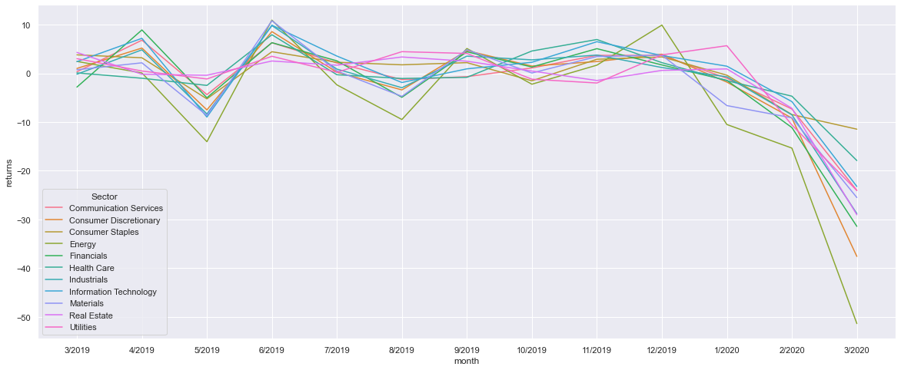
    


As we can see from this graph, while certain industries had it worse such as Energy and Consumer Discretionary, COVID-19 hasn't left a single industry unrattled.

## Risk Measurment Algorithm

#### I was able to successfully identify and weed out risk factors by using a textual analysis algorithm. The algorithm consists of the following steps:
---
<dl>
<dd>1. The user inputs two sets of words, one word per set is acceptable</dd>
<dd>2. After the 10-k text is stripped of any unusual characters, the algorithm lets the user decide the number of words between any word in set 1 to set 2</dd>
<dd>3. The words must match the sets perfectly, meaning getting all forms of the word is encouraged</dd>
<dd>4. By allowing the user to change the word spacer, the algorithm can become as specific and general as the user pleases</dd>
</dl>

## Word Banks
---

### SUPPLY CHAIN (GENERAL) ~~ METHOD 1 WORD BANK ~~ Spacing = 15

#### Why Supply Chain
> Supply chain seemed like a perfect choice with plenty of economic analysis to be done. When the pandemic was in full swing, a combination of social distancing, a decreasing workforce, an increase in common good consumption leading to backed-up wait times, and a massive chip shortage had supply chains scrambling for answers. With this in mind, I based my first word bank on any type of general term associated with supplies and the second with any form of hardship.

> ONE
```python
purchased|purchase|parts|outsource|outsorced|source|sourced|supplier|suppliers|supply|product|products|version|variant|shipping|shipment|deliver|delivery|deliveries|transport|transportation|schedule|schedules|price|prices|quality|timeline|construction|volume|volumes|production|boat|airplane|capacity|prospects
```
> TWO
```python
delay|delays|issue|issues|timely|time|limited|limit|challenge|challenges|fail|failure|pandemic|epidemic|COVID19|earthquake|unable|disruption|disruptions|replace|alternate|alternative|unsuccessful|harm|unstable|impact
```
   
#### Reasoning:
> For the first search in my main topic, supply chain, I wanted to get a very general sense of the direction regarding supply chain issues versus returns. From this observation, I ended up gathering a trendline that reflected little correlation and decided to shorten the word bank distance to 3. Even so, the correlation was weak which led me to my third attempt

#### Statistical Properties


```python
# General Breakdown
return_data[['SCM_M1_OCCUR','Sector']].groupby('Sector').describe()
```


<div>
<style scoped>
    .dataframe tbody tr th:only-of-type {
        vertical-align: middle;
    }

    .dataframe tbody tr th {
        vertical-align: top;
    }

    .dataframe thead tr th {
        text-align: left;
    }

    .dataframe thead tr:last-of-type th {
        text-align: right;
    }
</style>
<table border="1" class="dataframe">
  <thead>
    <tr>
      <th></th>
      <th colspan="8" halign="left">SCM_M1_OCCUR</th>
    </tr>
    <tr>
      <th></th>
      <th>count</th>
      <th>mean</th>
      <th>std</th>
      <th>min</th>
      <th>25%</th>
      <th>50%</th>
      <th>75%</th>
      <th>max</th>
    </tr>
    <tr>
      <th>Sector</th>
      <th></th>
      <th></th>
      <th></th>
      <th></th>
      <th></th>
      <th></th>
      <th></th>
      <th></th>
    </tr>
  </thead>
  <tbody>
    <tr>
      <th>Communication Services</th>
      <td>25.0</td>
      <td>42.120000</td>
      <td>24.622686</td>
      <td>7.0</td>
      <td>23.00</td>
      <td>39.0</td>
      <td>60.00</td>
      <td>100.0</td>
    </tr>
    <tr>
      <th>Consumer Discretionary</th>
      <td>59.0</td>
      <td>46.372881</td>
      <td>29.380910</td>
      <td>0.0</td>
      <td>25.50</td>
      <td>40.0</td>
      <td>55.50</td>
      <td>146.0</td>
    </tr>
    <tr>
      <th>Consumer Staples</th>
      <td>31.0</td>
      <td>54.290323</td>
      <td>29.087447</td>
      <td>12.0</td>
      <td>37.00</td>
      <td>49.0</td>
      <td>60.50</td>
      <td>148.0</td>
    </tr>
    <tr>
      <th>Energy</th>
      <td>21.0</td>
      <td>51.666667</td>
      <td>18.059162</td>
      <td>17.0</td>
      <td>40.00</td>
      <td>50.0</td>
      <td>69.00</td>
      <td>87.0</td>
    </tr>
    <tr>
      <th>Financials</th>
      <td>63.0</td>
      <td>39.587302</td>
      <td>24.410888</td>
      <td>0.0</td>
      <td>22.50</td>
      <td>36.0</td>
      <td>53.50</td>
      <td>103.0</td>
    </tr>
    <tr>
      <th>Health Care</th>
      <td>63.0</td>
      <td>74.936508</td>
      <td>41.294721</td>
      <td>0.0</td>
      <td>44.00</td>
      <td>67.0</td>
      <td>101.00</td>
      <td>235.0</td>
    </tr>
    <tr>
      <th>Industrials</th>
      <td>71.0</td>
      <td>43.323944</td>
      <td>19.598670</td>
      <td>5.0</td>
      <td>31.00</td>
      <td>38.0</td>
      <td>57.50</td>
      <td>99.0</td>
    </tr>
    <tr>
      <th>Information Technology</th>
      <td>74.0</td>
      <td>69.162162</td>
      <td>51.317178</td>
      <td>0.0</td>
      <td>32.00</td>
      <td>56.0</td>
      <td>95.00</td>
      <td>312.0</td>
    </tr>
    <tr>
      <th>Materials</th>
      <td>28.0</td>
      <td>50.642857</td>
      <td>22.470086</td>
      <td>0.0</td>
      <td>39.00</td>
      <td>47.5</td>
      <td>66.25</td>
      <td>101.0</td>
    </tr>
    <tr>
      <th>Real Estate</th>
      <td>29.0</td>
      <td>27.586207</td>
      <td>15.260868</td>
      <td>5.0</td>
      <td>19.00</td>
      <td>24.0</td>
      <td>34.00</td>
      <td>78.0</td>
    </tr>
    <tr>
      <th>Utilities</th>
      <td>28.0</td>
      <td>54.500000</td>
      <td>28.140520</td>
      <td>13.0</td>
      <td>31.75</td>
      <td>53.5</td>
      <td>71.00</td>
      <td>148.0</td>
    </tr>
  </tbody>
</table>
</div>


There's a ton of variation across the board here. This is to be expected due to the wide range of words chosen.

### SUPPLY CHAIN (SPECIFIC) ~~ METHOD 2 WORD BANK ~~ Spacing = 3


```python
# General Breakdown
return_data[['SCM_M2_OCCUR','Sector']].groupby('Sector').describe()
```


<div>
<style scoped>
    .dataframe tbody tr th:only-of-type {
        vertical-align: middle;
    }

    .dataframe tbody tr th {
        vertical-align: top;
    }

    .dataframe thead tr th {
        text-align: left;
    }

    .dataframe thead tr:last-of-type th {
        text-align: right;
    }
</style>
<table border="1" class="dataframe">
  <thead>
    <tr>
      <th></th>
      <th colspan="8" halign="left">SCM_M2_OCCUR</th>
    </tr>
    <tr>
      <th></th>
      <th>count</th>
      <th>mean</th>
      <th>std</th>
      <th>min</th>
      <th>25%</th>
      <th>50%</th>
      <th>75%</th>
      <th>max</th>
    </tr>
    <tr>
      <th>Sector</th>
      <th></th>
      <th></th>
      <th></th>
      <th></th>
      <th></th>
      <th></th>
      <th></th>
      <th></th>
    </tr>
  </thead>
  <tbody>
    <tr>
      <th>Communication Services</th>
      <td>25.0</td>
      <td>13.320000</td>
      <td>10.057004</td>
      <td>0.0</td>
      <td>6.00</td>
      <td>10.0</td>
      <td>17.00</td>
      <td>42.0</td>
    </tr>
    <tr>
      <th>Consumer Discretionary</th>
      <td>59.0</td>
      <td>18.423729</td>
      <td>14.521332</td>
      <td>0.0</td>
      <td>8.00</td>
      <td>14.0</td>
      <td>24.00</td>
      <td>64.0</td>
    </tr>
    <tr>
      <th>Consumer Staples</th>
      <td>31.0</td>
      <td>19.451613</td>
      <td>12.748434</td>
      <td>4.0</td>
      <td>13.50</td>
      <td>18.0</td>
      <td>22.00</td>
      <td>75.0</td>
    </tr>
    <tr>
      <th>Energy</th>
      <td>21.0</td>
      <td>17.619048</td>
      <td>7.592603</td>
      <td>5.0</td>
      <td>11.00</td>
      <td>18.0</td>
      <td>21.00</td>
      <td>30.0</td>
    </tr>
    <tr>
      <th>Financials</th>
      <td>63.0</td>
      <td>11.380952</td>
      <td>9.272625</td>
      <td>0.0</td>
      <td>5.00</td>
      <td>10.0</td>
      <td>15.50</td>
      <td>38.0</td>
    </tr>
    <tr>
      <th>Health Care</th>
      <td>63.0</td>
      <td>27.126984</td>
      <td>16.502680</td>
      <td>0.0</td>
      <td>15.00</td>
      <td>24.0</td>
      <td>35.00</td>
      <td>86.0</td>
    </tr>
    <tr>
      <th>Industrials</th>
      <td>71.0</td>
      <td>16.056338</td>
      <td>9.546708</td>
      <td>2.0</td>
      <td>9.00</td>
      <td>15.0</td>
      <td>22.00</td>
      <td>46.0</td>
    </tr>
    <tr>
      <th>Information Technology</th>
      <td>74.0</td>
      <td>27.040541</td>
      <td>20.845445</td>
      <td>0.0</td>
      <td>11.00</td>
      <td>22.5</td>
      <td>37.75</td>
      <td>97.0</td>
    </tr>
    <tr>
      <th>Materials</th>
      <td>28.0</td>
      <td>21.785714</td>
      <td>11.480602</td>
      <td>0.0</td>
      <td>12.75</td>
      <td>21.0</td>
      <td>28.50</td>
      <td>47.0</td>
    </tr>
    <tr>
      <th>Real Estate</th>
      <td>29.0</td>
      <td>9.241379</td>
      <td>7.079423</td>
      <td>0.0</td>
      <td>4.00</td>
      <td>8.0</td>
      <td>11.00</td>
      <td>34.0</td>
    </tr>
    <tr>
      <th>Utilities</th>
      <td>28.0</td>
      <td>18.535714</td>
      <td>9.788437</td>
      <td>3.0</td>
      <td>11.00</td>
      <td>18.0</td>
      <td>24.00</td>
      <td>48.0</td>
    </tr>
  </tbody>
</table>
</div>


This table had similar effects as above

### SUPPLY CHAIN (SPECIFIC) ~~ METHOD 3 WORD BANK ~~ Spacing = 15

> ONE
```python
deliver|delivery|deliveries|delivering|shipping|shipment|transport|transportation|boat|airplane|ship
```
> TWO
```python
delay|delays|issue|issues|timely|time|limited|limit|challenge|challenges|fail|failure|pandemic|epidemic|COVID19|earthquake|unable|disruption|disruptions|replace|alternate|alternative|unsuccessful|harm|unstable|impact
```

#### Reasoning:
> It wasn't until the 3rd method that I began to see the results that I was expecting. By narrowing down the crux of the issue to "transportation" industries and companies, I began to see a negatively correlated trend line in my scatterplot, meaning that some of the words used in method one were not as relevant as I initially thought.

#### Statistical Properties


```python
# General Breakdown
return_data[['SCM_M3_OCCUR','Sector']].groupby('Sector').describe()
```


<div>
<style scoped>
    .dataframe tbody tr th:only-of-type {
        vertical-align: middle;
    }

    .dataframe tbody tr th {
        vertical-align: top;
    }

    .dataframe thead tr th {
        text-align: left;
    }

    .dataframe thead tr:last-of-type th {
        text-align: right;
    }
</style>
<table border="1" class="dataframe">
  <thead>
    <tr>
      <th></th>
      <th colspan="8" halign="left">SCM_M3_OCCUR</th>
    </tr>
    <tr>
      <th></th>
      <th>count</th>
      <th>mean</th>
      <th>std</th>
      <th>min</th>
      <th>25%</th>
      <th>50%</th>
      <th>75%</th>
      <th>max</th>
    </tr>
    <tr>
      <th>Sector</th>
      <th></th>
      <th></th>
      <th></th>
      <th></th>
      <th></th>
      <th></th>
      <th></th>
      <th></th>
    </tr>
  </thead>
  <tbody>
    <tr>
      <th>Communication Services</th>
      <td>25.0</td>
      <td>3.120000</td>
      <td>2.682039</td>
      <td>0.0</td>
      <td>1.0</td>
      <td>3.0</td>
      <td>5.00</td>
      <td>10.0</td>
    </tr>
    <tr>
      <th>Consumer Discretionary</th>
      <td>59.0</td>
      <td>7.576271</td>
      <td>5.810820</td>
      <td>0.0</td>
      <td>3.0</td>
      <td>7.0</td>
      <td>11.00</td>
      <td>22.0</td>
    </tr>
    <tr>
      <th>Consumer Staples</th>
      <td>31.0</td>
      <td>4.000000</td>
      <td>2.221111</td>
      <td>0.0</td>
      <td>2.5</td>
      <td>4.0</td>
      <td>5.00</td>
      <td>9.0</td>
    </tr>
    <tr>
      <th>Energy</th>
      <td>21.0</td>
      <td>7.952381</td>
      <td>4.727327</td>
      <td>2.0</td>
      <td>4.0</td>
      <td>6.0</td>
      <td>12.00</td>
      <td>16.0</td>
    </tr>
    <tr>
      <th>Financials</th>
      <td>63.0</td>
      <td>2.206349</td>
      <td>3.785195</td>
      <td>0.0</td>
      <td>0.0</td>
      <td>1.0</td>
      <td>2.50</td>
      <td>24.0</td>
    </tr>
    <tr>
      <th>Health Care</th>
      <td>63.0</td>
      <td>5.333333</td>
      <td>4.755303</td>
      <td>0.0</td>
      <td>2.0</td>
      <td>4.0</td>
      <td>7.00</td>
      <td>23.0</td>
    </tr>
    <tr>
      <th>Industrials</th>
      <td>71.0</td>
      <td>8.436620</td>
      <td>8.785918</td>
      <td>0.0</td>
      <td>3.0</td>
      <td>6.0</td>
      <td>10.00</td>
      <td>50.0</td>
    </tr>
    <tr>
      <th>Information Technology</th>
      <td>74.0</td>
      <td>8.054054</td>
      <td>5.499419</td>
      <td>0.0</td>
      <td>5.0</td>
      <td>7.0</td>
      <td>11.00</td>
      <td>24.0</td>
    </tr>
    <tr>
      <th>Materials</th>
      <td>28.0</td>
      <td>6.107143</td>
      <td>6.379012</td>
      <td>0.0</td>
      <td>2.0</td>
      <td>4.5</td>
      <td>7.25</td>
      <td>30.0</td>
    </tr>
    <tr>
      <th>Real Estate</th>
      <td>29.0</td>
      <td>2.137931</td>
      <td>2.183119</td>
      <td>0.0</td>
      <td>0.0</td>
      <td>2.0</td>
      <td>3.00</td>
      <td>8.0</td>
    </tr>
    <tr>
      <th>Utilities</th>
      <td>28.0</td>
      <td>7.678571</td>
      <td>4.303776</td>
      <td>0.0</td>
      <td>4.0</td>
      <td>7.5</td>
      <td>11.00</td>
      <td>16.0</td>
    </tr>
  </tbody>
</table>
</div>


While definitely a smaller sample size, its still not insignificant and will prove to have value in the charts below

### ENVIRONMENTAL REGULATION ~~ METHOD 1 WORD BANK

> ONE
```python
environment|environmental|EPA|emissions|emission|esg
```
> TWO
```python
regulation|regulations|regulate|regulatory|regulated|risk|risks|effects|effect|law|laws
```

#### Reasoning:
> With health consciousness and numerous movements stemming from COVID-19 protocols, I figured either one of two things would be the case:
<dd>1. People would begin to adapt an obsession to the air that they breathe and pollution would come under heavy scrutiny.</dd>
<dd>2. Since everyone is struggling and rightfully self-absorbed, environmental regulation would come to a standstill, similar to every other facet of life during the pandemic. Furthermore, small and medium-sized businesses getting a tiny bit of leeway with waste to remain afloat was foreseeable as well.</dd>

> although not the most ideal method of measurement, the words that I used seem to have little correlation with returns.

#### Statistical Properties:


```python
# General Breakdown
return_data[['ENV_M1_OCCUR','Sector']].groupby('Sector').describe()
```


<div>
<style scoped>
    .dataframe tbody tr th:only-of-type {
        vertical-align: middle;
    }

    .dataframe tbody tr th {
        vertical-align: top;
    }

    .dataframe thead tr th {
        text-align: left;
    }

    .dataframe thead tr:last-of-type th {
        text-align: right;
    }
</style>
<table border="1" class="dataframe">
  <thead>
    <tr>
      <th></th>
      <th colspan="8" halign="left">ENV_M1_OCCUR</th>
    </tr>
    <tr>
      <th></th>
      <th>count</th>
      <th>mean</th>
      <th>std</th>
      <th>min</th>
      <th>25%</th>
      <th>50%</th>
      <th>75%</th>
      <th>max</th>
    </tr>
    <tr>
      <th>Sector</th>
      <th></th>
      <th></th>
      <th></th>
      <th></th>
      <th></th>
      <th></th>
      <th></th>
      <th></th>
    </tr>
  </thead>
  <tbody>
    <tr>
      <th>Communication Services</th>
      <td>25.0</td>
      <td>2.800000</td>
      <td>3.851407</td>
      <td>0.0</td>
      <td>1.0</td>
      <td>2.0</td>
      <td>3.0</td>
      <td>19.0</td>
    </tr>
    <tr>
      <th>Consumer Discretionary</th>
      <td>59.0</td>
      <td>6.610169</td>
      <td>5.889842</td>
      <td>0.0</td>
      <td>2.0</td>
      <td>5.0</td>
      <td>10.0</td>
      <td>27.0</td>
    </tr>
    <tr>
      <th>Consumer Staples</th>
      <td>31.0</td>
      <td>9.870968</td>
      <td>5.536196</td>
      <td>2.0</td>
      <td>5.5</td>
      <td>10.0</td>
      <td>12.5</td>
      <td>27.0</td>
    </tr>
    <tr>
      <th>Energy</th>
      <td>21.0</td>
      <td>35.285714</td>
      <td>14.325302</td>
      <td>7.0</td>
      <td>24.0</td>
      <td>36.0</td>
      <td>47.0</td>
      <td>60.0</td>
    </tr>
    <tr>
      <th>Financials</th>
      <td>63.0</td>
      <td>10.015873</td>
      <td>10.140134</td>
      <td>0.0</td>
      <td>3.0</td>
      <td>7.0</td>
      <td>14.0</td>
      <td>60.0</td>
    </tr>
    <tr>
      <th>Health Care</th>
      <td>63.0</td>
      <td>7.746032</td>
      <td>5.772483</td>
      <td>0.0</td>
      <td>4.0</td>
      <td>7.0</td>
      <td>11.0</td>
      <td>29.0</td>
    </tr>
    <tr>
      <th>Industrials</th>
      <td>71.0</td>
      <td>14.000000</td>
      <td>11.129112</td>
      <td>0.0</td>
      <td>7.0</td>
      <td>11.0</td>
      <td>17.0</td>
      <td>67.0</td>
    </tr>
    <tr>
      <th>Information Technology</th>
      <td>74.0</td>
      <td>5.418919</td>
      <td>4.802986</td>
      <td>0.0</td>
      <td>2.0</td>
      <td>4.0</td>
      <td>8.0</td>
      <td>20.0</td>
    </tr>
    <tr>
      <th>Materials</th>
      <td>28.0</td>
      <td>24.035714</td>
      <td>11.679302</td>
      <td>0.0</td>
      <td>17.0</td>
      <td>22.0</td>
      <td>28.0</td>
      <td>54.0</td>
    </tr>
    <tr>
      <th>Real Estate</th>
      <td>29.0</td>
      <td>14.103448</td>
      <td>9.427713</td>
      <td>1.0</td>
      <td>8.0</td>
      <td>11.0</td>
      <td>17.0</td>
      <td>38.0</td>
    </tr>
    <tr>
      <th>Utilities</th>
      <td>28.0</td>
      <td>47.035714</td>
      <td>25.282818</td>
      <td>1.0</td>
      <td>30.5</td>
      <td>45.0</td>
      <td>67.0</td>
      <td>93.0</td>
    </tr>
  </tbody>
</table>
</div>


There is definitely plenty of variation within these observations

### EXTERNAL COMPETITION ~~ METHOD 1 WORD BANK

> ONE
```python
competitive|competition|compete|competitors|competitor|contestant

```
> TWO
```python
intensify|intense|intensly|stiff|crossborder|potential|current|factor|factors|advantage|condition|conditions
```

#### Reasoning:
> Competition became extremely fierce at the height of COVID-19 due to a number of reasons:
<dl>
<dd>1. New business opportunities especially in the healthcare industry were constantly springing up.</dd>
<dd>2. There was a massive increase in consumer online spending, thus shifting firms' normally dual-focused operations (in-store and online) to completely online. Client online persona obsession reached new heights as a result of this.</dd>
<dd>3. Although small and mid-cap businesses got hit the hardest, the urgency of the disappearance of money led to every last avenue of potential income being exhausted, again raising competition.</dd>
</dl>

### Statistics


```python
# General Breakdown
return_data[['CMP_M1_OCCUR','Sector']].groupby('Sector').describe()
```


<div>
<style scoped>
    .dataframe tbody tr th:only-of-type {
        vertical-align: middle;
    }

    .dataframe tbody tr th {
        vertical-align: top;
    }

    .dataframe thead tr th {
        text-align: left;
    }

    .dataframe thead tr:last-of-type th {
        text-align: right;
    }
</style>
<table border="1" class="dataframe">
  <thead>
    <tr>
      <th></th>
      <th colspan="8" halign="left">CMP_M1_OCCUR</th>
    </tr>
    <tr>
      <th></th>
      <th>count</th>
      <th>mean</th>
      <th>std</th>
      <th>min</th>
      <th>25%</th>
      <th>50%</th>
      <th>75%</th>
      <th>max</th>
    </tr>
    <tr>
      <th>Sector</th>
      <th></th>
      <th></th>
      <th></th>
      <th></th>
      <th></th>
      <th></th>
      <th></th>
      <th></th>
    </tr>
  </thead>
  <tbody>
    <tr>
      <th>Communication Services</th>
      <td>25.0</td>
      <td>10.440000</td>
      <td>4.839766</td>
      <td>3.0</td>
      <td>7.00</td>
      <td>9.0</td>
      <td>14.0</td>
      <td>23.0</td>
    </tr>
    <tr>
      <th>Consumer Discretionary</th>
      <td>59.0</td>
      <td>8.203390</td>
      <td>5.148752</td>
      <td>0.0</td>
      <td>6.00</td>
      <td>7.0</td>
      <td>10.0</td>
      <td>34.0</td>
    </tr>
    <tr>
      <th>Consumer Staples</th>
      <td>31.0</td>
      <td>7.935484</td>
      <td>4.373675</td>
      <td>1.0</td>
      <td>5.00</td>
      <td>7.0</td>
      <td>9.0</td>
      <td>21.0</td>
    </tr>
    <tr>
      <th>Energy</th>
      <td>21.0</td>
      <td>5.047619</td>
      <td>3.499660</td>
      <td>0.0</td>
      <td>3.00</td>
      <td>4.0</td>
      <td>6.0</td>
      <td>14.0</td>
    </tr>
    <tr>
      <th>Financials</th>
      <td>63.0</td>
      <td>10.190476</td>
      <td>6.316535</td>
      <td>0.0</td>
      <td>6.00</td>
      <td>9.0</td>
      <td>14.5</td>
      <td>28.0</td>
    </tr>
    <tr>
      <th>Health Care</th>
      <td>63.0</td>
      <td>9.682540</td>
      <td>5.057174</td>
      <td>0.0</td>
      <td>6.00</td>
      <td>10.0</td>
      <td>13.0</td>
      <td>21.0</td>
    </tr>
    <tr>
      <th>Industrials</th>
      <td>71.0</td>
      <td>7.014085</td>
      <td>4.568504</td>
      <td>0.0</td>
      <td>4.00</td>
      <td>6.0</td>
      <td>9.5</td>
      <td>22.0</td>
    </tr>
    <tr>
      <th>Information Technology</th>
      <td>74.0</td>
      <td>11.864865</td>
      <td>5.803457</td>
      <td>0.0</td>
      <td>8.25</td>
      <td>11.0</td>
      <td>15.0</td>
      <td>29.0</td>
    </tr>
    <tr>
      <th>Materials</th>
      <td>28.0</td>
      <td>6.892857</td>
      <td>5.187873</td>
      <td>0.0</td>
      <td>4.00</td>
      <td>6.0</td>
      <td>8.0</td>
      <td>25.0</td>
    </tr>
    <tr>
      <th>Real Estate</th>
      <td>29.0</td>
      <td>6.758621</td>
      <td>3.709593</td>
      <td>0.0</td>
      <td>5.00</td>
      <td>6.0</td>
      <td>8.0</td>
      <td>17.0</td>
    </tr>
    <tr>
      <th>Utilities</th>
      <td>28.0</td>
      <td>4.892857</td>
      <td>3.413907</td>
      <td>1.0</td>
      <td>2.00</td>
      <td>4.0</td>
      <td>7.0</td>
      <td>14.0</td>
    </tr>
  </tbody>
</table>
</div>


There's definitely more of an even split here in terms of variation, but among sectors it's still rather noticeable.

# DATA CORRELATION


```python
return_data_corr = return_data.corr()
plt.figure(figsize=(50,20))
sns.heatmap(return_data_corr, cmap="Greens",annot=True)
```


    <AxesSubplot:>


    
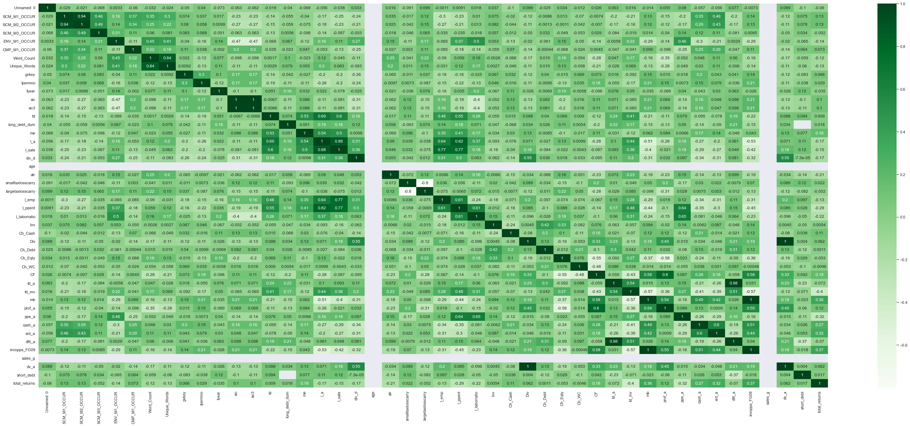
    


---

Using Investopedia's definition of a significant correlation (+-0.8), nothing jumps out from the correlation map perspective. While this means that my solutions aren't perfectly optimal, they still have high enough correlations to form some sort of a meaningful correlation.

# DATA VALIDATION

## Supply Chain Methods 1-3


```python
return_data.groupby("Sector")['SCM_M1_OCCUR','SCM_M2_OCCUR', 'SCM_M3_OCCUR'].describe().reset_index()
```

    C:\Users\19173\anaconda3\lib\site-packages\ipykernel_launcher.py:1: FutureWarning: Indexing with multiple keys (implicitly converted to a tuple of keys) will be deprecated, use a list instead.
      """Entry point for launching an IPython kernel.
    


<div>
<style scoped>
    .dataframe tbody tr th:only-of-type {
        vertical-align: middle;
    }

    .dataframe tbody tr th {
        vertical-align: top;
    }

    .dataframe thead tr th {
        text-align: left;
    }
</style>
<table border="1" class="dataframe">
  <thead>
    <tr>
      <th></th>
      <th>Sector</th>
      <th colspan="8" halign="left">SCM_M1_OCCUR</th>
      <th colspan="4" halign="left">SCM_M2_OCCUR</th>
      <th colspan="8" halign="left">SCM_M3_OCCUR</th>
    </tr>
    <tr>
      <th></th>
      <th></th>
      <th>count</th>
      <th>mean</th>
      <th>std</th>
      <th>min</th>
      <th>25%</th>
      <th>50%</th>
      <th>75%</th>
      <th>max</th>
      <th>count</th>
      <th>...</th>
      <th>75%</th>
      <th>max</th>
      <th>count</th>
      <th>mean</th>
      <th>std</th>
      <th>min</th>
      <th>25%</th>
      <th>50%</th>
      <th>75%</th>
      <th>max</th>
    </tr>
  </thead>
  <tbody>
    <tr>
      <th>0</th>
      <td>Communication Services</td>
      <td>25.0</td>
      <td>42.120000</td>
      <td>24.622686</td>
      <td>7.0</td>
      <td>23.00</td>
      <td>39.0</td>
      <td>60.00</td>
      <td>100.0</td>
      <td>25.0</td>
      <td>...</td>
      <td>17.00</td>
      <td>42.0</td>
      <td>25.0</td>
      <td>3.120000</td>
      <td>2.682039</td>
      <td>0.0</td>
      <td>1.0</td>
      <td>3.0</td>
      <td>5.00</td>
      <td>10.0</td>
    </tr>
    <tr>
      <th>1</th>
      <td>Consumer Discretionary</td>
      <td>59.0</td>
      <td>46.372881</td>
      <td>29.380910</td>
      <td>0.0</td>
      <td>25.50</td>
      <td>40.0</td>
      <td>55.50</td>
      <td>146.0</td>
      <td>59.0</td>
      <td>...</td>
      <td>24.00</td>
      <td>64.0</td>
      <td>59.0</td>
      <td>7.576271</td>
      <td>5.810820</td>
      <td>0.0</td>
      <td>3.0</td>
      <td>7.0</td>
      <td>11.00</td>
      <td>22.0</td>
    </tr>
    <tr>
      <th>2</th>
      <td>Consumer Staples</td>
      <td>31.0</td>
      <td>54.290323</td>
      <td>29.087447</td>
      <td>12.0</td>
      <td>37.00</td>
      <td>49.0</td>
      <td>60.50</td>
      <td>148.0</td>
      <td>31.0</td>
      <td>...</td>
      <td>22.00</td>
      <td>75.0</td>
      <td>31.0</td>
      <td>4.000000</td>
      <td>2.221111</td>
      <td>0.0</td>
      <td>2.5</td>
      <td>4.0</td>
      <td>5.00</td>
      <td>9.0</td>
    </tr>
    <tr>
      <th>3</th>
      <td>Energy</td>
      <td>21.0</td>
      <td>51.666667</td>
      <td>18.059162</td>
      <td>17.0</td>
      <td>40.00</td>
      <td>50.0</td>
      <td>69.00</td>
      <td>87.0</td>
      <td>21.0</td>
      <td>...</td>
      <td>21.00</td>
      <td>30.0</td>
      <td>21.0</td>
      <td>7.952381</td>
      <td>4.727327</td>
      <td>2.0</td>
      <td>4.0</td>
      <td>6.0</td>
      <td>12.00</td>
      <td>16.0</td>
    </tr>
    <tr>
      <th>4</th>
      <td>Financials</td>
      <td>63.0</td>
      <td>39.587302</td>
      <td>24.410888</td>
      <td>0.0</td>
      <td>22.50</td>
      <td>36.0</td>
      <td>53.50</td>
      <td>103.0</td>
      <td>63.0</td>
      <td>...</td>
      <td>15.50</td>
      <td>38.0</td>
      <td>63.0</td>
      <td>2.206349</td>
      <td>3.785195</td>
      <td>0.0</td>
      <td>0.0</td>
      <td>1.0</td>
      <td>2.50</td>
      <td>24.0</td>
    </tr>
    <tr>
      <th>5</th>
      <td>Health Care</td>
      <td>63.0</td>
      <td>74.936508</td>
      <td>41.294721</td>
      <td>0.0</td>
      <td>44.00</td>
      <td>67.0</td>
      <td>101.00</td>
      <td>235.0</td>
      <td>63.0</td>
      <td>...</td>
      <td>35.00</td>
      <td>86.0</td>
      <td>63.0</td>
      <td>5.333333</td>
      <td>4.755303</td>
      <td>0.0</td>
      <td>2.0</td>
      <td>4.0</td>
      <td>7.00</td>
      <td>23.0</td>
    </tr>
    <tr>
      <th>6</th>
      <td>Industrials</td>
      <td>71.0</td>
      <td>43.323944</td>
      <td>19.598670</td>
      <td>5.0</td>
      <td>31.00</td>
      <td>38.0</td>
      <td>57.50</td>
      <td>99.0</td>
      <td>71.0</td>
      <td>...</td>
      <td>22.00</td>
      <td>46.0</td>
      <td>71.0</td>
      <td>8.436620</td>
      <td>8.785918</td>
      <td>0.0</td>
      <td>3.0</td>
      <td>6.0</td>
      <td>10.00</td>
      <td>50.0</td>
    </tr>
    <tr>
      <th>7</th>
      <td>Information Technology</td>
      <td>74.0</td>
      <td>69.162162</td>
      <td>51.317178</td>
      <td>0.0</td>
      <td>32.00</td>
      <td>56.0</td>
      <td>95.00</td>
      <td>312.0</td>
      <td>74.0</td>
      <td>...</td>
      <td>37.75</td>
      <td>97.0</td>
      <td>74.0</td>
      <td>8.054054</td>
      <td>5.499419</td>
      <td>0.0</td>
      <td>5.0</td>
      <td>7.0</td>
      <td>11.00</td>
      <td>24.0</td>
    </tr>
    <tr>
      <th>8</th>
      <td>Materials</td>
      <td>28.0</td>
      <td>50.642857</td>
      <td>22.470086</td>
      <td>0.0</td>
      <td>39.00</td>
      <td>47.5</td>
      <td>66.25</td>
      <td>101.0</td>
      <td>28.0</td>
      <td>...</td>
      <td>28.50</td>
      <td>47.0</td>
      <td>28.0</td>
      <td>6.107143</td>
      <td>6.379012</td>
      <td>0.0</td>
      <td>2.0</td>
      <td>4.5</td>
      <td>7.25</td>
      <td>30.0</td>
    </tr>
    <tr>
      <th>9</th>
      <td>Real Estate</td>
      <td>29.0</td>
      <td>27.586207</td>
      <td>15.260868</td>
      <td>5.0</td>
      <td>19.00</td>
      <td>24.0</td>
      <td>34.00</td>
      <td>78.0</td>
      <td>29.0</td>
      <td>...</td>
      <td>11.00</td>
      <td>34.0</td>
      <td>29.0</td>
      <td>2.137931</td>
      <td>2.183119</td>
      <td>0.0</td>
      <td>0.0</td>
      <td>2.0</td>
      <td>3.00</td>
      <td>8.0</td>
    </tr>
    <tr>
      <th>10</th>
      <td>Utilities</td>
      <td>28.0</td>
      <td>54.500000</td>
      <td>28.140520</td>
      <td>13.0</td>
      <td>31.75</td>
      <td>53.5</td>
      <td>71.00</td>
      <td>148.0</td>
      <td>28.0</td>
      <td>...</td>
      <td>24.00</td>
      <td>48.0</td>
      <td>28.0</td>
      <td>7.678571</td>
      <td>4.303776</td>
      <td>0.0</td>
      <td>4.0</td>
      <td>7.5</td>
      <td>11.00</td>
      <td>16.0</td>
    </tr>
  </tbody>
</table>
<p>11 rows × 25 columns</p>
</div>


### Supply Chain Data Validation:
- Through this analysis, it is clear that Healthcare and Information Technology are the most susceptible supply chain risks.
- This is very consistent with climate sentiment, as during the time of these returns, it was impossible to get necessities like masks, doctor gloves, disinfectant, etc.
- Additionally, given the massive computer chip and hardware shortage early during COVID-19, IT being very high up makes sense as well.


```python
return_data.groupby("Sector")['ENV_M1_OCCUR'].describe().reset_index()
```


<div>
<style scoped>
    .dataframe tbody tr th:only-of-type {
        vertical-align: middle;
    }

    .dataframe tbody tr th {
        vertical-align: top;
    }

    .dataframe thead th {
        text-align: right;
    }
</style>
<table border="1" class="dataframe">
  <thead>
    <tr style="text-align: right;">
      <th></th>
      <th>Sector</th>
      <th>count</th>
      <th>mean</th>
      <th>std</th>
      <th>min</th>
      <th>25%</th>
      <th>50%</th>
      <th>75%</th>
      <th>max</th>
    </tr>
  </thead>
  <tbody>
    <tr>
      <th>0</th>
      <td>Communication Services</td>
      <td>25.0</td>
      <td>2.800000</td>
      <td>3.851407</td>
      <td>0.0</td>
      <td>1.0</td>
      <td>2.0</td>
      <td>3.0</td>
      <td>19.0</td>
    </tr>
    <tr>
      <th>1</th>
      <td>Consumer Discretionary</td>
      <td>59.0</td>
      <td>6.610169</td>
      <td>5.889842</td>
      <td>0.0</td>
      <td>2.0</td>
      <td>5.0</td>
      <td>10.0</td>
      <td>27.0</td>
    </tr>
    <tr>
      <th>2</th>
      <td>Consumer Staples</td>
      <td>31.0</td>
      <td>9.870968</td>
      <td>5.536196</td>
      <td>2.0</td>
      <td>5.5</td>
      <td>10.0</td>
      <td>12.5</td>
      <td>27.0</td>
    </tr>
    <tr>
      <th>3</th>
      <td>Energy</td>
      <td>21.0</td>
      <td>35.285714</td>
      <td>14.325302</td>
      <td>7.0</td>
      <td>24.0</td>
      <td>36.0</td>
      <td>47.0</td>
      <td>60.0</td>
    </tr>
    <tr>
      <th>4</th>
      <td>Financials</td>
      <td>63.0</td>
      <td>10.015873</td>
      <td>10.140134</td>
      <td>0.0</td>
      <td>3.0</td>
      <td>7.0</td>
      <td>14.0</td>
      <td>60.0</td>
    </tr>
    <tr>
      <th>5</th>
      <td>Health Care</td>
      <td>63.0</td>
      <td>7.746032</td>
      <td>5.772483</td>
      <td>0.0</td>
      <td>4.0</td>
      <td>7.0</td>
      <td>11.0</td>
      <td>29.0</td>
    </tr>
    <tr>
      <th>6</th>
      <td>Industrials</td>
      <td>71.0</td>
      <td>14.000000</td>
      <td>11.129112</td>
      <td>0.0</td>
      <td>7.0</td>
      <td>11.0</td>
      <td>17.0</td>
      <td>67.0</td>
    </tr>
    <tr>
      <th>7</th>
      <td>Information Technology</td>
      <td>74.0</td>
      <td>5.418919</td>
      <td>4.802986</td>
      <td>0.0</td>
      <td>2.0</td>
      <td>4.0</td>
      <td>8.0</td>
      <td>20.0</td>
    </tr>
    <tr>
      <th>8</th>
      <td>Materials</td>
      <td>28.0</td>
      <td>24.035714</td>
      <td>11.679302</td>
      <td>0.0</td>
      <td>17.0</td>
      <td>22.0</td>
      <td>28.0</td>
      <td>54.0</td>
    </tr>
    <tr>
      <th>9</th>
      <td>Real Estate</td>
      <td>29.0</td>
      <td>14.103448</td>
      <td>9.427713</td>
      <td>1.0</td>
      <td>8.0</td>
      <td>11.0</td>
      <td>17.0</td>
      <td>38.0</td>
    </tr>
    <tr>
      <th>10</th>
      <td>Utilities</td>
      <td>28.0</td>
      <td>47.035714</td>
      <td>25.282818</td>
      <td>1.0</td>
      <td>30.5</td>
      <td>45.0</td>
      <td>67.0</td>
      <td>93.0</td>
    </tr>
  </tbody>
</table>
</div>


### Environmental Regulation Data Validation:
- Through this analysis, it is clear that Energy and Utilities draw the most matches.
- This is very consistent with the real world as well as ESG related issues constantly are being resolved caused by utilities and energy solutions.
- Regulation targeting these two sectors the most is indicative of the future commitment to a greener environment, and firms in these two industries have certainly recognized that.


```python
return_data.groupby("Sector")['CMP_M1_OCCUR'].describe().reset_index()
```


<div>
<style scoped>
    .dataframe tbody tr th:only-of-type {
        vertical-align: middle;
    }

    .dataframe tbody tr th {
        vertical-align: top;
    }

    .dataframe thead th {
        text-align: right;
    }
</style>
<table border="1" class="dataframe">
  <thead>
    <tr style="text-align: right;">
      <th></th>
      <th>Sector</th>
      <th>count</th>
      <th>mean</th>
      <th>std</th>
      <th>min</th>
      <th>25%</th>
      <th>50%</th>
      <th>75%</th>
      <th>max</th>
    </tr>
  </thead>
  <tbody>
    <tr>
      <th>0</th>
      <td>Communication Services</td>
      <td>25.0</td>
      <td>10.440000</td>
      <td>4.839766</td>
      <td>3.0</td>
      <td>7.00</td>
      <td>9.0</td>
      <td>14.0</td>
      <td>23.0</td>
    </tr>
    <tr>
      <th>1</th>
      <td>Consumer Discretionary</td>
      <td>59.0</td>
      <td>8.203390</td>
      <td>5.148752</td>
      <td>0.0</td>
      <td>6.00</td>
      <td>7.0</td>
      <td>10.0</td>
      <td>34.0</td>
    </tr>
    <tr>
      <th>2</th>
      <td>Consumer Staples</td>
      <td>31.0</td>
      <td>7.935484</td>
      <td>4.373675</td>
      <td>1.0</td>
      <td>5.00</td>
      <td>7.0</td>
      <td>9.0</td>
      <td>21.0</td>
    </tr>
    <tr>
      <th>3</th>
      <td>Energy</td>
      <td>21.0</td>
      <td>5.047619</td>
      <td>3.499660</td>
      <td>0.0</td>
      <td>3.00</td>
      <td>4.0</td>
      <td>6.0</td>
      <td>14.0</td>
    </tr>
    <tr>
      <th>4</th>
      <td>Financials</td>
      <td>63.0</td>
      <td>10.190476</td>
      <td>6.316535</td>
      <td>0.0</td>
      <td>6.00</td>
      <td>9.0</td>
      <td>14.5</td>
      <td>28.0</td>
    </tr>
    <tr>
      <th>5</th>
      <td>Health Care</td>
      <td>63.0</td>
      <td>9.682540</td>
      <td>5.057174</td>
      <td>0.0</td>
      <td>6.00</td>
      <td>10.0</td>
      <td>13.0</td>
      <td>21.0</td>
    </tr>
    <tr>
      <th>6</th>
      <td>Industrials</td>
      <td>71.0</td>
      <td>7.014085</td>
      <td>4.568504</td>
      <td>0.0</td>
      <td>4.00</td>
      <td>6.0</td>
      <td>9.5</td>
      <td>22.0</td>
    </tr>
    <tr>
      <th>7</th>
      <td>Information Technology</td>
      <td>74.0</td>
      <td>11.864865</td>
      <td>5.803457</td>
      <td>0.0</td>
      <td>8.25</td>
      <td>11.0</td>
      <td>15.0</td>
      <td>29.0</td>
    </tr>
    <tr>
      <th>8</th>
      <td>Materials</td>
      <td>28.0</td>
      <td>6.892857</td>
      <td>5.187873</td>
      <td>0.0</td>
      <td>4.00</td>
      <td>6.0</td>
      <td>8.0</td>
      <td>25.0</td>
    </tr>
    <tr>
      <th>9</th>
      <td>Real Estate</td>
      <td>29.0</td>
      <td>6.758621</td>
      <td>3.709593</td>
      <td>0.0</td>
      <td>5.00</td>
      <td>6.0</td>
      <td>8.0</td>
      <td>17.0</td>
    </tr>
    <tr>
      <th>10</th>
      <td>Utilities</td>
      <td>28.0</td>
      <td>4.892857</td>
      <td>3.413907</td>
      <td>1.0</td>
      <td>2.00</td>
      <td>4.0</td>
      <td>7.0</td>
      <td>14.0</td>
    </tr>
  </tbody>
</table>
</div>


### Competition Data Validation:
- Among the three fields broken down, competition has the most equal disparity, certainly logical due to every industry being tested during the pandemic.
- Communication services and information technology were two industries that exploded with the rise of virtual workplaces and it certainly makes sense that they are near the top.
- Financials being at the top can seem puzzling at first, but there's always very stiff competition in finance, and with the luxury of being at home and constantly available for clients, the competition was bound to increase.

---

# Final Sample


```python
return_data.describe().T
```


<div>
<style scoped>
    .dataframe tbody tr th:only-of-type {
        vertical-align: middle;
    }

    .dataframe tbody tr th {
        vertical-align: top;
    }

    .dataframe thead th {
        text-align: right;
    }
</style>
<table border="1" class="dataframe">
  <thead>
    <tr style="text-align: right;">
      <th></th>
      <th>count</th>
      <th>mean</th>
      <th>std</th>
      <th>min</th>
      <th>25%</th>
      <th>50%</th>
      <th>75%</th>
      <th>max</th>
    </tr>
  </thead>
  <tbody>
    <tr>
      <th>Unnamed: 0</th>
      <td>492.0</td>
      <td>245.500000</td>
      <td>142.172431</td>
      <td>0.000000</td>
      <td>122.750000</td>
      <td>245.500000</td>
      <td>368.250000</td>
      <td>4.910000e+02</td>
    </tr>
    <tr>
      <th>SCM_M1_OCCUR</th>
      <td>492.0</td>
      <td>52.256098</td>
      <td>34.717414</td>
      <td>0.000000</td>
      <td>30.000000</td>
      <td>45.000000</td>
      <td>66.000000</td>
      <td>3.120000e+02</td>
    </tr>
    <tr>
      <th>SCM_M2_OCCUR</th>
      <td>492.0</td>
      <td>19.018293</td>
      <td>14.667172</td>
      <td>0.000000</td>
      <td>9.000000</td>
      <td>16.000000</td>
      <td>26.000000</td>
      <td>9.700000e+01</td>
    </tr>
    <tr>
      <th>SCM_M3_OCCUR</th>
      <td>492.0</td>
      <td>5.963415</td>
      <td>5.900972</td>
      <td>0.000000</td>
      <td>2.000000</td>
      <td>5.000000</td>
      <td>8.000000</td>
      <td>5.000000e+01</td>
    </tr>
    <tr>
      <th>ENV_M1_OCCUR</th>
      <td>492.0</td>
      <td>13.048780</td>
      <td>14.821740</td>
      <td>0.000000</td>
      <td>4.000000</td>
      <td>8.000000</td>
      <td>16.000000</td>
      <td>9.300000e+01</td>
    </tr>
    <tr>
      <th>CMP_M1_OCCUR</th>
      <td>492.0</td>
      <td>8.640244</td>
      <td>5.427043</td>
      <td>0.000000</td>
      <td>5.000000</td>
      <td>7.000000</td>
      <td>12.000000</td>
      <td>3.400000e+01</td>
    </tr>
    <tr>
      <th>Word_Count</th>
      <td>492.0</td>
      <td>67952.065041</td>
      <td>29327.386389</td>
      <td>1557.000000</td>
      <td>50979.250000</td>
      <td>64140.000000</td>
      <td>79728.500000</td>
      <td>2.537950e+05</td>
    </tr>
    <tr>
      <th>Unique_Words</th>
      <td>492.0</td>
      <td>5255.817073</td>
      <td>1391.203369</td>
      <td>461.000000</td>
      <td>4513.250000</td>
      <td>5140.000000</td>
      <td>5844.250000</td>
      <td>1.484300e+04</td>
    </tr>
    <tr>
      <th>gvkey</th>
      <td>352.0</td>
      <td>45655.275568</td>
      <td>61312.551897</td>
      <td>1045.000000</td>
      <td>6357.250000</td>
      <td>13973.000000</td>
      <td>61612.250000</td>
      <td>3.160560e+05</td>
    </tr>
    <tr>
      <th>lpermno</th>
      <td>352.0</td>
      <td>53572.482955</td>
      <td>30231.047786</td>
      <td>10104.000000</td>
      <td>19474.750000</td>
      <td>58246.000000</td>
      <td>82644.250000</td>
      <td>9.343600e+04</td>
    </tr>
    <tr>
      <th>fyear</th>
      <td>352.0</td>
      <td>2018.886364</td>
      <td>0.317821</td>
      <td>2018.000000</td>
      <td>2019.000000</td>
      <td>2019.000000</td>
      <td>2019.000000</td>
      <td>2.019000e+03</td>
    </tr>
    <tr>
      <th>sic</th>
      <td>352.0</td>
      <td>4330.014205</td>
      <td>1949.495636</td>
      <td>100.000000</td>
      <td>2849.250000</td>
      <td>3786.000000</td>
      <td>5507.750000</td>
      <td>8.742000e+03</td>
    </tr>
    <tr>
      <th>sic3</th>
      <td>352.0</td>
      <td>432.784091</td>
      <td>194.979666</td>
      <td>10.000000</td>
      <td>284.750000</td>
      <td>378.500000</td>
      <td>550.750000</td>
      <td>8.740000e+02</td>
    </tr>
    <tr>
      <th>td</th>
      <td>352.0</td>
      <td>12119.868341</td>
      <td>21713.135840</td>
      <td>0.000000</td>
      <td>1817.975000</td>
      <td>5079.242500</td>
      <td>12152.750000</td>
      <td>1.884020e+05</td>
    </tr>
    <tr>
      <th>long_debt_dum</th>
      <td>352.0</td>
      <td>0.982955</td>
      <td>0.129625</td>
      <td>0.000000</td>
      <td>1.000000</td>
      <td>1.000000</td>
      <td>1.000000</td>
      <td>1.000000e+00</td>
    </tr>
    <tr>
      <th>me</th>
      <td>352.0</td>
      <td>57432.237628</td>
      <td>116693.961167</td>
      <td>2963.886500</td>
      <td>13191.317000</td>
      <td>22455.288000</td>
      <td>51945.526250</td>
      <td>1.023856e+06</td>
    </tr>
    <tr>
      <th>l_a</th>
      <td>352.0</td>
      <td>9.708541</td>
      <td>1.229763</td>
      <td>6.569794</td>
      <td>8.800306</td>
      <td>9.686929</td>
      <td>10.557991</td>
      <td>1.322070e+01</td>
    </tr>
    <tr>
      <th>l_sale</th>
      <td>352.0</td>
      <td>9.317635</td>
      <td>1.256966</td>
      <td>4.097822</td>
      <td>8.472732</td>
      <td>9.231821</td>
      <td>10.018299</td>
      <td>1.314555e+01</td>
    </tr>
    <tr>
      <th>div_d</th>
      <td>352.0</td>
      <td>0.744318</td>
      <td>0.436865</td>
      <td>0.000000</td>
      <td>0.000000</td>
      <td>1.000000</td>
      <td>1.000000</td>
      <td>1.000000e+00</td>
    </tr>
    <tr>
      <th>age</th>
      <td>352.0</td>
      <td>0.000000</td>
      <td>0.000000</td>
      <td>0.000000</td>
      <td>0.000000</td>
      <td>0.000000</td>
      <td>0.000000</td>
      <td>0.000000e+00</td>
    </tr>
    <tr>
      <th>atr</th>
      <td>352.0</td>
      <td>0.234018</td>
      <td>0.235356</td>
      <td>0.000000</td>
      <td>0.125926</td>
      <td>0.199817</td>
      <td>0.241626</td>
      <td>1.000000e+00</td>
    </tr>
    <tr>
      <th>smalltaxlosscarry</th>
      <td>273.0</td>
      <td>0.721612</td>
      <td>0.449029</td>
      <td>0.000000</td>
      <td>0.000000</td>
      <td>1.000000</td>
      <td>1.000000</td>
      <td>1.000000e+00</td>
    </tr>
    <tr>
      <th>largetaxlosscarry</th>
      <td>273.0</td>
      <td>0.197802</td>
      <td>0.399074</td>
      <td>0.000000</td>
      <td>0.000000</td>
      <td>0.000000</td>
      <td>0.000000</td>
      <td>1.000000e+00</td>
    </tr>
    <tr>
      <th>l_emp</th>
      <td>352.0</td>
      <td>3.327105</td>
      <td>1.160559</td>
      <td>0.455524</td>
      <td>2.440164</td>
      <td>3.263833</td>
      <td>4.197118</td>
      <td>6.025866e+00</td>
    </tr>
    <tr>
      <th>l_ppent</th>
      <td>352.0</td>
      <td>7.904878</td>
      <td>1.546549</td>
      <td>3.690204</td>
      <td>6.795529</td>
      <td>7.825421</td>
      <td>9.037236</td>
      <td>1.111335e+01</td>
    </tr>
    <tr>
      <th>l_laborratio</th>
      <td>352.0</td>
      <td>4.650632</td>
      <td>1.317926</td>
      <td>0.511044</td>
      <td>3.834218</td>
      <td>4.385719</td>
      <td>5.330502</td>
      <td>9.931146e+00</td>
    </tr>
    <tr>
      <th>Inv</th>
      <td>352.0</td>
      <td>0.054387</td>
      <td>0.084964</td>
      <td>-0.329408</td>
      <td>0.020732</td>
      <td>0.048013</td>
      <td>0.089258</td>
      <td>4.238831e-01</td>
    </tr>
    <tr>
      <th>Ch_Cash</th>
      <td>352.0</td>
      <td>0.008847</td>
      <td>0.065049</td>
      <td>-0.315808</td>
      <td>-0.007998</td>
      <td>0.003960</td>
      <td>0.023985</td>
      <td>3.837106e-01</td>
    </tr>
    <tr>
      <th>Div</th>
      <td>352.0</td>
      <td>0.025462</td>
      <td>0.027004</td>
      <td>0.000000</td>
      <td>0.000000</td>
      <td>0.020492</td>
      <td>0.037559</td>
      <td>1.385936e-01</td>
    </tr>
    <tr>
      <th>Ch_Debt</th>
      <td>352.0</td>
      <td>0.014027</td>
      <td>0.072364</td>
      <td>-0.265326</td>
      <td>-0.019568</td>
      <td>0.000000</td>
      <td>0.031572</td>
      <td>4.217628e-01</td>
    </tr>
    <tr>
      <th>Ch_Eqty</th>
      <td>352.0</td>
      <td>-0.042757</td>
      <td>0.058526</td>
      <td>-0.282758</td>
      <td>-0.062731</td>
      <td>-0.023404</td>
      <td>-0.002746</td>
      <td>1.741915e-01</td>
    </tr>
    <tr>
      <th>Ch_WC</th>
      <td>352.0</td>
      <td>0.011417</td>
      <td>0.044580</td>
      <td>-0.252402</td>
      <td>-0.005327</td>
      <td>0.006631</td>
      <td>0.024374</td>
      <td>3.726431e-01</td>
    </tr>
    <tr>
      <th>CF</th>
      <td>352.0</td>
      <td>0.123344</td>
      <td>0.077283</td>
      <td>-0.288764</td>
      <td>0.074645</td>
      <td>0.113733</td>
      <td>0.162095</td>
      <td>3.332969e-01</td>
    </tr>
    <tr>
      <th>td_a</th>
      <td>352.0</td>
      <td>0.328435</td>
      <td>0.192516</td>
      <td>0.000000</td>
      <td>0.204722</td>
      <td>0.319227</td>
      <td>0.432302</td>
      <td>1.245754e+00</td>
    </tr>
    <tr>
      <th>td_mv</th>
      <td>352.0</td>
      <td>0.185137</td>
      <td>0.140769</td>
      <td>0.000000</td>
      <td>0.092256</td>
      <td>0.160139</td>
      <td>0.262688</td>
      <td>8.095309e-01</td>
    </tr>
    <tr>
      <th>mb</th>
      <td>352.0</td>
      <td>3.027132</td>
      <td>2.091248</td>
      <td>0.877849</td>
      <td>1.583681</td>
      <td>2.412643</td>
      <td>3.655906</td>
      <td>1.308288e+01</td>
    </tr>
    <tr>
      <th>prof_a</th>
      <td>352.0</td>
      <td>0.151264</td>
      <td>0.074569</td>
      <td>-0.323828</td>
      <td>0.101974</td>
      <td>0.138951</td>
      <td>0.186640</td>
      <td>3.903839e-01</td>
    </tr>
    <tr>
      <th>ppe_a</th>
      <td>352.0</td>
      <td>0.247675</td>
      <td>0.219468</td>
      <td>0.009521</td>
      <td>0.091756</td>
      <td>0.162726</td>
      <td>0.336247</td>
      <td>9.285623e-01</td>
    </tr>
    <tr>
      <th>cash_a</th>
      <td>352.0</td>
      <td>0.126782</td>
      <td>0.138790</td>
      <td>0.002073</td>
      <td>0.032281</td>
      <td>0.072970</td>
      <td>0.167961</td>
      <td>6.946123e-01</td>
    </tr>
    <tr>
      <th>xrd_a</th>
      <td>352.0</td>
      <td>0.031364</td>
      <td>0.050330</td>
      <td>0.000000</td>
      <td>0.000000</td>
      <td>0.009533</td>
      <td>0.043306</td>
      <td>3.367946e-01</td>
    </tr>
    <tr>
      <th>dltt_a</th>
      <td>352.0</td>
      <td>0.295314</td>
      <td>0.181393</td>
      <td>0.000000</td>
      <td>0.176565</td>
      <td>0.283319</td>
      <td>0.386684</td>
      <td>1.071959e+00</td>
    </tr>
    <tr>
      <th>invopps_FG09</th>
      <td>331.0</td>
      <td>2.702297</td>
      <td>2.106053</td>
      <td>0.405435</td>
      <td>1.250688</td>
      <td>2.160294</td>
      <td>3.298536</td>
      <td>1.216423e+01</td>
    </tr>
    <tr>
      <th>sales_g</th>
      <td>0.0</td>
      <td>NaN</td>
      <td>NaN</td>
      <td>NaN</td>
      <td>NaN</td>
      <td>NaN</td>
      <td>NaN</td>
      <td>NaN</td>
    </tr>
    <tr>
      <th>dv_a</th>
      <td>352.0</td>
      <td>0.025462</td>
      <td>0.027004</td>
      <td>0.000000</td>
      <td>0.000000</td>
      <td>0.020492</td>
      <td>0.037559</td>
      <td>1.385936e-01</td>
    </tr>
    <tr>
      <th>short_debt</th>
      <td>346.0</td>
      <td>0.112720</td>
      <td>0.111597</td>
      <td>0.000000</td>
      <td>0.026783</td>
      <td>0.085531</td>
      <td>0.152638</td>
      <td>7.610294e-01</td>
    </tr>
    <tr>
      <th>total_returns</th>
      <td>488.0</td>
      <td>-21.455246</td>
      <td>26.855255</td>
      <td>-84.910000</td>
      <td>-37.722500</td>
      <td>-22.120000</td>
      <td>-6.272500</td>
      <td>1.866600e+02</td>
    </tr>
  </tbody>
</table>
</div>


### Caveats
- 140 observations per accounting variable is missing. That kind of sample missing can easily sway a correlation table and would be interesting to have


```python
risk_counts = pd.read_csv('output/sp500_accting_plus_textrisks.csv')
```


```python
risk_counts
```


<div>
<style scoped>
    .dataframe tbody tr th:only-of-type {
        vertical-align: middle;
    }

    .dataframe tbody tr th {
        vertical-align: top;
    }

    .dataframe thead th {
        text-align: right;
    }
</style>
<table border="1" class="dataframe">
  <thead>
    <tr style="text-align: right;">
      <th></th>
      <th>Unnamed: 0</th>
      <th>Ticker</th>
      <th>Sector</th>
      <th>SCM_M1_OCCUR</th>
      <th>SCM_M2_OCCUR</th>
      <th>SCM_M3_OCCUR</th>
      <th>ENV_M1_OCCUR</th>
      <th>CMP_M1_OCCUR</th>
      <th>Word_Count</th>
      <th>Unique_Words</th>
      <th>...</th>
      <th>mb</th>
      <th>prof_a</th>
      <th>ppe_a</th>
      <th>cash_a</th>
      <th>xrd_a</th>
      <th>dltt_a</th>
      <th>invopps_FG09</th>
      <th>sales_g</th>
      <th>dv_a</th>
      <th>short_debt</th>
    </tr>
  </thead>
  <tbody>
    <tr>
      <th>0</th>
      <td>0</td>
      <td>A</td>
      <td>Health Care</td>
      <td>0.0</td>
      <td>0.0</td>
      <td>0.0</td>
      <td>0.0</td>
      <td>0.0</td>
      <td>2793.0</td>
      <td>643.0</td>
      <td>...</td>
      <td>2.974622</td>
      <td>0.134786</td>
      <td>0.089928</td>
      <td>0.146212</td>
      <td>0.042742</td>
      <td>0.189484</td>
      <td>2.767827</td>
      <td>NaN</td>
      <td>0.021794</td>
      <td>0.255920</td>
    </tr>
    <tr>
      <th>1</th>
      <td>1</td>
      <td>AAL</td>
      <td>Industrials</td>
      <td>67.0</td>
      <td>23.0</td>
      <td>26.0</td>
      <td>24.0</td>
      <td>17.0</td>
      <td>105043.0</td>
      <td>6285.0</td>
      <td>...</td>
      <td>1.206665</td>
      <td>0.100408</td>
      <td>0.728927</td>
      <td>0.066406</td>
      <td>0.000000</td>
      <td>0.481290</td>
      <td>0.768908</td>
      <td>NaN</td>
      <td>0.002967</td>
      <td>0.136616</td>
    </tr>
    <tr>
      <th>2</th>
      <td>2</td>
      <td>AAP</td>
      <td>Consumer Discretionary</td>
      <td>47.0</td>
      <td>19.0</td>
      <td>6.0</td>
      <td>6.0</td>
      <td>7.0</td>
      <td>35820.0</td>
      <td>4408.0</td>
      <td>...</td>
      <td>1.670232</td>
      <td>0.089422</td>
      <td>0.337692</td>
      <td>0.037220</td>
      <td>0.000000</td>
      <td>0.245764</td>
      <td>1.267618</td>
      <td>NaN</td>
      <td>0.001528</td>
      <td>0.147413</td>
    </tr>
    <tr>
      <th>3</th>
      <td>3</td>
      <td>AAPL</td>
      <td>Information Technology</td>
      <td>52.0</td>
      <td>17.0</td>
      <td>1.0</td>
      <td>3.0</td>
      <td>10.0</td>
      <td>36786.0</td>
      <td>3942.0</td>
      <td>...</td>
      <td>3.672440</td>
      <td>0.225918</td>
      <td>0.110417</td>
      <td>0.297120</td>
      <td>0.047906</td>
      <td>0.271204</td>
      <td>3.356129</td>
      <td>NaN</td>
      <td>0.041709</td>
      <td>0.150305</td>
    </tr>
    <tr>
      <th>4</th>
      <td>4</td>
      <td>ABBV</td>
      <td>Health Care</td>
      <td>64.0</td>
      <td>26.0</td>
      <td>2.0</td>
      <td>4.0</td>
      <td>2.0</td>
      <td>55976.0</td>
      <td>5288.0</td>
      <td>...</td>
      <td>2.561071</td>
      <td>0.178107</td>
      <td>0.037098</td>
      <td>0.448005</td>
      <td>0.076216</td>
      <td>0.709488</td>
      <td>2.211589</td>
      <td>NaN</td>
      <td>0.071436</td>
      <td>0.057566</td>
    </tr>
    <tr>
      <th>...</th>
      <td>...</td>
      <td>...</td>
      <td>...</td>
      <td>...</td>
      <td>...</td>
      <td>...</td>
      <td>...</td>
      <td>...</td>
      <td>...</td>
      <td>...</td>
      <td>...</td>
      <td>...</td>
      <td>...</td>
      <td>...</td>
      <td>...</td>
      <td>...</td>
      <td>...</td>
      <td>...</td>
      <td>...</td>
      <td>...</td>
      <td>...</td>
    </tr>
    <tr>
      <th>487</th>
      <td>487</td>
      <td>YUM</td>
      <td>Consumer Discretionary</td>
      <td>65.0</td>
      <td>29.0</td>
      <td>16.0</td>
      <td>6.0</td>
      <td>7.0</td>
      <td>77015.0</td>
      <td>4591.0</td>
      <td>...</td>
      <td>8.309310</td>
      <td>0.341853</td>
      <td>0.346396</td>
      <td>0.142038</td>
      <td>0.000000</td>
      <td>1.071959</td>
      <td>8.046718</td>
      <td>NaN</td>
      <td>0.097687</td>
      <td>0.044192</td>
    </tr>
    <tr>
      <th>488</th>
      <td>488</td>
      <td>ZBH</td>
      <td>Health Care</td>
      <td>52.0</td>
      <td>16.0</td>
      <td>2.0</td>
      <td>5.0</td>
      <td>6.0</td>
      <td>60189.0</td>
      <td>4361.0</td>
      <td>...</td>
      <td>1.748659</td>
      <td>0.102051</td>
      <td>0.095139</td>
      <td>0.025078</td>
      <td>0.021081</td>
      <td>0.281545</td>
      <td>1.556915</td>
      <td>NaN</td>
      <td>0.007983</td>
      <td>0.184000</td>
    </tr>
    <tr>
      <th>489</th>
      <td>489</td>
      <td>ZBRA</td>
      <td>Information Technology</td>
      <td>67.0</td>
      <td>22.0</td>
      <td>5.0</td>
      <td>8.0</td>
      <td>13.0</td>
      <td>44058.0</td>
      <td>4559.0</td>
      <td>...</td>
      <td>3.537790</td>
      <td>0.192104</td>
      <td>0.077691</td>
      <td>0.006368</td>
      <td>0.094884</td>
      <td>0.250478</td>
      <td>3.225952</td>
      <td>NaN</td>
      <td>0.000000</td>
      <td>0.160740</td>
    </tr>
    <tr>
      <th>490</th>
      <td>490</td>
      <td>ZION</td>
      <td>Financials</td>
      <td>17.0</td>
      <td>2.0</td>
      <td>2.0</td>
      <td>5.0</td>
      <td>7.0</td>
      <td>79103.0</td>
      <td>6363.0</td>
      <td>...</td>
      <td>NaN</td>
      <td>NaN</td>
      <td>NaN</td>
      <td>NaN</td>
      <td>NaN</td>
      <td>NaN</td>
      <td>NaN</td>
      <td>NaN</td>
      <td>NaN</td>
      <td>NaN</td>
    </tr>
    <tr>
      <th>491</th>
      <td>491</td>
      <td>ZTS</td>
      <td>Health Care</td>
      <td>130.0</td>
      <td>45.0</td>
      <td>4.0</td>
      <td>29.0</td>
      <td>13.0</td>
      <td>78774.0</td>
      <td>5755.0</td>
      <td>...</td>
      <td>6.216815</td>
      <td>0.218709</td>
      <td>0.184409</td>
      <td>0.167518</td>
      <td>0.039584</td>
      <td>0.529320</td>
      <td>6.019250</td>
      <td>NaN</td>
      <td>0.027198</td>
      <td>0.080500</td>
    </tr>
  </tbody>
</table>
<p>492 rows × 48 columns</p>
</div>


```python
returns_df = init_return_data.loc[(init_return_data['date'] >= '2020-03-09')
                          & (init_return_data['date'] <= '2020-03-13')]

returns_df = (returns_df.assign(total_returns = 1+returns_df['ret'])
                        .groupby(['ticker'])
                         ['total_returns'].prod()
                         -1
             )
returns_df = returns_df.reset_index()

merged_df = pd.merge(risk_counts[['Ticker','Sector','SCM_M1_OCCUR','SCM_M2_OCCUR','SCM_M3_OCCUR','ENV_M1_OCCUR','CMP_M1_OCCUR']],
                     returns_df, 
                     how = 'left', 
                     left_on = 'Ticker', 
                     right_on = 'ticker'
                    )
merged_df = merged_df.drop(columns = ['ticker'])
merged_df
```


<div>
<style scoped>
    .dataframe tbody tr th:only-of-type {
        vertical-align: middle;
    }

    .dataframe tbody tr th {
        vertical-align: top;
    }

    .dataframe thead th {
        text-align: right;
    }
</style>
<table border="1" class="dataframe">
  <thead>
    <tr style="text-align: right;">
      <th></th>
      <th>Ticker</th>
      <th>Sector</th>
      <th>SCM_M1_OCCUR</th>
      <th>SCM_M2_OCCUR</th>
      <th>SCM_M3_OCCUR</th>
      <th>ENV_M1_OCCUR</th>
      <th>CMP_M1_OCCUR</th>
      <th>total_returns</th>
    </tr>
  </thead>
  <tbody>
    <tr>
      <th>0</th>
      <td>A</td>
      <td>Health Care</td>
      <td>0.0</td>
      <td>0.0</td>
      <td>0.0</td>
      <td>0.0</td>
      <td>0.0</td>
      <td>-0.119144</td>
    </tr>
    <tr>
      <th>1</th>
      <td>AAL</td>
      <td>Industrials</td>
      <td>67.0</td>
      <td>23.0</td>
      <td>26.0</td>
      <td>24.0</td>
      <td>17.0</td>
      <td>-0.103944</td>
    </tr>
    <tr>
      <th>2</th>
      <td>AAP</td>
      <td>Consumer Discretionary</td>
      <td>47.0</td>
      <td>19.0</td>
      <td>6.0</td>
      <td>6.0</td>
      <td>7.0</td>
      <td>-0.111173</td>
    </tr>
    <tr>
      <th>3</th>
      <td>AAPL</td>
      <td>Information Technology</td>
      <td>52.0</td>
      <td>17.0</td>
      <td>1.0</td>
      <td>3.0</td>
      <td>10.0</td>
      <td>-0.038267</td>
    </tr>
    <tr>
      <th>4</th>
      <td>ABBV</td>
      <td>Health Care</td>
      <td>64.0</td>
      <td>26.0</td>
      <td>2.0</td>
      <td>4.0</td>
      <td>2.0</td>
      <td>-0.038844</td>
    </tr>
    <tr>
      <th>...</th>
      <td>...</td>
      <td>...</td>
      <td>...</td>
      <td>...</td>
      <td>...</td>
      <td>...</td>
      <td>...</td>
      <td>...</td>
    </tr>
    <tr>
      <th>487</th>
      <td>YUM</td>
      <td>Consumer Discretionary</td>
      <td>65.0</td>
      <td>29.0</td>
      <td>16.0</td>
      <td>6.0</td>
      <td>7.0</td>
      <td>-0.122372</td>
    </tr>
    <tr>
      <th>488</th>
      <td>ZBH</td>
      <td>Health Care</td>
      <td>52.0</td>
      <td>16.0</td>
      <td>2.0</td>
      <td>5.0</td>
      <td>6.0</td>
      <td>-0.211926</td>
    </tr>
    <tr>
      <th>489</th>
      <td>ZBRA</td>
      <td>Information Technology</td>
      <td>67.0</td>
      <td>22.0</td>
      <td>5.0</td>
      <td>8.0</td>
      <td>13.0</td>
      <td>-0.092335</td>
    </tr>
    <tr>
      <th>490</th>
      <td>ZION</td>
      <td>Financials</td>
      <td>17.0</td>
      <td>2.0</td>
      <td>2.0</td>
      <td>5.0</td>
      <td>7.0</td>
      <td>-0.166100</td>
    </tr>
    <tr>
      <th>491</th>
      <td>ZTS</td>
      <td>Health Care</td>
      <td>130.0</td>
      <td>45.0</td>
      <td>4.0</td>
      <td>29.0</td>
      <td>13.0</td>
      <td>-0.084422</td>
    </tr>
  </tbody>
</table>
<p>492 rows × 8 columns</p>
</div>


---

# QUESTION 5 SCM METHODS 1-3


```python
from asgn_plot import method_one_scm
method_one_scm(merged_df)
```


    
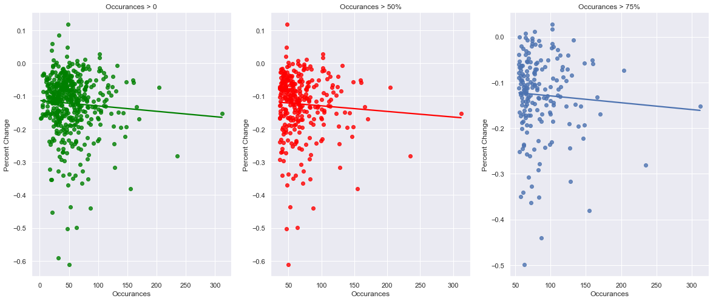
    


```python
from asgn_plot import method_two_scm
method_two_scm(merged_df)
```


    
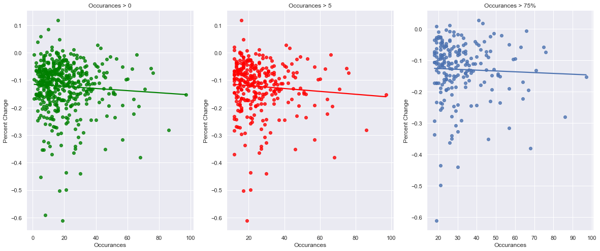
    


```python
from asgn_plot import method_three_scm
method_three_scm(merged_df)
```


    
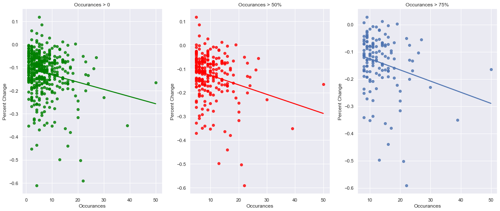
    


# ENV METHOD 1


```python
from asgn_plot import method_one_env
method_one_env(merged_df)
```


    
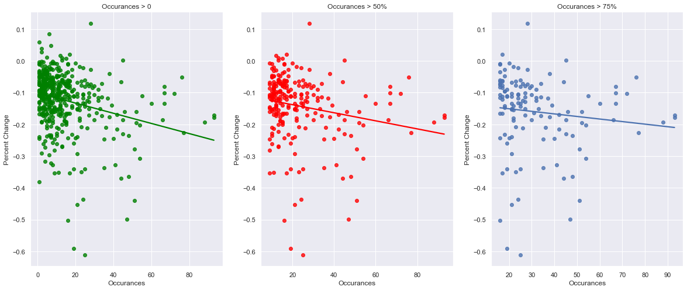
    


# COMPEITIVE METHOD 1


```python
from asgn_plot import method_one_cmp
method_one_cmp(merged_df)
```


    
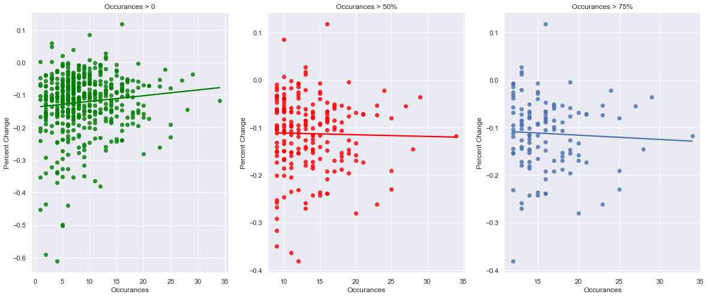
    


---

# Bonus: Feb 23-Mar 23


```python
returns_df = init_return_data.loc[(init_return_data['date'] >= '2020-02-23')
                          & (init_return_data['date'] <= '2020-03-23')]

returns_df = (returns_df.assign(total_returns = 1+returns_df['ret'])
                        .groupby(['ticker'])
                         ['total_returns'].prod()
                         -1
             )
returns_df = returns_df.reset_index()

merged_df = pd.merge(risk_counts[['Ticker','Sector','SCM_M1_OCCUR','SCM_M2_OCCUR','SCM_M3_OCCUR','ENV_M1_OCCUR','CMP_M1_OCCUR']],
                     returns_df, 
                     how = 'left', 
                     left_on = 'Ticker', 
                     right_on = 'ticker'
                    )
merged_df = merged_df.drop(columns = ['ticker'])
```

---


```python
method_one_scm(merged_df)
```


    
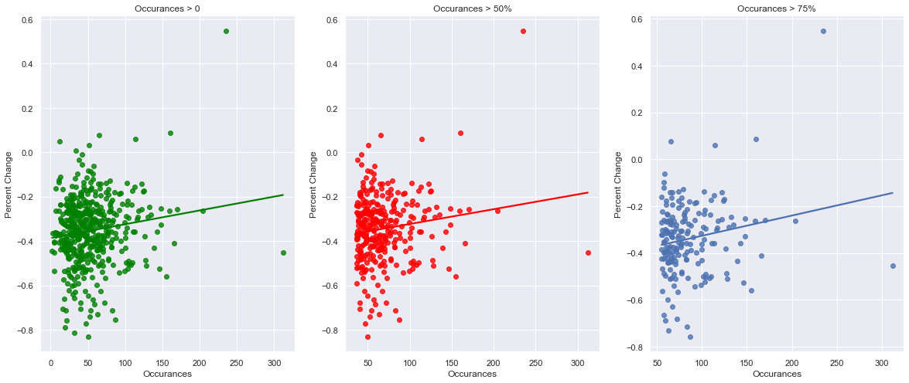
    


```python
method_two_scm(merged_df)
```


    

    


```python
method_three_scm(merged_df)
```


    
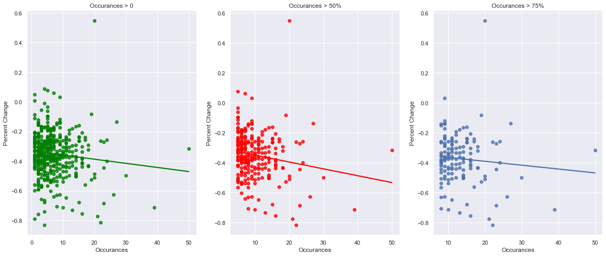
    


# ENV METHOD 1


```python
method_one_env(merged_df)
```


    
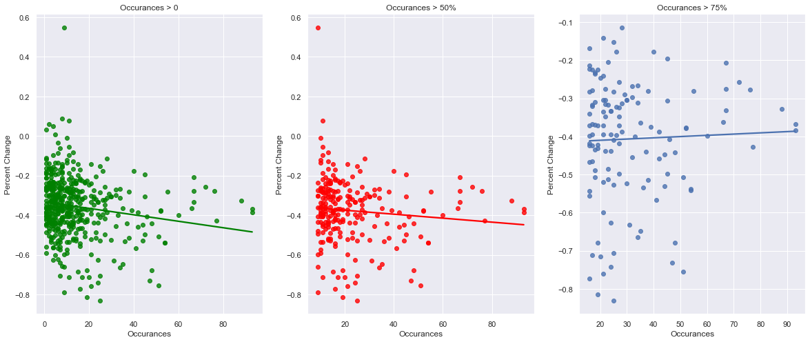
    


# COMPEITIVE METHOD 1


```python
method_one_cmp(merged_df)
```


    
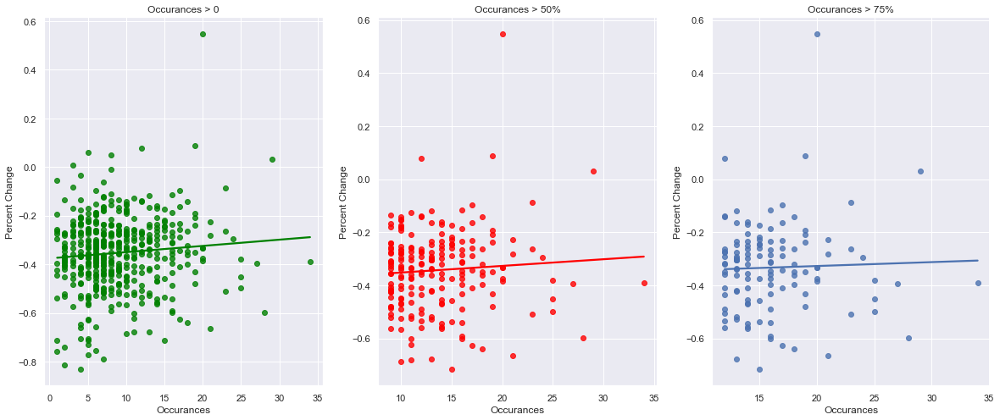
    

